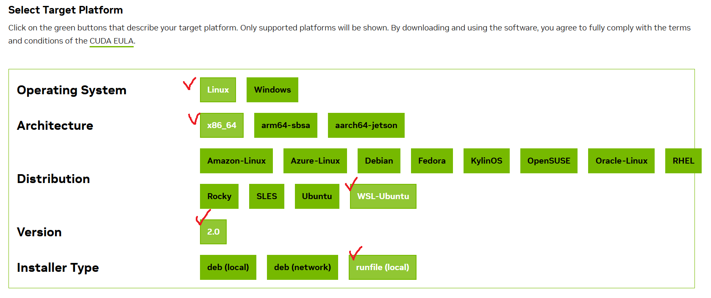
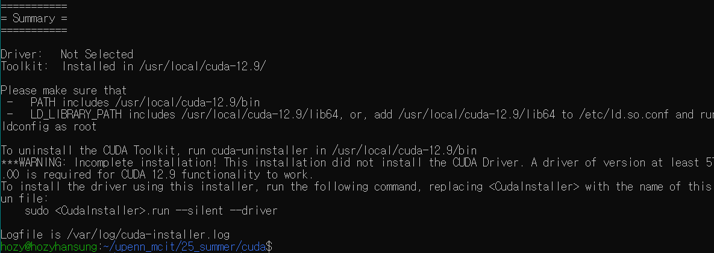
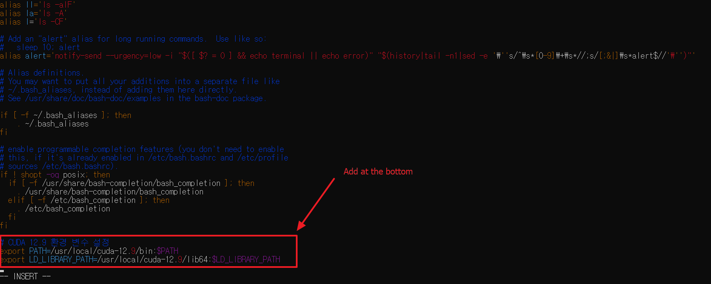
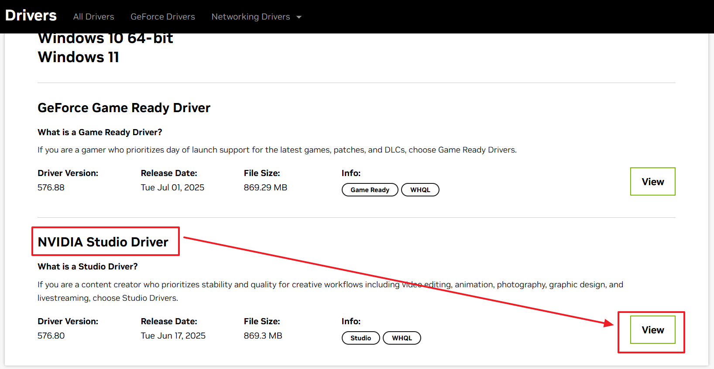
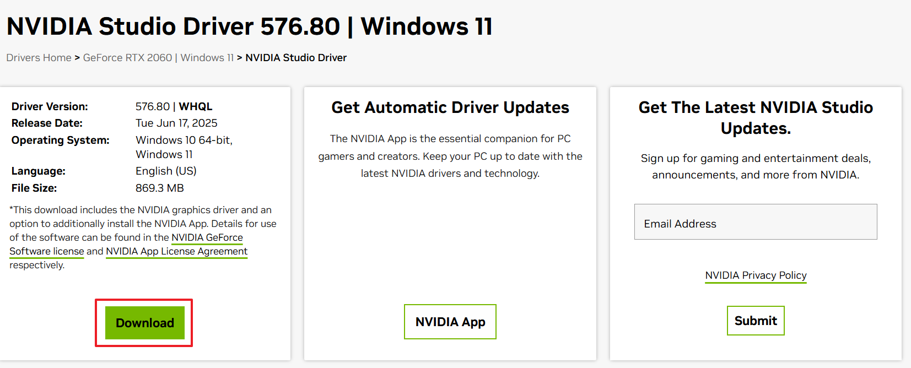

[Back to Main](../main.md)

# CUDA Setup

### 1. wsl - Ubuntu


```shell
wsl --install Ubuntu-18.04
```

```sh
sudo apt update && sudo apt upgrade -y
```

```sh
sudo apt install wget curl git
```

```sh
sudo apt install python3-pip
```

### 2. CUDA Toolkit

Go to [install page](https://developer.nvidia.com/cuda-downloads)   



```sh
wget https://developer.download.nvidia.com/compute/cuda/12.9.1/local_installers/cuda_12.9.1_575.57.08_linux.run
```

```sh
sudo sh cuda_12.9.1_575.57.08_linux.run
```




Add paths at the bottom of `~/.bashrc`.

```sh
# CUDA 12.9 환경 변수 설정
export PATH=/usr/local/cuda-12.9/bin:$PATH
export LD_LIBRARY_PATH=/usr/local/cuda-12.9/lib64:$LD_LIBRARY_PATH
```

```sh
source ~/.bashrc
```

확인 1
```sh
nvcc --version
```

확인 2
```sh
nvidia-smi
```
- 안되는 경우
  - Windows cmd에서 쳐보기
    ```sh
    nvidia-smi
    ```
    
  - Driver 설치하기 ([여기서](https://developer.nvidia.com/cuda/wsl))
       
       
       


<br><br>

[Back to Main](../main.md)