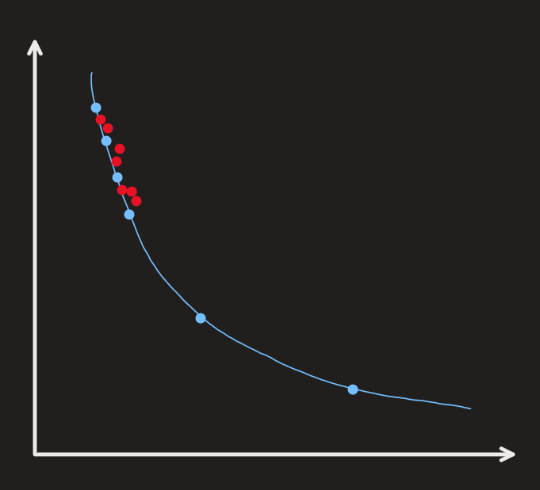

# Research Log
2025-08-22

### Goal)
- Design the algorithm
  - What is the cluster
  - Intra-cluster search for pf
  - Inter-cluster search for pf
  - How to relate TuRBO into this algorithm
  - Reconciling between finding within/between cluster(s)
- Design the test set

 

### To-Do List)
|Fin.|Name|Desc.|
|:-:|:-|:-|
|v|Find test sets for MOO settings|ZDT, DTLZ, WFG, MW|
||Algorithm Design|Define the cluster|
||Algorithm Design|Algorithm Sketch|
||||
||||

 

### Works
#### 1.Find test sets in MOO settings
- Test the algorithm on MOO settings
  - Problem Sets)
    - ZDT Series
      - ZDT1: Convex Pareto Front
      - ZDT2: Non-convex PF
      - ZDT3: Disconnected PF
      - ZDT4: Multi-modal decision space
      - ZDT5: Binary variables (bitstring)
      - ZDT6: Non-uniform density on PF
    - DTLZ Series
      - DTLZ1: Linear PF, many local optima
      - DTLZ2: Quadratic PF
      - DTLZ3: Like DTLZ2 but with many local optima
      - DTLZ4: Bias towards certain regions of PF
      - DTLZ5: Low-dimensional PF
      - DTLZ6: Similar to DTLZ5 but biased mapping
      - DTLZ7: Disconnected PF (like ZDT3 generalization)
    - WFG Series
      - WFG1~WFG9
    - MW Test Suite
      - MW1–MW2: convex vs non-convex
      - MW3: degenerate
      - MW4–MW5: concave, irregular
      - MW6: multimodal
      - MW7: disconnected
      - MW8: biased
      - MW9: concave + discontinuous + irregular

 

#### 2. Define the concept of cluster
- What is a cluster?
  - Depending on the space
    - Cluster on the design space
      - TuRBO applicable.
      - Good at local search : TR based approach
      - Intra-cluster strategy
    - Cluster on the performance space
      - DGEMO's KKT approach applicable
      - Inter-cluster strategy
  - Depending on the concept
    - Simple distance based approach
      - Desc.)
        - Points within a given distance $`L_{\text{max}}`$ in the performance space
          - where $`L_{\text{max}}`$ is the maximum length of the hyper rectangle in TuRBO
        - How to get it?
          - Pick an arbitrary point.
          - Find points that are within $`L_{\text{max}}`$ sphere.
          - If points are found, add them to its cluster.
          - Repeat the process with the remaining points.
        - Simplified version of the DBSCAN below
      - Q)
        - What if points are deployed equally with the distance of $`L\gt L_{\text{max}}`$
          - Too many clusters.
            - Apply global search: inter-cluster search.
    - $`K`$ means approach
      - Desc.)
        - The number of clusters $`K`$ is given.
        - Find $`K`$ number of clusters among the points
      - Q)
        - How to set $`K`$ for each problem.
          - We may set an arbitrary rule such as...
            - When $`n_{\text{init}}`$ number of points on PF is given set $`K=\displaystyle\left\lceil \frac{n_{\text{init}}}{k} \right\rceil,\; \exists k\gt 0`$
              - $`k`$ may be dependent on the dimension of the performance space
    - DBSCAN
      - Desc.)
        - Density based approach
          - i.e.)
            - Minimum number of points within the radius of $`\epsilon`$
- What algorithms can be used to get those clusters?
- What's next after deriving the clusters?

 

### Algorithm Sketch
|Intra-Search|Inter-Search|
|:-:|:-:|
|||

#### Main Algorithm
- Input
  - $`\mathcal{D}_0^* = (\mathbf{X_0^*,Y_0^*})`$ : Initial Pareto Front datapoints
    - where
      - $`\vert\mathcal{D}_0^*\vert = n_0`$
      - $`\mathbf{X_0^*} = \left\{ (\mathbf{x}^{(i)}) \right\}_{i=1}^{n_0} \subseteq \mathcal{P} \subseteq\mathbb{R}^d`$
      - $`\mathbf{Y_0^*} = \left\{ (\mathbf{y}^{(i)}) \right\}_{i=1}^{n_0} \subseteq\mathbb{R}^m`$
  - $`f:\mathbb{R}^d\rightarrow\mathbb{R}^m`$ : the evaluation function
  - $`\mathcal{L} = (L_{\text{init}}, L_{\text{min}}, L_{\text{max}})`$ : Initial/minimum/maximum length of the TR for the TuRBO's TR
- Output
  - $`\mathcal{D}`$ : a diverse pareto front
- Procedure
  - $`\mathcal{D}\leftarrow\mathcal{D_0^*}`$
  - `while` budget is not exhausted `do`
    - $`\mathcal{GP} \leftarrow \tilde{f}(\mathcal{D})`$
    - Get clusters $`\{C_1,\cdots,C_K\} \subseteq \mathbb{R}^{d}`$ with [Cluster](#clustering-algorithm)$`(\mathcal{D})`$
    - `for` $`k=1,\cdots,K`$
      - Select two points $`\mathbf{x}_1,\mathbf{x}_2\in C_k \subseteq \mathbb{R}^d`$
      - $`\mathbf{x^*_{\text{intra}}}=`$ [Intra-Search](#intra-search-algorithm)$`(\mathbf{x}_1, \mathbf{x}_2,\mathcal{GP}, \mathcal{L})`$
      - Evaluate $`\mathbf{y^*_{\text{intra}}} = f(\mathbf{x^*_{\text{intra}}})`$ 
      - $`\mathcal{D}\leftarrow\mathcal{D}\cup\{(\mathbf{x^*_{\text{intra}}},\mathbf{y^*_{\text{intra}}})\}`$
    - `for` $`k_1, k_2 =1,\cdots,K,\; k_1\ne k_2`$
      - Select two points $`\mathbf{x}_1\in C_{k_1},\; \mathbf{x}_2\in C_{k_2},\; C_{k_1}\ne C_{k_2}`$
      - Get $`\mathbf{x^*_{\text{inter}}}`$ with [Inter-Search](#inter-search-algorithm)$`(\mathbf{x}_1, \mathbf{x}_2,\mathcal{GP}, \mathcal{L})`$  
      - Evaluate $`\mathbf{y^*_{\text{inter}}} = f(\mathbf{x^*_{\text{inter}}})`$ 
      - $`\mathcal{D}\leftarrow\mathcal{D}\cup\{(\mathbf{x^*_{\text{inter}}},\mathbf{y^*_{\text{inter}}})\}`$
  - `return` $`\mathcal{D}`$

#### Clustering Algorithm
- Input
  - $`\mathbf{X}_0 \subseteq \mathcal{P}\subseteq\mathbb{R}^d`$ : Points on the Pareto Front
- Output
  - $`\{C_1,\cdots,C_K\} \subseteq \mathbb{R}^{d\times K}`$ : $`K`$ number of clusters
- Candidate Algorithms
  - Distance Base
  - K-means
  - DBSCAN

#### TuRBO
- Input
  - $`\mathbf{x}\in\mathbb{R}^d`$
  - $`\mathcal{L} = (L_{\text{init}}, L_{\text{min}}, L_{\text{max}})`$
- Output
  - $`\mathbf{x}^*\in\mathbb{R}^d`$
- Procedure
  - Set up a TR centered on $`\mathbf{x}`$ with the length $`L_{\text{init}}`$.
  - Run increasing/decreasing the length and re-centering procedure.
  - `return` $`\mathbf{x}^*\in\mathbb{R}^d`$

#### Intra Search Algorithm
- Input
  - $`\mathbf{x}_1,\mathbf{x}_2\in C_k \subseteq \mathbb{R}^d`$ : two intra-cluster points
    - where $`C_k`$ is the $`k`$-th cluster
  - $`\mathcal{GP}=\tilde{f}:\mathbb{R}^d\rightarrow\mathbb{R}^m`$
  - $`\mathcal{L} = (L_{\text{init}}, L_{\text{min}}, L_{\text{max}})`$
- Output
  - $`\mathbf{x^*_{\text{intra}}}`$
- Procedure
  - Let $`\mathbf{x}_0 = \displaystyle\frac{\mathbf{x}_1+\mathbf{x}_2}{2}`$ : the mid point
  - `return` $`\mathbf{x^*_{\text{intra}}}`$ = [TuRBO](#turbo)($`\mathbf{x}_0, \mathcal{L}`$)

#### Inter Search Algorithm
- Input
  - $`\mathbf{x}_1\in C_{k_1},\; \mathbf{x}_2\in C_{k_2},\; C_{k_1}\ne C_{k_2}`$ : two inter-cluster points
  - $`\mathcal{GP}=\tilde{f}:\mathbb{R}^d\rightarrow\mathbb{R}^m`$
  - $`\mathcal{L} = (L_{\text{init}}, L_{\text{min}}, L_{\text{max}})`$
- Output
  - $`\mathbf{x^*_{\text{inter}}}`$
- Procedure
  - $`\mathbf{x}^{(0)} = \mathbf{x}_1,\; \mathbf{X}_{\text{cand}} \leftarrow \emptyset`$
  - `for` $`t=1,\cdots,T`$
    - Let $`S = \{\mathbf{x}\mid\mathbf{x}\in\mathbb{R}^d,\; L_{\text{min}} \le \Vert \mathbf{x}^{(t-1)} - \mathbf{x}\Vert \le L_{\text{max}} \}`$
    - $`\mathbf{x}^{(t)} = \displaystyle\arg\max_{\mathbf{x}\in S } \alpha(\mathbf{x}) = \text{HV}(\mathbf{x}) - \lambda \Vert \mathbf{x} - \mathbf{x}_2 \Vert,\; \lambda\gt0`$
      - Candidate HVs
        - EHVI
        - HV Scalarization by Zhang et al.
    - $`\mathbf{x}_{\text{cand}}^{(t)} =`$ [TuRBO](#turbo)$`(\mathbf{x}^{(t)}, \mathcal{L})`$
    - $`\mathbf{X}_{\text{cand}}\leftarrow \mathbf{X}_{\text{cand}} \cup \{\mathbf{x}_{\text{cand}}^{(t)}\}`$
  - $`\mathbf{x^*_{\text{inter}}} = \displaystyle\arg\max_{\mathbf{x\in X}_{\text{cand}}} \text{HV}(\mathbf{x})`$
    - Or maybe, return $`\mathbf{X}_{\text{cand}}`$ in batch
  - `return` $`\mathbf{x^*_{\text{inter}}}`$

### What to do next
