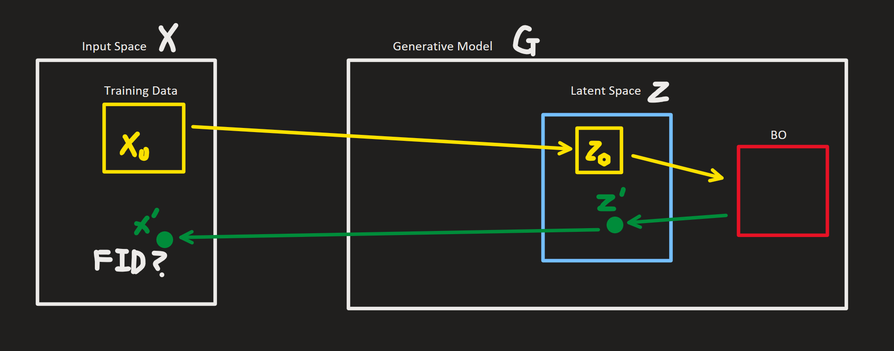
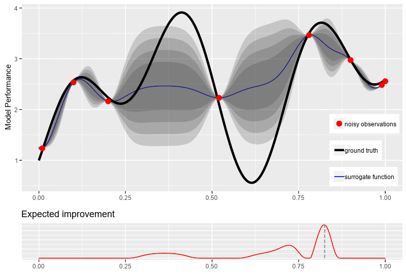

# Research Log
2025-mm-dd

# Inquisitive Bayesian Optimization (I, BO) 
Self-Improving Generative Model with BO  
### Goal: Get an actively learning generative model using BO as its engine

### Key Point:  
- Standard generative models are **passive learners** that rely solely on given datasets.  
- With BO, the model becomes an **active learner**, *requesting data that it needs*.  
- Unlike RL-style brute force exploration, BO provides **sample-efficient self-improvement**.  
- Forgetting/pruning mechanisms can make BO’s memory management **human-like selective memory**.

 

---

 

   

1. **Initialize a generative model**  
   - Any type of generative model (GAN, VAE, Diffusion, etc.).  
   - Start training with only a **subset of the dataset**.  

2. **Apply Bayesian Optimization (BO) to the latent space**  
   - Place a BO surrogate model on the latent space \(z\).  
   - (Optional) Use **forgettable BO** with pruning/quantization to manage memory and scalability.  

3. **BO-driven candidate selection**  
   - BO uses its acquisition function (e.g., EI, UCB) to propose **promising latent codes $`z'`$**.  

4. **Data proposal**  
   - Generate samples $`x'=G(z')`$ from the model.  

5. **Feedback & evaluation**  
   - Measure how much adding \(x'\) improves external quality metrics (e.g., Inception Score, FID).  
   - Use this feedback as the objective signal for BO.  

6. **Iterative loop**  
   - Repeat the process: BO continuously proposes new latent codes, the model generates samples, and quality improvement is evaluated.  
   - The generative model can be fine-tuned or expanded with these new samples.  

7. **Outcome analysis**  
   - At the end, analyze **which regions of the data distribution the BO requested**.  
   - Evaluate how effectively BO expanded coverage of the generative model’s learned data space.  

---

