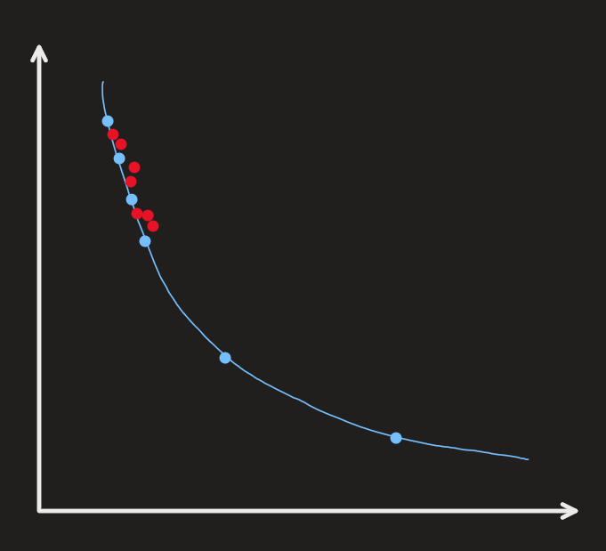
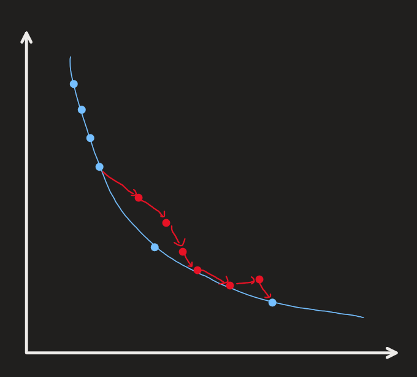

# Multi-Objective Bayesian Optimization with Diverse Solutions from Clusters (MOBy-DiC)

### Goal)
Search diverse solutions along the Pareto Front

### Similar Works)
- DGEMO
  - Pros)
    - Provides diverse solutions along the Pareto Front
  - Cons)
    - Not effective on high dimensional feature space $`(N\gt6)`$
    - Local optimization 
      - The surrogate model (GP) is treated to be deterministic and $`L_2`$ optimization is performed on it.
      - 1st-order approximation on the surrogate model (GP).
- MORBO
  - Pros)
    - Effective on high dimensional feature space
    - Asynchronous local optimization allows faster search.
  - Cons)
    - Does not focus on providing diverse solutions
- ROBOT
  - Similarity)
    - Provides diverse candidate solutions in a single objective problem setting
  - Difference)
    - Does not support MOBO
  - Prop.)
    - User defined distance metric is used.

### Idea
- Use TuRBO's TR strategy for searching the high-dimensional feature space.
  - $`M`$ TRs that perform local optimizations.
- Find heuristics to suggest diverse datapoints by combining the existing best points from diverse TRs.
  - How?)
    - Clustering and Mixing
      - Cluster the existing best points from each TRs into $`K`$ clusters.
        - K-Means
        - DBSCAN
      - Create new TRs that encompasses the combinations of the points from each cluster.
        - For each of these new TRs, we may take advantage of the asynchronous optimization.
    - User defined distance metric

### Algorithm Sketch
|Intra-Search|Inter-Search|
|:-:|:-:|
|||

#### Main Algorithm
- Input
  - $`\mathcal{D}_0^* = (\mathbf{X_0^*,Y_0^*})`$ : Initial Pareto Front datapoints
    - where
      - $`\vert\mathcal{D}_0^*\vert = n_0`$
      - $`\mathbf{X_0^*} = \left\{ (\mathbf{x}^{(i)}) \right\}_{i=1}^{n_0} \subseteq \mathcal{P} \subseteq\mathbb{R}^d`$
      - $`\mathbf{Y_0^*} = \left\{ (\mathbf{y}^{(i)}) \right\}_{i=1}^{n_0} \subseteq\mathbb{R}^m`$
  - $`f:\mathbb{R}^d\rightarrow\mathbb{R}^m`$ : the evaluation function
  - $`\mathcal{L} = (L_{\text{init}}, L_{\text{min}}, L_{\text{max}})`$ : Initial/minimum/maximum length of the TR for the TuRBO's TR
- Output
  - $`\mathcal{D}`$ : a diverse pareto front
- Procedure
  - $`\mathcal{D}\leftarrow\mathcal{D_0^*}`$
  - `while` budget is not exhausted `do`
    - $`\tilde{f} \leftarrow \tilde{f} \sim \mathcal{GP}(\boldsymbol{\theta}\mid\mathcal{D})`$
    - Get clusters $`\{C_1,\cdots,C_K\} \subseteq \mathbb{R}^{d}`$ with [Cluster](#clustering-algorithm)$`(\mathcal{D})`$
    - `for` $`k=1,\cdots,K`$
      - Select two points $`\mathbf{x}_1,\mathbf{x}_2\in C_k \subseteq \mathbb{R}^d`$
      - $`\mathbf{x^*_{\text{intra}}}=`$ [Intra-Search](#intra-search-algorithm)$`(\mathbf{x}_1, \mathbf{x}_2,\mathcal{GP}, \mathcal{L})`$
      - Evaluate $`\mathbf{y^*_{\text{intra}}} = f(\mathbf{x^*_{\text{intra}}})`$ 
      - $`\mathcal{D}\leftarrow\mathcal{D}\cup\{(\mathbf{x^*_{\text{intra}}},\mathbf{y^*_{\text{intra}}})\}`$
    - `for` $`k_1, k_2 =1,\cdots,K,\; k_1\ne k_2`$
      - Select two points $`\mathbf{x}_1\in C_{k_1},\; \mathbf{x}_2\in C_{k_2},\; C_{k_1}\ne C_{k_2}`$
      - Get $`\mathbf{x^*_{\text{inter}}}`$ with [Inter-Search](#inter-search-algorithm)$`(\mathbf{x}_1, \mathbf{x}_2,\mathcal{GP}, \mathcal{L})`$  
      - Evaluate $`\mathbf{y^*_{\text{inter}}} = f(\mathbf{x^*_{\text{inter}}})`$ 
      - $`\mathcal{D}\leftarrow\mathcal{D}\cup\{(\mathbf{x^*_{\text{inter}}},\mathbf{y^*_{\text{inter}}})\}`$
  - `return` $`\mathcal{D}`$

#### Clustering Algorithm
- Input
  - $`\mathbf{X}_0 \subseteq \mathcal{P}\subseteq\mathbb{R}^d`$ : Points on the Pareto Front
- Output
  - $`\{C_1,\cdots,C_K\} \subseteq \mathbb{R}^{d\times K}`$ : $`K`$ number of clusters
- Candidate Algorithms
  - Distance Base
  - K-means
  - DBSCAN

#### TuRBO
- Input
  - $`\mathbf{x}\in\mathbb{R}^d`$
  - $`\mathcal{L} = (L_{\text{init}}, L_{\text{min}}, L_{\text{max}})`$
- Output
  - $`\mathbf{x}^*\in\mathbb{R}^d`$
- Procedure
  - Set up a TR centered on $`\mathbf{x}`$ with the length $`L_{\text{init}}`$.
  - Run increasing/decreasing the length and re-centering procedure.
  - `return` $`\mathbf{x}^*\in\mathbb{R}^d`$

#### Intra Search Algorithm
- Input
  - $`\mathbf{x}_1,\mathbf{x}_2\in C_k \subseteq \mathbb{R}^d`$ : two intra-cluster points
    - where $`C_k`$ is the $`k`$-th cluster
  - $`\mathcal{GP}=\tilde{f}:\mathbb{R}^d\rightarrow\mathbb{R}^m`$
  - $`\mathcal{L} = (L_{\text{init}}, L_{\text{min}}, L_{\text{max}})`$
- Output
  - $`\mathbf{x^*_{\text{intra}}}`$
- Procedure
  - Let $`\mathbf{x}_0 = \displaystyle\frac{\mathbf{x}_1+\mathbf{x}_2}{2}`$ : the mid point
  - `return` $`\mathbf{x^*_{\text{intra}}}`$ = [TuRBO](#turbo)($`\mathbf{x}_0, \mathcal{L}`$)

#### Inter Search Algorithm
- Input
  - $`\mathbf{x}_1\in C_{k_1},\; \mathbf{x}_2\in C_{k_2},\; C_{k_1}\ne C_{k_2}`$ : two inter-cluster points
  - $`\mathcal{GP}=\tilde{f}:\mathbb{R}^d\rightarrow\mathbb{R}^m`$
  - $`\mathcal{L} = (L_{\text{init}}, L_{\text{min}}, L_{\text{max}})`$
- Output
  - $`\mathbf{x^*_{\text{inter}}}`$
- Procedure
  - $`\mathbf{x}^{(0)} = \mathbf{x}_1,\; \mathbf{X}_{\text{cand}} \leftarrow \emptyset`$
  - `for` $`t=1,\cdots,T`$
    - Let $`S = \{\mathbf{x}\mid\mathbf{x}\in\mathbb{R}^d,\; L_{\text{min}} \le \Vert \mathbf{x}^{(t-1)} - \mathbf{x}\Vert \le L_{\text{max}} \}`$
    - $`\mathbf{x}^{(t)} = \displaystyle\arg\max_{\mathbf{x}\in S } \alpha(\mathbf{x}) = \text{HV}(\mathbf{x}) - \lambda \Vert \mathbf{x} - \mathbf{x}_2 \Vert,\; \lambda\gt0`$
      - Candidate HVs
        - EHVI
        - HV Scalarization by Zhang et al.
    - $`\mathbf{x}_{\text{cand}}^{(t)} =`$ [TuRBO](#turbo)$`(\mathbf{x}^{(t)}, \mathcal{L})`$
    - $`\mathbf{X}_{\text{cand}}\leftarrow \mathbf{X}_{\text{cand}} \cup \{\mathbf{x}_{\text{cand}}^{(t)}\}`$
  - $`\mathbf{x^*_{\text{inter}}} = \displaystyle\arg\max_{\mathbf{x\in X}_{\text{cand}}} \text{HV}(\mathbf{x})`$
    - Or maybe, return $`\mathbf{X}_{\text{cand}}`$ in batch
  - `return` $`\mathbf{x^*_{\text{inter}}}`$

### Test
- Test the algorithm on MOO settings
  - Problem Sets)
    - ZDT Series
      - ZDT1: Convex Pareto Front
      - ZDT2: Non-convex PF
      - ZDT3: Disconnected PF
      - ZDT4: Multi-modal decision space
      - ZDT5: Binary variables (bitstring)
      - ZDT6: Non-uniform density on PF
    - DTLZ Series
      - DTLZ1: Linear PF, many local optima
      - DTLZ2: Quadratic PF
      - DTLZ3: Like DTLZ2 but with many local optima
      - DTLZ4: Bias towards certain regions of PF
      - DTLZ5: Low-dimensional PF
      - DTLZ6: Similar to DTLZ5 but biased mapping
      - DTLZ7: Disconnected PF (like ZDT3 generalization)
    - WFG Series
      - WFG1~WFG9
    - MW Test Suite
      - MW1–MW2: convex vs non-convex
      - MW3: degenerate
      - MW4–MW5: concave, irregular
      - MW6: multimodal
      - MW7: disconnected
      - MW8: biased
      - MW9: concave + discontinuous + irregular

$\mathbf{y}_{\mathrm{intra}}^* = f(\mathbf{x}_{\mathrm{intra}}^*)$

$\mathbf{y}^*_{\mathrm{intra}} = f(\mathbf{x}_{\mathrm{intra}}^*)$