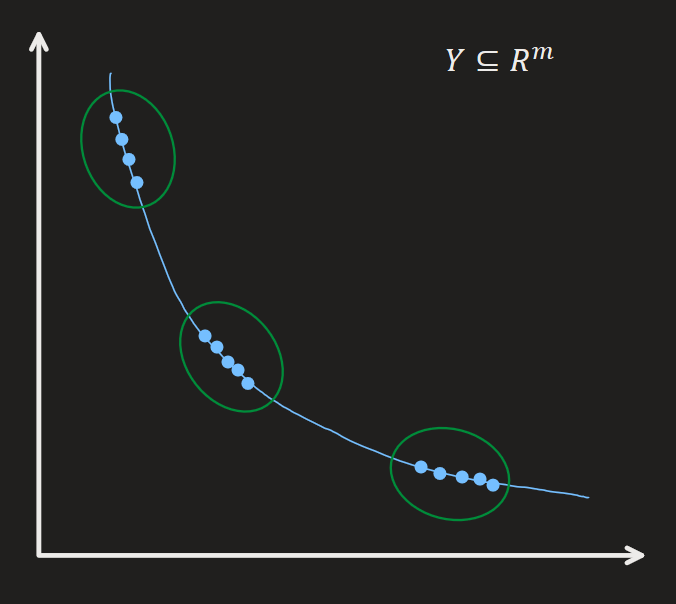
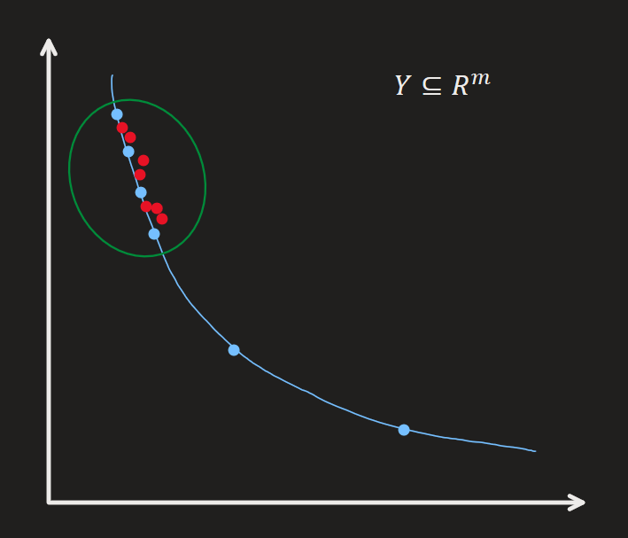
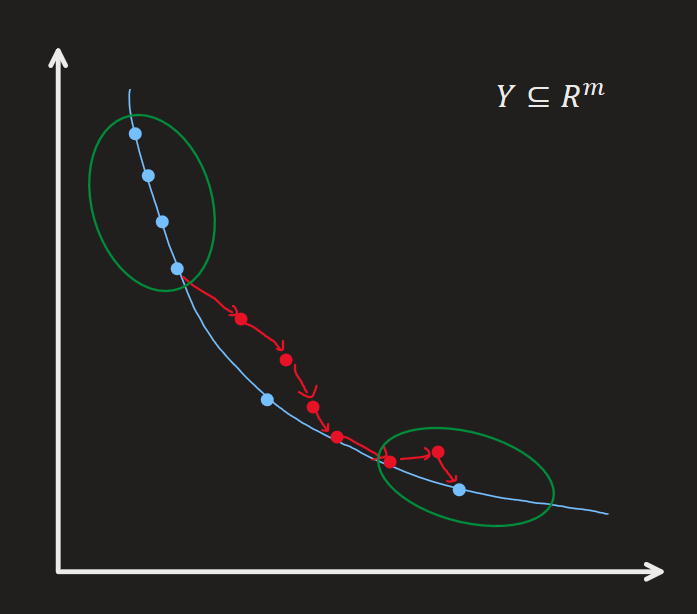

# **M**ulti-**O**bjective **B**a**y**esian Optimization with **Di**verse, **C**luster-based Solutions (MOBy-DiC)

Joon Hyeok Kim

---
# MOBy-DiC

### Objective
  - To generate a **diverse** set of Pareto-optimal solutions for multi-objective optimization problems.

### Assumptions
  - An initial set of Pareto-optimal solutions is provided as input.
    - These solutions can be sourced from existing algorithms 
      - e.g.) MORBO, qNEHVI, NSGA-II
    - Alternatively, in real-world applications, they can be solutions found empirically.

---

# Strategy 1 : Clustering

Cluster the initial solutions in the design space $\mathcal{X}\subseteq\mathbb{R}^d$ to identify distinct promising regions.

  

### Possible Clustering Algorithms
1. DBSCAN
   - Hyperparameters 
     - $\epsilon$ : maximum distance between each datapoint
       - $\epsilon\approx L_{\min}$ from TuRBO's TR, $\mathcal{T}$
     - MinPts : minimum number of points in a cluster
2. k-Means
   - Hyperparameters
     - $k$ : number of clusters
       - How to choose $k$?

  

  

---

# Strategy 2 : Dual Search
Apply a TuRBO-based strategy that operates on two levels:

  

### 1. Intra-Cluster Search
Local TuRBO like MORBO within the cluster

- Input : $\mathbf{x}_1,\mathbf{x}_2\in C_k \subseteq \mathbb{R}^d$ : two intra-cluster points
    - where $C_k$ is the $k$-th cluster
- Output: $\mathbf{x^*_{\text{intra}}}$
- Procedure
  - Let $\mathbf{x}_0 = \displaystyle\frac{\mathbf{x}_1+\mathbf{x}_2}{2}$ : the mid point
  - `return` $\mathbf{x^*_{\text{intra}}}$ = [TuRBO](#turbo)($\mathbf{x}_0, \mathcal{L, GP}$)

  

  

---

  

### 2. Inter-Cluster Search
Find a path between two clusters and apply TuRBO on it

- Input : $\mathbf{x}_1\in C_{k_1},\; \mathbf{x}_2\in C_{k_2},\; C_{k_1}\ne C_{k_2}$ 
  - Two points from different clusters
- Output : $\mathbf{x^*_{\text{inter}}}$
- Procedure
  - Find a path between $\mathbf{x}_1$ and $\mathbf{x}_2$ by iteratively solving
    - $\displaystyle\arg\max_{\mathbf{x}\in S } \alpha(\mathbf{x}) = \text{HV}(\mathbf{x}) - \lambda \Vert \mathbf{x} - \mathbf{x}_2 \Vert,\; \lambda\gt0$
    - where $S$ is the set of points within the distance of $L$ from the previous point.

  

  

---

- Procedure
  - $\mathbf{x}^{(0)} = \mathbf{x}_1,\; \mathbf{X}_{\text{cand}} \leftarrow \emptyset$
  - `for` $t=1,\cdots,T$
    - $S \leftarrow \{\mathbf{x}\mid\mathbf{x}\in\mathbb{R}^d,\; L_{\text{min}} \le \Vert \mathbf{x}^{(t-1)} - \mathbf{x}\Vert \le L_{\text{max}} \}$
    - $\mathbf{x}^{(t)} = \displaystyle\arg\max_{\mathbf{x}\in S } \alpha(\mathbf{x}) = \text{HV}(\mathbf{x}) - \lambda \Vert \mathbf{x} - \mathbf{x}_2 \Vert,\; \lambda\gt0$
      - Candidate HVs
        - EHVI
        - HV Scalarization by Zhang et al.
    - $\mathbf{x}_{\text{cand}}^{(t)} =$ [TuRBO](#turbo)$(\mathbf{x}^{(t)}, \mathcal{L})$
    - $\mathbf{X}_{\text{cand}}\leftarrow \mathbf{X}_{\text{cand}} \cup \{\mathbf{x}_{\text{cand}}^{(t)}\}$
  - $\mathbf{x^*_{\text{inter}}} = \displaystyle\arg\max_{\mathbf{x\in X}_{\text{cand}}} \text{HV}(\mathbf{x})$
    - Or maybe, return $\mathbf{X}_{\text{cand}}$ in batch
  - `return` $\mathbf{x^*_{\text{inter}}}$

---
# Related Works
## ROBOT
- Props.
  - Suggests diverse solutions using the Bayesian optimization technique
  - Utilizes TuRBO to search the high dimensional design space.
- Differences
  - Solves single objective optimization problems
  - Suggested solutions have priorities.
    - In MOBO, pareto optimality allows various solutions.
---
# Related Works
## DGEMO
- Props.
  - Solves multi objective optimization problems
  - Suggests diverse solutions using the Bayesian optimization technique
  - Adapts the batch selection strategy and the First-Order approximation technique
- Limit
  - Does not work on higher dimensional design spaces $(d\gt6)$

---
# Related Works
## MORBO
- Props.
  - Solves the multi objective optimization problem
  - Works well on higher dimensional design spaces
  - Efficiently finds pareto optimal solutions using TuRBO
- Limit
  - Does not provide diverse solutions along the pareto front
