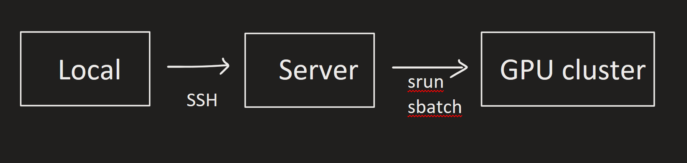
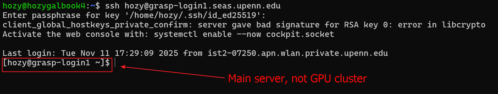
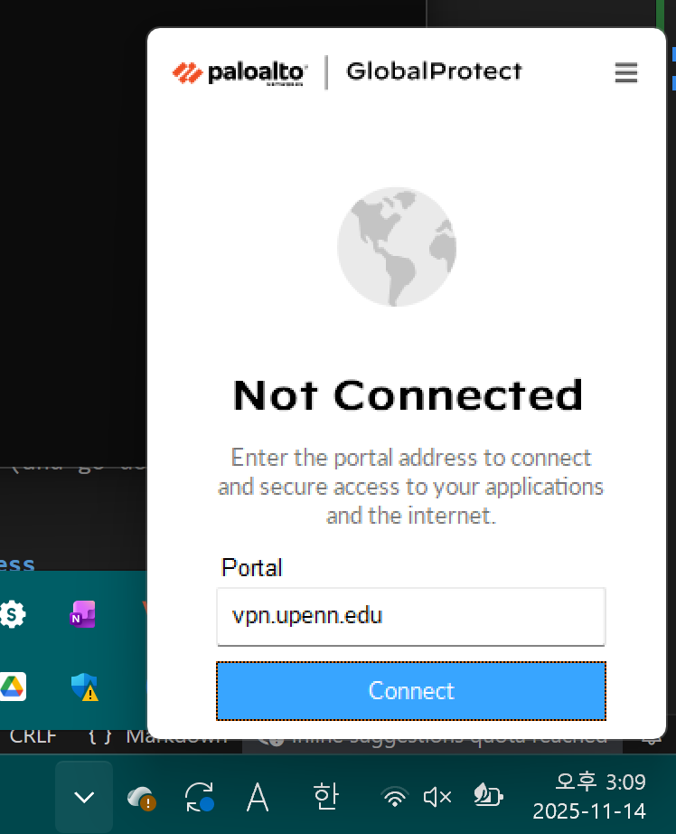
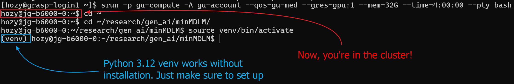
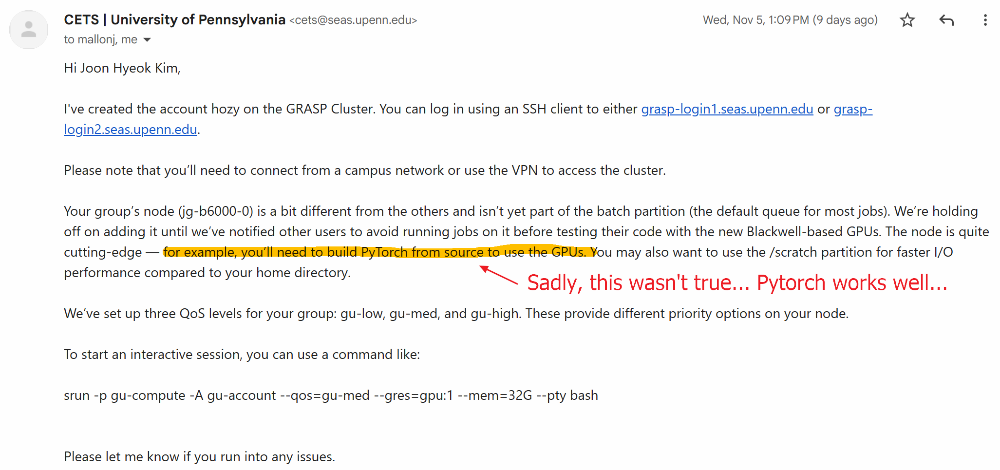
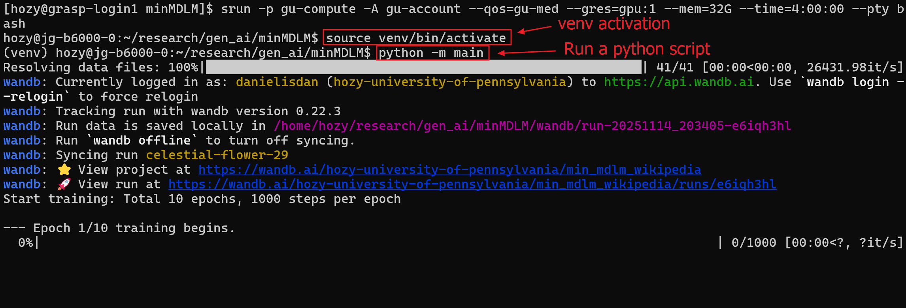
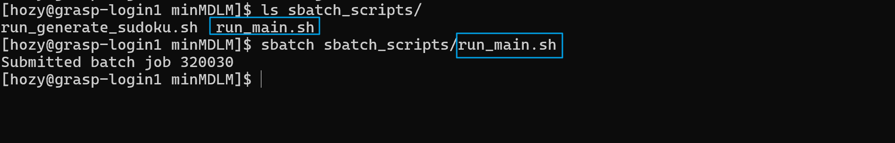
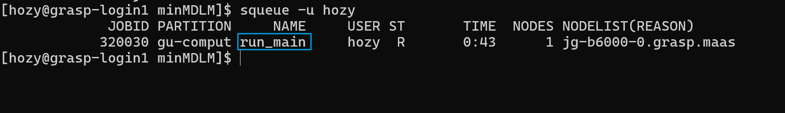
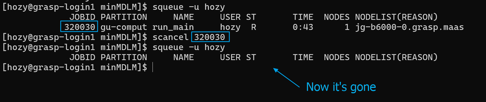

# A brief guide to use GPU cluster 
Joon Hyeok Kim

## 0. System Structure


## 1. Use Linux environment to connect to the Server
- For Apple devices, you may just use your cmd.
- For Windows devices, I recommend you to use [wsl](https://learn.microsoft.com/en-us/windows/wsl/setup/environment) which allows you to use Linux in Windows seamlessly.

<br>

## 2. Logging into the server (Not GPU cluster)
- In that Linux environment access the server.
  - login1
    ```bash
    ssh hozy@grasp-login1.seas.upenn.edu
    ```
  - login2
    ```bash
    ssh hozy@grasp-login2.seas.upenn.edu
    ```
- This is the server that manages the overall system, not the GPU cluster.   
  
- If you're using the school wifi, you can `ssh` directly.
  - If not, use the [Penn VPN](https://isc.upenn.edu/resources/university-vpn-getting-started-guide)   
    

<br>

## 3. Access the GPU Cluster
- Option 1. [Request temporary access](#21-request-temporary-access) (must keep your connection!)
- Option 2. [(Recommended!) Run a script]() (and go do sth else ;))


### 2.1 Request Temporary access 
- Command
  ```bash
  srun -p gu-compute -A gu-account --qos=gu-med --gres=gpu:1 --mem=32G --time=4:00:00 --pty bash
  ```
- This means that you request access to GPU cluster with the following options like
  - `--mem=32G` : 32 GB RAM memory for CPU, not the GPU VRAM!
  - `--time=4:00:00` : access for 4 hours
- If you enter the above command, you are now in the GPU cluster.   
  
- Thankfully, python 3.12 is installed in the cluster, so you can use `venv` as you did in local.
  - You don't have to install python (which I tried with anaconda and failed, waisting at least 20 hours)
    
  - Just use the `venv` and `pip install torch` there.
  - `torch` will recognize the GPU!
- You can run python programs as in local.
  - e.g.)   
    


### 2.2 Run a script
- You can create a bash script like this.
  - DIR : `~/research/gen_ai/minMDLM/sbatch_scripts/run_main.sh`
    ```bash
    #!/bin/bash

    # Slurm setup
    #SBATCH -p gu-compute
    #SBATCH -A gu-account
    #SBATCH --qos=gu-med
    #SBATCH --gres=gpu:1
    #SBATCH --mem=32G
    #SBATCH --time=4:00:00
    #SBATCH --output=/dev/null
    #SBATCH --error=/dev/null

    mkdir -p "./logs"

    DATE_WITH_TIME=$(date +%Y%m%d_%H%M%S)
    OUTPUT_FILE="./logs/${DATE_WITH_TIME}_run_${SLURM_JOB_ID}.log"

    exec > "$OUTPUT_FILE" 2>&1

    echo "==================================="
    echo "min_mdlm run"
    date
    echo "Job running on node: $(hostname)"
    echo "==================================="

    echo "Attempting to activate venv"
    source ./venv/bin/activate

    echo "[DEBUG] Python check:"
    python --version
    echo "==================================="
    echo "Running main.py starts"
    date

    python -m main >> "$OUTPUT_FILE" 2>&1

    echo "==================================="
    echo "Fin."
    ```
- You can run this script in the main server (NOT the GPU cluster) by 
  ```bash
  sbatch [script_dir]
  ```
  - e.g.)   
    
- You may check the status with
  ```bash
  squeue -u [user_name]
  ```
  - e.g.)   
    
- You may cancel that job by
  ```bash
  scancel [job id]
  ```
  - e.g.)   
    


### 
