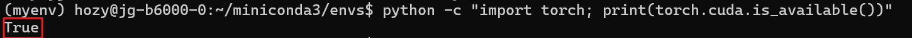

# Miniconda3 setup
- Connect to the GPU unit. (Every job should be done here)
  ```bash
  srun -p gu-compute -A gu-account --qos=gu-med --gres=gpu:1 --mem=32G --time=4:00:00 --pty bash
  ```
- Create your directory in `/scratch/tmp/`
  ```bash
  # /scratch has faster io. If /scratch/tmp is allowed
  cd /scratch/tmp
  mkdir hozy
  cd hozy
  mkdir torch_setup
  cd torch_setup
  ```
- Download Miniconda
  ```bash
  wget https://repo.anaconda.com/miniconda/Miniconda3-latest-Linux-x86_64.sh
  ```
- Install
  ```bash
  bash Miniconda3-latest-Linux-x86_64.sh
  ```
- Create a virtual environment
  ```bash
  conda create -n <env_name> python=<python_version>
  ```
  - e.g.)
    ```bash
    conda create -n pytorch_blackwell_default python=3.12
    ```


### Torch setup
- Initial
  - Activate the virtual environment
    ```bash
    conda activate <env_name>
    ```
  - Install following packages
    ```bash
    pip install cmake six
    ```
    ```bash
    conda install -c nvidia cuda-toolkit pyyaml make c-compiler cxx-compiler
    ```
  - Clone the official PyTorch github repo
    ```bash
    git clone https://github.com/pytorch/pytorch.git
    ```
  - Three Options
    - [Install in CLI](#install-in-cli)
    - [Run script](#run-script)
    - [Copy existing build...](#copy-existing-build)
- Copying the existing build
  ```bash
  conda create --name [new_env_name] --clone [existing_env_name]
  ```

<br>

#### Install in CLI
- Connect the GPU
  ```bash
  srun -p gu-compute -A gu-account --qos=gu-med --gres=gpu:1 --mem=32G --time=4:00:00 --pty bash
  ```
  - Set 4hrs. Installation takes more than an hour.
- Go to the cloned PyTorch repository and run `setup.py`
  ```bash
  cd pytorch # If properly installed.
  pip install . -v
  ```
  - If you failed, clean the repo with below and run the above again.
    ```bash
    git clean -xdf
    ```


#### Run script
- Create environment check script : [env_check_sbatch_script.sh](./scripts/env_check_sbatch_script.sh)
- Run script and check log
  ```bash
  sbatch [script_file]
  ```
- Create actual build script : [torch_install_sbatch_script.sh](./scripts/torch_install_sbatch_script.sh)
- Run script
  ```bash
  sbatch [script_file]
  ```
- Check status
  ```bash
  squeue -u [user_name]
  ```

### Copy existing build
- Admin'or shared below   
  ```
  Hi Joon,
  I think it took about 2 or 3 hours to build for me.  If you run into any more issues, feel free to copy my build, which is in /scratch/tmp/svitale:

  It should be faster to build in /scratch..  also, if you'd like us to add some directories with user-specific permissions in /scratch, just let us know.  Right now /scratch/tmp is world writable so you can at least create files there.
  ```
- Copy env to my minconda3 envs
  ```bash
  cp -r /scratch/tmp/svitale/myenv ~/miniconda3/envs
  ```
- Activate conda and check if cuda recognition
  ```bash
  conda activate myenv
  python -c "import torch; print(torch.cuda.is_available())"
  ```
  
- Keeping activation of `myenv`, export package list
  ```bash
  conda env export > env_spec.yml
  conda deactivate
  ```
- Create new environments using `conda create --clone`
  ```bash
  conda env create -f env_spec.yml --name [new_env_name]
  ```