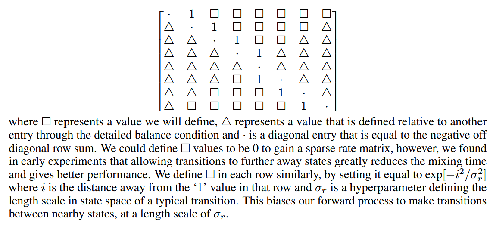
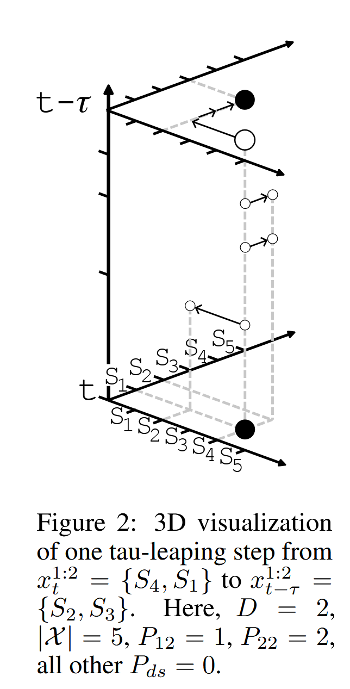

# A Continuous Time Framework for Discrete Denoising Models
[@campbellContinuousTimeFramework2022]

## Summary
- Goal)
  - Adopt continuous time to Discrete Diffusion Model.
- How?)
  - By introducing the [transition rate matrix](#concept-transition-rate-matrix) $`(R_t)`$ and the [Kolmogorov equation](#concept-kolmogorov-equation), this paper defines the forward and backward process of the discrete diffusion model.
  - The backward transition rate $`(\hat{R}_t)`$ is approximated with the neural network with $`(\hat{R}_t^\theta)`$
  - With [Proposition 1](#proposition-1), the relation between the forward rate $`(R_t)`$ and the backward rate $`(\hat{R}_t)`$ is defined.
    - Using the this equation, forward posterior is calculated with using $`R_t`$ and we may optimize $`\hat{R}_t^\theta`$
    - ELBO is used as loss.
  - [Tau-leaping](#concept-tau-leaping-algorithm) enables faster sampling sacrificing some accuracy.
  - [Predictor-Corrector](#44-predictor-corrector) algorithm enhances the sampling accuracy by utilizing the marginal $`q_t(x_t)`$ 
    - the rate $`R_t^c = R_t+\hat{R}_t`$ has $`q_t(x_t)`$ as its stationary distribution

 

## 2 Background on Discrete Denoising Models
- Settings)
  - $`x_0\in\mathcal{X}`$ : a discrete data
    - where 
      - $`S=\vert\mathcal{X}\vert`$
        - i.e.) the state space has the finite cardinality $`S`$
  - $`\exists p_{\text{data}}`$ : a discrete data distribution 
    - s.t. $`x_0\sim p_{\text{data}}(x_0)`$
- Forward Noising Process
  - Desc.)
    - Transforms $`p_{\text{data}}`$ to some distribution $`q_K(x_K)`$
      - where $`q_K(x_K) \approx p_{\text{ref}}(x_K)`$ for an easy to sample distribution $`p_{\text{ref}}(x_K)`$.
  - $`q_{k+1\mid k}(x_{k+1}\mid x_k)`$ : a forward kernel
    - e.g.) Uniform
      - $`q_{k+1\mid k}(x_{k+1}\mid x_k) = \delta_{x_{k+1},x_k}(1-\beta) + (1-\delta_{x_{k+1},x_k})\beta/(S-1)`$
        - where
          - $`\delta_{i,j}=\begin{cases} 1&\text{if }i=j\\0&\text{if }i\ne j\\ \end{cases}`$ : a Kronecker delta
          - $`(1-\beta)`$ : the probability that the state is unchanged i.e. $`\mathbb{P}(x_{k+1}=x_k)`$
        - Desc.)
          - The corresponding $`p_{\text{ref}}`$ is Uniform over all states with $`\frac{\beta}{S-1}`$
  - Forward Joint Decomposition   
    $`q_{0:K}(x_{0:K}) = p_{\text{data}}(x_0)\displaystyle\prod_{k=0}^{K-1}q_{k+1\mid k}(x_{k+1}\mid x_k)`$
- Reverse Denoising Process
  - Forward Posterior   
    $`q_{0:K}(x_{0:K}) = q_K(x_K)\displaystyle\prod_{k=0}^{K-1}\underbrace{q_{k\mid k+1}(x_k\mid x_{k+1})}_{\text{Reverse order!}}`$
    - where 
      - $`q_{k\mid k+1}(x_k\mid x_{k+1}) = \displaystyle\frac{q_{k+1\mid k}(x_{k+1}\mid x_k) q_k(x_k)}{q_{k+1}(x_{k+1})}\quad\cdots(A)`$
    - Prop.)
      - $`q_{k\mid k+1}(x_k\mid x_{k+1})`$ is intractable!
        - Thus, we may parameterize with $`p^\theta_{k\mid k+1}`$ in the reverse Process
      - $`q_K(x_K)`$ is also intractable
        - Why?)
          - $`q_K(x_K) = \sum_{x_0} q(x_K\mid x_0) p_{\text{data}}(x_0)`$ where $`p_{\text{data}}(x_0)`$ is intractable!
        - Sol.)
          - For large $`K`$, $`q_K(x_K)\approx p_{\text{ref}}(x_K)`$
  - Parametric Denoising Model   
    $`\begin{aligned}
        p^\theta_{k\mid k+1} &\triangleq \sum_{x_0} q_{k\mid k+1, 0}(x_k\mid x_{k+1}, x_0) \; p^\theta_{0\mid k+1}(x_0\mid x_{k+1}) & \text{cf.) Each }x_0\text{ is mutually exclusive. Thus, }\sum_{x_0} \\
        &= \sum_{x_0} \underbrace{\frac{q_{k+1\mid k}(x_{k+1}\mid x_k) q_{k\mid 0}(x_k\mid x_0)}{q_{k+1\mid 0}(x_{k+1}\mid x_0)}}_{\text{from (A)}\times\text{Bayes Rule}} \; p^\theta_{0\mid k+1}(x_0\mid x_{k+1}) \\
        &= q_{k+1\mid k}(x_{k+1}\mid x_k) \sum_{x_0} \frac{q_{k\mid 0}(x_k\mid x_0)}{q_{k+1\mid 0}(x_{k+1}\mid x_0)} \; p^\theta_{0\mid k+1}(x_0\mid x_{k+1})
    \end{aligned}`$
  - Optimization
    - Minimize the negative discrete time ELBO   
      $`\mathbb{E}_{p_{\text{data}}(x_0)} \left[ -\log p_0^\theta(x_0) \right] \le \mathbb{E}_{q_{0:K}(x_{0:K})} \left[ -\log \displaystyle\frac{p_{0:K}^\theta(x_{0:K})}{q_{1:K \mid0}(x_{1:K}\mid x_0)}\right] = \mathcal{L}_{\text{DT}}(\theta)`$
      - Decomposition)   
        $`\begin{aligned}
            \mathcal{L}_{\text{DT}}(\theta) &= \mathbb{E}_{p_{\text{data}}(x_0)} \left[ \text{KL}(q_{K\mid0}(x_K\mid x_0)\;\Vert\; p_{\text{ref}}(x_K))\right] \\
            &- \mathbb{E}_{q_{1\mid0}(x_1\mid x_0)}\left[ \log p_{0\mid1}^\theta(x_0\mid x_1) \right] \\
            &+ \sum_{k=1}^{K-1}\mathbb{E}_{q_{k+1\mid 0}(x_{k+1}\mid x_0)} \left[ \text{KL}(q_{k\mid k+1,0}(x_k\mid x_{k+1},x_0)\;\Vert\; p_{k\mid k+1}^\theta(x_k\mid x_{k+1})) \right]
        \end{aligned}`$
- Sampling Generative Distribution   
  $`p_{0:K}^\theta(x_{0:K}) = p_{\text{ref}}(x_K) \displaystyle\prod_{k=0}^{K-1} p_{k\mid k+1}^\theta(x_k\mid x_{k+1})`$

  

## 3 Continuous Time Framework
### 3.1 Forward Process and its Time Reversal

#### Concept) Continuous Time Markov Chain (CTMC)
- A Continuous Time Markov Chain (CTMC) can be completely characterized by 
  - Jump Time 
    - i.e.) transitioning between states
    - Let $`r(\tilde{x}\mid x)`$ be the probability distribution of jumping to $`\tilde{x}`$ from $`x`$
      - cf.) **Determined** that we **jump**, what is the probability of jumping specifically to $`\tilde{x}`$
  - Holding Time 
    - i.e.) staying at the same state
    - Put $`\nu(x)`$ as the mean holding time of the state $`x`$
- The time between each **jump** or **holding time** is exponentially distributed with mean $`\nu(x)`$ where $`x`$ is the state in which the process is holding.
  - i.e.) $`t\sim \text{Exponential}\left(t;\frac{1}{\nu(x)}\right) = \frac{1}{\nu(x)}\exp\left(-\frac{t}{\nu(x)}\right) \quad(\because t\ge 0)`$
  - Why exponential distribution?
    - We assumed the Markov Chain framework that depends only on the previous state.
    - The exponential distribution satisfies this property of memorylessness
      - How?)
        - Consider $`P(T\gt t+s\mid T\gt t) = \displaystyle\frac{P(T\gt t+s \;\wedge\; T\gt t)}{P(T\gt t)}`$.
        - We may interpret this as the probability of $`T\gt t+s`$ given the memory of $`T\gt t`$.
        - For exponential distribution with rate $`\lambda`$, the pdf is given by $`p(t)=\lambda e^{-\lambda t}`$
          - cf.) mean of $`1/\lambda`$
        - Thus, we may calculate
          - $`P(T\gt t)=\displaystyle\int_t^\infty \lambda e^{-\lambda T}\text{d}T = e^{-\lambda t}`$
          - $`P(T\gt t+s)=\displaystyle\int_{t+s}^\infty \lambda e^{-\lambda T}\text{d}T = e^{-\lambda (t+s)}`$
        - Also, $`P(T\gt t+s \;\wedge\; T\gt t) = P(T\gt t+s)`$
          - This may hold in other distributions as well.
        - Hence,
          - $`P(T\gt t+s\mid T\gt t) = \displaystyle\frac{P(T\gt t+s)}{P(T\gt t)} = \frac{e^{-\lambda (t+s)}}{e^{-\lambda t}} = e^{-\lambda s} = P(T\gt s)\quad\cdots\text{QED}`$

#### Concept) Transition Rate Matrix
- Settings)
  - $`t\in[0,T]`$
  - $`q_0`$ : the initial distribution
- Def.)
  - $`R_t\in\mathbb{R}^{S\times S}`$ : a transition rate matrix
    - where $`R_t(\tilde{x},x) = \displaystyle\lim_{\Delta t\rightarrow0}\frac{q_{t\mid t-\Delta t}(x\mid\tilde{x}) - \delta_{x,\tilde{x}}}{\Delta t} \quad\cdots(B)`$
      - for
        - $`q_{t\mid t-\Delta t}(x\mid\tilde{x})`$ : an infinitesimal transition probability from the state $`\tilde{x}`$ at time $`t-\Delta t`$ transitioning to $`x`$ at time $`t`$
        - $`\delta_{i,j}=\begin{cases} 1&\text{if }i=j\\0&\text{if }i\ne j\\ \end{cases}`$ : a Kronecker delta
- Desc.)
  - $`R_t(\tilde{x},x)`$ is the instantaneous **rate** for the state $`\tilde{x}`$ at time $`t-\Delta t`$ transitioning to $`x`$ at time $`t`$
    - Case 1) $`\tilde{x}\ne x`$
      - These elements $`R_t(\tilde{x},x)`$ denote the rate at which probability mass moves from $`\tilde{x}`$ to $`x`$
      - Consider that   
        $`\begin{aligned}
          \tilde{x}\ne x
          &\Rightarrow\delta_{\tilde{x},x} = 0 \\
          &\Rightarrow R_t(\tilde{x},x) = \displaystyle\lim_{\Delta t\rightarrow0}\frac{q_{t\mid t-\Delta t}(x\mid\tilde{x})}{\Delta t}
        \end{aligned}`$
      - Above is the rate that $`q_{t\mid t-\Delta t}(x\mid\tilde{x})`$ changes
    - Case 2) $`\tilde{x} = x`$ (i.e. the diagonal elements of $`R_t`$)
      - These elements $`R_t(x,x)`$ denote the **exit rate** by our definition.
      - Consider that   
        $`\begin{aligned}
          \tilde{x}=x
          &\Rightarrow\delta_{x,x} =1 \\
          &\Rightarrow R_t(x,x) = \displaystyle\lim_{\Delta t\rightarrow0}\frac{q_{t\mid t-\Delta t}(x\mid\tilde{x}) - 1}{\Delta t}
        \end{aligned}`$
      - Also, if $`\tilde{x}=x`$, then $`\Delta t\rightarrow0 \Rightarrow q_{t\mid t-\Delta t}(x\mid\tilde{x})\rightarrow 1`$
        - i.e.) the probability of staying at $`x`$ is almost 1 in the infinitesimal time step.
      - $`1-q_{t\mid t-\Delta t}(x\mid\tilde{x})`$ denotes the probability of NOT staying at $`x`$
        - i.e.) the exit probability.
      - By **negating** the above probability, we may define the exit rate as a negative value.
      - Thus, we may interpret $`R_t(x,x) = \displaystyle\lim_{\Delta t\rightarrow0}\frac{q_{t\mid t-\Delta t}(x\mid\tilde{x}) - 1}{\Delta t}`$ as the rate that the probability mass moving out of the state $`x`$. 
- Prop.)
  - The higher $`R_t(\tilde{x}, x)`$ is, the less time it will take for this transition to occur
  - $`R_t`$ is analogous to $`q_{k+1\mid k}`$ in the [discrete model case above](#2-background-on-discrete-denoising-models).
    - Refer to the forward process below for more detail.
  - $`R(\tilde{x},x) \ge 0,\quad\forall\tilde{x}\ne x`$
  - $`R(x,x) \le 0`$ 
    - Desc.) Negative value by definition!
  - $`R(x,x) = -\displaystyle\sum_{x'\ne x}R(x,x')`$
    - Desc.) Moving out rate of $`x`$ is identical to the negative of the sum of transitioning rate from $`x`$ to all other states $`x'`$s.
  - [Jump / Holding time](#concept-continuous-time-markov-chain-ctmc) definition using $`R`$
    - Time-Homogeneous Case
      - $`\nu(x) = -\displaystyle\frac{1}{R(x,x)}`$ : mean holding time
        - Why?)
          - Recall that we assumed $`t\sim \text{Exponential}\left(t;\frac{1}{\nu(x)}\right)`$
          - Here, $`\frac{1}{\nu(x)}`$ is the rate that "exit" happens in a unit time step $`t`$.
          - This is equivalent to the exit rate $`-R(x,x)`$
            - cf.) We negated the rate and made $`R(x,x)\le 0`$.
          - Therefore, $`\frac{1}{\nu(x)}=-R(x,x)`$
      - $`r(\tilde{x}\mid x) = \displaystyle(1-\delta_{\tilde{x},x})\frac{R(x,\tilde{x})}{-R(x,x)}`$ : jumping probability from $`x`$ to $`\tilde{x}`$
        - Why?)
          - $`(1-\delta_{\tilde{x},x})`$ is used to fix the case $`x\ne\tilde{x}`$
            - i.e.) We only consider the case we jump!
            - Thus, we consider all possible states we can jump from $`x`$, and get the conditional probability of jumping specifically to $`\tilde{x}`$
          - Recall that $`R(x,x) = -\displaystyle\sum_{x'\ne x}R(x,x')`$
            - i.e.) Negative value of total exit rate from $`x`$
          - $`R(x,\tilde{x})`$ is the rate of jumping from $`x`$ to $`\tilde{x}`$ specifically.
    - Time-Inhomogeneous Case
      - Desc.)
        - $`\nu(x)`$ and $`r(\tilde{x}\mid x)`$ does not depend on $`t`$.
        - Thus, simple relations like the homogeneous case don't hold.
        - Still, the properties of $`R(x,\tilde{x})`$ still hold!
  - [Kolmogorov Equation](#concept-kolmogorov-equation)s ($`0\le s\lt t \le 1`$) : Discrete version of Fokker-Planck in Continuous
    - Forward ($`s\rightarrow t`$) : $`\underbrace{\partial_t}_{\text{at }t} q_{t\mid s}(x\mid\tilde{x}) = \displaystyle\sum_y q_{t\mid s}(y\mid\tilde{x})R_t(y,x)`$
      - Desc.)
        - On the perspective of the destination $`x`$ at the time step $`t`$
        - Sum of all possible **inflows** to $`x`$ by passing through $`\tilde{x}\rightarrow y\rightarrow x`$
    - Backward ($`s\leftarrow t`$) : $`\underbrace{\partial_s}_{\text{at }s} q_{t\mid s}(x\mid\tilde{x}) = -\displaystyle\sum_y R_s(\tilde{x},y) q_{t\mid s}(x\mid y)`$
      - Desc.)
        - On the perspective of the starting point $`\tilde{x}`$ at the time step $`s`$
        - Sum of all possible **outflows** from $`\tilde{x}`$ by passing through $`\tilde{x}\rightarrow y\rightarrow x`$
    - Differential Equation at $`t`$ :   
      $`\begin{aligned}
        \partial_t q_{t}(x) &= \underbrace{\partial_t}_{\text{at }t} q_{t\mid s}(x\mid\tilde{x}) + \underbrace{\partial_s}_{\text{at }s} q_{t\mid s}(x\mid\tilde{x}) \\
        &= \displaystyle\sum_y q_{t}(y)R_t(y,x)
      \end{aligned}`$
        - Desc.)
          - Considers both inflows and outflows of $`x`$ at time step $`t`$.
            - Inflows : $`x\ne y`$
            - Outflows : $`x = y`$

 

#### Concept) Kolmogorov Equation
- Settings)
  - $`\mathcal{X} = \{x_i\mid i=1,2,\cdots, S\}`$ : a set of states with $`\vert\mathcal{X}\vert = S`$
    - $`x,\tilde{x}, y \in\mathcal{X}`$ : some states.
  - $`Q_{t\mid s}\in\mathbb{R}^{S\times S}`$ : the transition probability matrix from time step $`s`$ to $`t`$
    - $`\left[Q_{t\mid s}\right]_{(x,y)} = q_{t\mid s}(y\mid x)`$ : the probability of jumping from $`x`$ to $`y`$
      - i.e.) The total probability that start with $`x`$ at $`s`$ and end with $`y`$ at $`t`$
  - $`R_t\in\mathbb{R}^{S\times S}`$ : the [transition rate matrix](#concept-transition-rate-matrix)
    - $`R_t(x,y)=\left[R_t\right]_{(x,y)}`$ : the rate of jumping from $`x`$ to $`y`$ at $`t`$
- Goal)
  - We want to define the dynamics of $`\tilde{x}\rightarrow y\rightarrow x`$ during time step $`s\rightarrow t`$
    - i.e.) the transition from $`\tilde{x}`$ to $`x`$ through $`y`$
- Forward Equation 
  - Desc.) 
    - $`\tilde{x}\rightarrow y \rightarrow x`$ during $`s\rightarrow t`$ 
      - i.e.) Inflow to $`x`$ at $`t`$
    - Dynamics at $`t`$ is denoted as $`\partial_t q_{t\mid s}`$ using
      - $`R_t(y, x)`$ : the transition rate at $`t`$
      - $`q_{t\mid s}(y\mid\tilde{x})`$ : the probability during $`s\rightarrow t`$
  - Def.)   
    $`\begin{aligned}
      \partial_t q_{t\mid s}(x\mid\tilde{x}) &= \sum_{y\in\mathcal{X}} \underbrace{q_{t\mid s}(y\mid\tilde{x})}_{\text{prob. of } \tilde{x}\rightarrow y} \cdot \underbrace{R_t(y, x)}_{\text{rate of } y\rightarrow x \text{ at } t} \\
      &= \underbrace{\begin{bmatrix} q_{t\mid s}(x_0\mid\tilde{x}) & \cdots& q_{t\mid s}(x_S\mid\tilde{x}) \end{bmatrix}}_{\tilde{x}\text{-th row of }Q_{t\mid s}} \cdot {\underbrace{\begin{bmatrix} R_t(x_0,x) & \cdots& R_t(x_S,x) \end{bmatrix}}_{x\text{-th column of }R_t}}^\top \\
      &= \left[ Q_{t\mid s} R_t \right]_{(\tilde{x}, x)}
    \end{aligned}`$
- Backward Equation 
  - Desc.) 
    - $`x\leftarrow y\leftarrow\tilde{x}`$ during $`s\leftarrow t`$
      - i.e.) Outflow from $`\tilde{x}`$ at $`s`$
    - Dynamics at $`s`$ is denoted as $`\partial_s q_{t\mid s}`$ using
      - $`R_s(\tilde{x}, y)`$ : the transition rate at $`s`$
      - $`q_{t\mid s}(x\mid y)`$ : the probability during $`s\rightarrow t`$
        - Equivalent to the one during $`s\leftarrow t`$
  - Def.)   
    $`\begin{aligned}
      \partial_s q_{t\mid s}(x\mid\tilde{x}) &= \underbrace{-}_{\text{outflow!}} \left( \sum_{y\in\mathcal{X}} \underbrace{R_s(\tilde{x},y)}_{\text{rate of } \tilde{x}\rightarrow y \text{ at } s} \cdot \underbrace{q_{t\mid s}(x\mid y)}_{\text{prob. of } y\rightarrow x} \right) \\
      &= - \underbrace{\begin{bmatrix} R_s(\tilde{x},x_0) & \cdots& R_s(\tilde{x},x_S) \end{bmatrix}}_{\tilde{x}\text{-th row of }R_s} \cdot {\underbrace{\begin{bmatrix} q_{t\mid s}(x_0\mid x) & \cdots& q_{t\mid s}(x_S\mid x) \end{bmatrix}}_{x\text{-th column of }Q_{t\mid s}}}^\top \\
      &= - \left[ R_s Q_{t\mid s} \right]_{(\tilde{x},x)}
    \end{aligned}`$
- Differential Equation)
  - Desc.) 
    - $`\displaystyle\lim_{s\rightarrow t} \partial_t q_{t\mid s}(x\mid\tilde{x}) \triangleq \partial_t q_t(x)`$
  - Def.)
    - $`\partial_t q_t(x) = \displaystyle\sum_{y\in\mathcal{X}} q_t(y) \cdot R_t(y, x)`$
  - Prop.)
    - Inflow : $`x\ne y`$
    - Outflow : $`x=y`$

 

#### Concept) Forward Process
- Def.) Forward Transitional Probability (Infinitesimal Transition Probability)
  - $`q_{t\mid t-\Delta t} (x\mid\tilde{x}) = \delta_{x,\tilde{x}} + R_t(\tilde{x},x)\Delta t + o(\Delta t)`$
    - where
      - $`o(\Delta t)`$ : terms that tend to zero faster than $`\Delta t`$
        - e.g.) $`\Delta t^2, \Delta t^3`$
    - Derivation)
      - Directly from the definition of the [trainsition rate matrix](#concept-transition-rate-matrix) $`R_t(\tilde{x},x)`$ above
- Prop.)
  - $`R_t`$ plays an analogous role to $`q_{k+1\mid k}`$ (the discrete time forward kernel) 
    - i.e.) It defines the forward process
    - Thus, we may design $`R_t`$ s.t.
      - the forward process mixes quickly towards an easy to sample (stationary) distribution $`p_{\text{ref}}`$
        - e.g.) Uniform
      - capable of analytically obtaining $`q_{t\mid0}(x_t\mid x_0)`$

#### Concept) Reverse Process
- Forward Posterior
  - $`q_{t\mid t+\Delta t}(\tilde{x}\mid x) = \delta_{\tilde{x},x} + \hat{R}_t(x,\tilde{x})\Delta t + o(\Delta t)`$
    - where   
      $`\hat{R}_t(x,\tilde{x}) = \begin{cases}
        \displaystyle R_t(\tilde{x},x) \sum_{x_0} \frac{q_{t\mid0}(\tilde{x}\mid x_0)}{q_{t\mid0}(x\mid x_0)} q_{0\mid t}(x_0\mid x) & \text{if } x\ne\tilde{x} \\
        -\displaystyle\sum_{x'\ne x} \hat{R}_t(x,x') & \text{otherwise}
      \end{cases}`$
        - for
          - $`q_{t\mid0}(x\mid x_0)`$ : the conditional marginals of the forward process
          - $`q_{0\mid t}(x_0\mid x) = \displaystyle\frac{q_{t\mid0}(x\mid x_0)}{q_t(x)}`$
          - $`q_t(x)`$ : the marginal of the forward process at time $`t`$
        - Derivation)
          - Refer to [Proposition 1](#proposition-1)
    - Prop.)
      - $`\hat{R}_t`$ is intractable.
        - Why?)
          - $`q_t(x)`$ is intractable $`\Rightarrow`$ $`q_{0\mid t}(x_0\mid x)`$ is intractable
        - Sol.)
          - Approximate using $`\hat{R}_t^\theta`$ with $`p_{0\mid t}^\theta (x_0\mid x)`$
- Parametric Denoising Model   
  - Def.)
    - $`p_{0\mid t}^\theta (x_0\mid x)`$
  - Prop.)
    - We may approximate the backward transition rate as   
      $`\hat{R}_t^\theta(x,\tilde{x}) = \begin{cases}
        \displaystyle R_t(\tilde{x},x) \sum_{x_0} \frac{q_{t\mid0}(\tilde{x}\mid x_0)}{q_{t\mid0}(x\mid x_0)} \; \underbrace{p_{0\mid t}^\theta (x_0\mid x)}_{\text{Param'd Model}} & \text{if } x\ne\tilde{x} \\
        -\displaystyle\sum_{x'\ne x} \hat{R}_t^\theta(x,x') & \text{otherwise}
      \end{cases}`$

 

#### Proposition 1
- Theorem)
  - Let
    - $`\{ x_t \}_{t\in[0,T]}`$ : a forward in time CTMC
      - with
        - $`R_t`$ : a rate matrix at $`t`$
        - $`p_{\text{data}}(x_0)`$ : the initial distribution
        - $`q_T(x_T)`$ : the terminal distribution
  - Then, there exists a CTMC
    - with
      - initial distribution $`q_T(x_T)`$
      - terminal distribution $`p_{\text{data}}(x_0)`$
      - $`\hat{R}_t`$ : a backward transition rate matrix
  - And, it is almost everywhere equivalent to the time **reversal of the forward CTMC** : $`\{ x_t \}_{t\in[T,0]}`$
  - Further, $`\hat{R}_t`$ is given by   
    $`\hat{R}_t(x,\tilde{x}) = \begin{cases}
      \displaystyle R_t(\tilde{x},x) \sum_{x_0} \frac{q_{t\mid0}(\tilde{x}\mid x_0)}{q_{t\mid0}(x\mid x_0)} q_{0\mid t}(x_0\mid x) & \text{if } x\ne\tilde{x} \\
      -\displaystyle\sum_{x'\ne x} \hat{R}_t(x,x') & \text{otherwise}
    \end{cases}`$
      - where
        - $`q_{t\mid0}(x\mid x_0)`$ : the conditional marginals of the forward process
        - $`q_{0\mid t}(x_0\mid x) = \displaystyle\frac{q_{t\mid0}(x\mid x_0)}{q_t(x)}`$
        - $`q_t(x)`$ : the marginal of the forward process at time $`t`$

Pf (Click to see)

1. Existence of the reversal of the forward CTMC
   - Since $`\{ x_t \}_{t\in[0,T]}`$ is a Markov Process, it satisfies...
     - Right-continuity   
       
     - Markov properties
       - $`\{q_{t\mid s}\mid s,t\in[0,T], s\lt t\}`$ : a transition probability system
       - $`R_t(\tilde{x},x)`$ : a transition matrix
       - Kolmogorov **Backward** Equation
         - $`\underbrace{\partial_s}_{\text{at }s} q_{t\mid s}(x\mid \tilde{x}) = -\displaystyle\sum_{y\in\mathcal{X}} R_s(\tilde{x},y) q_{t\mid s}(x\mid y) \quad\cdots(\text{A-1})`$
   - Put 
     - $`\tau_n`$ : the jump times of the forward process $`\{ x_t \}_{t\in[0,T]}`$
     - $`\{y_t\}_{t\in[0,T]}`$ s.t. $`y_t = \begin{cases}
        x_{T-t} & \text{if } t\ne T-\tau_n \\
        x_{\tau_n}^- = \displaystyle\lim_{t\le\tau_n, t\rightarrow\tau_n} x_t & \text{if } t= T-\tau_n \\
       \end{cases}`$
       - i.e.) Artificially making $`\{y_t\}`$ satisfy right-continuity by...
         - Filling holes (state before jump in $`x_t`$)
         - Punching holes (state after jump in $`x_t`$)   
           
   - Then $`\{y_t\}_{t\in[0,T]}`$ is a CTMC.
2. Derivation of $\hat{R}_t(x,\tilde{x})$
   - Let $`x,\tilde{x}\in\mathcal{X}`$ s.t. $`x\ne\tilde{x}`$ be different states.
   - Since $`\{y_t\}_{t\in[0,T]}`$ is a CTMC, we may define 
     - $`\hat{R}_t(\tilde{x},x)`$ : a transition matrix 
     - $`\{p_{t\mid s}\mid s,t\in[0,T], s\lt t\}`$ : a transition probability system
   - Thus, $`\{y_t\}`$'s Kolmogorov **Forward** equations are given by
      - $`\underbrace{\partial_t}_{\text{at }t} p_{t\mid s}(\tilde{x}\mid x) = \displaystyle\sum_{y\in\mathcal{X}} p_{t\mid s}(y\mid x)\hat{R}_t(y,\tilde{x}) \quad\cdots(\text{A-2})`$
   - Then, we might rewrite the transition probability system as   
     $`\begin{array}{lll}
      p_{t\mid s}(\tilde{x}=j\mid x=i)
      &= \mathbb{P}(y_t = j\mid y_s = i) \\
      &= \mathbb{P}(x_{T-t} = j\mid x_{T-s} = i) \\
      &= \mathbb{P}(x_{T-s} = i\mid x_{T-t} = j) \displaystyle\frac{\mathbb{P}(x_{T-t} = j)}{\mathbb{P}(x_{T-s} = i)} &\because\text{Bayes' Rule} \\
      &= q_{T-s\mid T-t}(x=i\mid \tilde{x}=j) \displaystyle\frac{q_{T-t}(\tilde{x} = j)}{q_{T-s} (x= i)} & \cdots(\text{A-3}) \\
     \end{array}`$
   - Consider that if $`s\lt t`$, then $`T-s \gt T-t`$
     - Thus, we may use (relabel) $`\{x_t\}`$'s Kolmogorov Backward $`\text{(A-1)}`$ as 
        - $`\partial_{T-t} q_{T-s\mid T-t}(x\mid \tilde{x}) = -\displaystyle\sum_{y\in\mathcal{X}} R_{T-t}(\tilde{x},y) q_{T-s\mid T-t}(x\mid y)`$
          - i.e.) Relabel $`\begin{cases} s \rightarrow T-t \\ t\rightarrow T-s \end{cases}`$
          - Why?) The equation holds for $`\forall s,t`$ s.t. $`s\lt t`$
      - Using the chain rule, we may get   
        $`\begin{aligned}
          \underbrace{\partial_t}_{\text{what we want!}} q_{T-s\mid T-t}(x\mid \tilde{x})
          &= \left(\frac{\partial_t}{\partial_{T-t}}\right) \left(\partial_{T-t} q_{T-s\mid T-t}(x\mid \tilde{x})\right) \\
          &= (-1) \left(-\sum_{y\in\mathcal{X}} R_{T-t}(\tilde{x},y) q_{T-s\mid T-t}(x\mid y)\right) \\
          &= \sum_{y\in\mathcal{X}} R_{T-t}(\tilde{x},y) q_{T-s\mid T-t}(x\mid y) &\cdots\text{(A-4)}
        \end{aligned}`$
   - Also consider that 
     - $`\begin{cases} \displaystyle\lim_{s\rightarrow t}q_{T-s\mid T-t}(x\mid \tilde{x}) = 0 \\ \displaystyle\lim_{s\rightarrow t}q_{T-s\mid T-t}(x\mid x) = 1 \end{cases}\quad\cdots\text{(A-5)}`$
       - Why?)
         - $`q_{T-s\mid T-t}(x\mid \tilde{x})`$ is the probability that $`x`$ jumps to $`\tilde{x}`$.
           - Thus, as $`s\rightarrow t (\Leftrightarrow\Delta t\rightarrow0)`$, the probability converges to 0.
         - $`q_{T-s\mid T-t}(x\mid x)`$ is the probability that $`x`$ stays.
           - Thus, as $`s\rightarrow t (\Leftrightarrow\Delta t\rightarrow0)`$, the probability converges to 1.
       - cf.) Rate $`R_t`$ may not!
   - Since $`x\ne\tilde{x}`$, by definition   
     $`\begin{array}{lll}
       \hat{R}_t(x,\tilde{x}) &= \displaystyle\lim_{s\rightarrow t}\frac{p_{t\mid s}(\tilde{x}\mid x)}{t-s} & \left(\Leftrightarrow \displaystyle\lim_{\Delta t\rightarrow0}\frac{q_{t\mid t-\Delta t}(\tilde{x}\mid x)}{\Delta t}\right) \\
       &= \displaystyle\lim_{s\rightarrow t} \partial_t p_{t\mid s}(\tilde{x}\mid x) \\
       &= \displaystyle\lim_{s\rightarrow t} \partial_t \left(q_{T-s\mid T-t}(x\mid \tilde{x}) \frac{q_{T-t}(\tilde{x})}{q_{T-s} (x)}\right) & \because \text{Plugging in (A-3)} \\
       &= \displaystyle\lim_{s\rightarrow t} \left[ \partial_t q_{T-s\mid T-t}(x\mid \tilde{x}) \frac{q_{T-t}(\tilde{x})}{q_{T-s} (x)} + \underbrace{q_{T-s\mid T-t}(x\mid \tilde{x})}_{\rightarrow0} \frac{\partial_t q_{T-t}(\tilde{x})}{q_{T-s} (x)}\right] \\
       &= \displaystyle\lim_{s\rightarrow t} \partial_t q_{T-s\mid T-t}(x\mid \tilde{x}) \frac{q_{T-t}(\tilde{x})}{q_{T-s} (x)} & \because\text{(A-5)} \\
       &= \displaystyle\lim_{s\rightarrow t} \underbrace{\sum_{y\in\mathcal{X}} R_{T-t}(\tilde{x},y) q_{T-s\mid T-t}(x\mid y)}_{\text{(A-4)}} \frac{q_{T-t}(\tilde{x})}{q_{T-s} (x)} &\because\text{Plugging in (A-4)} \\
       &= \displaystyle\lim_{s\rightarrow t} \left(\sum_{y \ne x} R_{T-t}(\tilde{x},y) \underbrace{q_{T-s\mid T-t}(x\mid y)}_{\rightarrow 0} + R_{T-t}(\tilde{x},x) \underbrace{q_{T-s\mid T-t}(x\mid x)}_{\rightarrow1} \right) \frac{q_{T-t}(\tilde{x})}{q_{T-s} (x)}  \\
       &= \displaystyle R_{T-t}(\tilde{x},x) \frac{q_{T-t}(\tilde{x})}{q_{T-t} (x)}
     \end{array}`$
     - Or, equivalently 
       - $`\hat{R}_{T-t}(x,\tilde{x}) = \displaystyle R_{t}(\tilde{x},x) \frac{q_{t}(\tilde{x})}{q_{t} (x)}`$
     - But the authors argue that
       - $`\hat{R}_{t}(x,\tilde{x}) = \displaystyle R_{t}(\tilde{x},x) \frac{q_{t}(\tilde{x})}{q_{t} (x)}`$
         - Just by starting with $`\hat{R}_{T-t}`$ instead of $`\hat{R}_{t}`$.

  

### 3.2 Continuous Time ELBO
- Def.) Continuous Time (CT) negative ELBO $`\mathcal{L}_{\text{CT}}`$
  - For the reverse in time CTMC
    - with
      - $`p_{\text{ref}}(x_T)`$ : the initial distribution
      - $`p_0^\theta(x_0)`$ : the terminal distribution
      - $`\hat{R}_t\theta`$ : the reverse rate
  - $`\mathbb{E}_{p_{\text{data}}(x_0)}\big[ -\log p_0^\theta(x_0) \big]`$ (upper bound on the negative model log-likelihood) is given by
    - $`\displaystyle\mathcal{L}_{\text{CT}}(\theta) = T\cdot\mathbb{E}_{t\sim\mathcal{U}(0,T)q_t(x)r_t(\tilde{x}\mid x)} \left[\left\{ \sum_{x'\ne x}\hat{R}_t^\theta(x,x') \right\} - \mathcal{Z}^t(x)\log\left(\hat{R}_t^\theta(\tilde{x},x)\right) \right] + C`$
      - where
        - $`C`$ : a constant independent of $`\theta`$
        - $`\mathcal{Z}^t(x) = \displaystyle\sum_{x'\ne x} R_t(x,x')`$
        - $`r_t(\tilde{x}\mid x) = (1-\delta_{\tilde{x},x}) R_t(x,\tilde{x}) / \mathcal{Z}^t(x)`$
          - cf.) Jumping probability in Time homogenous case from [transition rate matrix](#concept-transition-rate-matrix)
          - i.e.) the probability of transitioning from $`x`$ to $`\tilde{x}`$, given that we know a transition occurs at time $`t`$

#### Optimization Process)
1. Sample... 
   - a batch of data points from $`p_{\text{data}}(x_0)`$
   - a random time $`t\sim\mathcal{U}(0,T)`$
2. Noise each datapoint by $`x\sim q_{t\mid0}(x\mid x_0)`$
3. Sample an auxiliary $`\tilde{x}\sim r_t(\tilde{x}\mid x)`$
   - Here, $`(x,\tilde{x})`$ is the pair of states following the **forward** in time noising process
4. Minimize $`\mathcal{L}_{\text{CT}}`$
   - Prop.)
     - $`\mathcal{Z}^t(x)\log\left(\hat{R}_t^\theta(\tilde{x},x)\right)`$ is the reverse process from $`\tilde{x}`$ to $`x`$
   - Approximation)
     - $`\displaystyle\mathcal{L}_{\text{CT}}(\theta) = T\cdot\mathbb{E}_{t\sim\mathcal{U}(0,T)q_t(x)r_t(\tilde{x}\mid x)} \left[\left\{ \sum_{x'\ne x}\hat{R}_t^\theta(\underbrace{\tilde{x}}_{\text{replace!}},x') \right\} - \mathcal{Z}^t(x)\log\left(\hat{R}_t^\theta(\tilde{x},x)\right) \right] + C`$
       - Why?) To avoid calling $`p_{0|t}^\theta(\cdot \mid \mathbf{x})`$ twice

  

## 4 Efficient Forward and Backward Sampling
### 4.1 Choice of Forward Process
- Goal)
  - Choose $`R_t`$ s.t. mixes quickly towards $`p_{\text{ref}}`$
  - The $`q_{t\mid0}(x\mid x_0)`$ distribution can be analytically obtained
    - where [Kolmogorov differential equation](#concept-kolmogorov-equation) should be integrated while obtaining $`q_{t\mid0}(x\mid x_0)`$
      - i.e.) $`\partial_t q_t(x) = \displaystyle\sum_{y\in\mathcal{X}} q_t(y) \cdot R_t(y, x)`$
- Model)
  - Set $`R_t = \beta(t) R_b`$
    - where
      - $`\beta(t)`$ : a time dependent scalar
        - e.g.) $`\beta(t) = ab^t\log(b)`$
          - where $`a,b`$ are chosen s.t.
            - $`q_T(x)\approx p_{\text{ref}}(x)`$ at $`t=T`$
            - having steady speed of information corruption which ensures that $`\hat{R}_t`$ does not vary quickly in a short span of time.
      - $`R_b \in\mathbb{R}^{S\times S}`$ : a user-specified time independent base rate matrix
        - s.t. $`\displaystyle\frac{R_b(\tilde{x},x)}{R_b(x,\tilde{x})} = \frac{p_{\text{ref}}(x)}{p_{\text{ref}}(\tilde{x})} = \exp\left[ \frac{(\tilde{x}-\mu_0)^2}{2\sigma_0^2} - \frac{(x-\mu_0)^2}{2\sigma_0^2} \right]`$
          - which was derived from the **detailed balance** condition of
            - $`p_{\text{ref}}(\tilde{x}) R_b(\tilde{x},x) = p_{\text{ref}}(x) R_b(x,\tilde{x})`$
        - Desc.) $`8\times 8`$   
          
        - e.g.) Uniform rate 
          - $`R_b = \mathbf{1}\mathbf{1}^\top - S\text{Id}`$ where
            - $`\mathbf{1}`$ is a matrix of ones
            - $`\text{Id}`$ is the identity matrix
  - Then we may derive the forward process as
    - $`\displaystyle q_{t\mid0}(x=j\mid x_0=i) = \left( Q \exp\left[ \Lambda\int_0^t\beta(s)\text{d}s \right] Q^{-1} \right)_{ij}`$
      - where
        - Eigenvalue decomposition $`R_b = Q\Lambda Q^{-1}`$
        - $`\exp(\cdot)`$ is the element-wise exponential

 

### 4.2 Factorizing Over Dimensions
- Goal)
  - Modeling a sequence of tokens is intractable.
    - The length of sequence is the dimension of the data
      - $`\boldsymbol{x}^{1:D}\in\mathcal{X}^D`$
    - And the cardinality of $`\mathcal{X}`$ is $`\vert\mathcal{X}\vert = S`$
    - Thus, at each time step, $`S^D`$ number of rate values are required!
  - Factorize the forward process that each dimension propagates independently.
- Idea)
  - The probability that multiple dimensions transition at exactly the same time is zero.
    - Why?) We assumed the **continuous** time process!
  - Thus, overall in the full dimensional forward CTMC, each transition only ever involves a change in exactly **one** dimension!
  - This applies to the time reversal CTMC as well.
  - Now, the computation is tractable : $`D\times(S-1)+1`$
    - How?)
      - Recall that we had the $`S^D`$ number of rates.
      - Since only one token will change at a timestep, the possible scenarios will be
        - No token transitions.
          - e.g.) $`(A, A, A) \rightarrow (A,A,A)`$
        - Only one token transitions.
          - e.g.) $`(A, A, A) \rightarrow (A,B,A)`$
      - Now, among them, only $`\underbrace{D\times\underbrace{(S-1)}_{\vert\mathcal{X}\backslash x\vert}}_{\text{transition!}} +\underbrace{1}_{\text{no transition}}`$ rates are non-zero.
        - Why?)
          - There is only **one** case that no token shifts.
          - The number of cases that only one token shifts is $`D\times(S-1)`$
- Settings)
  - $`\boldsymbol{x}^{1:D}\in\mathcal{X}^D`$ : $`D`$-dimensional sequence which forward process propagates independently.
    - $`\boldsymbol{x}^{1:D} = \{x^d\mid d=1,2,\cdots,D\}`$
  - Factorization
    - $`q_{t\mid s}(\boldsymbol{x}_t^{1:D}\mid\boldsymbol{x}_s^{1:D}) = \displaystyle\prod_{d=1}^D q_{t\mid s}(x_t^d \mid x_s^d)\quad (s\lt t)`$
  - $`R_t^d\in\mathbb{R}^{S\times S}`$ : the transition rate matrix of an individual dimension $`d`$
  - Kronecker-Delta
    - $`\delta_{\boldsymbol{x}^{1:D\backslash d}, \tilde{\boldsymbol{x}}^{1:D\backslash d}} = \begin{cases} 1 & \text{if all dimensions except for } d \text{ are equal} \\ 0 &\text{otherwise} \end{cases}`$
      - i.e.)
        - Consider only the case that $`\tilde{x}^{d'}=x^{d'},\quad \forall d' \in D\backslash d`$
        - All dimensions except $`d`$ do not transition.
      - To exclude the cases that multiple dimensions shift.
      - Only two cases left.
        - $`\tilde{x}^d = x^d`$ : No dimension transitions
        - $`\tilde{x}^d \ne x^d`$ : Only $`d`$ transitions
- Results)
  - Forward Rates
    - $`R_t^{1:D}(\tilde{\boldsymbol{x}}^{1:D},\boldsymbol{x}^{1:D})= \displaystyle\sum_{d=1}^D R_t^d(\tilde{x}^d, x^d) \cdot \delta_{\boldsymbol{x}^{1:D\backslash d}, \tilde{\boldsymbol{x}}^{1:D\backslash d}}`$
  - Reverse Rates
    - $`\hat{R}_t^{1:D}(\boldsymbol{x}^{1:D}, \tilde{\boldsymbol{x}}^{1:D})= \displaystyle\sum_{d=1}^D \left( R_t^d(\tilde{x}^d, x^d) \cdot \delta_{\boldsymbol{x}^{1:D\backslash d}, \tilde{\boldsymbol{x}}^{1:D\backslash d}} \cdot \sum_{x_0^d} q_{0\mid t}(x_0^d\mid\boldsymbol{x}^{1:D}) \frac{q_{t\mid0}(\tilde{x}^d\mid x_0^d)}{q_{t\mid0}(x^d\mid x_0^d)} \right)`$
  - Parameterized Reverse Rates
    - $`\hat{R}_t^{\theta\;1:D}(\boldsymbol{x}^{1:D}, \tilde{\boldsymbol{x}}^{1:D})= \displaystyle\sum_{d=1}^D \left( R_t^d(\tilde{x}^d, x^d) \cdot \delta_{\boldsymbol{x}^{1:D\backslash d}, \tilde{\boldsymbol{x}}^{1:D\backslash d}} \cdot \sum_{x_0^d} p_{0\mid t}^\theta(x_0^d\mid\boldsymbol{x}^{1:D}) \frac{q_{t\mid0}(\tilde{x}^d\mid x_0^d)}{q_{t\mid0}(x^d\mid x_0^d)} \right)`$

 

### 4.3 Simulating the Generative Reverse Process with Tau-Leaping
- Goal)
  - Utilize the faster sampling process with [Tau-Leaping](#concept-tau-leaping-algorithm)
- Idea)
  - Gillepspies's Algorithm may sample step by step as...
    - sampling a holding time to reamin in the current state
    - sampling a new state according to $`\hat{R}_t^{\theta\;1:D}`$.
  - What if we apply all transitions that occurred in $`[t-\tau,t]`$ simultaneously.
    - [Tau-Leaping](#concept-tau-leaping-algorithm)

#### Concept) Tau-Leaping Algorithm
- Assumptions)
  - Consider the time steps $`[t-\tau, t]`$
  - $`\hat{R}_{t'}^{\theta\;1:D}`$ and $`\boldsymbol{x}_{t'}^{1:D}`$ remains constant $`\forall t'\in[t-\tau, t]`$
- General Tau-Leaping in chemistry
  - $`\displaystyle\boldsymbol{x}_{t-\tau}^{1:D} = \boldsymbol{x}_t^{1:D} + \sum_i P_i \cdot \left(\tilde{\boldsymbol{x}}_i^{1:D} - \boldsymbol{x}_t^{1:D}\right)`$
    - where 
      - $`i = (d,s) \in D\times \mathcal{X}`$ : an index for all possible transitions in dimension $`d`$ to state $`s`$.
        - Jump vector $`\left(\tilde{\boldsymbol{x}}_i^{1:D} - \boldsymbol{x}_t^{1:D}\right) = [0\;0\;\cdots\;(s-x_t^d)\;\cdots\;0]`$ below characterizes $`i=(d,s)`$
      - $`P_i`$ : the number of jumps Poisson distributed with mean $`\tau \hat{R}_t^{\theta\;1:D}(\boldsymbol{x}_t^{1:D}, \tilde{\boldsymbol{x}}_t^{1:D})`$
        - i.e.) 
          - the number of times a transition $`\left(\boldsymbol{x}_t^{1:D}\rightarrow\tilde{\boldsymbol{x}}_t^{1:D}\right)`$ occurs is Poisson distributed with the mean of $`\tau \hat{R}_t^{\theta\;1:D}(\boldsymbol{x}_t^{1:D}, \tilde{\boldsymbol{x}}_t^{1:D})`$
      - $`\left(\tilde{\boldsymbol{x}}_i^{1:D} - \boldsymbol{x}_t^{1:D}\right)`$ : the jump vector to $`i=(d,s)`$
        - Desc.)
          - Suppose the original state is $`\boldsymbol{x}_t^{1:D}`$ at $`t`$
            - where $`\boldsymbol{x}_t^{1:D} = [x_t^1\;x_t^2\;\cdots\;x_t^d\;\cdots\;x_t^D\;]`$
          - We want to quantify the direction and magintue of the jump to $`\tilde{\boldsymbol{x}}_t^{1:D}`$
            - where $`\tilde{\boldsymbol{x}}_t^{1:D} = [x_t^1\;x_t^2\;\cdots\;s\;\cdots\;x_t^D\;]`$
          - Only the dimension $`d`$ changes from $`x_t^d`$ to $`s`$, because we assumed CTMC.  
            - Refer to the [factorization](#42-factorizing-over-dimensions) for more details.
          - Then the subtraction $`\left(\tilde{\boldsymbol{x}}_i^{1:D} - \boldsymbol{x}_t^{1:D}\right)`$ denotes the direction and the magintude of that transition.
            - i.e.) $`\left(\tilde{\boldsymbol{x}}_i^{1:D} - \boldsymbol{x}_t^{1:D}\right) = [0\;0\;\cdots\;(s-x_t^d)\;\cdots\;0]`$
              - cf.) Here, $`s,x_t^d \in\mathcal{X}`$ are categorical values, but we defined the **subtraction** having a mapping of $`\mathcal{X}\times\mathcal{X}\rightarrow\mathbb{Z}`$   
- We may rewrite as
  - $`\displaystyle\boldsymbol{x}_{t-\tau}^{1:D} = \boldsymbol{x}_t^{1:D} + \sum_{d=1}^D\sum_{s=1}^S P_{ds} \cdot (s-x_t^d) \cdot \boldsymbol{e}^d`$
    - where 
      - $`P_{ds}`$ : the number of jumps at dimension $`d`$ to state $`s`$
        - Poisson distributed with mean $`\tau \hat{R}_t^{\theta\;1:D}(\boldsymbol{x}_t^{1:D}, \tilde{\boldsymbol{x}}_t^{1:D})`$
      - $`\boldsymbol{e}^d`$ : the one hot vector with a $`1`$ at dimension $`d`$
        - i.e.) $`\boldsymbol{e}^d = [0\;0\;\cdots\underbrace{1}_{d\text{-th dim.}}\cdots\;0]`$
- Props.)
  - Multiple jumps in the same dimension
    - Case 1) $`\mathcal{X}`$ is ordinal
      - Makes sense. So add them up.
    - Case 2) $`\mathcal{X}`$ is categorical (Our case!)
      - Block this.
        - i.e.) Reject changes to $`x_t^d`$ for any $`d`$ s.t. $`\displaystyle\sum_{s\in \mathcal{X}\backslash x_t^d} P_{ds}\gt1`$
      - cf.) The author says the rejection rate was small when $`R_t^{1:D}`$ is suitable for categorical data
        - e.g.) Uniform
  - Trade-off between precision and performance

|Desc.|Image|
|:-|:-:|
|$`\displaystyle\sum_i \underbrace{P_i}_{\text{\# of jumps}} \cdot \underbrace{\left(\tilde{\boldsymbol{x}}_i^{1:D}- \boldsymbol{x}_t^{1:D}\right)}_{\text{dir \& mag of jump}} = \sum_{d=1}^D\sum_{s=1}^S P_{ds} \cdot (s-x_t^d) \cdot \boldsymbol{e}^d`$     - The above metric counts all the jumps that each dimension of $`\boldsymbol{x}_t^{1:D}`$ transitioning into every state $`s\in\mathcal{X}`$||

 

### 4.4 Predictor-Corrector
- Goal)
  - Recall that $`q_t(x_t)`$ (the marginal distribution of samples at $`t`$) was intractable.
  - Thus, we parameterized $`q_{0\mid t}(x_0\mid x) = \displaystyle\frac{q_{t\mid0}(x\mid x_0)}{q_t(x)}`$ with $`p_{0\mid t}^\theta (x_0\mid x)`$.
  - We may guide our model to better approximate the path buy exploiting additional information of $`\left\{q_t(x_t)\right\}_{t\in[T,0]}`$ (the reverse progression of marginals).
- How?)
  - Use [Tau-leaping](#concept-tau-leaping-algorithm) with the rate $`\hat{R}_t^\theta`$ as the **predictor**.
  - Apply **corrector** steps by using $`R_t^c = R_t+\hat{R}_t^\theta`$
- Why does this work?)
  - Proposition 4)
    - For a forward CTMC with
      - $`\left\{q_t(x_t)\right\}_{t\in[0,T]}`$ : the forward marginals
      - $`R_t`$ : the forward rate
      - $`\hat{R}_t`$ : the corresponding reverse CTMC rate
    - the rate $`R_t^c = R_t+\hat{R}_t`$ has $`q_t(x_t)`$ as its stationary distribution
      - Here, the stationary distribution means that the distribution is time-indifferent.
      - Since $`R_t^c = R_t + \hat{R}_t`$, the forward and backward time flows are canceled out
  - We approximate as $`\hat{R}_t \approx \hat{R}_t^\theta`$
- Prop.)
  - This works similar to the [Score Based Model](../../../../paper_presentation/250931_latent_diffusion/paper_summary/score_based_model.md) s.t.
    - predict by integrating reverse SDE
    - correct with score-based MCMC steps.
      - refer to [Predictor–Corrector (PC) Samplers](../../../../paper_presentation/250931_latent_diffusion/paper_summary/score_based_model.md#42-predictorcorrector-pc-samplers)

 

### 4.5 Error Bound
