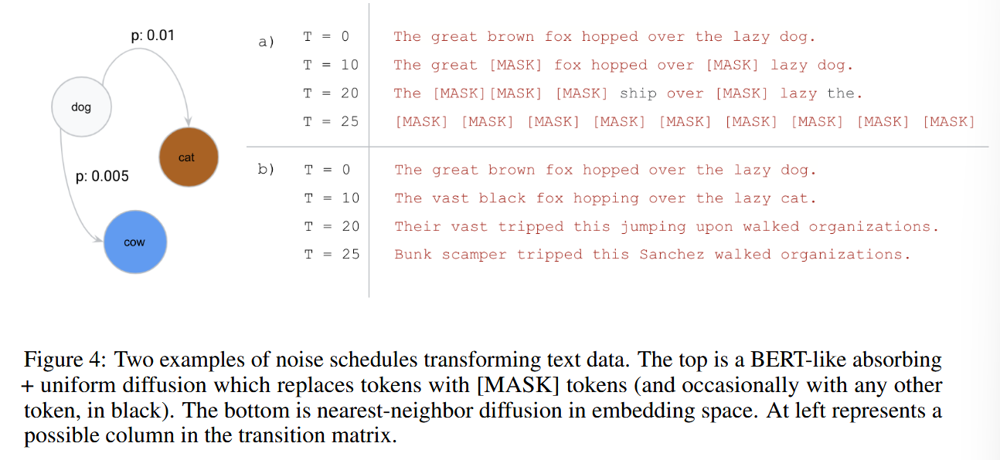

# Structured Denoising Diffusion Models in Discrete State-Spaces
[@austinStructuredDenoisingDiffusion2023a]

## 2. Background: Diffusion Models
#### Model) Diffusion Models
- Forward Process
  - Desc.)
    - Corrupt the data $`x_0\sim q(x_0)`$ into a sequence of increasingly noisy latent variables $`x_{1:T} = x_1,\cdots,x_T`$.
    - Process)
      - $`q(x_{1:T}\mid x_0) = \displaystyle\prod_{t=1}^T q(x_t\mid x_{t-1})`$
- Reverse Markov Process
  - Desc.)
    - Gradually denoise the latent variables towards the data distribution.
    - Process)
      - $`p_\theta(x_{0:T}) = p(x_T)\displaystyle\prod_{t=1}^T p_\theta(x_{t-1}\mid x_t)`$
- Optimization)
  - Minimize a variational upper bound on the negative log-likelihood of   
    

#### Props.) Diffusion Models
- If $`T\rightarrow\infty`$
  - then the forward and the reverse process share the same functional form.
  - Thus, we may use a learned **reverse process** from the same class of distributions as that of the **forward process**.
- For several choices of the forward process, 
  - $`q(x_t\mid x_0)`$ converges to a stationary distribution $`\pi(x)`$ when $`t\rightarrow\infty`$.
    - i.e.) Independent of $`x_0`$
  - Thus, for the large enough $`T`$, we may choose $`\pi(x)`$ as the prior $`p(x_T)`$.
    - e.g.) Gaussian
  - Also, from the above loss, $`L_T\approx0`$ regardless of the data distribution $`q(x_0)`$
- Desirable properties of the forward process, for the efficient training on $`p_\theta`$
  - Permits efficient sampling of $`x_t`$ from $`q(x_t\mid x_0),\;\forall t`$
    - Then, we may
      - randomly sample $`t`$
      - optimize each $`L_{t-1}`$ term individually with stochastic gradient descent
  - Has a tractable expression for the forward process posterior $`q(x_{t-1}\mid x,_t,x_0)`$
    - Then, we may easily compute the KL divergences in $`L_{t-1}`$ terms.
  - e.g.)
    - $`q(x_t\mid x_{t-1}) = \mathcal{N}(x_t\mid \sqrt{1-\beta_t} x_{t-1}, \beta_t\mathbf{I})`$
    - $`p_\theta(x_{t-1}\mid x_t) = \mathcal{N}(x_{t-1}\mid\mu_\theta(x_t,t), \Sigma_\theta(x_t, t))`$
      - Then
        - $`p(x_t) = \mathcal{N}(x_T\mid\mathbf{0,I})`$

  

## 3. Diffusion models for discrete state spaces
#### Concept) Diffusion with Categorical Random Variables
- Settings)
  - Scalar discrete random variable $`x_t`$ with $`K`$ categories
    - i.e.) $`x_t\in\{1,\cdots,K\},\; \forall t`$
  - Then, the **forward transition probabilities** can be represented by a matrix
    - $`[\boldsymbol{Q}_t]_{ij} = q(x_t = j\mid x_{t-1}=i)`$   
      - i.e.)    
        $`Q_t = \begin{bmatrix} 
        q(x_t=1\mid x_{t-1}=1) & q(x_t=2\mid x_{t-1}=1) & \cdots & q(x_t=K\mid x_{t-1}=1) \\ 
        q(x_t=1\mid x_{t-1}=2) & q(x_t=2\mid x_{t-1}=2) & \cdots & q(x_t=K\mid x_{t-1}=2) \\ 
        \vdots & \vdots & \ddots & \vdots \\
        q(x_t=1\mid x_{t-1}=K) & q(x_t=2\mid x_{t-1}=K) & \cdots & q(x_t=K\mid x_{t-1}=K) \\
        \end{bmatrix}`$
      - Desc.)
        - The $`i`$-th row denotes the probabilities of $`x_{t-1}=j`$ transitioning into each $`x_t`$ value.
      - Prop.)
        - $`\displaystyle\sum_{j=1}^K q(x_t=j\mid x_{t-1}=i) = 1,\;\forall i=1,\cdots,K`$
        - We may control the data corruption and denoising process by choosing different $`\boldsymbol{Q}_t`$.
- Marginal Probabilities)
  - $`q(\boldsymbol{x}_t\mid \boldsymbol{x}_{t-1}) = \text{Cat}(\boldsymbol{x}_t;\; \boldsymbol{p} = \boldsymbol{x}_{t-1}\boldsymbol{Q}_t)`$
    - where
      - $`\boldsymbol{x}_{t-1}, \boldsymbol{x}_t \in \left\{ [1\;0\;\cdots\;0], \cdots, [0\;0\;\cdots\;1] \right\}\subseteq \{0,1\}^K`$ : one-hot row vector
      - $`\boldsymbol{p}\in[0,1]^K`$ : row probability vector
        - cf.)   
          $`\boldsymbol{p} = \begin{bmatrix} q(x_t=1\mid x_{t-1}=i) & q(x_t=2\mid x_{t-1}=i) & \cdots & q(x_t=K\mid x_{t-1}=i) \end{bmatrix}`$
      - $`\text{Cat}(\boldsymbol{x};\boldsymbol{p})`$ : a categorical distribution over  $`\boldsymbol{x}`$ and $`\boldsymbol{p}`$ 
    - Desc.)
      - $`x_t`$ is sampled from the categorical distribution $`x_{t-1}Q_t`$
    - e.g.) 
      - Suppose
        - $`\boldsymbol{x}_{t-1} = \begin{bmatrix}1&0&0\end{bmatrix}`$, $`Q_t = \begin{bmatrix} 0.3&0.3&0.4\\0.2&0.3&0.5\\0.1&0.3&0.6 \end{bmatrix}`$.
      - Then, we get the probability vector
        - $`x_{t-1}Q_t = \begin{bmatrix}0.3&0.3&0.4\end{bmatrix} = \boldsymbol{p}`$
      - Finally, we sample $`x_t`$ as
        - $`x_t \sim \begin{cases} 1 & \text{with }p=0.3\\2 & \text{with }p=0.3\\1 & \text{with }p=0.4\\ \end{cases}`$
  - Then, we may get
    - $`q(\boldsymbol{x}_t\mid\boldsymbol{x}_0) = \text{Cat}(\boldsymbol{x}_t; \boldsymbol{p} = \boldsymbol{x}_0 \overline{\boldsymbol{Q}}_t)`$ : the $`t`$-step marginal
      - where $`\overline{\boldsymbol{Q}}_t = \boldsymbol{Q}_1\boldsymbol{Q}_2\cdots\boldsymbol{Q}_t`$ 
        - Prop.)
          - The rows of $`\overline{\boldsymbol{Q}}_t`$ must converge to a known stationary distribution when $`t`$ becomes large
- Posterior Probability)
  - Why needed?)
    - Recall the diffusion model's loss of 
      - $`L_{\text{vb}} = \mathbb{E}_q \left[ L_T + \displaystyle\sum_{t=2}^T L_{t-1} - L_0 \right]`$
    - And, also that
      - $`L_{t-1} = \mathbb{E}_{q(\boldsymbol{x}_t\mid\boldsymbol{x}_0)}\left[ D_{\text{KL}} \left(\underbrace{q(\boldsymbol{x}_{t-1}\mid\boldsymbol{x}_t,\boldsymbol{x}_0)}_{\text{Forward Posterior!}} \;\bigg\Vert\; \underbrace{p_\theta(\boldsymbol{x}_{t-1}\mid\boldsymbol{x}_t)}_{\text{Param'd Reverse}}\right) \right]`$
    - Thus, in order to optimize, the forward posterior should be calculated!
  - Def.) Posterior : $`t-1\rightarrow t`$   
    $`\begin{aligned}
      q(\boldsymbol{x}_{t-1}\mid\boldsymbol{x}_t, \boldsymbol{x}_0) 
      &= \frac{q(\boldsymbol{x}_t\mid\boldsymbol{x}_{t-1},\boldsymbol{x}_0) q(\boldsymbol{x}_{t-1}\mid\boldsymbol{x}_0)}{q(\boldsymbol{x}_t\mid\boldsymbol{x}_0)} \\
      &= \text{Cat} \left(\boldsymbol{x}_{t-1}; \boldsymbol{p} = \frac{\boldsymbol{x}_t \boldsymbol{Q}_t^\top \odot \boldsymbol{x}_0 \overline{\boldsymbol{Q}}_{t-1}}{\boldsymbol{x}_0 \overline{\boldsymbol{Q}}_t x_t^\top}  \right) & \text{ : the posterior at } t-1
    \end{aligned}`$
    - cf.)
      - $`q(\boldsymbol{x}_{t}\mid\boldsymbol{x}_{t-1}, \boldsymbol{x}_0) = q(\boldsymbol{x}_{t}\mid\boldsymbol{x}_{t-1}) \quad (\because\text{Markov Process})`$
  - Assume that $`p_\theta(x_t\mid x_{t-1})`$ is also factorized as conditionally independent over the image or sequence elements.
    - Then, the KL divergence between $`q`$ and $`p_\theta`$ can be computed by simply summing over all possible values of each random variable.

 

#### Tech) Implementation on the Concatenated Data
- Problem)
  - Consider that the above $`Q_t`$ transition illustrates the categorical distribution of an individual datapoint.
    - e.g.)
      - Individual token in the LMs
      - Individual pixel's channel in Vision Models.
  - But the data that we actually care are the concatenations of those individual datapoints.
    - e.g.)
      - Text in the LMs
      - Picture in the Vision Models.
  - Then, how do we apply the above DDM to the concatenated dataset?
- Sol.)
  - Put 
    - $`\boldsymbol{x}`$ : an individual datapoint
    - $`X = [\boldsymbol{x}^1, \boldsymbol{x}^2,\cdots,\boldsymbol{x}^n]`$ : the concatenated dataset with the length $`n`$.
  - Then, we may define the forward process as
    - $`q(X_t\mid X_{t-1}) = \displaystyle\prod_{i=1}^n q(\boldsymbol{x}_t^i\mid \boldsymbol{x}_{t-1}^i)`$
      - i.e.) The forward process (noising) assumes each datapoint transitions independently.
- Implementation)
  - Training)
    - Given $`(X_0, t)`$, create the noise data $`X_t`$ in parallel using $`q(X_t\mid X_{0}) = \displaystyle\prod_{i=1}^n q(\boldsymbol{x}_t^i\mid \boldsymbol{x}_{0}^i)`$.
    - Input $`(X_t, t)`$ into $`p_\theta`$ and calculate the [loss](#34-loss-function) made with $`X_0-\hat{X_0}`$
  - Inference)
    - Input the whole $`(X_t, t)`$ repetitively following the schedule from $`t=T`$ to $`t=1`$ to generate $`X_0`$.

 

### 3.1 Choice of Markov transition matrices for the forward process
- Advantage)
  - We may control the data corruption and denoising process by choosing different $`\boldsymbol{Q}_t`$.
- Caution)
  - $`\boldsymbol{Q}_t`$ should gradually add noise to the previous state.
    - Why?)
      - If not, the original image will turn into pure noise in few steps.
    - Below examples of $`\boldsymbol{Q}_t`$ are the ones that guarantee that the information is slowly and gradually destroyed in a controlled manner.
- Types)
  - [Uniform Transition Matrix](#concept-uniform-transition-matrix)
  - [Absorbing State Transition Matrix](#concept-absorbing-state-transition-matrix)
  - [Discretized Gaussian Transition Matrix](#concept-discretized-gaussian-transition-matrix)
  - [Token Embedding Distance Transition Matrix](#concept-token-embedding-distance-transition-matrix)

 

#### Concept) Uniform Transition Matrix
- Def.)
  - $`\boldsymbol{Q}_t = (1-\beta_t)\mathbf{I} + \beta_t/K \; \boldsymbol{1}\boldsymbol{1}^\top`$ with $`\beta_t\in[0,1]`$
    - Desc.)
      - With the probability
        - $`1-\beta_t`$, the next state stays in the same category
        - $`\beta_t`$, the next state changes the category
- Prop.)
  - Doubly stochastic with strictly positive entries.
    - Thus, the stationary distribution is uniform.
  - Transition probability to any other state is uniform
- Noise Schedule)
  - [Cosine schedule](../../../../project/references/basics/improved_ddpm.md#32-improving-the-noise-schedule) as in [Improved DDPM](../../../../project/references/basics/improved_ddpm.md).

 

#### Concept) Absorbing State Transition Matrix
- Def.)   
  - For the absorbing state $`m`$,   
    $`[\boldsymbol{Q}_t]_{ij} = \begin{cases}
      1 & \text{if } i=j=m \\
      1-\beta_t & \text{if } i=j \ne m \\
      \beta_t & \text{if } j=m, i\ne m \\
    \end{cases}`$
    - Or, equivalently $`Q_t = (1-\beta_t)\mathbf{I} + \beta_t \boldsymbol{1} e_m^\top`$ where $`e_m`$ is a vector with a one on the absorbing state and zeros elsewhere.
      - e.g.) When $`m=2`$   
        $`(1-\beta_t)\begin{bmatrix} 1&0&0&\cdots&0 \\ 0&1&0&\cdots&0 \\ 0&0&1&\cdots&0 \\ \vdots&\vdots&\vdots&\ddots&\vdots\\ 0&0&0&\cdots&1 \end{bmatrix} + \beta_t\begin{bmatrix} 0&1&0&\cdots&0 \\ 0&1&0&\cdots&0 \\ 0&1&0&\cdots&0 \\ \vdots&\vdots&\vdots&\ddots&\vdots \\ 0&\underbrace{1}_{\text{abs}}&0&\cdots&0 \end{bmatrix} = \begin{bmatrix} 1-\beta_t&\beta_t&0&\cdots&0 \\ 0&1&0&\cdots&0 \\ 0&\beta_t&1-\beta_t&\cdots&0\\ \vdots&\vdots&\vdots&\ddots&\vdots\\ 0&\beta_t&0&\cdots&1-\beta_t \end{bmatrix}`$
  - Prop.)
    - Higher $`\beta_t`$, faster absorbing
- Desc.)
  - [MASK] : an absorbing state
    - s.t. each token either stays the same or transitions to [MASK] with some probability $`\beta_t`$
  - Motivated by BERT
  - No particular relationships between categories
- Noise Schedule)
  - Interpolate the mutual information between $`\boldsymbol{x}_t`$ and $`\boldsymbol{x}_0`$
    - i.e.) $`I(\boldsymbol{x}_t;\boldsymbol{x}_0) \approx \left(1-\frac{t}{T}\right) H(\boldsymbol{x}_0)`$
    - This schedule reduces to exactly the $`(T-t+1)^{-1}`$

 

#### Concept) Discretized Gaussian Transition Matrix
- Desc.)
  - Imitate a continuous space diffusion model by using a discretized, truncated Gaussian distribution.
    - Higher probability to the closer categories
  - Doubly stochastic normalization, leading to a uniform stationary distribution.
- Noise Schedule)
  - Linearly increasing variance of the Gaussian before discretizing it.
    - cf.) Linear schedule for $`\boldsymbol{Q}_t`$ leads to a nonlinear amount of cumulative noise in $`\overline{\boldsymbol{Q}}_t`$

 

#### Concept) Token Embedding Distance Transition Matrix
- Desc.)
  - Specifically for the textural data.
  - Higher probability to the closer embeddings
- Noise Schedule)
  - Interpolate the mutual information between $`\boldsymbol{x}_t`$ and $`\boldsymbol{x}_0`$
    - i.e.) $`I(\boldsymbol{x}_t;\boldsymbol{x}_0) \approx \left(1-\frac{t}{T}\right) H(\boldsymbol{x}_0)`$

  

### 3.3 Parameterization of the Reverse Process
- Model)
  - One-step Reverse Process
    - $`p_\theta(\boldsymbol{x}_{t-1}\mid \boldsymbol{x}_t) \varpropto \displaystyle\sum_{\tilde{\boldsymbol{x}_0}} q(\boldsymbol{x}_{t-1}, \boldsymbol{x}_t \mid \tilde{\boldsymbol{x}_0}) \underbrace{\tilde{p}_\theta(\tilde{\boldsymbol{x}_0}\mid\boldsymbol{x}_t)}_{\text{What nn}_\theta(\boldsymbol{x}_t)\text{ predicts}}`$
      - where
        - $`\tilde{\boldsymbol{x}_0}`$ : the categorical value at $`t=0`$
      - Derivation)   
        $`\begin{aligned}
          p_\theta(\boldsymbol{x}_{t-1}\mid \boldsymbol{x}_t)
          &= \sum_{\tilde{\boldsymbol{x}_0}} p_\theta(\boldsymbol{x}_{t-1}, \tilde{\boldsymbol{x}_0}\mid\boldsymbol{x}_t) \\
          &= \sum_{\tilde{\boldsymbol{x}_0}} p_\theta(\boldsymbol{x}_{t-1}\mid\boldsymbol{x}_t, \tilde{\boldsymbol{x}_0}) \; p_\theta(\tilde{\boldsymbol{x}_0}\mid \boldsymbol{x}_t) \\
          &= \sum_{\tilde{\boldsymbol{x}_0}} \frac{p_\theta(\boldsymbol{x}_{t-1}, \boldsymbol{x}_t\mid\tilde{\boldsymbol{x}_0})}{p_\theta(\boldsymbol{x}_t\mid\tilde{\boldsymbol{x}_0})} \; p_\theta(\tilde{\boldsymbol{x}_0}\mid \boldsymbol{x}_t) \\
          &\approx \sum_{\tilde{\boldsymbol{x}_0}} \frac{q(\boldsymbol{x}_{t-1}, \boldsymbol{x}_t\mid\tilde{\boldsymbol{x}_0})}{q(\boldsymbol{x}_t\mid\tilde{\boldsymbol{x}_0})} \; \tilde{p_\theta}(\tilde{\boldsymbol{x}_0}\mid \boldsymbol{x}_t) \\
          &\varpropto \sum_{\tilde{\boldsymbol{x}_0}} \underbrace{q(\boldsymbol{x}_{t-1}, \boldsymbol{x}_t\mid\tilde{\boldsymbol{x}_0})}_{\text{term 0}} \; \tilde{p_\theta}(\tilde{\boldsymbol{x}_0}\mid \boldsymbol{x}_t) \\
        \end{aligned}`$
      - cf.) How to get $`\underbrace{q(\boldsymbol{x}_{t-1}, \boldsymbol{x}_t\mid\tilde{\boldsymbol{x}_0})}_{\text{term 0}}`$.
        - Consider that
          - $`q(\boldsymbol{x}_{t-1}, \boldsymbol{x}_t\mid\tilde{\boldsymbol{x}_0}) = \underbrace{q(\boldsymbol{x}_t\mid\boldsymbol{x}_{t-1},\tilde{\boldsymbol{x}_0})}_{\text{term 1}} \cdot \underbrace{q(\boldsymbol{x}_{t-1}\mid\tilde{\boldsymbol{x}_0})}_{\text{term 2}}`$ 
        - Term 1)
          - Since the forward process is the Markovian, $`\boldsymbol{x}_t`$ depends only on $`\boldsymbol{x}_{t-1}`$
          - Thus,
            - $`\underbrace{q(\boldsymbol{x}_t\mid\boldsymbol{x}_{t-1},\tilde{\boldsymbol{x}_0})}_{\text{term 1}} = q(\boldsymbol{x}_t\mid\boldsymbol{x}_{t-1})`$
          - Here, $`q(\boldsymbol{x}_t\mid\boldsymbol{x}_{t-1})`$ is the element of $`Q_t`$ that we choose!
            - e.g.) For $`x_t = j, x_{t-1} = i`$, 
              - $`q(\boldsymbol{x}_t\mid\boldsymbol{x}_{t-1}) = [Q_t]_{ij}`$.  
        - Term 2)
          - By the forward process,
            - $`\underbrace{q(\boldsymbol{x}_{t-1}\mid\tilde{\boldsymbol{x}_0})}_{\text{term 2}} = \tilde{x_0} \overline{Q}_{t-1} = \tilde{x_0} Q_1\cdots Q_{t-1}`$
  - $`k`$ steps in one-shot
    - $`p_\theta(\boldsymbol{x}_{t-k}\mid \boldsymbol{x}_t) = \displaystyle\sum_{\tilde{\boldsymbol{x}_0}} q(\boldsymbol{x}_{t-k}, \boldsymbol{x}_t \mid \tilde{\boldsymbol{x}_0}) \underbrace{\tilde{p}_\theta(\tilde{\boldsymbol{x}_0}\mid\boldsymbol{x}_t)}_{\text{What nn}_\theta(\boldsymbol{x}_t)\text{ predicts}}`$
- Desc.)
  - We want to parameterize a single reverse step $`p_\theta(\boldsymbol{x}_{t-1}\mid \boldsymbol{x}_t)`$.
  - However, in this categorical problem setting, it is more complicated.
    - Why?) $`K`$ options on every step!
  - Thus, we may take an alternative indirect approach.
    - $`\boldsymbol{x}_{t} \rightarrow \tilde{\boldsymbol{x}_0} \rightarrow \boldsymbol{x}_{t-1}`$
      - How?)
        - `for` $`\tilde{\boldsymbol{x}_0}`$ `in` $`\{1,\cdots, K\}`$
          - $`\boldsymbol{x}_{t} \rightarrow \boldsymbol{x}_0`$ : $`\tilde{p}_\theta(\tilde{\boldsymbol{x}_0}\mid\boldsymbol{x}_{t})`$
          - $`\boldsymbol{x}_0 \rightarrow \boldsymbol{x}_{t-1}`$ : $`q(\boldsymbol{x}_{t-1}, \boldsymbol{x}_t \mid \tilde{\boldsymbol{x}_0})`$
      - cf.) Direct Process
        - $`\boldsymbol{x}_t \rightarrow \boldsymbol{x}_{t-1}`$
          - e.g.) DDPM : $`p_\theta(x_{t-1}\mid x_{t}) = \mathcal{N}(\mu_\theta(x_{t}), \Sigma_\theta(x_{t}))`$
- Props.)
  - The sparsity pattern of $`\boldsymbol{Q}_t`$ determines the sparsity pattern of the ideal reverse transition probability distribution $`p_\theta(\boldsymbol{x}_{t-1}\mid \boldsymbol{x}_t)`$
    - i.e.)
      - This parameterization ensures learning a reverse process that has the correct sparsity pattern dictated by $`\boldsymbol{Q}_t`$
    - Why?)
      - Only if $`q(\boldsymbol{x}_t\mid \boldsymbol{x}_{t-1})\ne0`$, the reverse process takes that state transition into account.

  

### 3.4 Loss Function
- Def.)
  - $`L_\lambda = L_{\text{vb}} + \lambda \mathbb{E}_{q(\boldsymbol{x}_0)} \mathbb{E}_{q(\boldsymbol{x}_t\mid\boldsymbol{x}_0)}\big[-\log\tilde{p_\theta}(\boldsymbol{x}_0\mid\boldsymbol{x}_t)\big]`$
    - where
      - $`L_{\text{vb}}`$ : the negative variational lower bound
        - cf.)
          - [DDPM](../../../../paper_presentation/250931_latent_diffusion/paper_summary/ddpm.md) and [Improved DDPM](../../../../project/references/basics/improved_ddpm.md)
      - $`\mathbb{E}_{q(\boldsymbol{x}_0)} \mathbb{E}_{q(\boldsymbol{x}_t\mid\boldsymbol{x}_0)}\big[-\log\tilde{p_\theta}(\boldsymbol{x}_0\mid\boldsymbol{x}_t)\big]`$ : an auxiliary denoising objective for the $`\boldsymbol{x}_0`$-parameterization of the reverse process
- Prop.)
  - The auxiliary objective 
    - encourages good predictions of the data $`\boldsymbol{x}_0`$ at each time step.
    - coincides with the cross entropy term $`L_0`$ in the [diffusion model above](#model-diffusion-models) 

  

## 4. Connection to existing probabilistic models for text
#### 1) BERT

#### 2) AR
- Masking from last to first in a deterministic order
  - Forward
    - e.g.)
      - The great brown fox hopped over the lazy dog.
      - The great brown fox hopped over the lazy [MASK].
      - The great brown fox hopped over the [MASK] [MASK].
      - The great brown fox hopped over [MASK] [MASK] [MASK].
      - ...
      - The [MASK] [MASK] [MASK] [MASK] [MASK] [MASK] [MASK] [MASK].
      - [MASK] [MASK] [MASK] [MASK] [MASK] [MASK] [MASK] [MASK] [MASK].
  - Reverse
    - $`D_{KL}(q([\boldsymbol{x}_{t-1}]_j\vert\boldsymbol{x}_t,\boldsymbol{x}_0)\;\Vert\;p_\theta([\boldsymbol{x}_{t-1}]_j\vert\boldsymbol{x}_t)) = \begin{cases} -\log p_\theta([\boldsymbol{x}_0]_i\mid\boldsymbol{x}_t) & i=T-t \\ 0 & \text{otherwise} \end{cases}`$
      - Desc.)
        - Loss exists only at the first of the remaining [MASK] tokens, the next token to predict in the AR process.
#### 3) Masked Language Models (MLM)