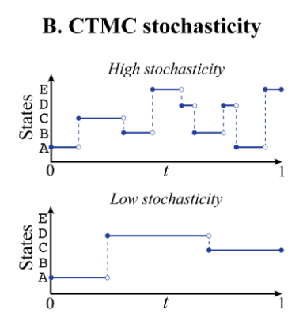
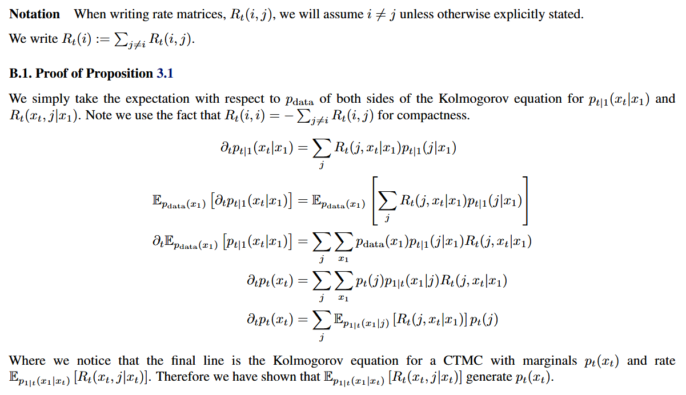
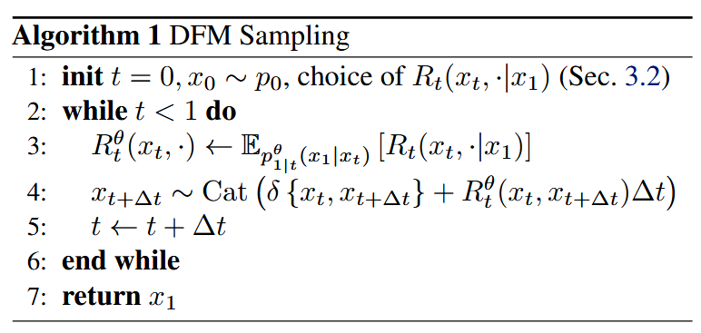
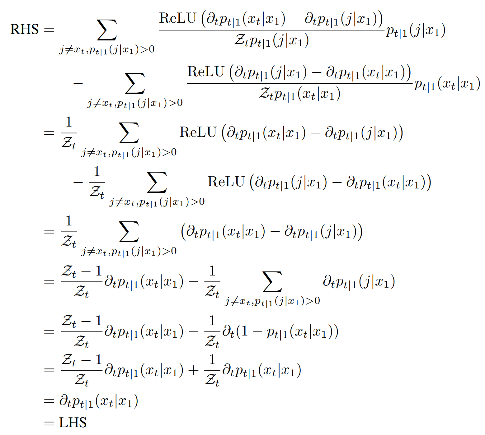

# Generative Flows on Discrete State-Spaces:  Enabling Multimodal Flows with Applications to Protein Co-Design
[@campbellGenerativeFlowsDiscrete2024]

## 1 DFM workflow summarized by hozy
- Paper's logical flow
  - We want to learn the [marginal generative flow](#concept-marginal-generative-flow) $`p_t(x_t)`$.
  - By the [CTMC](./cmtc.md#concept-continuous-time-markov-chain-ctmc) framework, we may generate $`p_t(x_t)`$ using the marginal transition rate matrix $`R_t(x_t, j)`$.
    - How?) Using the [Kolmogorov Equation](./cmtc.md#concept-kolmogorov-equation)
  - $`R_t(x_t, j)`$ has a [property](#concept-how-to-get-the-marginal-transition-rate-matrix-using-conditional-transition-matrix) that
    - $`R_t(x_t, j) := \mathbb{E}_{\underbrace{p_{1\mid t}(x_1\mid x_t)}_{(2)}} \left[ \underbrace{R_t(x_t,j\mid x_1)}_{(1)} \right]`$
      - cf.) Proved in this paper.
  - Here,
    - (1) $`R_t(x_t,j\mid x_1)`$ is any [conditional transition rate matrix](#concept-conditional-transition-matrix) that generates the [conditional generative flow](#concept-conditional-generative-flow) $`p_{t\mid1}(x_t\mid x_1)`$
      - We design the [conditional generative flow](#concept-conditional-generative-flow) $`p_{t\mid1}(x_t\mid x_1)`$.
        - Meaning) 
          - Given the final destination $`x_1`$, the probability of choosing $`x_t`$ at time $`t`$
        - Design) 
          - Linear interpolation between prior noise and the data distribution.
        - Possible priors)
          - Uniform, Mask(Absorbing) State
      - We choose $`R_t(x_t,j\mid x_1)`$ that generates $`p_{t\mid1}(x_t\mid x_1)`$
    - (2) $`p_{1\mid t}(x_1\mid x_t)`$ is intractable.
      - So we approximate with neural network : $`p_{1\mid t}^\theta(x_1\mid x_t)`$
  - By optimizing $`\theta`$ using the cross entropy loss $`(\Leftrightarrow \text{Max Likelihood} \Rightarrow \text{ELBO})`$, we may approximate $`p_{1\mid t}^\theta(x_1\mid x_t) \approx p_{1\mid t}(x_1\mid x_t)`$
- Practical Work flow
  - Define the desired noise schedule $`p_{t\mid1}(x_t\mid x_1)`$.
  - Train denoising model $`p_{1\mid t}^\theta(x_1\mid x_t)`$
  - Choose rate matrix $`R_t^\eta`$
  - Run sampling.

 

## 2 Background
- Settings)
  - $`x\in\{1,\cdots,S\}^D`$ : a discrete data sequence with $`D`$-dimension
    - For simplicity, we assume $`D=1`$.
    - Still, all results hold for $`\forall D\gt1`$.

 

### 2.1 Continuous Time Markov Chain (CTMC)
[hozy note on CTMC](./cmtc.md)
- Settings)
  - $`x_t`$ : a sequence trajectory over time $`t\in[0,1]`$
    - Desc.)
      - $`x_t`$ alternates between resting in its current state and periodically jumping to another randomly chosen state.   
        
  - $`R_t(x_t,j)\in\mathbb{R}^{S\times S}`$ : the transition rate matrix from state $`x_t`$ to $`j`$
    - where
      - $`x_t,j\in\{1,\cdots,S\}`$
      - its off-diagonal elements are non-negative.
  - $`p_{t+\text{d}t}(j\mid x_t)`$ : the probability of jumping from $`x_t`$ to $`j`$ determined by $`R_t(x_t,j)`$
    - Desc.)
      - $`R_t`$ determines the frequency and destination of the jumps by     
        $`\begin{aligned}
            p_{t+\text{d}t}(j\mid x_t) &= \begin{cases} R_t(x_t, j)\text{d}t & \text{for } j\ne x_t \\ 1+R_t(x_t, x_t)\text{d}t & \text{for } j = x_t \\ \end{cases} \\
            &= \delta\{x_t,j\} + R_t(x_t, j)\text{d}t
        \end{aligned}`$
        - where
          - $`\delta(i,j) = \begin{cases} 1 & \text{if }i=j\\0 & \text{otherwise}\end{cases}`$
          - $`R_t(x_t, x_t) := -\displaystyle\sum_{k\ne x}R_t(x_t,k)`$
            - Why?) So that $`R_t(x_t, x_t)+\displaystyle\sum_{k\ne x}R_t(x_t,k)=\sum_{k}R_t(x_t,k)=p_{t+\text{d}t}(\cdot\mid i)=1`$
      - $`p_{t+\text{d}t}`$ is a Categorical distribution 
        - i.e.)
          - $`j\sim p_{t+\text{d}t}(j\mid x_t) \Leftrightarrow j\sim \text{Cat}\bigg(\delta\{x_t,j\} + R_t(x_t,j)\text{d}t\bigg)`$
      - Finite time interval notation
        - $`x_{t+\Delta t} \sim \text{Cat}\bigg(\delta\{x_t,x_{t+\Delta t}\} + R_t(x_t,x_{t+\Delta t})\Delta t\bigg)`$

 

### 2.2 Kolmogorov Equation
- Goal)
  - Describe $`p_t(x_t)`$, the marginal distribution at time $`t`$, using the dynamics of the [CTMC above](#21-continuous-time-markov-chain-ctmc).
- Def.)
  - $`\partial_t p_t(x_t) = \displaystyle \underbrace{\sum_{j\ne x_t} R_t(j,x_t)p_t(j)}_{\text{incoming to } x_t} - \underbrace{\sum_{j\ne x_t} R_t(x_t, j)p_t(x_t)}_{\text{outgoing from }x_t} = R_t^\top p_t`$

 

#### Concept) Ordinary Differential Equation (ODE) defined on CTMC
- Def.)
  - $`\partial_t p_t = R_t^\top p_t, \quad \forall t\in[0,1]`$
- Prop.)
  - This series of distributions $`p_t`$ satisfies the ODE as a probability flow.

  

## 3 Discrete Flow Models (DFM)
### 3.1 A Flow Model for Sampling Discrete Data

#### Concept) Marginal Generative Flow
- Def.)
  - $`p_t(x_t)`$ is the interpolation between $`p_0(x_0)`$ and $`p_1(x_1)`$.
    - where
      - $`x_0 \in\mathcal{X}`$ : an arbitrary state at time $`t=0`$
      - $`p_0(x_0) = p_{\text{noise}}(x_0)`$
        - i.e.) Drawing $`x_0`$ completely in random at time $`t=0`$
          - Here, the randomness corresponds with the noise concept.
        - e.g.) Uniform case : $`p_{\text{noise}}(x_0)=\frac{1}{S}`$
      - $`x_1 \in\mathcal{X}`$ : a deterministic state at time $`t=1`$
      - $`p_1(x_1) = p_{\text{data}}(x_1)`$
        - i.e.) Drawing $`x_1`$ from the data distribution at time $`t=1`$.
- Desc.)
  - A probability flow $`p_t`$ that interpolates from noise to data.
    - Not necessarily a linear interpolation.
    - cf.) We design [conditional Generative Flow](#concept-conditional-generative-flow) to be linear.
- Problem)
  - The marginal flow is complex to consider directly.
    - Why?)
      - It contains both inflow and outflow, which corresponds to Kolmogorov forward and backward.
- Solution)
  - Consider the following   
    $`\begin{aligned}
        p_t(x_t) 
        &= \sum_{x_1} p(x_t, x_1) & (\because\text{Discretely marginalize!}) \\
        &= \sum_{x_1} p_{t\mid1}(x_t\mid x_1) \; p_{\text{data}}(x_1) & (\because\text{Bayes Rule})  \\   
        &= \mathbb{E}_{p_{\text{data}}(x_1)} \left[ p_{t\mid1}(x_t\mid x_1) \right] \\   
    \end{aligned}`$
  - We may interpret $`p_{t\mid1}(x_t\mid x_1)`$ as the probability of choosing $`x_t`$ at time $`t`$ given the destination $`x_1`$ at $`t=1`$
  - We may further simplify by designing it in the linear interpolation form as [Conditional Generative Flow below](#concept-conditional-generative-flow)

 

#### Concept) Conditional Generative Flow
- Def.)   
  - $`p_{t\mid1}(x_t\mid x_1) = \text{Cat}\bigg( t\; p_{1\mid1}(x_t\mid x_1) + (1-t)\; p_{0\mid1}(x_0\mid x_1) \bigg)`$
    - where
      - $`p_{0\mid1}(x_0\mid x_1) = p_{\text{noise}}(x_0)`$ : the noise
        - Meaning)
          - The probability of drawing $`x_0`$ completely in **random** at time $`t=0`$ given the final state $`x_1`$
      - $`p_{1\mid1}(x_t\mid x_1) = \delta\{x_1,x_t\} = \begin{cases} 1 &\text{if }x_t=x_1\\ 0&\text{otherwise}\end{cases}`$ : the data
        - Meaning)
          - The probability of **deterministically** drawing $`x_1`$ at time $`t=1`$ given the final state $`x_1`$ (trivial!)
    - i.e.) 
      - the probability of choosing $`x_t`$ at time $`t`$ given the destination $`x_1`$ at $`t=1`$
- Desc.)
  - Intractable [marginal generative flow above](#concept-marginal-generative-flow) is defined by the tractable **conditional generative flow**.
  - **Linear interpolation** in time between the noise and data...
    - Thus, the probability $`p_{t\mid1}(x_t\mid x_1)`$ is differentiable w.r.t. time $`t`$
  - Categorical Distribution for $`x_t`$ at $`t`$.
    - i.e.) 
      - Suppose the we are at time $`t`$.
      - The probability of drawing $`j=1,2,\cdots,S`$ is 
        - $`p_{t\mid1}(j\mid x_1) = t\; p_{1\mid1}(x_t\mid x_1) + (1-t)\; p_{0\mid1}(x_0\mid x_1)`$
- e.g.)
  - Uniform prior case
    - $`p_{t\mid1}^{\text{unif}}(x_t\mid x_1) = \text{Cat}\bigg( t\;\delta\{x_1,x_t\} + (1-t)\frac{1}{S} \bigg)`$
      - where
        - $`p_{\text{noise}}^{\text{unif}}(x_t)=\displaystyle\frac{1}{S}`$
    - One-hot Encoding representation
      - $`p_{1\mid1}(x_1\mid x_1) = [0\;0\;\cdots\;0\;1\;0\;\cdots\;0]`$
      - $`p_{0\mid1}(x_0\mid x_1) = [\frac{1}{S}\;\frac{1}{S}\;\cdots\;\frac{1}{S}\;\frac{1}{S}\;\frac{1}{S}\;\cdots\;\frac{1}{S}]`$ 
  - Mask (Absorbing) state $`(M)`$ case
    - $`p_{t\mid1}^{\text{mask}}(x_t\mid x_1) = \text{Cat}\bigg( t\;\delta\{x_1,x_t\} + (1-t)\;\delta\{M,x_t\} \bigg)`$
      - where
        - $`p_{\text{noise}}^{\text{mask}}(x_t)=\delta\{M,x_t\}`$
    - One-hot Encoding representation
      - $`p_{1\mid1}(x_1\mid x_1) = [0\;0\;\cdots\;0\;1\;0\;\cdots\;\underbrace{0}_{\text{Mask State}}]`$
      - $`p_{0\mid1}(x_0\mid x_1) = [0\;0\;\cdots\;0\;0\;0\;\cdots\;\underbrace{1}_{\text{Mask State}}]`$ : Masked!

 

#### Concept) Conditional Transition Matrix
- Def.)         
  - $`R_t(x_t, j\mid x_1)`$ : the $`(x_t, j)`$-th element of the transition matrix $`R_t(\cdot\mid x_1)`$
    - s.t.   
        $`\begin{aligned}
            \mathbb{P}(x_{t+\Delta t}=j\mid x_t, x_1)
            &= \begin{cases} R_t(x_t, j\mid x_1)\text{d}t & \text{for } j\ne x_t \\ 1+R_t(x_t, x_t\mid x_1)\text{d}t & \text{for } j = x_t \\ \end{cases}
        \end{aligned}`$
- Desc.)
  - [Recall](#generative-flows-on-discrete-state-spaces--enabling-multimodal-flows-with-applications-to-protein-co-design) that we decided to use the conditional probability flow $`p_{t\mid1}(x_t \mid x_1)`$.
  - Thus, we should define $`R_t(x_t, j\mid x_1)`$ that generates $`p_{t\mid1}(x_t \mid x_1)`$.
  - There are infinitely many $`R_t(x_t, j\mid x_1)`$s that generates $`p_{t\mid1}(x_t \mid x_1)`$.
  - [3.2 Choice of Rate Matrix](#32-choice-of-rate-matrix) explains choosing which $`R_t(x_t, j\mid x_1)`$ is the most promising.

 

#### Concept) How to get the Marginal Transition Rate Matrix using Conditional Transition Matrix
- Goal)
  - To generate **intractable** the marginal probability flow, $`p_t(x_t)`$, we need to define $`R_t(x_t,j)`$.
    - Why?)
      - [Recall](#concept-marginal-generative-flow) that $`p_t(x_t)`$ was intractable.
  - But, we don't know what $`R_t(x_t,j)`$ is.
  - Still, instead have...
    - $`p_{t\mid 1}(x_t \mid x_1)`$
    - $`R_t(x_t, j\mid x_1)`$ 
  - We want to derive $`R_t(x_t,j)`$ using what we have.
- Desc.)
  - The Prop. below shows that we may derive $`R_t(x_t,j)`$ using $`R_t(x_t, j\mid x_1)`$ 
    - $`R_t(x_t, j) := \mathbb{E}_{p_{1\mid t}(x_1\mid x_t)} \bigg[ R_t(x_t,j\mid x_1) \bigg]`$
      - pf.)   
        
  - To get the expectation of $`R_t(x_t,j\mid x_1)`$ on $`p_{1\mid t}(x_1\mid x_t)`$, we need to know $`p_{1\mid t}(x_1\mid x_t)`$
  - However, $`p_{1\mid t}(x_1\mid x_t)`$ is intractable.
    - Why?)
      - $`p_{1\mid t}(x_1\mid x_t) = \displaystyle \frac{p_{t\mid1}(x_t\mid x_1) \; p_{\text{data}}(x_1)}{p_t(x_t)}`$
        - where $`p_t(x_t)`$ is still intractable.
  - Thus, we [approximate using neural network](#312-training).
    - i.e.) $`p_{1\mid t}^\theta(x_1\mid x_t) = p_{1\mid t}(x_1\mid x_t)`$

 

#### 3.1.1 Sampling
- Algorithm)   
  

 

#### 3.1.2 Training
- Desc.)
  - Recall that we approximated as
    - $`p_{1\mid t}^\theta(x_1\mid x_t) = p_{1\mid t}(x_1\mid x_t)`$
  - We may train this model by making it approximate the true denoising distribution.
    - i.e.) Learn to predict the clean data point $`x_1`$ given the noisy data $`x_t \sim p_{t\mid 1} (x_t\mid x_1)`$.
  - Using the cross entropy loss, we may get
    - $`\mathcal{L}_{\text{ce}} = \mathbb{E}_{p_{\text{data}}(x_1)\;\mathcal{U}(t;0,1)\;p_{t\mid1}(x_t\mid x_1)} \bigg[ \log p_{1\mid t}^\theta(x_1\mid x_t) \bigg]`$
      - cf.)   
        $`\begin{aligned}
            \mathcal{L}_{\text{ce}} &= -\sum_{x_1'} y(x_1') \log p^\theta(x_1'\mid x_t) & (y(x_1') \text{ is a one-hot vector}) \\
            &= -\sum_{x_1'} \log p^\theta(x_1'\mid x_t) & (\because \text{all } x_1\ne x_1' \text{zeroes out!}) \\
        \end{aligned}`$
      - This loss relates to ELBO.

 

### 3.2 Choice of Rate Matrix
- Goal)
  - There are infinitely many choices of conditional transition rate matrices $`R_t(x_t, j\mid x_1)`$ that generates the conditional flow $`p_{t\mid1}(x_t\mid x_1)`$.
  - We want to fine appropriate ones to our needs.
- e.g.)
  - [ReLU](#concept-relu-conditional-transition-matrix)
  - [Generalized Rate matrix](#concept-generalized-conditional-transition-matrix) using the [Detailed Balance](#concept-detailed-balance-conditional-transition-matrix) condition

#### Concept) ReLU Conditional Transition Matrix
- Def.)
  - $`R_t^*(x_t,j\mid x_1) := \begin{cases}
    0 & \text{if } p_{t\mid1}(j\mid x_1) = 0 \vee p_{t\mid1}(x_t \mid x_1) = 0 \\
    -\displaystyle\sum_{j\ne x_t} R^*(x_t,j\mid x_1) & \text{if } x_t = j \\
    \displaystyle\frac{\text{ReLU}\big(\partial_t p_{t\mid1}(j\mid x_1) - \partial_t p_{t\mid1}(x_t \mid x_1) \big)}{S \cdot p_{t\mid1}(x_t \mid x_1)} &\text{otherwise}
  \end{cases}`$
    - where
      - $`\text{ReLU}(a) = \max(a,0)`$
      - $`\partial_t p_{t\mid1}(j\mid x_1)`$ : inflow to the state $`j`$ at time $`t`$
      - $`\partial_t p_{t\mid1}(x_t\mid x_1)`$ : inflow to the state $`x_t`$ at time $`t`$
        - cf.) $`p_{t\mid 1}(\cdot\mid x_1)`$ is differentiable w.r.t. $`t`$.
          - Why?)
            - Recall that we defined $`p_{t\mid 1}(j\mid x_1)`$ to be the linear interpolation between $`p_{0\mid 1}`$ and $`p_{1\mid 1}`$.
      - $`S = \vert\mathcal{X}\vert`$
        - In appendix
          - $`\mathcal{Z} = \vert\{ x_t : p_{t\mid1}(x_t\mid x_1) \gt 0 \}\vert`$
            - i.e.) the number of states that have non-zero mass
- How does ReLU work?)
  - $`R_t^*`$ can be understood as distributing probability mass to states that require it.
    - State 1) $`\partial_t p_{t\mid1}(j\mid x_1) \gt \partial_t p_{t\mid1}(x_t\mid x_1)`$
      - This means that the inflow to $`j`$ is larger than that to $`x_t`$.
      - Then, there is a high chance that jump takes place from $`x_t`$ to $`j`$
      - Thus, we may assume $`R_t^*(x_t,j\mid x_1) \gt 0`$.
        - i.e.) Strong positive rate for jumping from $`x_t`$ to $`j`$
      - And, our ReLU model satisfies this condition 
        - $`\text{ReLU}\big(\partial_t p_{t\mid1}(j\mid x_1) - \partial_t p_{t\mid1}(x_t \mid x_1) \big) \gt 0`$
    - State 2) $`\partial_t p_{t\mid1}(j\mid x_1) \le \partial_t p_{t\mid1}(x_t\mid x_1)`$
      - This means that the inflow to $`j`$ is smaller than that to $`x_t`$.
      - Then, there is a low chance that jump takes place from $`x_t`$ to $`j`$
      - Thus, we may assume $`R_t^*(x_t,j\mid x_1) = 0`$.
        - i.e.) Weak rate for jumping from $`x_t`$ to $`j`$
      - And, our ReLU model satisfies this condition. 
        - $`\text{ReLU}\big(\partial_t p_{t\mid1}(j\mid x_1) - \partial_t p_{t\mid1}(x_t \mid x_1) \big) = 0`$
    - Denominator) $`S\cdot p_{t\mid1}(x_t\mid x_1)`$
      - Meaning)
        - the probability mass in the current state
          - Why?)
            - $`S`$ : the number of all possible states
              - Here, it works as a scaler
            - $`p_{t\mid1}(x_t\mid x_1)`$ : the probability mass at the current state $`x_t`$
      - Goal)
        - Normalize the rate in the numerator 
  - Further assume
    - $`p_{t\mid1}(j\mid x_1) = 0 \Rightarrow \partial_t p_{t\mid1}(j\mid x_1) = 0`$ 
      - i.e.) If there is no probability mass at the state $`j`$ (dead state), then no possibility to gain probability mass at $`j`$
        - i.e.) No inflow / outflow at the state $`j`$
      - cf.) $`x_t\ne j \Rightarrow p_{t\mid1}(x_t\mid x_1) \gt 0`$
  - Then, $`R_t^*`$ generates $`p_{t\mid1}(x_t\mid x_1)`$.
    - Pf.)
      - Recall the [Kolmogorov equation](#22-kolmogorov-equation), conditioned on $`x_1`$ as   
        - $`\partial_t p_{t\mid1}(x_t\mid x_1) = \displaystyle \underbrace{\sum_{j\ne x_t} R_t(j,x_t\mid x_1)p_{t\mid1}(j\mid x_1)}_{\text{incoming to } x_t} - \underbrace{\sum_{j\ne x_t} R_t(x_t, j\mid x_1)p_{t\mid1}(x_t\mid x_1)}_{\text{outgoing from }x_t}`$
      - Plugging our ReLU $`R_t^*(x_t,j\mid x_1)`$ to the RHS of the above   
        $`\begin{aligned}
          \text{RHS} &= \sum_{j\ne x_t} R_t^*(j,x_t\mid x_1)p_{t\mid1}(j\mid x_1) - \sum_{j\ne x_t} R_t^*(x_t, j\mid x_1)p_{t\mid1}(x_t\mid x_1) \\
        \end{aligned}`$
        
- e.g.) Refer to [conditional generative flow](#concept-conditional-generative-flow) for $`p_{t\mid1}`$
  - Uniform
    - $`R_t^{*\text{unif}} = \displaystyle\frac{\delta\{x_1,j\}(1-\delta\{x_1,x_t\})}{1-t}`$ with $`p_{t\mid1}^{\text{unif}}`$
  - Mask
    - $`R_t^{*\text{unif}} = \displaystyle\frac{\delta\{x_1,j\}\delta\{x_t,M\}}{1-t}`$ with $`p_{t\mid1}^{\text{mask}}`$

#### Concept) Detailed Balance Conditional Transition Matrix
- Settings)
  - $`R_t^{\text{DB}}`$ : a rate matrix that satisfies the **detailed balance** condition for $`p_{t\mid1}`$ of
    - $`p_{t\mid1}(i\mid x_1) R_t^{\text{DB}}(i,j\mid x_1) = p_{t\mid1}(j\mid x_1) R_t^{\text{DB}}(j,i\mid x_1)`$
      - Desc.)
        - The net flow between $`i`$ and $`j`$ are equal to 0.
          - Why?)
            - Inflow probability mass $`p_{t\mid1}(i\mid x_1) R_t^{\text{DB}}(i,j\mid x_1)`$ is equal to the outflow probability mass $`p_{t\mid1}(j\mid x_1) R_t^{\text{DB}}(j,i\mid x_1)`$.
      - Prop.)
        - $`R_t^{\text{DB}}`$ has no overall effect on the probability flow.
          - Thus, can be added on to $`R_t^*`$, maintaining the property of generating $`p_{t\mid 1}`$
        - This condition was used in [CTMC](./cmtc.md#concept-continuous-time-markov-chain-ctmc)'s [froward matrix choice problem](./cmtc.md#41-choice-of-forward-process)

#### Concept) Generalized Conditional Transition Matrix
- Def.)
  - $`R_t^\eta := R_t^* + \eta R_t^{\text{DB}}`$
    - where
      - $`\eta\in\mathbb{R}^{\ge0}`$
      - $`R_t^{\text{DB}}`$ : a [detailed balance conditional transition matrix](#concept-detailed-balance-conditional-transition-matrix)
- Prop.)
  - $`R_t^\eta`$ generates $`p_{t\mid1}(x_t\mid x_1),\quad \forall\eta\in\mathbb{R}^{\ge0}`$
  - $`\eta`$ affect the CTMC.
    - Thus, the author labeled it to be the [CTMC stochasticity](#concept-ctmc-stochasticity)

#### Concept) CTMC stochasticity
- Desc.)
  - Assume a generalized conditional transition matrix
    - $`R_t^\eta := R_t^* + \eta R_t^{\text{DB}}`$
  - Here, the $`\eta`$ can be used to control the CTMC by...
    - Large $`\eta`$ increase the influence of $`R_t^{\text{DB}}`$ which leads to... 
      - large exchanges of probability mass between states.
      - increased frequency of jumps occurring in the sequence trajectory
      - a short auto-correlation time for the CTMC
      - a high level of unpredictability of the future states given the current state
- Prop.)
  - Optimal $`\eta`$ varies by the task.
    - Some level of stochasticity improves the performance of the continuous diffusion models.
    - But too much of it lowers the performance.

  

## 4 Multimodal Protein Generative Model