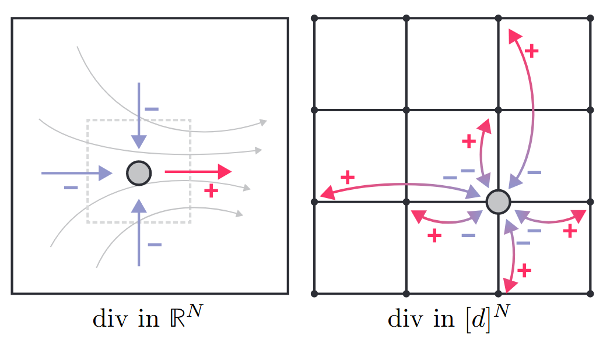

# Discrete Flow Matching
[@gatDiscreteFlowMatching2024]

## 2 Discrete Flow Matching
### 2.1 Setup and notations
- $`x = \left( x^1, x^2, \cdots, x^N \right)`$ : a sequence as an array of $`N`$ elements
  - where
    - each element (token) $`x^i`$ is selected from a vocabulary of size $`d`$
      - i.e.) $`x^i \in [d] = \{1,\cdots,d\}`$
- $`\mathcal{D} = [d]^N`$ : the entire set of possible sequences
  - where 
    - $`[d] = \{1,\cdots,d\}`$
- $`X`$ : a random variable taking values $`\mathcal{D}`$
  - where
    - $`P(X=x)`$ is the corresponding probability mass function 
      - Notation) $`p(x)`$ denotes the PMF as well.
- $`p(x^i) = \displaystyle\sum_{x^{\bar{i}}} p(x)`$ : the $`x^i`$ marginal of $`p`$
  - where
    - $`x^{\bar{i}} = (\cdots, x^{i-1}, x^{i+1}, \cdots) \in [d]^{N-1}`$
      - i.e.) $`x^i`$ is excluded from $`x`$
  - Desc.)
    - By marginalizing out $`x^{\bar{i}}`$, we focus only on a single token $`x^i`$
- $`\delta_y(x) = \displaystyle\prod_{i=1}^N \delta_{y^i}(x^i)`$ : the delta PMF function
  - where
    - $`x,y\in\mathcal{D}`$
    - $`\delta_{y^i}(x^i) = \begin{cases} 1 & x^i = y^i \\ 0 & x^i \ne   y^i \end{cases}`$
  - Prop.)
    - $`\delta_y(x) = 1 \Leftrightarrow x^i = y^i,\quad \forall i=1,\cdots,N`$
  - Notation)
    - $`\delta_y(x^{i}) = \delta_{y^{i}}(x^{i})`$
    - $`\delta_y(x^{\bar{i}}) = \delta_{y^{\bar{i}}}(x^{\bar{i}}) = \displaystyle\prod_{j\ne i}\delta_{y^{j}}(x^{j}) = \displaystyle\prod_{j\in\{1,\cdots,N\}\backslash i}\delta_{y^{j}}(x^{j})`$

 

### 2.2 Source and target distributions
- Settings)
  - $`X_0\sim p`$ : a sample from the source distribution $`p`$
  - $`X_1\sim q`$ : a sample from the target(data) distribution $`q`$
  - $`(X_0, X_1) \sim \pi(x,y)`$ : the training data sampled from a joint distribution $`\pi`$
    - where
      - $`p(x) = \displaystyle\sum_{y\in\mathcal{D}} \pi(x,y)`$ : the marginals
      - $`q(y) = \displaystyle\sum_{x\in\mathcal{D}} \pi(x,y)`$ : the marginals
      - $`\pi`$ can have two types of couplings
        - [Unconditional Coupling (U-coupling)](#concept-unconditional-coupling-u-coupling)
        - [Conditional Coupling (C-coupling)](#concept-conditional-coupling-c-coupling)
  - $`\mathbf{m}\in[d]`$ : a mask token
    - We may further assume the source distribution $`p`$ to be all-mask sequences.
      - i.e.) $`p(x) = \delta_{\mathbf{m}}(x)`$

#### Concept) Unconditional Coupling (U-coupling)
- Def.)
  - $`\pi(x_0, x_1) = p(x_0)q(x_1)`$
    - i.e.) the training pairs are sampled independently from the source and target distributions.
      - i.e.) $`(X_0, X_1)\sim p(X_0)q(X_1)`$
  - Using the mask token $`\mathbf{m}`$, we have
    - $`(X_0, X_1) = \big( (\mathbf{m}, \cdots, \mathbf{m}), X_1 \big)`$

#### Concept) Conditional Coupling (C-coupling)
- Def.)
  - $`\pi(x_0, x_1) = p(x_0\mid x_1)q(x_1)`$
  - Using the mask token $`\mathbf{m}`$, we may denote
    - $`(X_0, X_1) = \left( \overbrace{\underbrace{\mathbb{I}\odot X_1}_{\text{unmasked}} + \underbrace{(\mathbf{1} - \mathbb{I}) \odot (\mathbf{m}, \cdots, \mathbf{m})}_{\text{masked!}}}^{\text{partially masked}},\; X_1 \right)`$
      - where
        - $`\mathbb{I}\in\{0,1\}^N`$ : a random variable indicating the conditioning
        - $`\odot`$ : the entrywise product
        - $`\mathbf{1} = \{1\}^N`$ : a vector with all ones

  

### 2.3 Probability paths
#### Concept) Marginal Probability Path
- Def.)
  - $`p_t`$ : the probability path in $`t\in[0,1]`$
    - where
      - $`p_0 = p`$
      - $`p_1 = q`$
  - Or, we may re-right as
    - $`p_t(x) = \displaystyle\sum_{x_0, x_1\in\mathcal{D}} p_t(x\mid x_0, x_1) \pi(x_0, x_1)`$
      - where
        - $`p_t(x\mid x_0, x_1) = \displaystyle\prod_{i=1}^N p_t(x^i\mid x_0, x_1)`$
          - for 
            - $`p_t(x^i\mid x_0, x_1)`$ : the time dependent probability on the space of tokens $`[d]`$ conditioned on $`(x_0, x_1)`$
            - $`p_0(x^i\mid x_0, x_1) = \delta_{x_0}(x^i)`$
            - $`p_1(x^i\mid x_0, x_1) = \delta_{x_1}(x^i)`$

 

#### Concept) Flow Matching Framework
- Def.)
  - $`p_t(x^i\mid x_0, x_1) = \displaystyle\sum_{j=1}^m \kappa_t^{i,j} w^j(x^i\mid x_0, x_1)`$
    - where
      - $`w^j(x^i\mid x_0, x_1)`$ : the $`j`$-th base conditional probability
        - e.g.)
          - $`w^1 = \delta_{x_1}`$ : the data distribution
          - $`w^2 = p_{\text{u}}`$ : the uniform distribution
          - $`w^3 = \delta_{x_0}`$ : the source distribution
          - and so on...
      - $`\kappa_t^{i,j}`$ : the weight on $`w^j(x^i\mid x_0, x_1)`$
        - for $`\displaystyle\sum_j\kappa_t^{i,j} = 1, \;\kappa_t^{i,j}\ge 0`$
      - $`m`$ : the number of possible base path
- e.g.)
  - Convex Interpolant
    - Model)   
      $`\begin{aligned}
        p_t(x^i\mid x_0, x_1) 
        &= \kappa_t^{i,3} \delta_{x_0}(x^i) + \kappa_t^{i,1} \delta_{x_1}(x^i) \\
        &= (1-\kappa_t) \underbrace{\delta_{x_0}(x^i)}_{\text{source}} + \kappa_t \underbrace{\delta_{x_1}(x^i)}_{\text{data}} \\
      \end{aligned}`$
      - where
        - $`\begin{cases} \kappa_0=0\\ \kappa_1=1 \end{cases}`$ and $`\kappa_t`$ monotonically increases with $`t`$
    - Desc.)
      - All tokens $`x^i`$ share the same weight $`\kappa_t`$ and $`(1-\kappa_t)`$ at time $`t`$
  - Convex Interpolant + Uniform Noise added
    - Model)   
      - $`p_t(x^i\mid x_0, x_1) = \kappa_t^1 \underbrace{\delta_{x_1}(x^i)}_{\text{data}} + \kappa_t^2 \underbrace{p_{\text{u}}(x^i)}_{\text{uniform}} + \kappa_t^3 \underbrace{\delta_{x_0}(x^i)}_{\text{source}}`$
        - where
          - $`\begin{cases} \kappa_0^1=0\\ \kappa_1^1=1 \end{cases}`$ : data
          - $`\kappa_0^2 = \kappa_1^2=0`$ : no uniform added at $`t=0\vee t=1`$
          - $`\begin{cases} \kappa_0^3=1\\ \kappa_1^3=0 \end{cases}`$ : source

  

### 2.4 Generating Probability Velocities
#### Concept) Continuous Flow Matching
- Model)
  - Let
    - $`X_t\in\mathbb{R}^N`$ : the current sample at $`t`$
    - $`t\in[0,1)`$
    - $`u_t^i : \mathbb{R}^N \rightarrow \mathbb{R}`$ : a learned generating velocity field for $`i\in[N]`$
      - e.g.)
        - a neural network
        - parameterized via denoiser
        - noise-prediction (e.g. $`\epsilon`$-prediction from DDPM)
      - cf.) $`u_t`$ is a velocity (vector) field!
  - Then, Euler sampling follows the deterministic rule of
    - $`X_{t+h}^i = X_t^i + h\cdot u_t^i(X_t)`$
      - where
        - $`h\gt0`$ : a user-defined time step
- Prop.)
  - If the sampling provides $`X_{t+h}\sim p_{t+h} + o(h)`$, then $`u_t`$ generates $`p_t`$.
    - where 
      - $`o(h^\ell)`$ means a function going to zero faster than $`h^\ell`$ as $`h\rightarrow0`$
    - Desc.)
      - $`u_t`$ is the deterministic vector field that we set.
      - $`p_t`$ is the actual path we want to learn.
      - If the output of the ODE is similar to the actual path, we may say that $`u_t`$ generates $`p_t`$

 

#### Concept) Probability Velocity
- Goal)
  - We want to define Flow Matching in the discrete setting.
  - Thus, we need a velocity concept that corresponds to the velocity field $`u_t`$ in the [continuous flow matching](#concept-continuous-flow-matching).
- Def.)
  - $`u_t^i`$ : the probability velocity 
    - s.t.
      - $`X_{t+h}^i \sim \delta_{X_t^i}(\cdot) + h u_t^i(\cdot, X_t)`$
        - where
          - $`X_t\in[d]^N`$
          - $`X_t^i\in[d]`$
      - $`u_t^i(x^i, z) \ge 0, \quad z\in[d]^N, x^i\ne z^i, \forall i\in[N]`$
        - i.e.) Outflow from $`z`$ on the direction of $`x^i`$
          - Off-diagonal cases of the [transition rate matrix in CTMC](./cmtc.md#concept-transition-rate-matrix)
      - $`\displaystyle\sum_{x^i\in[d]} u_t^i(x^i, z) = 0`$ where $`z\in[d]^N`$
        - cf.) 
          - Since the above off-diagonals are positive, diagonals should be **negative**. 
          - This corresponds with $`R_t(x,x)`$ of the [transition rate matrix in CTMC](./cmtc.md#concept-transition-rate-matrix)
  - $`u_t`$ **generates** the probability path $`p_t`$
    - if $`X_{t+h}\sim p_{t+h} + o(h), \quad \forall t\in[0,1)`$
      - where $`X_{t+h}^i \sim \delta_{X_t^i}(\cdot) + h u_t^i(\cdot, X_t)`$

 

#### Concept) Divergence Operator
- Def.)
  - For 
    - $`x\in\mathbb{R}^N`$ : an $`N`$ length sequence in the **continuous** space
    - $`v:\mathbb{R}^N\rightarrow\mathbb{R}^N`$ : a vector field
      - i.e.) $`v = [v^1,\cdots, v^N]`$ for $`v^i : \mathbb{R}^N\rightarrow\mathbb{R},\quad i=1,\cdots, N`$
  - the divergence operator $`\text{div}`$ of the vector field $`v`$ on a point $`x`$ is defined as
    - $`\text{div}_x(v) = \displaystyle\sum_{i=1}^N \partial_{x^i} v^i(x)`$
- Meaning)
  - Total flux (inflow + outflow) leaving $`x`$.
    - Why?)
      - Consider that $`v^i : \mathbb{R}^N\rightarrow\mathbb{R}`$.
        - i.e.) The magnitude of change from a sequence state $`x\in\mathbb{R}^N`$ on the direction of $`x^i\in\mathbb{R}`$
        - cf.)
          - Recall that the velocity is composed of the direction and the magnitude.
          - $`v`$ describes the $`N`$ directions by mapping to $`\mathbb{R}^N`$
          - Each element $`v^i`$ fixes the direction and denotes the magnitude on it.
      - Then $`\partial_{x^i}v^i(x)`$ is the rate of change on that direction $`x^i`$
        - Desc.)
          - Recall that $`v^i`$ was the magnitude of change on the direction of $`x_i`$.
          - Thus, $`\partial_{x^i} v^i`$ captures the rate of change in that direction.
          - If you add those from every direction, it denotes the net flux on the point $`x`$ in every direction $`\mathbb{R}^N`$
        - Cases)
          - $`\partial_{x^i}v^i(x) \gt 0`$ : outflow
          - $`\partial_{x^i}v^i(x) \lt 0`$ : inflow
      - Hence, $`\displaystyle\sum_{i=1}^N \partial_{x^i} v^i(x)`$ captures the net flux from $`x`$ on every direction.
- Graphical Desc.)   
  

 

#### Concept) Continuity Equation
- Def.)
  - $`\dot{p}_t(x) + \text{div}_x(p_t u_t) = 0`$
    - where
      - $`p_t\in\mathbb{R}^+`$ : the marginal probability **density** (continuous!)
      - $`u_t:\mathbb{R}^N\rightarrow\mathbb{R}^N`$ : the [probability velocity](#concept-probability-velocity) field in the continuous space
    - cf.)
      - We may think $`p_t u_t`$ as amount of probability density flow
- Meaning)
  - The rate of the probability $`\dot{p}_t(x)`$ of a state $`x\in\mathbb{R}^N`$ equals the total **incoming** probability flux $`\text{div}_x(p_t u_t)`$.
    - Why incoming?)
      - Consider that $`\text{div}_x(p_t u_t) = - \dot{p}_t(x)`$
      - Recall that in the [divergence operator](#concept-divergence-operator), inflow was negative.
  - This corresponds to the differential derived from the [Kolomogorov equation](./cmtc.md#concept-kolmogorov-equation).
    - $`\partial_t q_t(x) = \displaystyle\sum_{y\in\mathcal{X}} q_t(y) \cdot R_t(y, x)`$

 

#### Concept) Discrete Divergence
- Def.)
  - Let
    - $`p_t`$ : the marginal probability **mass** (discrete!)
    - $`u_t : \mathcal{D}\rightarrow\mathcal{D}`$ : the [probability velocity](#concept-probability-velocity) field in the discrete space
    - $`\text{div}_x(v) = \displaystyle\sum_{z\in\mathcal{D}}\left[\underbrace{v(z,x)}_{\text{outflow}} - \underbrace{v(x,z)}_{\text{inflow}}\right]`$ : the [divergence operator](#concept-divergence-operator) on the discrete space
      - where 
        - $`v(z,x)`$ denotes the outflow from $`x`$ to $`z`$
        - $`-v(x,z)`$ denotes the inflow from $`z`$ to $`x`$
  - The discrete divergence of the flux $`p_tu_t`$ at a state $`x`$ is defined as
    - $`\text{div}_x(p_t u_t) = -\displaystyle\sum_{z\in\mathcal{D}} p_t(z) \left[ \sum_{i=1}^N \delta_z(x^{\bar{i}}) u_t^i(x^i, z) \right]`$
      - where
        - $`\delta_z(x^{\bar{i}}) = \begin{cases} 1 & \text{if } z^{\bar{i}} = x^{\bar{i}} \; (\text{i.e. } z=x \;\vee\; z^i\ne x^i \text{ only at } i ) \\ 0 & \text{otherwise}  \end{cases}`$
- Derivation)
  - We may rewrite the [divergence operator](#concept-divergence-operator) definition $`\text{div}_x(v) = \displaystyle\sum_{z\in\mathcal{D}}\left[\underbrace{v(z,x)}_{\text{outflow}} - \underbrace{v(x,z)}_{\text{inflow}}\right]`$ with
    - $`v(z,x) = p_t(x) u_t^i(z^i, x)`$
      - i.e.) the probability mass outflow from $`x`$
    - $`-v(x,z) = -\underbrace{p_t(z) u_t^i(x^i, z)}_{\text{outflow from }z}`$
      - i.e.) the probability mass inflow to $`x`$
  - Also, consider that the $`z=x`$ case cancels out.
    - Why?)
      - $`v(x,x)-v(x,x) = p_t(x) u_t^i(x^i, x) - \underbrace{p_t(x) u_t^i(x^i, x)}_{\text{outflow from }x} = 0`$
    - We say $`z = x`$ iff. $`z^i = x^i,\quad\forall i=1,\cdots,N`$
    - We may denote this using the [direct delta](#21-setup-and-notations) notation as
      - $`z=x \;\Leftrightarrow\; \delta_x(z^{\bar{i}}) = 1`$
        - where
          - $`\delta_x(z^{\bar{i}}) = \delta_{x^{\bar{i}}}(z^{\bar{i}}) = \displaystyle\prod_{j\ne i}\delta_{x^{j}}(z^{j}) = \displaystyle\prod_{j\in\{1,\cdots,N\}\backslash i}\delta_{x^{j}}(z^{j})`$
  - Hence, we may rewrite as   
    $`\begin{aligned}
      \text{div}_x(v) 
      &= \sum_{z\in\mathcal{D}}\left[\underbrace{v(z,x)}_{\text{outflow}} - \underbrace{v(x,z)}_{\text{inflow}}\right] \\
      &= \sum_{z\in\mathcal{D}}\left[ \left(\sum_{i=1}^N p_t(x) u_t^i(z^i, x)\right) - \left( \sum_{i=1}^N p_t(z) u_t^i(x^i, z) \right) \right] \\
      &= \sum_{z\in\mathcal{D}}\left[ \sum_{j\in\{1,\cdots,N\}\backslash i}  \bigg( p_t(x) u_t^i(z^i, x) - p_t(z) u_t^i(x^i, z) \bigg) \right] & \because\text{Cancel out } z= x \\
      &= \sum_{z\in\mathcal{D}}\sum_{i=1}^N \left[ \delta_{x^{\bar{i}}}(z^{\bar{i}}) \bigg( p_t(x) u_t^i(z^i, x) - p_t(z) u_t^i(x^i, z) \bigg) \right] & \because\text{Dirac-delta Notation} \\
      &= \sum_{z\in\mathcal{D}}\sum_{i=1}^N \left[ \delta_{x^{\bar{i}}}(z^{\bar{i}}) p_t(x) u_t^i(z^i, x) \right] -  \sum_{z\in\mathcal{D}}\sum_{i=1}^N \left[ \delta_{x^{\bar{i}}}(z^{\bar{i}}) p_t(z) u_t^i(x^i, z) \right]  \\
      &= p_t(x) \sum_{z\in\mathcal{D}}\sum_{i=1}^N \left[ \delta_{x^{\bar{i}}}(z^{\bar{i}}) u_t^i(z^i, x) \right] -  \sum_{z\in\mathcal{D}}\sum_{i=1}^N \left[ \delta_{x^{\bar{i}}}(z^{\bar{i}}) p_t(z) u_t^i(x^i, z) \right]  \\
      &= p_t(x) \sum_{i=1}^N \underbrace{\sum_{z^i} \sum_{z^{\bar{i}}}}_{\mathcal{D}=z^i\cup z^{\bar{i}}} \left[ \delta_{x^{\bar{i}}}(z^{\bar{i}}) u_t^i(z^i, x) \right] -  \sum_{z\in\mathcal{D}}\sum_{i=1}^N \left[ \delta_{x^{\bar{i}}}(z^{\bar{i}}) p_t(z) u_t^i(x^i, z) \right]  \\
      &= p_t(x) \sum_{i=1}^N \sum_{z^i} \bigg(\underbrace{ \sum_{z^{\bar{i}}} \delta_{x^{\bar{i}}}(z^{\bar{i}}) }_{=1} \bigg) u_t^i(z^i, x)  -  \sum_{z\in\mathcal{D}}\sum_{i=1}^N \left[ \delta_{x^{\bar{i}}}(z^{\bar{i}}) p_t(z) u_t^i(x^i, z) \right]  \\
      &= p_t(x) \sum_{i=1}^N \bigg( \underbrace{\sum_{z^i} u_t^i(z^i, x)}_{=0} \bigg)  -  \sum_{z\in\mathcal{D}}\sum_{i=1}^N \left[ \delta_{x^{\bar{i}}}(z^{\bar{i}}) p_t(z) u_t^i(x^i, z) \right] & \because\text{Refer to Probability Velocity} \\
      &= -  \sum_{z\in\mathcal{D}}\sum_{i=1}^N \left[ \delta_{x^{\bar{i}}}(z^{\bar{i}}) p_t(z) u_t^i(x^i, z) \right] \\
      &= -  \sum_{z\in\mathcal{D}}\sum_{i=1}^N \left[ \delta_{z}(x^{\bar{i}}) p_t(z) u_t^i(x^i, z) \right] & \because \delta_{x}(z^{\bar{i}}) = \delta_{z}(x^{\bar{i}}) \\
    \end{aligned}`$

 

#### Theorem 2) 
- Thm.)
  - Given
    - $`u_t^i(x^i,z\mid x_0, x_1)`$ : a conditional [probability velocity](#concept-probability-velocity) field
    - $`p_t(x\mid x_0, x_1)`$ : a conditional [probability path](#23-probability-paths)
  - The marginal velocity $`u_t^i(x^i,z)`$ generates the marginal [marginal probability velocity](#concept-marginal-probability-path) $`p_t(x)`$
    - where
      - $`u_t^i(x^i,z) = \displaystyle\sum_{x_0,x_1\in\mathcal{D}} u_t^i(x^i,z\mid x_0, x_1)p_t(x_0, x_1\mid z)`$
      - $`\displaystyle p_t(x_0, x_1\mid z) = \frac{p_t(z\mid x_0, x_1)\pi(x_0, x_1)}{p_t(z)}`$
- Pf.)
  - Recall that the [marginal probability path](#concept-marginal-probability-path) goes
    - $`p_t(x) = \displaystyle\sum_{x_0, x_1} p_t(x^i\mid x_0, x_1) \pi(x_0, x_1)`$
  - Taking the time derivative of $`p_t(x)`$, we get   
    $`\begin{aligned}
      \dot{p_t}(x) 
      &= \sum_{x_0, x_1} \dot{p_t}(x^i\mid x_0, x_1) \pi(x_0, x_1) \\
      &= 
    \end{aligned}`$

