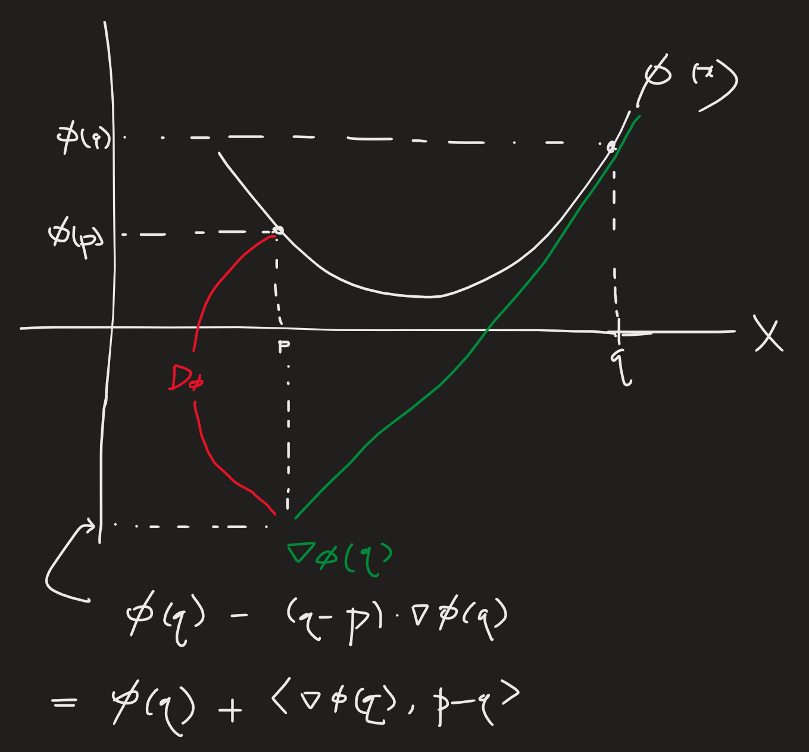

# Edit Flows: Flow Matching with Edit Operations
[@havasiEditFlowsFlow2025]

## 1 Hozy Summary
- Based on the [CTMC](./cmtc.md) and [Discrete Flow Matching](./dfm.md), introduce the following [edit operations](#concept-edit-operators): insertion, deletion, substitution.
- However, [Discrete Flow Matching](./dfm.md)'s cross-entropy ELBO loss does not work in this framework.
  - Why?) 
    - Due to insertion and deletion, our space is $`\mathcal{X} = \displaystyle\bigcup_{n=1}^n \mathcal{T}`$
    - Directly applying the CE-loss gets intractable.
- This paper introduces two concepts to solve this problem. 
  - [Bregman Divergence](#concept-bregman-divergence) $`D_\phi`$
    - cf.) Cross-Entropy loss, KL-Divergence, and MSE are examples of the Bregman divergence with specific convex function $`\phi`$s
    - For this problem, the authors utilize $`\phi(u) = u\log (u)`$ where $`u`$ is the probability velocity.
      - $`\phi`$ is identical to KL-Divergence, but takes the velocity field $`u`$ as input.
  - [Auxiliary Markov Process](#concept-training-with-an-auxiliary-alignment-process)   
    $`\begin{array}{}
      \;\\
      && \text{source} & & \text{target}\\
      \mathcal{Z} (\text{auxiliary space}) : && z_0 & \rightarrow & z_1 \\
      &\text{Add }\varepsilon& \uparrow & & \downarrow & (f_{\text{rm-blanks}}) \\
      \mathcal{X} (\text{original space}) : && x_0 & & x_1 \\
      \;
    \end{array}{}`$
    - Desc.)
      - Generate an auxiliary space $`\mathcal{Z}`$ by augmenting $`\mathcal{X}`$ with the mask token $`\varepsilon`$.
        - This enables the shift in dimension when insertion/deletion operation takes place.
- Now, just as the [Discrete Flow-Matching](#22-discrete-flow-matching) did... 
  - we will fine the probability velocity $`u_t`$ that generates the probability path $`p_t`$
  - let our model $`u_t^\theta`$ to approximate $`u_t`$.
- How?)
  - Get $`u_t`$ on the auxiliary space $`\mathcal{Z}`$ and then recover by removing $`\varepsilon`$ using $`f_{\text{rm-blanks}}`$.
    - [Theorem 3.1](#theorem-31) supports the idea of performing DFM on $`u_t`$ that utilizes the auxiliary space $`\mathcal{Z}`$ by showing that
      - $`u_t(x\mid x_t)\triangleq\sum_z\mathbb{E}_{p_t(z_t\mid x_t)} u_t(x,z\mid x_t, z_t)`$ generates $`p_t(x)\triangleq\sum_z p_t(x,z)`$
  - $`u_t(x_t)`$ remains in $`\mathcal{X}`$
  - Get the loss as the Bregman divergence of 
    - $`\mathcal{L}(\theta) = D_\phi(u_t, u_t^\theta)`$
  - Further applying the [linear interpolation concept from DFM](./dfm.md#theorem-3), we may simplify as
    - $`\mathcal{L}(\theta) = \mathbb{E}_{\pi(z_0,z_1), t, p_t(x_t,z_t\mid z_0,z_1)} \left[ \displaystyle\sum_{x\ne x_t} u_t^\theta(x\mid x_t) - \sum_{i=1}^N \mathbf{1}_{[z^i_1\ne z^i_t]} \frac{\dot{\kappa}_t}{1-\kappa_t} \log u_t^\theta\left( \underbrace{x(z_t, i, z^i_1)}_{\text{one edit opr}} \mid x_t \right) \right]`$
      - where 
        - $`x(z_t, i, z^i_1) = f_{\text{rm-blanks}}(z_t^1,\cdots,z_t^{i-1},z_1^i,z_t^{i+1},z_t^N)`$

  

## 2 Preliminaries
### 2.1 Continuous-time Markov Chains (CTMC)
- Def.)
  - Settings)
    - $`\mathcal{X}`$ : a discrete space
    - $`u_t`$ : a rate ([probability velocity field in DFM](./dfm.md#concept-probability-velocity)) s.t.
      - $`u_t(x\mid x_t)\ge 0,\quad\forall x\ne x_t`$
      - $`\sum_x u_t(x\mid x_t) = 0`$
        - where
          - $`u_t(x_t\mid x_t) = -\sum_{x\ne x_t} u_t(x\mid x_t)`$
    - $`p_t`$ : the probability path (Refer to [DFM's definition](./dfm.md#concept-marginal-probability-path))
  - The Markov process generates the trajectories $`(X_t)_{t\in[0,1]}`$ over $`\mathcal{X}`$ as
    - $`\mathbb{P}(x_{t+h}=x \mid X_t=x_t) = \delta_{x_t}(x) + h u_t(x\mid x_t) + o(h)`$
      - where
        - $`u_t`$ : a rate denoting the infinitesimal transition probabilities from a state $`x_t`$ to any other state $`x`$ at time $`t`$
        - $`o(h)`$ s.t. $`\displaystyle\lim_{h\rightarrow0}\frac{o(h)}{h} = 0`$
  - $`u_t`$ generates $`p_t`$ if $`X_t\sim p_t`$
    - Using the Kolmogorov forward equation, we may rewrite as   
      $`\begin{aligned}
        \frac{\partial}{\partial t} p_t(x) 
        &= \sum_y u_t(x\mid y) p_t(y) \\
        &= \underbrace{\sum_{y\ne x} u_t(x\mid y) p_t(y)}_{\text{inflow to } x} - \underbrace{\sum_{y\ne x} u_t(y\mid x) p_t(x)}_{\text{outflow from } x}
      \end{aligned}`$
      - cf.) Corresponds to the [Continuity Equation from DFM](./dfm.md#concept-continuity-equation)
        - $`\dot{p}_t(x) + \text{div}_x(p_t u_t) = 0`$

 

### 2.2 Discrete Flow Matching
- Goal)
  - Learn a CTMC-based generative model to transport from the source distribution $`p(x)`$ to the target distribution $`q(x)`$.
- Settings)
  - $`x\in\mathcal{X} = \mathcal{T}^N`$ : a discrete $`N`$-length sequence space
    - where
      - $`\mathcal{T} = \{1,\cdots, M\}`$ : a discrete set of tokens with the vocabulary size of $`M`$
  - $`p(x)`$ : a source (noise) distribution
  - $`q(x)`$ : a target (data) distribution
  - $`\pi(x_0, x_1)`$ : a coupling distribution that samples pairs $`(x_0, x_1)`$
    - where the marginals are given by
      - $`\sum_{x_0} \pi(x_0, x_1) = q(x_1)`$
      - $`\sum_{x_1} \pi(x_0, x_1) = p(x_0)`$
    - e.g.) Independent Coupling
      - $`\pi(x_0, x_1) = p(x_0)q(x_1)`$
- Model)
  - Conditional CTMC
    - $`u_t(x\mid x_t, x_0, x_1)`$ generating $`p_t(x\mid x_0, x_1)`$
      - where
        - $`p_0(x\mid x_0, x_1) = \delta_{x_0}(x)`$
        - $`p_1(x\mid x_0, x_1) = \delta_{x_1}(x)`$
    - Designing the **conditional** path $`p_t`$ as the interpolation between two points from the source and target, we may marginalize out the conditional get the **marginal** path as
      - $`p_t(x) = \sum_{x_0, x_1} p_t(x\mid x_0, x_1) \pi(x_0, x_1)`$
        - implying
          - $`p_0(x) = p(x)`$
          - $`p_1(x) = q(x)`$
    - Further, we can get the marginal rate as
      - $`u(x\mid x_t) = \mathbb{E}_{p_t(x_0, x_1 \mid x_t)} u_t(x\mid x_t, x_0, x_1)`$
        - which generates the **marginal** probability path $`p_t(x)`$

  

#### Concept) Token-wise Mixture Path
- Goal)
  - Factorize the **conditional** probability path using tokens
- Model)
  - Single Token Problem
    - $`p_t(x^i \mid x^i_0, x^i_1) = (1-\kappa_t) \delta_{x^i_0}(x^i) + \kappa_t \delta_{x^i_1}(x^i)`$
    - $`u_t(x^i\mid x^i_t, x^i_0, x^i_1) = \displaystyle\frac{\dot{\kappa}_t}{1-\kappa_t} \left( \delta_{x^i_1}(x^i) - \delta_{x^i_t}(x^i) \right)`$
      - where 
        - $`\kappa_t`$ : a scheduler that satisfies $`\kappa_0=0`$ and $`\kappa_1=1`$
  - Multi-dimensional (sequence) problem
    - $`p_t(x\mid x_0, x_1) = \displaystyle\prod_{i=1}^N p_t(x^i\mid x^i_0, x^i_1)`$
    - $`u_t(x\mid x_t, x_0, x_1) = \displaystyle\sum_{i} \delta_{x_t}(x^{\neg i}) u_t(x^i\mid x^i_t, x^i_0, x^i_1)`$
      - where
        - $`\delta_{x_t}(x^{\neg i}) = \displaystyle\prod_{j\ne i} \delta_{x_t^j}(x^j)`$
- Advantage)
  - This requires only per-dimension (token) parameterization of the model.
    - Then apply product rule to generate sequence!
    - Instead, we should take the iterative procedure to sample.
      - i.e.) No one shot sampling.

 

#### Concept) Mask Construction
- Settings)
  - $`p_0(x) = \delta_{\mathbf{m}}(x)`$ : **mask** distribution as the source!
- Benefits)
  - Drastically simple construction
    - i.e.) Transition from mask to unmask, or vice versa.
    - e.g.) [MDLM](./mdlm.md), Shi et al 2024
  - Practically has been shown to scale
    - Nie et al., 2025; Ye et al., 2025; Ermon et al., 2025
- Drawbacks)
  - Does not fully utilize the CTMC framework (transition between various vocabularies)
  - Equivalent to any-order AR model
    - i.e.) Implemented with non-causal attention.
    - e.g.) Hoogeboom et al., 2022; Pannatier et al., 2024
  - Does not support variable-length generation
    - i.e.) Fixed sequence length!

  

## 3 Edit Flows
### 3.1 Edit Flows: a continuous-time Markov chain using edit operations
- Settings)
  - $`\mathcal{T} = \{1,\cdots, M\}`$ : the discrete set of tokens with the vocabulary size of $`M`$
  - $`\mathcal{X} = \displaystyle\bigcup_{n=0}^N \mathcal{T}^n`$ : the state space as the set of all possible sequences up to some maximum length $`N`$
- Model)
  - $`u_t^\theta`$ : the parameterization of the CTMC rate $`u_t`$
    - where
      - $`u_t^\theta(x\mid x_t)`$ is allowed to be non-zero only if $`x`$ and $`x_t`$differ by one edit operation
        - for $`x,x_t\in\mathcal{X}`$
    - This will be parameterized by the [edit operators](#concept-edit-operators) as $`u_t(\cdot\mid x_t)`$

 

#### Concept) Edit Operators
- Def.)
  - Insertion
    - For $`x\in\mathcal{X}, i\in\{1,\cdots, n(x)\}, a\in\mathcal{T}`$
      - $`\text{ins}(x,i,a) = \left( x^1, x^2,\cdots, x^i, \underbrace{a}_{\text{ins!}}, x^{i+1},\cdots, x^{n(x)} \right)`$
  - Deletion
    - For $`x\in\mathcal{X}, i\in\{1,\cdots, n(x)\}`$
      - $`\text{del}(x,i) = \left( x^1, x^2,\cdots, x^{i-1}, x^{i+1},\cdots, x^{n(x)} \right)`$
  - Substitution
    - For $`x\in\mathcal{X}, i\in\{1,\cdots, n(x)\}, a\in\mathcal{T}`$
      - $`\text{sub}(x,i,a) = \left( x^1, x^2,\cdots, x^{i-1}, \underbrace{a}_{\text{was } x^i}, x^{i+1},\cdots, x^{n(x)} \right)`$
- Rate Parameterization)
  - For $`i\in\{1,\cdots, n(x)\}`$
    - $`u_t^\theta(\text{ins}(x,i,a) \mid x) = \lambda_{t,i}^{\text{ins}}(x) \; Q_{t,i}^{\text{ins}}(a\mid x)`$
    - $`u_t^\theta(\text{del}(x,i,a) \mid x) = \lambda_{t,i}^{\text{del}}(x)`$
    - $`u_t^\theta(\text{sub}(x,i,a) \mid x) = \lambda_{t,i}^{\text{sub}}(x) \; Q_{t,i}^{\text{sub}}(a\mid x)`$
      - where
        - $`\lambda_{t,i} \ge 0`$ : the total rates of {insertion, deletion, substitution} at the position $`i`$
        - $`Q_{t,i}(a\mid x)`$ : the (normalized) distribution over token value $`a`$ if {insertion, substitution} takes place at $`i`$
- Props.)
  - Individual operations result in sequences that are **mutually exclusive**.
    - which enables the **separate** rate parameterization above.
  - Parameterization should satisfy the CTMC rate properties.
    - $`u_t(\cdot\mid x_t) \ge 0`$
    - $`\displaystyle\sum_{i=1}^{n(x_t)} u_t^\theta(\cdot\mid x_t) = 1`$
    - $`\displaystyle u_t^\theta(x_t\mid x_t) = -\sum_{i=1}^{n(x_t)}\lambda_{t,i}^{\text{ins}}(x_t)-\sum_{i=1}^{n(x_t)}\lambda_{t,i}^{\text{del}}(x_t)-\sum_{i=1}^{n(x_t)}\lambda_{t,i}^{\text{sub}}(x_t)`$

 

### 3.2 Training Edit Flows
- Idea)
  - Existing cross-entropy or ELBO objectives do not work for the Edit Flow.
    - Why?) 
      - Too complicated for $`\mathcal{X} = \displaystyle\bigcup_{n=0}^N \mathcal{T}^n`$
      - We should account for all possible transactions ([alignment](#concept-alignment)) to an equivalent sequence
  - Instead, extend the [DFM training recipe](./dfm.md#concept-training) with auxiliary Markov process.
    - This allows [Bregman divergence](#concept-bregman-divergence) for training.

#### Theorem 3.1
- Theorem)
  - For
    - A CTMC that lies in a space $`\mathcal{X}`$
    - $`(x,z)\in\mathcal{X}\times\mathcal{Z}`$ : an augmented space
      - with the probability path $`p_t(x,z)`$
    - $`u_t(x,z\mid x_t,z_t)`$ : a rate over $`\mathcal{X}\times\mathcal{Z}`$ that generates $`p_t(x,z)`$
  - Then
    - $`u_t(x\mid x_t)\triangleq\sum_z\mathbb{E}_{p_t(z_t\mid x_t)} u_t(x,z\mid x_t, z_t)`$ generates $`p_t(x)\triangleq\sum_z p_t(x,z)`$
  - And, for any [Bregman divergence](#concept-bregman-divergence) $`D_\phi`$ over a convex function $`\phi`$, we have that
    - $`\displaystyle\frac{\text{d}}{\text{d}\theta} \mathbb{E}_{x_t, z_t\sim p_t(x,z)} D_\phi \left( \sum_z u_t(\cdot,z\mid x_t, z_t), u_t^\theta(\cdot\mid x_t) \right) = \frac{\text{d}}{\text{d} \theta} \mathbb{E}_{x_t\sim p_t(x)} D_\phi \left( \sum_z u_t(\cdot\mid x_t), u_t^\theta(\cdot\mid x_t) \right)`$

#### Concept) Bregman Divergence
- Def.)
  - For a convex function $`\phi`$
  - the Bregman Divergence is defined as
    - $`D_\phi(a,b) = \phi(a) - \phi(b) - \langle a-b, \frac{\text{d}}{\text{d}b} \phi(b)\rangle`$
- Graphical Desc.)   
  $`\begin{aligned}
    D_\phi(p,q) 
    &= \phi(p) - \phi(q) - \left\langle p-q, \frac{\text{d}}{\text{d}q} \phi(q)\right\rangle \\
    &= \phi(p) + \left( \phi(q) - \left\langle q-p, \frac{\text{d}}{\text{d}q} \phi(q)\right\rangle \right) \\
  \end{aligned}`$   
  
- e.g.)
  - KL divergence : $`\phi(x) = x\log x`$
  - MSE : $`\phi(x) = x^2`$

 

#### Concept) Alignment
- Def.)
  - Given two sequences $`x_0`$ and $`x_1`$, **alignment** is the **set** of [edit operations](#concept-edit-operators) that transform $`x_0`$ to $`x_1`$
- Prop.)
  - There can be many possible alignments for every pair of sequences.

 

#### Concept) Training with an Auxiliary Alignment Process
- Settings)
  - $`\varepsilon`$ : a blank token s.t. $`\varepsilon\notin\mathcal{T}`$
  - $`\mathcal{Z} = \left( \mathcal{T} \cup \{\varepsilon\} \right)^N`$
  - [Edit Operators](#concept-edit-operators) with $`\varepsilon`$
    - For 
      - $`a,b\in\mathcal{Z}`$
      - an [alignment](#concept-alignment) between $`a`$ and $`b`$
    - we may define edit operators of $`(a\rightarrow b)`$ as
      - $`a=\varepsilon`$ for insertion
      - $`b=\varepsilon`$ for deletion
      - $`a\ne\varepsilon \land b\ne\varepsilon`$ for substitution
  - $`f_{\text{rm-blanks}} : \mathcal{Z}\rightarrow\mathcal{X}`$ : a function that defines the operation of stripping away all $`\varepsilon`$s
- Model)
  - Let $`x_0, x_1 \in\mathcal{X}`$ be samples s.t.
    - $`x_0\sim p(x)`$ : the sample from the source distribution
    - $`x_1\sim q(x)`$ : the sample from the target distribution
  - Then, we can directly construct aligned sequences $`z_0, z_1 \in\mathcal{Z}`$ s.t.
    - Edit operation $`(x_0\rightarrow z_0)`$
    - Edit operation $`(x_1\rightarrow z_1)`$
  - We may define a coupling $`\pi(z_0, z_1)`$ that satisfies
    - $`p(x) = \displaystyle\sum_{z_0}\sum_{z_1} \pi(z_0, z_1)\delta_{f_{\text{rm-blanks}}(z_0)}(x)`$
    - $`q(x) = \displaystyle\sum_{z_0}\sum_{z_1} \pi(z_0, z_1)\delta_{f_{\text{rm-blanks}}(z_1)}(x)`$
      - i.e.) Recovery of $`\mathcal{Z}\rightarrow\mathcal{X}`$ by marginalizing out $`z_0, z_1`$
  - Then, we may define a **conditional probability path** over $`\mathcal{X}\times\mathcal{Z}`$ as   
    $`\begin{aligned}
      p_t(x,z\mid x_0, z_0, x_1, z_1) 
      &= p_t(x,z\mid z_0, z_1) \\
      &= p_t(z\mid z_0, z_1) \delta_{f_{\text{rm-blanks}}(z)}(x)
    \end{aligned}`$
    - where
      - $`p_t(z\mid z_0, z_1)`$ is a token-wise mixture probability path.
  - Also, a conditional rate that transports along the augmented probability path is given by
    - $`u_t(x,z\mid x_t,z_t,z_0,z_1) = \delta_{f_{\text{rm-blanks}}(z)}(x) \displaystyle\sum_{i=1}^N\frac{\dot{\kappa}_t}{1-\kappa_t}\big( \delta_{z^i_1}(z^i) - \delta_{z^i_t}(z^i) \big) \delta_{z_t}(z^{\neg i})`$
      - Prop.)
        - This rate only transports between sequences $`x_t\rightarrow x`$ that differ by one edit operation.
  - Applying [Theorem 3.1](#theorem-31), the marginal rate that transports from $`p(x)`$ to $`q(x)`$ can be expressed as
    - $`u_t(x\mid x_t) = \sum_z\mathbb{E}_{p_t(z_0,z_1,z_t\mid x_t)} u_t(x,z\mid x_t, z_t, z_0, z_1)`$
- Training)
  - Using the [Bregman divergence](#concept-bregman-divergence), the training loss goes
    - $`\mathcal{L}(\theta) = \mathbb{E}_{\pi(z_0,z_1), t, p_t(x_t,z_t\mid z_0,z_1)} \left[ \displaystyle\sum_{x\ne x_t} u_t^\theta(x\mid x_t) - \sum_{i=1}^N \mathbf{1}_{[z^i_1\ne z^i_t]} \frac{\dot{\kappa}_t}{1-\kappa_t} \log u_t^\theta\left( \underbrace{x(z_t, i, z^i_1)}_{\text{one edit opr}} \mid x_t \right) \right]`$
      - where 
        - $`x(z_t, i, z^i_1) = f_{\text{rm-blanks}}(z_t^1,\cdots,z_t^{i-1},z_1^i,z_t^{i+1},z_t^N)`$
  - Meaning)
    - Minimize all the output rate of the model, while having a weighted cross-entropy over edit operations that bring $`x_t`$ closer to $`x_1`$
  - Prop.)  
    - The trained model has a preference towards minimizing the number of edits during its generation.
      - Corresponds to the kinetic energy minimization observed for Flow Matching in continuous space (Shaul et al., 2023)
  - Derivation)
    - Suppose we have
      - $`u_t(\cdot, z\mid x_t, z_t)`$ : the augmented probability velocity
      - $`u_t^\theta(\cdot\mid x_t)`$ : the model that velocity on the original state space
        - cf.) Here, $`\cdot`$ denotes all possible states of $`x`$
    - We may define a convex function $`\phi`$ where
      - $`\phi(u_t(\cdot\mid x_t)) = \displaystyle \sum_{x\ne x_t} u_t(x\mid x_t) \log u_t(x\mid x_t)`$
        - cf.) Similar to the Shannon entropy used for the KL divergence!
    - Then, we may get the [Bregman Divergence](#concept-bregman-divergence) between $`f,g`$ over $`\phi`$ as   
      $`\begin{aligned}
        D_\phi(f(\cdot\mid x_t), g(\cdot\mid x_t)) 
        &= \phi(f(\cdot\mid x_t)) - \phi(g(\cdot\mid x_t)) - \sum_{x\ne x_t} (f(x\mid x_t) - g(x\mid x_t))(1+\log g(x\mid x_t)) \\
        &= \sum_{x\ne x_t} f(x\mid x_t) \log f(x\mid x_t) - \sum_{x\ne x_t} g(x\mid x_t) \log g(x\mid x_t) - \sum_{x\ne x_t} (f(x\mid x_t) - g(x\mid x_t))(1+\log g(x\mid x_t)) \\
        &= -\sum_{x\ne x_t} f(x\mid x_t) -\sum_{x\ne x_t} f(x\mid x_t) \log\frac{g(x\mid x_t) }{f(x\mid x_t) } + \sum_{x\ne x_t} g(x\mid x_t) \\
        &= \sum_{x\ne x_t} \left( -f(x\mid x_t) - f(x\mid x_t) \log\frac{g(x\mid x_t) }{f(x\mid x_t) } + g(x\mid x_t) \right)
      \end{aligned}`$
    - Further by [Theorem 3.1](#theorem-31), we have
      - $`u_t(x\mid x_t)\triangleq\sum_z\mathbb{E}_{p_t(z_t\mid x_t)} u_t(x,z\mid x_t, z_t)`$ generates $`p_t(x)\triangleq\sum_z p_t(x,z)`$
    - Now plugging in 
      - $`f = \mathbb{E}\sum_z u_t(\cdot, z\mid x_t,z_t)`$ 
      - $`g = u_t^\theta(\cdot\mid x_t)`$
    - we may get   
      $`\begin{aligned}
        \mathcal{L}(\theta)
        &= D_\phi \left( u_t(\cdot\mid x_t), u_t^\theta(\cdot\mid x_t) \right) \\
        &= D_\phi \left( \mathbb{E}\sum_z u_t(\cdot, z\mid x_t,z_t), u_t^\theta(\cdot\mid x_t) \right) \\
        &= \mathbb{E}_{t,\pi(z_0,z_1),p_t(x_t,z_t\mid z_0,z_1)} D_\phi \left( \sum_z u_t(\cdot, z\mid x_t,z_t), u_t^\theta(\cdot\mid x_t) \right) \\
        &= \mathbb{E}_{t,\pi(z_0,z_1),p_t(x_t,z_t\mid z_0,z_1)} \left( \sum_{x\ne x_t} \left[ -\sum_z u_t(x, z\mid x_t,z_t,z_0,z_1) - \sum_z u_t(x, z\mid x_t,z_t,z_0,z_1) \log\frac{u_t^\theta(x\mid x_t)}{\sum_z u_t(x, z\mid x_t,z_t,z_0,z_1)} + u_t^\theta(x\mid x_t) \right] \right) \\
        &= - \mathbb{E}_{t,\pi(z_0,z_1),p_t(x_t,z_t\mid z_0,z_1)} \left( -\sum_{x\ne x_t} u_t^\theta(x\mid x_t) + \sum_{x\ne x_t} \sum_z u_t(x, z\mid x_t,z_t,z_0,z_1) \log u_t^\theta(x\mid x_t) \right) + C \\
        &= - \mathbb{E}_{t,\pi(z_0,z_1),p_t(x_t,z_t\mid z_0,z_1)} \left( u_t^\theta(x_t\mid x_t) + \sum_z \sum_{x\ne x_t} u_t(x, z\mid x_t,z_t,z_0,z_1) \log u_t^\theta(x\mid x_t) \right) + C & \because -\sum_{x\ne x_t} u_t^\theta(x_t\mid x_t) = u_t^\theta(x\mid x_t) \\
      \end{aligned}`$
    - We may rewrite
      - from $`\displaystyle\sum_z \sum_{x\ne x_t} u_t(x, z\mid x_t,z_t,z_0,z_1) \log u_t^\theta(x\mid x_t)`$
      - to $`\displaystyle \sum_{i=1}^N \mathbf{1}_{[z^i_1\ne z^i_t]} \frac{\dot{\kappa}_t}{1-\kappa_t} \log u_t^\theta\left( \underbrace{x(z_t, i, z^i_1)}_{\text{one edit opr}} \mid x_t \right)`$
    - Here, $`x`$ denotes a sequence.
      - Then, the transition from $`x`$ to $`x'`$ can be decomposed into individual edit operations.
      - Also, the shift to the augmented space $`\mathcal{X}\times\mathcal{Z}`$ and the recovery can all be defined with the edit operation.

  

### 3.3 Algorithms and advanced techniques for Edit Flows
#### Sampling
- Procedure
  - Start from $`X_0\sim p`$ the source distribution to $`t=1`$
  - Iterate through $`t`$ by
    - current state : $`X_t`$
    - step size : $`h`$
    - with probability $`h\lambda_{t,i}(X_t)`$ independently determine whether insertion, deletion, and substitution occurs.

 

#### Classifier-Free Guidance
- Apply CFG independently to $`\lambda`$ and $`Q`$

 

#### Sharpening Q
- Sharpening methodologies on $`Q`$
  - e.g.)
    - temperature, top-p, top-k

 

#### Reverse Rates
- Goal)
  - Self-correcting capability during the inference time
    - without modifying the distribution of the samples!
- Def.)
  - $`\overleftarrow{{u_t}^\theta}`$ : a CTMC that transports from $`q`$ to $`p`$.
    - i.e.) $`t=1 \rightarrow t=0`$
- How?)
  - Forward step : $`t\rightarrow t+h(1+\alpha_t)`$ for $`\alpha_t\gt0`$
  - Reverse step : $`t+h(1+\alpha_t) \rightarrow t+h`$

 

#### Localized Edit Operations