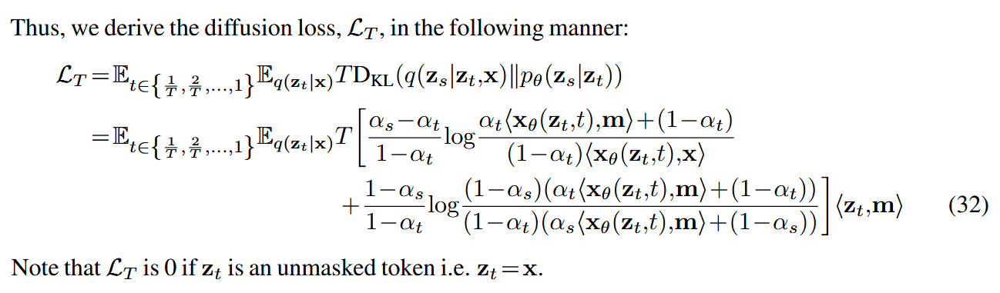
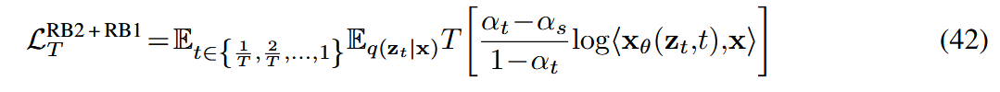
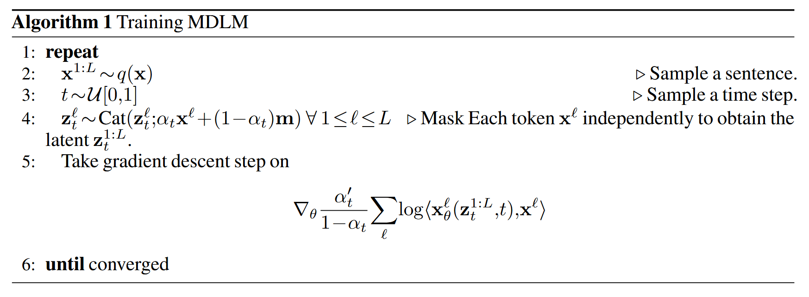

# Simple and Effective Masked Diffusion Language Models
[@sahooSimpleEffectiveMasked2024]

## 2 Background
### 2.1 Diffusion Models
- Model)
  - $`\mathbf{x}\sim q(\mathbf{x})`$ : clean data drawn from the data distribution
  - $`\mathbf{z}_t`$ : a latent variable for $`t\in[0,1]`$ which is the noisy version if $`\mathbf{x}`$
  - $`q`$ : forward process
    - Standard Forward Process
      - $`\mathbf{z}_t = \sqrt{\alpha_t}\mathbf{x} + \sqrt{1-\alpha_t}\boldsymbol{\epsilon}`$
        - where
          - $`\boldsymbol{\epsilon}\sim\mathcal{N}(\mathbf{0, I})`$
          - $`(\alpha_t)_{t\in[0,1]}`$ : a noise schedule that monotonically decrease in $`t`$
  - $`p_\theta`$ : reverse process
    - Parameterized over $`\mathbf{x}`$ and $`\mathbf{z}_t`$
- Optimization)
  - Maximize a [variational lower bound on log-likelihood (ELBO)](../../../../paper_presentation/250931_latent_diffusion/paper_summary/ddpm.md) as   
    $`\displaystyle \mathbb{E}_q \left[ \underbrace{-\log p_\theta (\mathbf{x}\mid \mathbf{z}_{t(0)})}_{\mathcal{L}_{\text{recons}}} + \underbrace{\sum_{i=1}^T D_{\text{KL}} \left[ q(\mathbf{z}_{s(i)}\mid\mathbf{z}_{t(i)},\mathbf{x}) \;\Vert\; p_\theta(\mathbf{z}_{s(i)}\mid\mathbf{z}_{t(i)}) \right]}_{\mathcal{L}_{\text{diffusion}}} \right] + \underbrace{D_{\text{KL}} \left[ q(\mathbf{z}_{t(T)}\mid\mathbf{x}) \;\Vert\; p_\theta(\mathbf{z}_{t(T)}) \right]}_{\mathcal{L}_{\text{prior}}}`$
    - where
      - $`T`$ : a number of discretization steps
      - $`s(i) = (i-1)/T`$
      - $`t(i) = i/T`$
    - Notation)
      - For brevity,
        - $`t(i) \triangleq t`$
        - $`s(i) \triangleq s`$

 

### 2.2 Discrete Diffusion Models
- [D3PM](./d3pm.md)
  - Model)
    - [Markov forward process](./d3pm.md#concept-diffusion-with-categorical-random-variables)
      - $`q(\mathbf{z}_t\mid\mathbf{z}_{t-1}) = \text{Cat}(\mathbf{z}_t; Q_t\mathbf{z}_{t-1})`$
        - where $`Q_t`$ is the transition matrix over $`T`$ discrete time steps
    - Marginal
      - $`q(\mathbf{z}_t\mid\mathbf{x}) = \text{Cat}(\mathbf{z}_t; \overline{Q}_t\mathbf{x})`$
        - where
          - $`\overline{Q}_t = Q_t\cdot Q_{t-1}\cdot\cdots\cdot Q_1`$
  - Key Takeaways)
    - Supports general forward process.
    - [Absorbing state](./d3pm.md#concept-absorbing-state-transition-matrix) diffusion consistently achieves the best performance.

  

## 3 Simple Masked Diffusion Models
- Goal)
  - Based on [D3PM](./d3pm.md), focus on masking and derive tight Rao-Blackwellized objectives.
    - This outperforms general approaches.
    - Does not require CTMC theory.
- Notation)
  - One-hot **column** vectors notation for scalar discrete random variables with $`K`$ categories.
    - $`\mathcal{V}\in\left\{ \mathbf{x}\in\{0,1\}^K : \displaystyle\sum_{i=1}^K \mathbf{x}_i = 1 \right\}`$
      - cf.) [D3PM](./d3pm.md) used the row vectors.
  - Categorical distribution over $`K`$ classes with probabilities given by $`\boldsymbol{\pi}\in\Delta^K`$
    - $`\text{Cat}(\cdot\;;\;\boldsymbol{\pi})`$
      - where $`\Delta^K`$ denotes the $`K`$-simplex 
        - i.e.) the set of all possible probabilities
      - cf.) Recall that in [D3PM](./d3pm.md#3-diffusion-models-for-discrete-state-spaces), we considered a generalized version of $`\boldsymbol{\pi} = Q_t\mathbf{x}_{t-1}`$ (column vector version)
  - Mask token : $`[\text{MASK}]`$
    - Set as the $`K`$-th (last) category.
      - $`\left\{\underbrace{\text{cat}_1, \text{cat}_2, \cdots, \text{cat}_{K-1}, [\text{MASK}]}_{K\text{ categories}}\right\}`$
    - $`\mathbf{m}\in\mathcal{V}`$ : the one-hot vector which the $`K`$-th (last) category is $`[\text{MASK}]`$
      - i.e.) $`\mathbf{m}_K = 1`$
  - $`\mathbf{1} = \{1\}^K`$
  - $`\langle a,b \rangle`$ : the dot product between $`a,b`$
  - $`a\odot b`$ : the Hadamard product between $`a,b`$

 

### 3.1 Interpolating Discrete Diffusion
- Goal)
  - We consider only the [DDPM's absorbing transition](./d3pm.md#concept-absorbing-state-transition-matrix) for the forward process.
    - cf.) In [D3PM's notation](./d3pm.md#concept-absorbing-state-transition-matrix), it was
      - $`Q_t = (1-\beta_t)\mathbf{I} + \beta_t \boldsymbol{1} e_m^\top`$
        - [Uniform](./d3pm.md#concept-uniform-transition-matrix) and [Absorbing](./d3pm.md#concept-absorbing-state-transition-matrix) transition used the interpolation structure.
  - Set a forward processes $`q`$ that interpolate between 
    - clean data $`\mathbf{x}\in\mathcal{V}`$
    - target distribution $`\text{Cat}(\cdot\;;\;\boldsymbol{\pi})`$
- Forward Process)
  - $`q`$ defines a sequence of $`\mathbf{z}_t\in\mathcal{V}`$
    - where
      - $`t=0`$ : least noisy
      - $`t=1`$ : most noisy
  - The marginal of $`\mathbf{z}_t`$ given $`\mathbf{x}`$
    - Def.)
      - $`q(\mathbf{z}_t\mid\mathbf{x}) = \text{Cat}(\mathbf{z}_t \;;\;\alpha_t\mathbf{x} + (1-\alpha_t)\boldsymbol{\pi})`$ : 
        - where
          - $`\alpha_t = e^{-\sigma(t)}\in[0,1]`$ 
            - s.t. $`\sigma: [0,1]\rightarrow\mathbb{R}_+`$
    - Props.)
      - $`\alpha_t\in[0,1]`$ strictly decrease in $`t`$
      - $`\alpha_0 \approx 1`$, $`\alpha_1 \approx 0`$
    - e.g.) Cosine Schedule : $`\sigma(t) = -\log\cos\left(\frac{\pi}{2}(t)\right)`$
      - cf.) The paper says its $`\sigma(t) = -\log\cos\left(\frac{\pi}{2}(1-t)\right)`$, which is the opposite
  - Forward Transition Probabilities $`s\rightarrow t \quad(s\lt t)`$
    - Def.)
      - $`q(\mathbf{z}_t\mid\mathbf{z}_s) = \text{Cat}\left(\mathbf{z}_t\;;\; \alpha_{t\mid s}\mathbf{z}_s + (1-\alpha_{t\mid s}) \boldsymbol{\pi} \right)`$
        - where $`\alpha_{t\mid s} = \alpha_t / \alpha_s`$
    - Desc.)
      - At each forward diffusion step, a fraction $`(1-\alpha_{t\mid s})`$ of the probability mass is transferred to the prior distribution $`\boldsymbol{\pi}`$
  - Posterior Probabilities : $`t\rightarrow s \quad(s\lt t)`$
    - Result)
      - $`q(\mathbf{z}_s\mid\mathbf{z}_t,\mathbf{x}) = \text{Cat}\left(\mathbf{z}_s\;;\; \displaystyle\frac{\left[ \alpha_{t\mid s} \mathbf{z}_t + (1-\alpha_{t\mid s}) \mathbf{1}\boldsymbol{\pi}^\top \mathbf{z}_t \right]\odot\left[ \alpha_s\mathbf{x} + (1-\alpha_s)\boldsymbol{\pi} \right]}{\alpha_t\mathbf{z}_t^\top\mathbf{x} + (1-\alpha_t)\mathbf{z}_t^\top\boldsymbol{\pi}}\right)`$
    - Derivation)
      - Recall that [D3PM](./d3pm.md#concept-diffusion-with-categorical-random-variables) suggested the posterior of   
        $`q(\mathbf{z}_s\mid\mathbf{z}_t,\mathbf{x}) = \text{Cat}\left(\mathbf{z}_s\;;\; \displaystyle\frac{Q_{t\mid s}\mathbf{z}_t \odot Q_s^\top \mathbf{x}}{\mathbf{z}_t^\top Q_t^\top\mathbf{x}}\right)`$
        - cf.) Column vector version!
      - Plug in the following which corresponds to the [absorbing state transition](./d3pm.md#concept-absorbing-state-transition-matrix)
        - $`Q_{(\cdot)} = \alpha_{(\cdot)} \mathbf{I} + (1-\alpha_{(\cdot)}) \boldsymbol{\pi} \mathbf{1}^\top`$ 
          - for $`(\cdot)\in\{t, s, t\mid s\}`$
    - Desc.)
      - Why needed?)
        - Included in the loss $`\mathcal{L}_{\text{vb}}`$.
          - Refer to the [D3PM's explanation](./d3pm.md#concept-diffusion-with-categorical-random-variables)

  

### 3.2 Masked Diffusion
#### 3.2.1 Forward Masking Process
- Settings)
  - $`\boldsymbol{\pi} = \mathbf{m} = \begin{bmatrix} 0&0&\cdots&0&1 \end{bmatrix}\in\mathcal{V}`$
  - At each noising step, $`t`$, the input $`\mathbf{x}`$ transitions to a masked state $`\mathbf{m}`$ with some probability.
  - $`q(\mathbf{z}_t\mid\mathbf{z}_{t'}=\mathbf{m}) = \text{Cat}(\mathbf{z}_t\;;\;\mathbf{m})`$
    - i.e.) If an input transitions to $`\mathbf{m}`$ at any time $`t'`$, it will remain as $`\mathbf{m},\;\forall t\gt t'`$
      - Why?) The sampling probability $`\boldsymbol{\pi}`$ is fixed to $`\mathbf{m}`$
  - At $`t=T`$, all inputs are masked with probability 1.
- Forward Process)
  - Marginal
    - The above forward process can be rewritten as
      - $`q(\mathbf{z}_t\mid\mathbf{x}) = \text{Cat}(\mathbf{z}_t\;;\;\alpha_t\mathbf{x} + (1-\alpha_t)\mathbf{m})`$
    - Then, $`\mathbf{z}_t`$ is sampled from $`\alpha_t\mathbf{x} + (1-\alpha_t)\mathbf{m}`$.
      - i.e.) $`\mathbf{z}_t = \begin{cases} \mathbf{x} & \text{with } p =\alpha_t \\ \text{[MASK]} & \text{with } p =1-\alpha_t \\ \end{cases}`$
  - Posterior
    - The above posterior can be simplified as   
      $`q(\mathbf{z}_s\mid\mathbf{z}_t,\mathbf{x}) = \begin{cases}
        \text{Cat}(\mathbf{z}_s\;;\;\mathbf{z}_t) & \mathbf{z}_t \ne \mathbf{m} \\
        \text{Cat}\left(\mathbf{z}_s\;;\;\displaystyle\frac{(1-\alpha_s)\mathbf{m} + (\alpha_s-\alpha_t)\mathbf{x}}{1-\alpha_t}\right) & \mathbf{z}_t = \mathbf{m} \\
      \end{cases}`$
      - where $`(s\lt t)`$
    - Desc.)
      - Consider that this posterior probability corresponds to the reverse process, but calculated solely with the forward process and the Bayes Rule.
      - $`\mathbf{z}_t\ne\mathbf{m}`$ means that the current token is already unmasked.
        - Thus, $`\mathbf{z}_s = \mathbf{z}_t`$ deterministically. (i.e. no more change!)
      - $`\mathbf{z}_t=\mathbf{m}`$ means that it should be unmasked in the further reverse process.
        - How?)
          - $`\mathbf{z}_s`$ is sampled from the following interpolated distribution
            - With the probability $`\frac{1-\alpha_s}{1-\alpha_t}`$, $`\mathbf{z}_s = \mathbf{m}`$ (Stays as the masked token)
            - With the probability $`\frac{\alpha_s-\alpha_t}{1-\alpha_t}`$, $`\mathbf{z}_s = \mathbf{x}`$ (Gets unmasked!)

 

#### 3.2.2 Reverse Unmasking Process
- Continuous Time model corresponding to $`T\rightarrow\infty`$ 
  - [3.4 Continuous-Time Likelihood Bounds](#34-continuous-time-likelihood-bounds)
- Discrete Time Model (Finite step Case)
  - The generative process can be denoted as 
    - $`\displaystyle p_\theta(\mathbf{x}) = \int_{\mathbf{z}} p_\theta(\mathbf{z}_1) p_\theta(\mathbf{x}\mid\mathbf{z}_0) \prod_{i=1}^T p_\theta(\mathbf{z}_s\mid\mathbf{z}_t) \text{d} \mathbf{z}_{0:1}`$
      - Derivation)
        - $`p_\theta(\mathbf{x})=\displaystyle\int_{\mathbf{z}} p_\theta(\mathbf{x},\mathbf{z}_{0:1}) \text{d}\mathbf{z}_{0:1}`$ denotes that the model considers all possible generative paths $`\mathbf{z}_{0:1}`$
        - Further, $`p_\theta(\mathbf{x},\mathbf{z}_{0:1}) = \displaystyle\underbrace{p_\theta(\mathbf{z}_1)}_{\text{Prior}} \underbrace{\prod_{i=1}^T p_\theta(\mathbf{z}_s\mid\mathbf{z}_t)}_{\text{Transition Likelihood}} \underbrace{p_\theta(\mathbf{x}\mid\mathbf{z}_0)}_{\text{Decoder Likelihood}}`$
          - where 
            - $`p_\theta(\mathbf{z}_1)`$ : the prior of the pure noise $`\mathbf{z}_1`$
            - $`\displaystyle\prod_{i=1}^T p_\theta(\mathbf{z}_s\mid\mathbf{z}_t)`$ : intermediate denoising steps from $`t`$ to $`s`$
              - where $`s=s(i), t=t(i)`$
            - $`p_\theta(\mathbf{x}\mid\mathbf{z}_0)`$ : the last step of transitioning $`\mathbf{z}_0`$ to the point $`\mathbf{x}`$ in the data space
  - How to parameterize the reverse process $`p_\theta(\mathbf{z}_s\mid\mathbf{z}_t)`$ where $`s\lt t`$.
    - Idea)
      - Recall that we have the forward posterior $`q(\mathbf{z}_s\mid\mathbf{z}_t,\mathbf{x})`$.
      - However, the forward posterior is conditioned on $`\mathbf{x}`$ as well.
      - Then, what if we parameterize $`\mathbf{x}`$ with $`\mathbf{z}_t`$?
        - i.e.) $`\mathbf{x}_\theta(\mathbf{z}_t, t) : \mathcal{V}\times[0,1]\rightarrow\Delta^K`$
    - Implementation)
      - [SUBS Parameterization](#323-subs-parameterization) below
    - cf.) [D3PM](./d3pm.md#33-parameterization-of-the-reverse-process) used a different approach of indirectly going through $`t\rightarrow0\rightarrow t-1`$
      - $`q(\boldsymbol{x}_{t-1}, \boldsymbol{x}_t\mid\tilde{\boldsymbol{x}_0})`$

#### 3.2.3 SUBS Parameterization
- Model)   
  $`p_\theta(\mathbf{z}_s\mid\mathbf{z}_t) = q(\mathbf{z}_s\mid\mathbf{z}_t,\mathbf{x}=\mathbf{x}_\theta(\mathbf{z}_t, t))=\begin{cases} \text{Cat}(\mathbf{z}_s\;;\;\mathbf{z}_t) & \mathbf{z}_t\ne\mathbf{m} \\ \text{Cat}\left(\mathbf{z}_s\;;\;\displaystyle\frac{(1-\alpha_s)\mathbf{m} + (\alpha_s-\alpha_t)\mathbf{x}_\theta(\mathbf{z}_t, t)}{1-\alpha_t}\right) & \mathbf{z}_t=\mathbf{m} \\  \end{cases}`$
  - Desc.)
    - Similar to the forward posterior.
      - Only difference is that $`\mathbf{x}`$ is parameterized as $`\mathbf{x}_\theta(\mathbf{z}_t, t)`$
    - Cases
      - If $`\mathbf{z}_t`$ is masked (initial state), 
        - we draw $`\mathbf{z}_s`$ from the distribution $`\displaystyle\frac{(1-\alpha_s)\mathbf{m} + (\alpha_s-\alpha_t)\mathbf{x}_\theta(\mathbf{z}_t, t)}{1-\alpha_t}`$
      - Else (i.e. already unmasked),
        - $`\mathbf{z}_s=\mathbf{z}_t`$ definitively.

 

#### 3.3 Rao-Blackwellized Likelihood Bounds
- Model)   
  - Recall that the [loss](#21-diffusion-models) was composed of
    - $`\mathcal{L} = \mathcal{L}_{\text{recon}} + \mathcal{L}_{\text{diffusion}} + \mathcal{L}_{\text{prior}}`$
  - We may further simplify $`\mathcal{L}_{\text{diffusion}}`$ using [SUBS parameterization](#323-subs-parameterization) as   
    $`\begin{aligned}
      \mathcal{L}_{\text{diffusion}}
      &= \mathbb{E}_q \left(\sum_{i=1}^T D_{\text{KL}} \left[ q(\mathbf{z}_{s(i)}\mid\mathbf{z}_{t(i)},\mathbf{x}) \;\Vert\; p_\theta(\mathbf{z}_{s(i)}\mid\mathbf{z}_{t(i)}) \right]\right) \\
      &= \sum_{i=1}^T \mathbb{E}_q \left(D_{\text{KL}} \left[ \underbrace{q(\mathbf{z}_s\mid\mathbf{z}_t,\mathbf{x})}_{\text{Forward Posterior}} \;\Vert\; \underbrace{p_\theta(\mathbf{z}_s\mid\mathbf{z}_t, \mathbf{x}_\theta(\mathbf{z}_t, t))}_{\text{SUBS para'd Reverse}} \right]\right) & \begin{array}{l} \text{where } s=s(i), t=t(i) \\ \because\mathbf{z}_t\in\{\mathbf{x},\mathbf{m}\} \wedge (\mathbf{z}_t=\mathbf{x}\Rightarrow D_{\text{KL}}(q\Vert p_\theta) = 0) \end{array} \\
      &\vdots\\
      &\text{Intermediate steps briefly explained }\\
      &\text{below with Implementation Details }\\
      &\vdots\\
      &= \sum_{i=1}^T \mathbb{E}_q\left[ \frac{\alpha_t-\alpha_s}{1-\alpha_t} \underbrace{\log\langle\mathbf{x}_\theta(\mathbf{z}_t,t),\; \mathbf{x}\rangle}_{\text{Cross Entropy Loss}} \right] & \text{cf.)} \begin{cases} \mathbf{z}_t=\mathbf{x} & \text{with }\frac{1-\alpha_s}{1-\alpha_t} \text{ : already excluded} \\ \mathbf{z}_t=\mathbf{m} & \text{with }\frac{\alpha_s-\alpha_t}{1-\alpha_t} \text{ : what we care!} \end{cases} \\
    \end{aligned}`$
  - Desc.)
    - $`-\log\langle\mathbf{x}_\theta,\mathbf{x}\rangle`$ denotes the cross entropy loss between them.
      - Refer to [PGM's desc. on MGM](./pgm.md#22-masked-generative-modeling) for further details.
    - Refer to appendix A.2 for further details.
- Implementation Details)
  - Plugging the forward posterior and the reverse denoiser into the KL-divergence, we may derive   
    
    - Refer to Appendix A.2.3 for more details.
  - Using Rao-Blackwellized Likelihood Bound ([RB1](#carry-over-unmasking-rb1) and [RB2](#zero-masking-probabilities-rb2)), the loss gets more simplified into   
    

#### Zero Masking Probabilities (RB2)
- Meaning)
  - The dot product between the original token and the mask token is always 0.
    - Why?)
      - By definition, $`\langle \mathbf{x},\mathbf{m}\rangle = 0`$.
    - e.g.)
      - $`\mathbf{x} = \begin{bmatrix} 1&0&0&\cdots&0&\underbrace{0}_{\text{mask}} \end{bmatrix}`$
      - $`\mathbf{m} = \begin{bmatrix} 0&0&0&\cdots&0&\underbrace{1}_{\text{mask}} \end{bmatrix}`$
  - We want to force this to $`\mathbf{x}_\theta(\mathbf{z}_t, t)`$ as well.
- How?)
  - Substitute the logit index corresponding to the $`\text{[MASK]}`$ token with $`-\infty`$
    - e.g.)
      - $`\mathbf{x}_\theta(\mathbf{z}_t,t) = \begin{bmatrix} 3&15&2&\cdots&7&\underbrace{-\infty}_{\text{mask}} \end{bmatrix}`$
      - Then $`p_\theta(\mathbf{z}_t=\mathbf{m}) = 0`$
- Why doing this?)
  - Thus, force model to satisfy $`\langle \mathbf{x}_\theta(\mathbf{z}_t,t),\mathbf{m}\rangle = 0`$ as well.
#### Carry-Over Unmasking (RB1)
- Meaning)
  - Already unmasked token will stay the same!
- How?)
  - Set $`\mathbf{x}_\theta(\mathbf{z}_t,t) = \mathbf{z}_t`$ if $`\mathbf{z}_t\ne\mathbf{m}`$ (i.e. unmasked)
- Why doing this?)
  - Combined with the Zero Masking probability above,
    - $`\mathbf{z}_t\ne\mathbf{m} \Rightarrow \mathbf{x}_\theta(\mathbf{z}_t,t) = \mathbf{z}_t \Rightarrow\langle\mathbf{z}_t,\mathbf{m}\rangle = \langle\mathbf{x}_\theta(\mathbf{z}_t,t),\mathbf{m}\rangle = 0`$
  - This cleans out the cases that $`\mathbf{z}_t = \mathbf{x}`$ from the loss.
  - And, we may focus only on $`\mathbf{z}_t = \mathbf{m}`$
  - Additionally, in case $`\mathbf{z}_t = \mathbf{m}`$,
    - $`\langle\mathbf{z}_t, \mathbf{m}\rangle = 1`$, which simplifies the loss even more!

  

### 3.4 Continuous-Time Likelihood Bounds
- Idea)
  - Increasing the number of steps $`T`$ yields a tighter approximation to ELBO.
  - What if $`T\rightarrow\infty`$?
- Loss)
  - $`\mathcal{L}_{\text{NELBO}}^\infty = \mathbb{E}_q\displaystyle\int_{t=0}^{t=1} \frac{\alpha_t'}{1-\alpha_t} \log\langle\mathbf{x}_\theta(\mathbf{z}_t,t), \mathbf{x}\rangle \text{d} t`$
    - where $`\alpha_t' = \displaystyle\lim_{T\rightarrow\infty} T(\alpha_t - \alpha_s)\quad(\because T\rightarrow\infty \Rightarrow s\rightarrow t)`$
  - Noise Schedule Invariant Version
    - $`\mathcal{L}_{\text{NELBO}}^\infty = -\mathbb{E}_q\displaystyle\int_{\gamma=-\infty}^{\gamma=0} \log\langle\mathbf{x}_\theta(\mathbf{z}_\gamma, \gamma), \mathbf{x}\rangle \text{d} \gamma`$
      - where $`\gamma \equiv \log(1-\alpha_t)`$
    - Props.)
      - Recall that $`\alpha_t`$ was monotonically increasing (i.e. invertible!)
      - By introducing $`\gamma`$, we may set up a loss that is invariant to the functional form of $`\alpha_t`$.

 

### 3.5 Masked Diffusion Language Models
- Settings)
  - Data
    - $`\mathbf{x}^{1:L}`$ : a sequence of $`L`$ tokens
      - where $`\mathbf{x}^{1:L} = \{\mathbf{x}^\ell\mid\ell = 1,2,\cdots,L\}`$
- Model)
  - Forward noising process is applied **independently** across a sequence.
    - i.e.) $`q(\mathbf{z}_t^{1:L}\mid\mathbf{x}^{1:L}) = \displaystyle\prod_{\ell=1}^L q(\mathbf{z}_t^{\ell}\mid\mathbf{x}^{\ell})`$
  - Denoising process factorizes **independently** across tokens, conditioned on a sequence of latents $`\mathbf{z}_t^{1:L}`$
    - i.e.) $`\displaystyle p_\theta(\mathbf{z}_s^{1:L}\mid\mathbf{z}_t^{1:L}) = \displaystyle\prod_{\ell=1}^L p_\theta(\mathbf{z}_s^{\ell}\mid\mathbf{z}_t^{1:L})`$
  - Optimization)
    - $`\mathcal{L}_{\text{NELBO}}^\infty = \mathbb{E}_q\displaystyle\int_{t=0}^{t=1} \frac{\alpha_t'}{1-\alpha_t} \sum_{\ell=1}^L \log\left\langle\mathbf{x}_\theta^\ell(\mathbf{z}_t^{1:L},t), \mathbf{x}^\ell\right\rangle \text{d} t`$
- Props.)
  - $`\mathcal{L}_{\text{NELBO}}^\infty`$ is the weighted average of masked language modeling (MLM) losses.
    - Connection between generative diffusion models and encoder-only BERT model
- Algorithm)   
  
  - How it works)
    - Sample a sentence (sequence) $`\mathbf{x}^{1:L}\sim q(\mathbf x)`$
    - Sample a time step $`t\sim\mathcal{U}[0,1]`$
    - For each token $`\mathbf{x}^{\ell} \in \mathbf{x}^{1:L}`$
      - Using the time schedule $`\alpha_t`$ and get the categorical distribution $`\alpha_t\mathbf{x}^\ell + (1-\alpha_t)\mathbf{m}`$
      - Draw $`\mathbf{z}_t^\ell\sim \big(\alpha_t\mathbf{x}^\ell + (1-\alpha_t)\mathbf{m}\big)`$
    - Calculate loss : $`\mathcal{L}_{\text{NELBO}}^\infty = \mathbb{E}_q\displaystyle\int_{t=0}^{t=1} \frac{\alpha_t'}{1-\alpha_t} \sum_{\ell=1}^L \log\left\langle\mathbf{x}_\theta^\ell(\mathbf{z}_t^{1:L},t), \mathbf{x}^\ell\right\rangle \text{d} t`$
      - which is actually doing...
        - For each token $`\mathbf{x}^{\ell} \in \mathbf{x}^{1:L}`$
          - Calculate the logit $`\mathbf{x}_\theta^\ell(\mathbf{z}_t^\ell, t)`$
          - Using Softmax, calcuate the probability $`p_\theta^\ell(\mathbf{x}^{\ell})`$
          - Calcualte the cross entropy loss between $`p_\theta^\ell(\mathbf{x}^{\ell})`$ and $`\mathbf{x}^\ell`$
            - Both are probability terms
            - $`\mathbf{x}^\ell`$ is the one-hot encoding (i.e. derminisitic probability)