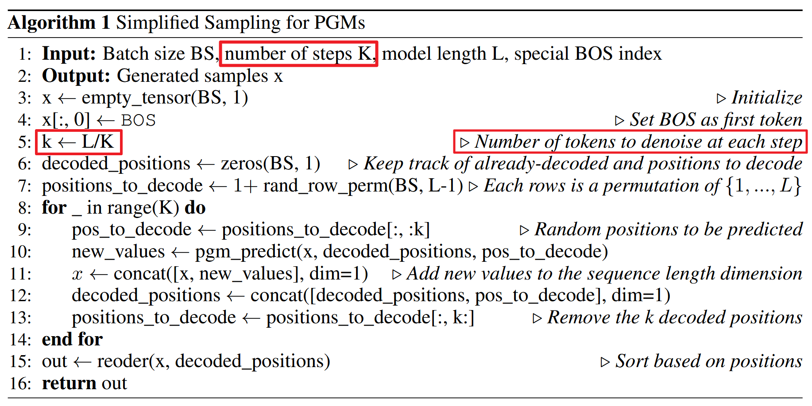
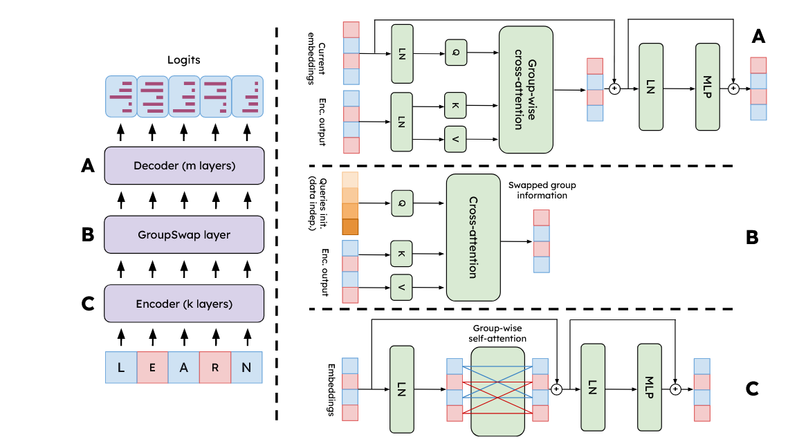
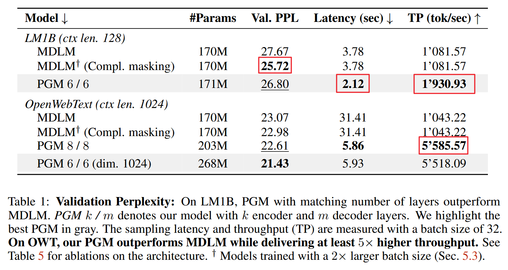

# Partition Generative Modeling: Masked Modeling without Masks
[@deschenauxPartitionGenerativeModeling2025]

## 2 Background
### 2.1 Generative Language Modeling
- Task)
  - Given
    - $`\mathcal{X} = \{0,1,\cdots,N-1\}`$ : a vocabulary with size $`N`$
      - $`x_i \in \mathcal{X}`$ : a discrete token from the vocabulary
    - $`\mathcal{D} : = \left\{ \mathbf{x}^{(0)}, \cdots, \mathbf{x}^{(K-1)} : \mathbf{x}^{(i)} \in\mathcal{X}^L\right\} \sim p_{\text{data}}`$ : training dataset of $`K`$ sequences
      - where 
        - $`p_{\text{data}} : \mathcal{X}^L\rightarrow[0,1]`$ is the unknown data distribution
  - The model generates $`\hat{\mathbf{x}}`$, sequences of discrete tokens of length $`L`$ 
    - i.e.)
      - $`\hat{\mathbf{x}}\in\mathcal{X}^L = \left\{ \mathbf{x}^{(i)} = \left( x_0^{(i)}, \cdots, x_{L-1}^{(i)} : x_j^{(i)}\in\mathcal{X} \right) \right\}_{i=0}^{N^L}`$
    - Prop.)
      - The generated sample $`\hat{\mathbf{x}}`$ should be similar to $`p_{\text{data}} : \mathcal{X}^L\rightarrow[0,1]`$

 

### 2.2 Masked Generative Modeling
- Task)
  - Following the settings of the [generative language model](#21-generative-language-modeling), a special $`\text{[MASK]}`$ is added to the vocabulary.
    - i.e.) $`\text{[MASK]} \in \mathcal{X}`$
      - where
        - $`\text{[MASK]}`$ denotes a hidden value
- Model)
  - A subset of the tokens in $`\mathbf{x}\in\mathcal{D}`$ are replaced with $`\text{[MASK]}`$
  - The denoiser model $`\mathbf{x}_\theta`$ learns to reconstruct the mask positions.
    - where
      - $`\mathbf{x}_\theta:\mathcal{X}^L\rightarrow\underbrace{\mathbb{R}^{L\times N}}_{\text{logit matrix}}`$ : the denoiser
        - i.e.)   
          $`\mathbf{x}_\theta(\mathbf{z}_t,t) = \left.{\underbrace{\begin{bmatrix} \text{logit}(0)&\cdots&\text{logit}(N-2)&\text{logit}(\text{[MASK]})\\\text{logit}(0)&\cdots&\text{logit}(N-2)&\text{logit}(\text{[MASK]})\\\vdots&\ddots&\vdots&\vdots\\\text{logit}(0)&\cdots&\text{logit}(N-2)&\text{logit}(\text{[MASK]})\\ \end{bmatrix}}_{\text{logit values of } N \text{ \# of tokens from }\mathcal{X}}}\right\rbrace \begin{array}{l} L \text{ \# of logit vectors of each token}\\\text{ forming the sequence }\mathcal{X}^L \end{array}`$  
          - $`\ell`$-th row denotes the logit vector of the $`\ell`$-th token of the sequence $`\mathcal{X}^L`$
            - Applying Softmax to them, we may get the probability of $`N`$ elements for that token
            - Just like [D3PM](./d3pm.md#3-diffusion-models-for-discrete-state-spaces) the neural network learns $`p_\theta`$ and $`\hat{\mathbf{x}}\sim p_\theta`$
  - Loss)   
    - $`\mathcal{L}_{\text{MGM}} := \mathbb{E}_{\mathbf{x}\sim\mathcal{D},t\sim\mathcal{U}[0,1]}\big[ w(t) \text{CE}(\mathbf{x}_\theta(\mathbf{z}_t,t), \mathbf{x}) \big]`$
      - where
        - $`t`$ : time step
          - Prop.) $`t`$ controls the fraction of tokens to mask
        - $`\mathbf{x}\in\mathcal{X}^L`$ : the input data
          - e.g.)
            - For the sequence "LEARN" it may be encoded into
              - $`\mathbf{x}=\begin{bmatrix} 0&1&2&3&4 \end{bmatrix}`$
                - where L has the index $`0`$ in $`\mathcal{X}`$ and so on.
          - cf.) Theoretically, one may think of $`\mathbf{x}`$ as an one hot encoded input data
            - i.e.)   
              $`\mathbf{x} = \begin{bmatrix} 1&0&\cdots&0&0\\0&0&\cdots&1&0\\\vdots&\vdots&\ddots&\vdots&\vdots\\0&1&\cdots&0&\underbrace{0}_{\text{[MASK]}}\\ \end{bmatrix}\in\mathbb{R}^{L\times N}`$
            - Desc.)
              - Each row is the probability for each token of the $`L`$ length sequence.
              - $`\mathbf{x}`$ has no masked token.
        - $`\mathbf{z}_t`$ : the corrupted sequence obtained by independently masking each token with probability $`p_t`$
          - cf.) $`p_t`$ is a hyperparameter and define the forwarding process.
          - e.g.) 
            - Suppose 
              - $`p_t=t`$ 
              - $`\mathbf{x}=\begin{bmatrix} 0&1&2&3&4 \end{bmatrix}`$ with sequence "LEARN"
            - We draw $`t\sim\mathcal{U}[0,1]`$.
            - Then for each token, we may mask with probability $`t`$ independently.   
              - e.g.)   
                - $`\mathbf{z}_t = \begin{bmatrix} 0&N-1&1&3&4 \end{bmatrix}`$
                  - where $`\text{[Mask]}`$ has index $`N-1`$.
                  - i.e.) "L[MASK]ARN"
              - Again, theoretically using the one-hot encoding we may denote as   
                $`\mathbf{z}_t = \begin{bmatrix} 1&0&\cdots&0&0\\0&0&\cdots&0&1 & \leftarrow\text{Masked!}\\\vdots&\vdots&\ddots&\vdots&\vdots\\0&1&\cdots&0&0\\ \end{bmatrix}`$
        - $`\text{CE}(\mathbf{x}_\theta,\mathbf{x})`$ calculates the cross entropy loss.
          - How?)
            - For each token $`x_i\in\mathbf{x}`$ get the Softmax probability using $`\mathbf{x}_\theta`$
              - i.e.) $`p_{x_i} = \displaystyle\frac{e^{\text{logit}(x_i)}}{\sum_{j=1}^N e^{\text{logit}(x_j)}}`$
            - Then,   
              $`\displaystyle\text{CE}(\mathbf{x}_\theta,\mathbf{x}) = -\sum_{\ell=1}^L \log p_{x_\ell}`$
          - e.g.)
            - Consider the "LEARN" case where
              - $`\mathbf{x}=\begin{bmatrix} 0&1&2&3&4 \end{bmatrix}`$
              - $`\mathbf{z}_t = \begin{bmatrix} 0&N-1&1&3&4 \end{bmatrix}`$
            - For "L" which index was 0, get $`\text{logit}(0)`$ from $`\mathbf{x}_\theta`$
            - Calculate
              - $`p_0 = \displaystyle\frac{e^{\text{logit}(0)}}{\sum_{j=1}^N e^{\text{logit}(j)}}`$
            - Likewise get probabilities of "E", "A", "R", "N", and calculate $`\text{CE}`$

 

### 2.3 Masked Diffusion Language Modeling
[@sahooSimpleEffectiveMasked2024] [hozy note](./mdlm.md)
- Model)
  - Forward Process
    - $`q(\mathbf{z}_t\mid\mathbf{x}) := \text{Cat}(\mathbf{z}_t\;;\;\alpha_t\mathbf{x} + (1-\alpha_t)\boldsymbol{\pi})`$
      - where
        - $`\mathbf{x}`$ : the one-hot representation of $`x\in\mathcal{X}`$
        - $`\boldsymbol{\pi} = \mathbf{m}`$ : the one-hot encoding of the $`[MASK]`$ token
        - $`\big(\alpha_t\big)_{t=0}^{t=1}`$ : the noise schedule
          - Prop.)
            - It represents the probability of not being masked at $`t`$. (Or, being masked with $`1-\alpha_t`$)
            - Strictly decreasing with boundary conditions $`\alpha_0=1`$, $`\alpha_1=0`$
    - Posterior is given by
      - $`p(\mathbf{z}_s\mid\mathbf{z}_t,\mathbf{x}) = \displaystyle\frac{p(\mathbf{z}_s\mid\mathbf{x})p(\mathbf{z}_t\mid\mathbf{z}_s)}{p(\mathbf{z}_t\mid\mathbf{x})}`$
      - Here, depending on the previous state $`t`$ in the reverse process, we may get
        - $`p(\mathbf{z}_s\mid\mathbf{z}_t,\mathbf{x}) = \begin{cases} \text{Cat}(\mathbf{z}_s\;;\;\mathbf{z}_t) & \mathbf{z}_t \ne \mathbf{m}\\ \text{Cat}\left(\mathbf{z}_s\;;\; \frac{(1-\alpha_s)\mathbf{m} + (\alpha_s-\alpha_t)\mathbf{x}}{1-\alpha_t}\right) & \mathbf{z}_t = \mathbf{m}\\  \end{cases}`$
  - Reverse Parameterization
    - The generative process $`p_\theta`$ is chosen by replacing $`\mathbf{x}`$ from the above forward posterior with $`\mathbf{x}_\theta(\mathbf{z}_t, t)`$
      - i.e.)
        - $`p_\theta(\mathbf{z}_s\mid\mathbf{z}_t) = p(\mathbf{z}_s\mid\mathbf{z}_t, \mathbf{x = x}_\theta)`$
          - where $`\mathbf{x}_\theta : \mathbf{X}^L\rightarrow\underbrace{\mathbb{R}^{L\times N}}_{\text{logit matrix}}`$
- Prop.)
  - Special case of [MGM](#22-masked-generative-modeling) s.t. $`w(t) = \displaystyle\frac{\alpha_t'}{1-\alpha_t}`$
    - cf.) [NELBO from MDLM](./mdlm.md#34-continuous-time-likelihood-bounds)

 

### 2.4 MaskGIT
- Desc.)
  - Image generate version of MGM
  - Masking is operated on discrete tokens obtained from a pre-trained VQGAN.
    - How?)
      - Training)
        - VQGAN tokenize the input image $`\mathbf{x}`$
        - Partially mask the tokenized input and name it $`\mathbf{z}_t`$
        - Feed $`\mathbf{z}_t`$ to a bidirectional transformer that outputs the logit matrix $`\mathbf{R}^{L\times N}`$
        - Calculate the CE loss and optimize it.
      - Inference)
        - Start with the $`z_T`$ all filled with masks.
        - Repeat the following until all are unmasked.
          - Feed $`z_t`$ to the transformer and get the logits.
          - Using logits, get the probability distribution using Softmax and sample each tokens.
          - Calculate the confidence of each tokens and choose top-k tokens to unmask.
            - The probability used for sampling can be used as the confidence.
            - Leave not chosen masked.

 

### 2.5 Classifier Guidance
- Settings)
  - $`p_\theta(\mathbf{x}\mid c)`$ : a class conditional distribution learned via diffusion
    - where
      - $`c\in\{0,\cdots,N-1\} \cup \{ \varnothing \}`$
  - $`p_\theta(\mathbf{x}\mid \varnothing)`$ : the class unconditional distribution
- Model)
  - For $`\omega\ge1`$, we may increase the likelihood of samples from a class $`c`$ by replacing $`\log p_\theta(\mathbf{x}\mid c)`$ with
    - $`v_\theta = (1+\omega)\log p_\theta(\mathbf{x}\mid c) - \omega\log p_\theta(\mathbf{x}\mid\varnothing)`$
- Prop.)
  - Used in [MaskGIT](#24-maskgit)

 

### 2.6 Self-Distillation Through Time (SDTT)
- Desc.)
  - Accelerate sampling from [MGM](#22-masked-generative-modeling) by
    - Put original MGM be the teacher.
    - Then, we may train a student MGM whose one step prediction matches the two-step predictions of the teacher.

  

## 3 Partition Generative Modeling
### Training
#### Concept) Partitioning
- Settings)
  - $`\mathbf{x}\in\mathcal{D}`$ : a training sequence
  - $`t\sim\mathcal{U}[0,1]`$ : sampled time step
  - $`\mathbf{g}\in\{0,1\}^L`$ : a binary vector indicating a group membership
    - i.e.) group 1 and group 2
- Partitioning)
  - With probability $`p_t`$, assign token to group 1.
  - With probability $`1-p_t`$, assign token to group 0.
#### Concept Objective)
  - Tasks)
    - Group 1 predicts a fraction $`(1-p_t)`$ of the tokens
    - Group 0 predicts a fraction $`p_t`$ of the tokens
      - This group use a weight $`w(t)`$ to remain consistent with the [MGM](#22-masked-generative-modeling).
  - Objective)
    - $`\mathcal{L}_{\text{PGM}} = \mathbb{E}_{\mathbf{x}\sim\mathcal{D},t\sim\mathcal{U}[0,1]} \big[ w^{\text{PGM}}(\mathbf{g},t) \; \text{CE}(\mathbf{x}_\theta(\mathbf{x};\mathbf{g};t), \mathbf{x}) \big]`$
      - where
        - $`w^{\text{PGM}}(\mathbf{g},t)_i = \begin{cases} w(t) & \text{if } \mathbf{g}_i = 0 \\ w(1-t) & \text{if } \mathbf{g}_i = 1 \\ \end{cases}`$
  - Prop.)
    - (Conceptually) One forward process trains two complementary masked sequences in the same batch

 

### Sampling
- Desc.)
  - Process only the clean tokens just like ARMs.
    - Why?)
      - Mask tokens are partitioned to different groups.
      - Does not carry mask tokens as [MGM](#22-masked-generative-modeling)s
  - Outputs categorical distributions for $`k\ge1`$ positions simultaneously
    - cf.) ARMs could predict only one token at a time.
- How?)
  - Assume same denoiser as [MDLM](./mdlm.md#321-forward-masking-process)     
    $`\begin{aligned}
      p_\theta(\mathbf{z}_s\mid\mathbf{z}_t) 
      &= q(\mathbf{z}_s\mid\mathbf{z}_t,\mathbf{x}=\mathbf{x}_\theta(\mathbf{z}_t, t)) \\
      &=\begin{cases} \text{Cat}(\mathbf{z}_s\;;\;\mathbf{z}_t) & \mathbf{z}_t\ne\mathbf{m} \\ \text{Cat}\left(\mathbf{z}_s\;;\;\displaystyle\frac{(1-\alpha_s)\mathbf{m} + (\alpha_s-\alpha_t)\mathbf{x}_\theta(\mathbf{z}_t, t)}{1-\alpha_t}\right) & \mathbf{z}_t=\mathbf{m} \\  \end{cases}
    \end{aligned}`$
    - i.e.)
      - Each mask token is denoised independently with proabability $`\displaystyle\frac{\alpha_s-\alpha_t}{1-\alpha_t}`$
- Props.)
  - The number of denoised positions can be viewed as drawn from $`\text{Binomial}\left( L, \frac{\alpha_s-\alpha_t}{1-\alpha_t} \right)`$
    - Algorithm one is fixing this number for simplicity... (wut?)   
      

  

## 4 The Partition Transformer
- Goal)
  - Build architecture that prevents information flow across the groups of the partition.
  - Practical implementation of [partitioning](#concept-partitioning)
- Structure)   
  
  - [Encoder](#tech-encoder)
  - [GroupSwap layer](#tech-groupswap-layer)
  - [Decoder](#tech-decoder)

#### Tech) Encoder
- Desc.)
  - Partition-wise **self-attention** blocks
    - i.e.)
      - 
- Prop.)
  - Similar to standard bidirectional transformer blocks
  - Different on that separate groups do not attend each other

 

#### Tech) Decoder
- Desc.)
  - Cross-attention layer
    - Keys and Values are computed based on the output of the [encoder](#tech-encoder)
    - Queries are computed using either...
      - the output of the [GroupSwap layer](#tech-groupswap-layer)
      - the output of the previous decoder block
- Prop.)
  - No self-attention layer
    - Why?)
      - Compute predictions solely at the positions that we will decode.
      - Paper argues that this allows efficient generation.

 

#### Tech) GroupSwap layer
- Goal)
  - Recall that encoder localized each group information.
  - This layer allows information exchange between groups.
    - Why?)
      - Prediction on group 1 should be based on group 0
      - and vice versa
- Implementation)
  - Cross-Attention
    - Queries
      - Data-Independent
        - Given a learnable vector $`\mathbf{u}\in\mathbb{R}^H`$
        - Create a query matrix $`V\in\mathbb{R}^{L\times H}`$ by
          - $`V_{i:\cdot} = W\left[\text{LN}(u+\text{pos}_{i;\cdot}) + b\right]`$
            - where
              - $`W,b`$ are learnable parameters
              - LN is the layer normalization
              - $`\text{pos}`$ is the sinusoidal encoding
            - i.e.)
              - Add positional encoding
              - Apply layer normalization
              - Linear projection
      - Data-Dependent
        - Given the encoder output $`X\in\mathbb{R}^{L\times H}`$
        - Perform a group-wise aggrecation to obtain vectors $`Y_0,Y_1\in\mathbb{R}^H`$
          - e.g.) logsumexp, mean
        - Get query initialization $`V'`$ s.t.
          - $`V_i' = V_{i:\cdot} + \begin{cases} Y_1 & \text{if } g_i=0\\ Y_0 & \text{otherwise }\\ \end{cases}`$
    - Keys and Values
      - Inputted from the [encoder](#tech-encoder)
      - Not speicified

  

## 5 Experiments
### 5.1 Language Modeling : PGM vs MDLM
- PGM achieved....
  - lower validation perplexity
  - 5 times higher sampling throughput
  - faster inferece without sacrificying downstream performance (tasked never trained)
  - higher accuracy after distillation

### 5.2 Image Modeling : PGM vs MaskGIT (VQGAN on ImageNet)
- PGM (64 steps) achieved....
  - improved FID score
  - 3.9 times faster

### 5.3 Isolating the effect of Complementary Masking
- Setting)
  - Use only MDLM
  - Input complementary masked sequences
    - e.g.)
      - "L[M]A[M]N"
      - "[M]E[M]R[M]"
  - Compare it with the normal MDLM.
- Result   
  