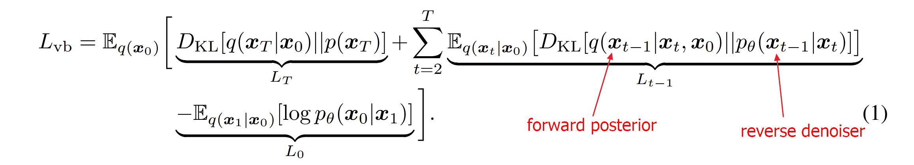
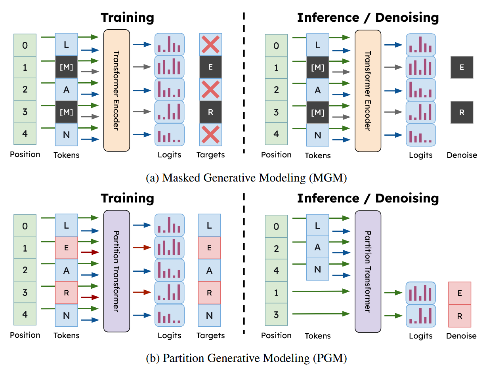

# **P**artition **G**enerative **M**odeling
Deschenaux et al. 2025

     

Reviewed & Presented by Joon Hyeok Kim

---

# Contents
### 1. Recap of **D3PM**
### 2. Recap of **MDLM** based on **D3PM**
### 3. **PGM**'s Idea based on **MDLM**
### 4. Implementation Details

---

## **D3PM** : General but heavy framework!
### Forward transition probabilities matrix
- $[\boldsymbol{Q}_t]_{ij} = q(x_t = j\mid x_{t-1}=i)$   

  

$Q_t = \begin{bmatrix} 
q(x_t=1\mid x_{t-1}=1) & q(x_t=2\mid x_{t-1}=1) & \cdots & q(x_t=N\mid x_{t-1}=1) \\ 
q(x_t=1\mid x_{t-1}=2) & q(x_t=2\mid x_{t-1}=2) & \cdots & q(x_t=N\mid x_{t-1}=2) \\ 
\vdots & \vdots & \ddots & \vdots \\
q(x_t=1\mid x_{t-1}=N) & q(x_t=2\mid x_{t-1}=N) & \cdots & q(x_t=N\mid x_{t-1}=N) \\
\end{bmatrix}$

 

- Props.)
  - Massive $Q_t \in N^2$ where $N$ is the size of the vocabulary

---

## **D3PM** continues
#### Question) What **Q** should we choose?
#### Answer) **Absorbing State** Transition Matrix
- Def.)   
  - For the absorbing state $m$,   
    $[\boldsymbol{Q}_t]_{ij} = \begin{cases}
      1 & \text{if } i=j=m \\
      1-\beta_t & \text{if } i=j \ne m \\
      \beta_t & \text{if } j=m, i\ne m \\
    \end{cases}$

- Prop.) 
  - This is equivalent to the interpolation notation : $Q_t = (1-\beta_t)\mathbf{I} + \beta_t \boldsymbol{1} e_m^\top$ 
    - where $e_m$ is a vector with a 1 on the absorbing state and 0s elsewhere.
  - Use this for the **MASK** token!

---

- e.g.) When the absorbing token  $m=2$   
$(1-\beta_t)\begin{bmatrix} 1&0&0&\cdots&0 \\ 0&1&0&\cdots&0 \\ 0&0&1&\cdots&0 \\ \vdots&\vdots&\vdots&\ddots&\vdots\\ 0&0&0&\cdots&1 \end{bmatrix} + \beta_t\begin{bmatrix} 0&1&0&\cdots&0 \\ 0&1&0&\cdots&0 \\ 0&1&0&\cdots&0 \\ \vdots&\vdots&\vdots&\ddots&\vdots \\ 0&\underbrace{1}_{\text{abs}}&0&\cdots&0 \end{bmatrix}$
$= \begin{bmatrix} 1-\beta_t&\beta_t&0&\cdots&0 \\ 0&1&0&\cdots&0 \\ 0&\beta_t&1-\beta_t&\cdots&0\\ \vdots&\vdots&\vdots&\ddots&\vdots\\ 0&\underbrace{\beta_t}_{\text{abs}}&0&\cdots&1-\beta_t \end{bmatrix}$

---

## **D3PM** continues
### Forward Process
#### One **Step** Marginal
$q(\boldsymbol{x}_t\mid \boldsymbol{x}_{t-1}) = \text{Cat}(\boldsymbol{x}_t;\; \boldsymbol{p} = \boldsymbol{x}_{t-1}\boldsymbol{Q}_t)$
- i.e.) Sample $\boldsymbol{x}_t$ from the categorical distribution $\boldsymbol{x}_{t-1}\boldsymbol{Q}_t$

#### One **Shot** Marginal
$q(\boldsymbol{x}_t\mid\boldsymbol{x}_0) = \text{Cat}(\boldsymbol{x}_t; \boldsymbol{p} = \boldsymbol{x}_0 \overline{\boldsymbol{Q}}_t)$ : the $t$-step marginal
  - where $\overline{\boldsymbol{Q}}_t = \boldsymbol{Q}_1\boldsymbol{Q}_2\cdots\boldsymbol{Q}_t$ 

#### **Posterior**
$q(\boldsymbol{x}_{t-1}\mid\boldsymbol{x}_t, \boldsymbol{x}_0) 
= \frac{q(\boldsymbol{x}_t\mid\boldsymbol{x}_{t-1},\boldsymbol{x}_0) q(\boldsymbol{x}_{t-1}\mid\boldsymbol{x}_0)}{q(\boldsymbol{x}_t\mid\boldsymbol{x}_0)} 
= \text{Cat} \left(\boldsymbol{x}_{t-1}; \boldsymbol{p} = \frac{\boldsymbol{x}_t \boldsymbol{Q}_t^\top \odot \boldsymbol{x}_0 \overline{\boldsymbol{Q}}_{t-1}}{\boldsymbol{x}_0 \overline{\boldsymbol{Q}}_t x_t^\top}  \right)$

---

## **D3PM** continues
### Reverse Process
$p_\theta(\boldsymbol{x}_{t-1}\mid \boldsymbol{x}_t) \varpropto \displaystyle\sum_{\tilde{\boldsymbol{x}_0}} \underbrace{q(\boldsymbol{x}_{t-1}, \boldsymbol{x}_t \mid \tilde{\boldsymbol{x}_0})}_{\text{term 0}} \underbrace{\tilde{p}_\theta(\tilde{\boldsymbol{x}_0}\mid\boldsymbol{x}_t)}_{\text{nn}_\theta(\boldsymbol{x}_t)\text{ predicts this!}}$

 

$\underbrace{q(\boldsymbol{x}_{t-1}, \boldsymbol{x}_t\mid\tilde{\boldsymbol{x}_0})}_{\text{term 0}} = \underbrace{q(\boldsymbol{x}_t\mid\boldsymbol{x}_{t-1},\tilde{\boldsymbol{x}_0})}_{\text{term 1}} \cdot \underbrace{q(\boldsymbol{x}_{t-1}\mid\tilde{\boldsymbol{x}_0})}_{\text{term 2}}$

 

$\underbrace{q(\boldsymbol{x}_t\mid\boldsymbol{x}_{t-1},\tilde{\boldsymbol{x}_0})}_{\text{term 1}} = q(\boldsymbol{x}_t\mid\boldsymbol{x}_{t-1})$
$\underbrace{q(\boldsymbol{x}_{t-1}\mid\tilde{\boldsymbol{x}_0})}_{\text{term 2}} = \tilde{x_0} \overline{Q}_{t-1} = \tilde{x_0} Q_1\cdots Q_{t-1} \quad\leftarrow\text{Expensive }\overline{Q}$

---

## **D3PM** continues
### Loss
$L_\lambda = L_{\text{vb}} + \lambda \mathbb{E}_{q(\boldsymbol{x}_0)} \mathbb{E}_{q(\boldsymbol{x}_t\mid\boldsymbol{x}_0)}\big[-\log\tilde{p_\theta}(\boldsymbol{x}_0\mid\boldsymbol{x}_t)\big]$

  

### Drawback
- $q$ and $p_\theta$ are $N$ dimensional distributions, which are heavy.   
- Parameterization is complicated (Consider all possible $\tilde{x}_0$s)

---

## **MDLM** : Single Token Problem
### Idea

Keep the **absorbing state transition** to use the MASK token!

 

Instead of considering $N$ dimensional distribution $Q_t$, focus only on **two** tokens!
1. original token $\mathbf{x}$
2. mask token $\mathbf{m}$

 

Inheriting the **interpolation notation** in the forward process

- $q(\mathbf{z}_t\mid\mathbf{x}) = \text{Cat}(\mathbf{z}_t\;;\;\alpha_t\mathbf{x} + (1-\alpha_t)\mathbf{m})$

 

i.e.) Sample the intermediate state $\mathbf{z}_t$ from the distribution $\alpha_t\mathbf{x} + (1-\alpha_t)\mathbf{m}$

---

## **MDLM** : Single Token Problem continues
### **Forward** Process
#### **Marginal**
$q(\mathbf{z}_t\mid\mathbf{x}) = \text{Cat}(\mathbf{z}_t\;;\;\alpha_t\mathbf{x} + (1-\alpha_t)\mathbf{m})$
- Then, $\mathbf{z}_t$ is sampled from $\alpha_t\mathbf{x} + (1-\alpha_t)\mathbf{m}$.
  - i.e.) $\mathbf{z}_t = \begin{cases} \mathbf{x} & \text{with } p =\alpha_t \\ \text{[MASK]} & \text{with } p =1-\alpha_t \\ \end{cases}$

#### **Posterior**  
$q(\mathbf{z}_s\mid\mathbf{z}_t,\mathbf{x}) = \begin{cases}
\text{Cat}(\mathbf{z}_s\;;\;\mathbf{z}_t) & \mathbf{z}_t \ne \mathbf{m} \\
\text{Cat}\left(\mathbf{z}_s\;;\;\displaystyle\frac{(1-\alpha_s)\mathbf{m} + (\alpha_s-\alpha_t)\mathbf{x}}{1-\alpha_t}\right) & \mathbf{z}_t = \mathbf{m} \\
\end{cases}$
- where $(s\lt t)$

---

## **MDLM** : Single Token Problem continues
### **Reverse** Process : SUBS Parameterization- Model)   
$p_\theta(\mathbf{z}_s\mid\mathbf{z}_t) = q(\mathbf{z}_s\mid\mathbf{z}_t,\mathbf{x}=\mathbf{x}_\theta(\mathbf{z}_t, t))=\begin{cases} \text{Cat}(\mathbf{z}_s\;;\;\mathbf{z}_t) & \mathbf{z}_t\ne\mathbf{m} \\ \text{Cat}\left(\mathbf{z}_s\;;\;\displaystyle\frac{(1-\alpha_s)\mathbf{m} + (\alpha_s-\alpha_t)\mathbf{x}_\theta(\mathbf{z}_t, t)}{1-\alpha_t}\right) & \mathbf{z}_t=\mathbf{m} \\  \end{cases}$
- Desc.)
  - Similar to the forward posterior.
      - Only difference is that $\mathbf{x}$ is parameterized as $\mathbf{x}_\theta(\mathbf{z}_t, t)$
  - Cases
      - If $\mathbf{z}_t$ is masked (initial state), 
        - we draw $\mathbf{z}_s$ from the distribution $\displaystyle\frac{(1-\alpha_s)\mathbf{m} + (\alpha_s-\alpha_t)\mathbf{x}_\theta(\mathbf{z}_t, t)}{1-\alpha_t}$
      - Else (i.e. already unmasked),
        - $\mathbf{z}_s=\mathbf{z}_t$ definitively.

---

## **MDLM** : Single Token Problem continues
### Loss
#### Start with ELBO

- Put $L_{T-1} = \mathcal{L}_{\text{diffusion}}$

---

## **MDLM** : Single Token Problem continues

$\begin{aligned}
    \mathcal{L}_{\text{diffusion}}
    &= \mathbb{E}_q \left(\sum_{i=1}^T D_{\text{KL}} \left[ q(\mathbf{z}_{s(i)}\mid\mathbf{z}_{t(i)},\mathbf{x}) \;\Vert\; p_\theta(\mathbf{z}_{s(i)}\mid\mathbf{z}_{t(i)}) \right]\right) \\
    &= \sum_{i=1}^T \mathbb{E}_q \left(D_{\text{KL}} \left[ \underbrace{q(\mathbf{z}_s\mid\mathbf{z}_t,\mathbf{x})}_{\text{Forward Posterior}} \;\Vert\; \underbrace{p_\theta(\mathbf{z}_s\mid\mathbf{z}_t, \mathbf{x}_\theta(\mathbf{z}_t, t))}_{\text{SUBS para'd Reverse}} \right]\right) & \begin{array}{l} \text{where } s=s(i), t=t(i) \\ \because\mathbf{z}_t\in\{\mathbf{x},\mathbf{m}\} \wedge (\mathbf{z}_t=\mathbf{x}\Rightarrow D_{\text{KL}}(q\Vert p_\theta) = 0) \end{array} \\
    &\vdots\\
    &\text{Rao-Blackwellized Likelihood Bounds backs up Simplification}\\
    &\vdots\\
    &= \sum_{i=1}^T \mathbb{E}_q\left[ \frac{\alpha_t-\alpha_s}{1-\alpha_t} \underbrace{\log\langle\mathbf{x}_\theta(\mathbf{z}_t,t),\; \mathbf{x}\rangle}_{\text{Cross Entropy Loss!}} \right] & \text{cf.)} \begin{cases} \mathbf{z}_t=\mathbf{x} & \text{with }\frac{1-\alpha_s}{1-\alpha_t} \text{ : already excluded} \\ \mathbf{z}_t=\mathbf{m} & \text{with }\frac{\alpha_s-\alpha_t}{1-\alpha_t} \text{ : what we care!} \end{cases} \\
\end{aligned}$

---

## **MDLM** : Single Token Problem continues
### **Continuous** Time Loss
Making the number of steps $T\rightarrow\infty$, we may get

 

$\mathcal{L}_{\text{NELBO}}^\infty = \mathbb{E}_q\displaystyle\int_{t=0}^{t=1} \frac{\alpha_t'}{1-\alpha_t} \underbrace{\log\langle\mathbf{x}_\theta(\mathbf{z}_t,t),\; \mathbf{x}\rangle}_{\text{Cross Entropy Loss!}} \text{d} t$

 

- where $\alpha_t' = \displaystyle\lim_{T\rightarrow\infty} T(\alpha_t - \alpha_s)\quad(\because T\rightarrow\infty \Rightarrow s\rightarrow t)$

---

## **MDLM** dealing with length **L** sequence of **tokens**
#### Forward noising process is applied **independently** across a sequence.
- $q(\mathbf{z}_t^{1:L}\mid\mathbf{x}^{1:L}) = \displaystyle\prod_{\ell=1}^L q(\mathbf{z}_t^{\ell}\mid\mathbf{x}^{\ell})$
#### Denoising process factorizes **independently** across tokens, conditioned on a sequence of latents $\mathbf{z}_t^{1:L}$
- $\displaystyle p_\theta(\mathbf{z}_s^{1:L}\mid\mathbf{z}_t^{1:L}) = \displaystyle\prod_{\ell=1}^L p_\theta(\mathbf{z}_s^{\ell}\mid\mathbf{z}_t^{1:L})$
#### Optimization)
- $\mathcal{L}_{\text{NELBO}}^\infty = \mathbb{E}_q\displaystyle\int_{t=0}^{t=1} \frac{\alpha_t'}{1-\alpha_t} \sum_{\ell=1}^L \log\left\langle\mathbf{x}_\theta^\ell(\mathbf{z}_t^{1:L},t), \mathbf{x}^\ell\right\rangle \text{d} t$

---

## **PGM** also solves **M**ask **G**enerative **M**odeling problem
$\mathcal{L}_{\text{MGM}} := \mathbb{E}_{\mathbf{x}\sim\mathcal{D},t\sim\mathcal{U}[0,1]}\big[ w(t) \text{CE}(\mathbf{x}_\theta(\mathbf{z}_t,t), \mathbf{x}) \big]$

 

#### Accoring to them **MDLM**'s **NELBO** loss is just a MGM loss with special **weight**

$\mathcal{L}_{\text{NELBO}}^\infty = \mathbb{E}_q\displaystyle\int_{t=0}^{t=1} \frac{\alpha_t'}{1-\alpha_t} \sum_{\ell=1}^L \underbrace{\log\langle\mathbf{x}_\theta(\mathbf{z}_t,t),\; \mathbf{x}\rangle}_{\text{Cross Entropy Loss!}} \text{d} t$

 

- where $w(t) = \displaystyle\frac{\alpha_t'}{1-\alpha_t}$

---

## **PGM**'s Idea : Based on the **MDLM** framework...
- Treat **masked** and **unmasked** tokens as **group 0** and **group 1**
- Let each group learn each other in the opposite time schedule

 

#### **Objective**
$\mathcal{L}_{\text{PGM}} = \mathbb{E}_{\mathbf{x}\sim\mathcal{D},t\sim\mathcal{U}[0,1]} \big[ w^{\text{PGM}}(\mathbf{g},t) \; \text{CE}(\mathbf{x}_\theta(\mathbf{x};\mathbf{g};t), \mathbf{x}) \big]$

- where $w^{\text{PGM}}(\mathbf{g},t)_i = \begin{cases} w(t) & \text{if } \mathbf{g}_i = 0 \\ w(1-t) & \text{if } \mathbf{g}_i = 1 \\ \end{cases}$

 

### How?
- Enable this using the architecture

 

---
### MDLM vs PGM

---
### **Partition** Transformer

---

#### **Encoder**
- Desc.)
  - Partition-wise **self-attention** blocks
- Prop.)
  - Similar to standard bidirectional transformer blocks
  - Different on that separate groups do not attend each other

#### **Decoder**
- Desc.)
  - Cross-attention layer
    - Keys and Values are computed based on the output of the [encoder](#tech-encoder)
    - Queries are computed using either...
      - the output of the [GroupSwap layer](#tech-groupswap-layer) (Current Implementation)
      - the output of the previous decoder block (Future work?)
- Prop.)
  - No self-attention layer
    - Why?)
      - Compute predictions solely at the positions that we will decode.
      - Paper argues that this allows efficient generation.

---
### GroupSwap Layer
- Goal)
  - Recall that encoder localized each group information.
  - This layer allows information exchange between groups.
    - Why?)
      - Prediction on group 1 should be based on group 0
      - and vice versa
- Implementation)
  - Cross Entropy
    - Queries
      - Data-Independent
      - Data-Dependent
    - Keys and Values
      - Inputted from the [encoder](#tech-encoder)
      - No speicified details provided.

---
## Experiments
### Language Modeling : PGM vs MDLM
- PGM achieved....
  - lower validation **perplexity**
  - 5 times higher sampling **throughput**
  - faster inferece without sacrificying **downstream performance**   
    - i.e. tasks never trained
  - higher accuracy after **distillation**

### Image Modeling : PGM vs MaskGIT (VQGAN on ImageNet)
- PGM (64 steps) achieved....
  - improved FID score
  - 3.9 times faster

---
### Isolating the effect of Complementary Masking
- Setting)
  - Use only MDLM
  - Input complementary masked sequences
    - e.g.) "L[M]A[M]N", "[M]E[M]R[M]"
  - Compare it with the normal MDLM.
- Result   
  