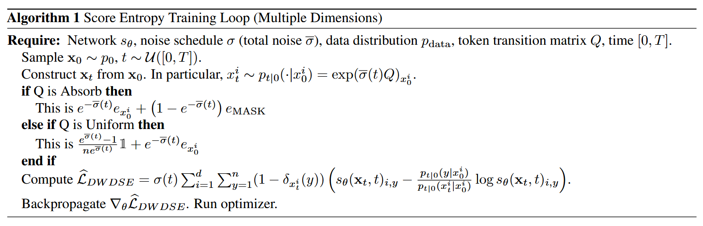
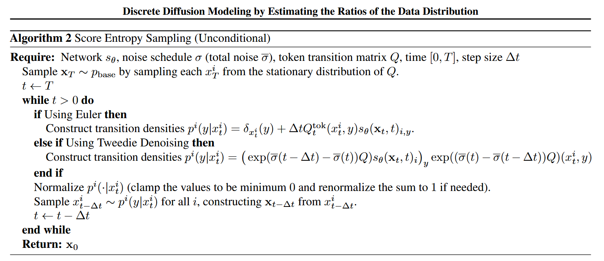
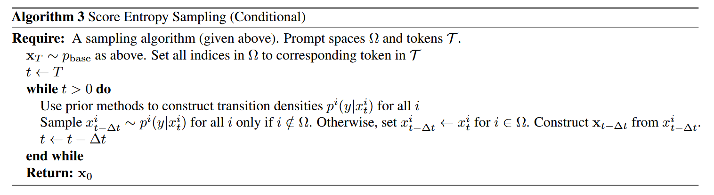

# Discrete Diffusion Modeling by Estimating the Ratios of the Data Distribution
[@louDiscreteDiffusionModeling2024]

## 1 Hozy Summary
- We want to learn the discrete model by approximating the ratio of $`\frac{p_t(y)}{p_t(x)}`$.
- Following the Meng et al.'s [concrete score matching](#concept-concrete-score-matching), we may approximate our model by
  - $`s_\theta(x,t)\approx\left[ \frac{p_t(y)}{p_t(x)} \right]_{y\ne x}`$
  - However, the [concrete score matching](#concept-concrete-score-matching) utilizes the L2 loss, which may lead to the negative ratio.
    - Ratio between probability paths cannot be negative!
- This paper suggests the [score entropy](#concept-score-entropy) that utilizes the Bregman Divergence with $`\phi(x) = x\log x - x`$.
  - This score can yield ELBO like loss of [DWDSE](#theorem-36-likelihood-training-and-evaluation) of 
    - $`-\log p_0^\theta(x_0) \le \mathcal{L}_{\text{DWDSE}}(x_0) + D_{KL}(p_{T\mid0}(\cdot\mid x_0) \;\Vert\; p_{\text{base}})`$
- This learned score can be used to generate the reverse matrix and do the reverse sampling.
- This model can be [extended to the sequence level](#33-practical-implementation).
- Reverse sampling can be accelerated using the [Tau-leaping](#41-time-reversal-strategies).
- Further, it can be used to the [infilling problem](#42-arbitrary-prompting-and-infilling).

  

## 2 Preliminaries
### 2.1 Discrete Diffusion Processes
- Settings)
  - $`\mathcal{X} = \{1,\cdots, N\}`$ : a finite discrete support
    - cf.) Support means $`\{x\in\Omega\mid p(x)\gt0 \}`$
  - $`p\in\mathbb{R}^N`$ : a probability mass vector that represents $`\mathcal{X}`$
  - $`p_t\in\mathbb{R}^N`$ : a family of distributions that follows the continuous time Markov process in [CTMC](./cmtc.md) 
- Ordinary Differential Equation)
  - $`\displaystyle\frac{\text{d}}{\text{d}t}p_t = Q_tp_t,\quad p_0\approx p_{\text{data}}`$
    - for
        - $`Q_t\in\mathbb{R}^{N\times N}`$ : the diffusion matrix
        - with
            - non-negative non-diagonal entries
            - columns sum to zero
            - simplicity so that $`p\rightarrow\infty \Rightarrow p_t\rightarrow p_{\text{base}}`$
            - e.g.) $`Q_t = \sigma(t)Q`$
- Simulation)
  - $`p(x_{t+\Delta t} = y \mid x_t = x) = \delta_{xy} + Q_t(y,x)\Delta t + O(\Delta t^2)`$
    - i.e.) Transition from the state $`x`$ to $`y`$ in $`\Delta t`$ Euler step
- Reversal)
  - $`\displaystyle\frac{\text{d}}{\text{d}t}p_{T-t} = \overline{Q}_{T-t}p_{T-t}`$
    - where
      - $`\overline{Q}_t\in\mathbb{R}^{N\times N}`$ : another diffusion matrix that satisfies...
        - $`\overline{Q}_t(y,x) = \displaystyle\frac{p_t(y)}{p_t(x)} Q_t(x,y)`$
          - Refer to [CTMC's reverse process](./cmtc.md#concept-reverse-process) for more details
          - cf.) [Concrete Score](#concept-concrete-score-matching) from Meng et al. 2022
            - Desc.) $`\frac{p_t(y)}{p_t(x)}`$ are known as the concrete scores that generalize the typical score function $`\nabla_x\log p_t`$
            - Why?) 
              - The gradient operator for discrete structures is defined for pairs $`x\ne y`$ by $`\nabla f(xy) = f(y) - f(x)`$. 
                - Here $`f(xy)`$ means the transition from $`x`$ to $`y`$
              - The score function would generalize the normalized gradients $`\frac{\nabla p(xy)}{p(x)} = \frac{p(y)-p(x)}{p(x)} = \frac{p(y)}{p(x)} - 1`$
        - $`\overline{Q}_t(x,x) = \displaystyle\sum_{y\ne x} \overline{Q}_t(y,x)`$

  

### 2.2 Discrete Diffusion Models
- Goal)
  - Construct the reverse process above by learning the ratios $`\displaystyle\frac{p_t(y)}{p_t(x)}`$
- Methods)
  - [Mean Prediction](#concept-mean-prediction)
  - [Ratio Matching](#concept-ratio-matching)
  - [Concrete Score Matching](#concept-concrete-score-matching)

#### Concept) Mean Prediction
- How?)
  - Use DDPM method to learn the reverse density $`p_{0\mid t}`$
- e.g.)
  - [D3PM](./d3pm.md), [CTMC](./cmtc.md)
- Advantage)
  - Does recover the ratio.
- Drawbacks)
  - Learning $`p_{0\mid t}`$ is hard because it's the probability density.
  - Empirically underperforms because the objective breaks down in continuous time and must be [approximated as CTMC](./cmtc.md#optimization-process)

#### Concept) Ratio Matching
- How?)
  - Learn the marginal probabilities of each dimension with maximum likelihood training.
- e.g.)
  - Sun et al. 2023, *Score-based continuous-time discrete diffusion models*
- Drawback)
  - The resulting setup departs from standard score matching and requires specialized and expensive network architectures.
  - Performs worse than Mean Prediction

#### Concept) Concrete Score Matching
- How?)
  - Generalize the standard Fisher divergence in score matching.
    - i.e.) Learn $`s_\theta(x,t)\approx\left[ \frac{p_t(y)}{p_t(x)} \right]_{y\ne x}`$ with concrete score matching:
      - $`\mathcal{L}_{\text{CSM}} = \displaystyle\frac{1}{2}\mathbb{E}_{x\sim p_t} \left[ \sum_{y\ne x} \left( s_\theta(x_t, t)_y - \frac{p_t(y)}{p_t(x)} \right)^2 \right]`$
    - cf.) Standard Fisher Divergence
      - $`D_F(p_{\text{data}}\Vert p_\theta) = \displaystyle\frac{1}{2}\mathbb{E}_{x\sim p_t} \left[ \left\Vert \nabla_x\log p_{\text{data}}(x) - \nabla_x\log p_{\theta}(x) \right\Vert_2^2 \right]`$
        - i.e.) Measure the scores between two distributions
- e.g.)
  - Meng et al. 2022, *Concrete score matching: Generalized score matching for discrete data*
- Drawback)
  - The $`\ell^2`$ loss is incompatible with the fact that $`\frac{p_t(y)}{p_t(x)} \gt 0`$

  

## 3 Score Entropy Discrete Diffusion Models
- Goal)
  - Learn the collected [concrete score](#concept-concrete-score-matching)
    - $`s_\theta(x,t)\approx\left[ \frac{p_t(y)}{p_t(x)} \right]_{y\ne x}`$
      - for
        - $`s_\theta : \mathcal{X}\times\mathbb{R} \rightarrow \mathbb{R}^{\vert\mathcal{X}\vert}`$
      - cf.)
        - $`\left[ \frac{p_t(y)}{p_t(x)} \right]_{y\ne x} = \begin{bmatrix} \frac{p_t(1)}{p_t(x)} & \frac{p_t(2)}{p_t(x)} &\cdots & \frac{p_t(N)}{p_t(x)} \end{bmatrix} \in\mathbb{R}^{\vert\mathcal{X}\vert}`$
          - Precisely, $`y=x`$ should be excluded and $`\mathbb{R}^{\vert\mathcal{X}\vert-1}`$ but use the above notation for the simplicity and ignore $`y=x`$ element.

### Concept) Score Entropy
- Def.)
  - For
    - $`p`$ : a distribution
    - $`w_{xy}\ge0`$ : weights
    - $`s_\theta(x)_y`$ : a score network
  - the score entropy $`\mathcal{L}_{\text{SE}}`$ is defined as
    - $`\mathcal{L}_{\text{SE}} = \displaystyle\mathbb{E}_{x\sim p}\left[ \sum_{y\ne x} w_{xy} \left( s_\theta(x)_y - \frac{p(y)}{p(x)}\log s_\theta(x)_y + K\left(\frac{p(y)}{p(x)}\right) \right) \right]`$
      - where
        - $`K(a) = a(\log a - 1)`$ : a normalizing constant function that ensures $`\mathcal{L}_{\text{SE}} \ge 0`$
- Desc.)
  - [Bregman divergence](./edit_flow.md#concept-bregman-divergence) used instead of the standard Fisher divergence from the [concrete score matching](#concept-concrete-score-matching) with the convex function $`\phi(x) = x\log x - x`$ (i.e. Generalized KL-Divergence)
    - cf.) $`D_\phi(a,b) = \phi(a) - \phi(b) - \langle a-b, \frac{\text{d}}{\text{d}b} \phi(b)\rangle`$
- Desirable Props.)
  - Score entropy is a suitable loss function that recovers the ground truth concrete score
    - i.e.) Consistent
    - Why?) [Prop 3.2](#prop-32-consistency-of-score-entropy)
  - Directly improves upon concrete score matching by rescaling problematic gradients.
    - e.g.)
      - Suppose $`w_{xy} = 1`$
      - Then $`\displaystyle\nabla_{s_\theta(x)_y}\mathcal{L}_{\text{SE}} = \frac{1}{s_\theta(x)_y} \nabla_{s_\theta(x)_y}\mathcal{L}_{\text{CSM}}`$
        - where
          - $`\mathcal{L}_{\text{CSM}}`$ is the [concrete score matching](#concept-concrete-score-matching) loss.
      - Here, the gradient signals for each pair $`(x,y)`$ are scaled by a factor of $`s_\theta(x)_y`$.
        - Thus, $`s_\theta\ge0`$
  - Computationally tractable by removing the unknown $`\frac{p(y)}{p(x)}`$ term.
    - How?)
      - (impractical) [Implicit Score Entropy](#prop-33-implicit-score-entropy)
      - (v) [Denoising Score Entropy](#theorem-34-denoising-score-entropy)
  - Can be used to define an ELBO like training and evaluation.
    - Desc.)
      - Using the [parameterized reverse matrix](#definition-35-parameterized-reverse-matrix) $`\overline{Q}_t^\theta`$, we may 
  - Can be scaled to high dimensional tasks.

  

#### Prop. 3.2) Consistency of Score Entropy
- Theorem)
  - Suppose $`p`$ is fully supported and $`w_{xy}\gt0`$.
  - Then, as the number of samples and model capacity approaches $`\infty`$, the optimal $`\theta^*`$ that minimizes the [score entropy](#concept-score-entropy) $`\mathcal{L}_{\text{SE}}`$ satisfies...
    - $`s_{\theta^*}(x)_y = \frac{p(y)}{p(x)},\quad\forall(x,y)\in\mathcal{X}^2`$
    - $`\mathcal{L}_{\text{SE}}(\theta^*) = 0`$

 

#### Prop. 3.3) Implicit Score Entropy
- Theorem)
  - The [score entropy](#concept-score-entropy)$`\mathcal{L}_{\text{SE}}`$ is equal up to a constant independent of $`\theta`$ to the **implicit score entropy** $`\mathcal{L}_{\text{ISE}}`$
    - i.e.) $`\nabla_\theta\mathcal{L}_{\text{SE}} = \nabla_\theta\mathcal{L}_{\text{ISE}}`$
    - where
      - $`\displaystyle\mathcal{L}_{\text{ISE}} = \mathbb{E}_{x\sim p}\left[ \sum_{y\ne x} w_{xy} s_\theta(x)_y - w_{yx}\log s_\theta(y)_x \right]`$
    - How?)
      - Recall that our goal was to remove the unknown $`\frac{p(y)}{p(x)}`$ term.
      - Focusing on the ratio term from $`\mathcal{L}_{\text{SE}}`$, we have   
        $`\begin{aligned}
          \mathbb{E}_{x\sim p}\left[ \sum_{y\ne x} w_{xy}\frac{p(y)}{p(x)}\log s_\theta(x)_y \right]
          &= \sum_{x} p(x) \sum_{y\ne x}w_{xy}\frac{p(y)}{p(x)}\log s_\theta(x)_y \\
          &= \sum_{x} \sum_{y\ne x} w_{xy}p(y)\log s_\theta(x)_y \\
          &= \sum_{y} \sum_{x\ne y} w_{yx}p(x)\log s_\theta(y)_x & \because x,y\in\mathcal{X}, \text{ just switching} \\
          &= \sum_{x} \sum_{y\ne x} w_{yx}p(x)\log s_\theta(y)_x & \text{cf.) Just expand and regroup} \\
          &= \sum_{x} p(x) \sum_{y\ne x} w_{yx}\log s_\theta(y)_x \\
          &= \mathbb{E}_{x\sim p}\left[ \sum_{y\ne x} w_{yx}\log s_\theta(y)_x \right] \\
        \end{aligned}`$
      - Thus,   
        $`\begin{aligned}
          \mathcal{L}_{\text{SE}} &= \mathbb{E}_{x\sim p}\left[ \sum_{y\ne x} w_{xy} s_\theta(x)_y - w_{yx}\log s_\theta(y)_x  + K\left(\frac{p(y)}{p(x)}\right) \right] \\
          &= \mathbb{E}_{x\sim p}\left[ \sum_{y\ne x} w_{xy} s_\theta(x)_y - w_{yx}\log s_\theta(y)_x \right] + C \\
          &= \mathcal{L}_{\text{ISE}} + C \\
        \end{aligned}`$
- Problem)
  - Assume that $`x\in\mathcal{X}`$ is a sequence.
  - Then, calculating $`\mathcal{L}_{\text{ISE}}`$ by summing all possible $`\sum_{x\ne y}`$ is intractable.
  - Thus, we may sample with Monte Carlo estimation and apply stochastic gradient descent.
  - However, the loss contains both $`s_\theta(x)_y`$ and $`s_\theta(y)_x`$ terms.
  - Thus, for a single sample $`x`$, we need to evaluate neighbors $`y`$.
  - Hence, if the sequence length is large, this sampling is intractable.
- Sol.)
  - [Denoising Score Entropy](#theorem-34-denoising-score-entropy)

 

#### Theorem 3.4) Denoising Score Entropy
- Theorem)
  - Suppose
    - $`p_0`$ : a base density
    - $`p`$ is a perturbation of $`p_0`$ by a transition kernel $`p(\cdot\mid\cdot)`$
      - i.e.)
        - $`p(x) = \displaystyle\sum_{x_0} p(x\mid x_0)p_0(x_0)`$
  - The score entropy $`\mathcal{L}_{\text{SE}}`$ is equivalent up to a constant independent of $`\theta`$ to the denoising score entropy $`\mathcal{L}_{\text{DSE}}`$
    - i.e.) $`\nabla_\theta\mathcal{L}_{\text{SE}} = \nabla_\theta\mathcal{L}_{\text{DSE}}`$
    - where
      - $`\mathcal{L}_{\text{DSE}} = \displaystyle \mathbb{E}_{x_0\sim p_0, x\sim p(\cdot\mid x_0)} \left[ \sum_{y\ne x} w_{xy} \left( s_\theta(x)_y - \frac{p(y\mid x_0)}{p(x\mid x_0)} \log s_\theta(x)_y \right) \right]`$
- Desc.)
  - Although we do not know the marginal ratio $`\frac{p(y)}{p(x)}`$, but the conditional $`\frac{p(y\mid x_0)}{p(x\mid x_0)}`$ is tractable.
    - This corresponds with the reverse process of the diffusion model : $`p_{\text{noise}}\rightarrow p_{\text{data}}`$.
  - Also, in $`\mathcal{L}_{\text{DSE}}`$, $`x`$ is the only input for $`s_\theta(\cdot)`$, which is way scalable than the [ISE](#prop-33-implicit-score-entropy).

 

#### Definition 3.5) Parameterized Reverse Matrix
- Def.)
  - The parameterized reverse matrix $`\overline{Q}_t^\theta(y,x)`$ can be defined as
    - $`\overline{Q}_t^\theta(y,x) = \begin{cases}  s_\theta(x,t)_y Q_t(x,y) & x\ne y \\ -\displaystyle\sum_{z\ne x} \overline{Q}_t^\theta(z,y) & x = y \end{cases}`$
      - where
        - $`\displaystyle\frac{\text{d}}{\text{d}t} p_{T-t}^\theta = \overline{Q}_{T-t}^\theta p_{T-t}^\theta,\quad p_T^\theta = p_{\text{base}} \approx p_T`$

 

#### Theorem 3.6) Likelihood Training and Evaluation
- Theorem)
  - For the **diffusion weighted denoising score entropy** for the data point $`x_0`$ given by
    - $`\mathcal{L}_{\text{DWDSE}}(x_0) = \displaystyle\int_0^T\mathbb{E}_{x_t\sim p_{t\mid 0}(\cdot\mid x_0)} \sum_{y\ne x_t} Q_t(x_t, y) \left( s_\theta(x_t,t)_y - \frac{p_{t\mid0}(y\mid x_0)}{p_{t\mid0}(x_t\mid x_0)} \log s_\theta(x_t, t)_y + K\left(\frac{p_{t\mid0}(y\mid x_0)}{p_{t\mid0}(x_t\mid x_0)}\right) \right)\text{d}t`$
      - i.e.) The weight $`w_{xy}`$ is given by the transition matrix $`Q_t(x_t, y)`$
  - the following holds
    - $`-\log p_0^\theta(x_0) \le \mathcal{L}_{\text{DWDSE}}(x_0) + D_{KL}(p_{T\mid0}(\cdot\mid x_0) \;\Vert\; p_{\text{base}})`$

 

### 3.3 Practical Implementation
- Settings)
  - $`\mathcal{X} = \{1,\cdots,n\}^d`$
    - i.e.) $`d`$-length sequence of $`x=(x^1,\cdots,x^d)\in\mathcal{X}`$
  - $`Q_t^{\text{tok}}(x, \hat{x}) = Q_t((x^1,\cdots,x^i,\cdots,x^d), (x^1,\cdots,\hat{x}^i,\cdots,x^d))`$
    - i.e.) Transition only on the $`i`$-th token of the sequence $`x`$
      - Assuming that the token perturbations are made independently!
  - $`s_\theta(\cdot, t) : \{1,\cdots,n\}^d\rightarrow\mathbb{R}^{d\times n}`$ : a score network as a seq-to-seq map s.t.
    - $`\left( s_\theta\left(\underbrace{(x^1,\cdots,x^i,\cdots,x^d)}_{=x}, t\right) \right)_{i, \hat{x}^i} \approx \displaystyle\frac{p_t(x^1,\cdots,\hat{x}^i,\cdots,x^d)}{p_t(x^1,\cdots,x^i,\cdots,x^d)}`$
      - These ratios are called the ratios between sequences with **Hamming distance 1**.
  - $`p_{t\mid0}^\text{seq}(\hat{x}\mid x) = \displaystyle\prod_{i=1}^d p_{t\mid0}^\text{tok}(\hat{x}^i\mid x^i)`$ : the forward transition with the token-wise independent perturbation.
  - $`p_{t\mid0}^\text{tok}(\cdot\mid x) = x\text{-th column of } \exp\left(\overline{\sigma}(t) Q^{\text{tok}}\right)`$
    - where
      - $`\overline{\sigma}(t) = \displaystyle\int_0^t\sigma(s)\text{d}s`$ : the cumulative noise
      - $`Q^{\text{tok}}`$ : time invariant token-wise transition matrix
        - e.g.)
          - $`Q^{\text{uniform}}, Q^{\text{absorb}}`$ used in [D3PM](./d3pm.md#31-choice-of-markov-transition-matrices-for-the-forward-process)
        - Why?) 
          - Storing $`n\times n`$ matrix is too costly.
          - Few of them are actually used.
    - Why Exponential?)
      - Recall that in [CTMC](./cmtc.md), we saw that [the exponential distribution was appropriate for the Markov Process](./cmtc.md#concept-continuous-time-markov-chain-ctmc).
- Model)
  - Consider applying this setup to the [DWDSE](#theorem-36-likelihood-training-and-evaluation), we may train $`s_\theta`$ to learn the conditional path ratio.
    - Recall that we reduced the transition into the one-token transition.
    - We may simplify the **conditional ratio** using the independent perturbation assumption as   
      $`\begin{aligned}
        \frac{p_{t\mid0}(y\mid x_0)}{p_{t\mid0}(x_t\mid x_0)} 
        &= \frac{p_{t\mid0}^\text{seq}(\hat{x}_t\mid x_0)}{p_{t\mid0}^\text{seq}(x_t\mid x_0)} \\
        &= \frac{\prod_{i=1}^d p_{t\mid0}^\text{tok}(\hat{x}^i\mid x_0^i)}{\prod_{i=1}^d p_{t\mid0}^\text{tok}(x^i\mid x_0^i)} & (\text{Transition at the } i\text{-th token}) \\
        &= \frac{p_{t\mid0}^\text{tok}(\hat{x}^i\mid x_0^i)}{p_{t\mid0}^\text{tok}(x^i\mid x_0^i)} & \because \text{Cancel out all non-transition tokens.} \\
        &= \frac{\left[ \exp(\overline{\sigma}(t)Q^{\text{tok}}) \right]_{x_0^i, \hat{x}^i}}{\left[ \exp(\overline{\sigma}(t)Q^{\text{tok}}) \right]_{x_0^i, x^i}}
      \end{aligned}`$
  - Hence, the loss goes
    - $`\mathcal{L}_{\text{DWDSE}}(x_0) = \displaystyle\int_0^T\mathbb{E}_{x_t\sim p_{t\mid 0}(\cdot\mid x_0)} \sum_{i=1}^d \sum_{\hat{x}^i\ne x_t^i} Q_t^{\text{tok}}(x_t^i, \hat{x}_t^i) \left( \left( s_\theta\left(x, t\right) \right)_{i, \hat{x}^i} - \frac{\left[ \exp(\overline{\sigma}(t)Q^{\text{tok}}) \right]_{x_0^i, \hat{x}^i}}{\left[ \exp(\overline{\sigma}(t)Q^{\text{tok}}) \right]_{x_0^i, x^i}} \log \left( s_\theta\left(x, t\right) \right)_{i, \hat{x}^i} + K\left(\frac{\left[ \exp(\overline{\sigma}(t)Q^{\text{tok}}) \right]_{x_0^i, \hat{x}^i}}{\left[ \exp(\overline{\sigma}(t)Q^{\text{tok}}) \right]_{x_0^i, x^i}}\right) \right)\text{d}t`$
- Training Algorithm)   
  

  

## 4 Simulating Reverse Diffusion with Concrete Scores
### 4.1 Time-Reversal Strategies
- Idea)
  - Apply the [tau-leaping like CTMC](./cmtc.md#concept-tau-leaping-algorithm).
    - i.e.) Simultaneously performing the Euler step at each position during a time step.
- Setting)
  - Given
    - $`x_t`$ : a sequence at $`t`$
    - $`\Delta t`$ : a time step
- Models)
  - [Euler Sampling](#concept-euler-sampling)
  - [Tweedie Denoiser Sampling](#concept-tweedie-denoiser-sampling)
- Algorithm)   
  

 

#### Concept) Euler Sampling
- Model)
  - We may **reverse** sample $`x_{t-\Delta t}`$ by sampling each token $`x_{t-\Delta t}^i`$ independently by using the probability
    - $`\delta_{x_t^i} (x_{t-\Delta t}^i) + \Delta t \cdot Q_t^{\text{tok}}(x_t^i, x_{t-\Delta t}^i) \cdot s_\theta(x_t, t)_{i, x_{t-\Delta t}^i}`$
      - cf.) Recall the simulation using ODE of
        - $`p(x_{t+\Delta t} = y \mid x_t = x) = \delta_{xy} + Q_t(y,x)\Delta t + O(\Delta t^2)`$
- Problem)
  - Slow simulation.
    - Why?)
      - This corresponds to the Euler strategy of transitioning one token at a time.
      - Instead, we may apply the $`\tau`$-leaping method!
        - i.e.) Using the [tau-leaping from CTMC](./cmtc.md#concept-tau-leaping-algorithm).

 

#### Concept) Tweedie Denoiser Sampling
- Model)
  - By Tweedie's Theorem in the Discrete Setting, we may get the **true denoiser** using the diffusion ODE of $`\text{d}p_t = Q p_t`$.
    - True Denoiser)
      - $`\displaystyle p_{0\mid t}(x_0\mid x_t) = \left( \exp(-tQ) \underbrace{\left[ \frac{p_t(i)}{p_t(x_t)} \right]_{i=1}^N}_{\text{intractable!}} \right)_{x_0} \cdot \exp(tQ)_{x_t, x_0}`$
  - However, we do not know all the ratios, but the ones between Hamming distance 1 sequences.
    - cf.) Recall our [practical implementation](#33-practical-implementation) of Hamming distance 1.
  - Instead, we may replace the above denoiser with the token-wise transition probabilities of
    - $`p_{(t-\Delta t)\mid t}^\text{tweedie}(x_{t-\Delta t}^i\mid x_t^i) = \left( \exp\left(-\sigma_t^{\Delta t}\; Q\right) \cdot \underbrace{s_\theta(x_t, t)_i}_{\text{approx'd ratio}} \right)_{x_{t-\Delta t}^i} \cdot \exp\left(-\sigma_t^{\Delta t}\; Q\right)_{x_t^i, x_{t-\Delta t}^i}`$
      - where
        - $`\sigma_t^{\Delta t} = \overline{\sigma}(t) - \overline{\sigma}(t-\Delta t)`$

  

### 4.2 Arbitrary Prompting and Infilling
- Goal)
  - We may enable the generative process by filling the unfilled indices.
    - i.e.) Unmasking
- Model)
  - Let
    - $`\Omega`$ : unfilled indices
    - $`\overline{\Omega}`$ : filled indices
  - Then, we may denote our problem as
    - $`p_t\left( x^\Omega \mid x^{\overline{\Omega}} = y \right)`$
  - Using the Bayes' rule, we may get the conditional score as
    - $`\displaystyle\frac{p_t\left( x^\Omega = z' \mid x^{\overline{\Omega}} = y \right)}{p_t\left( x^\Omega = z \mid x^{\overline{\Omega}} = y \right)} = \frac{p_t\left( x^\Omega = z' \oplus_{\Omega} y \right)}{p_t\left( x^\Omega = z \oplus_{\Omega} y \right)}`$
      - where $`\oplus_{\Omega}`$ is the concatenation along $`\Omega, \overline{\Omega}`$
- Algorithm)   
  