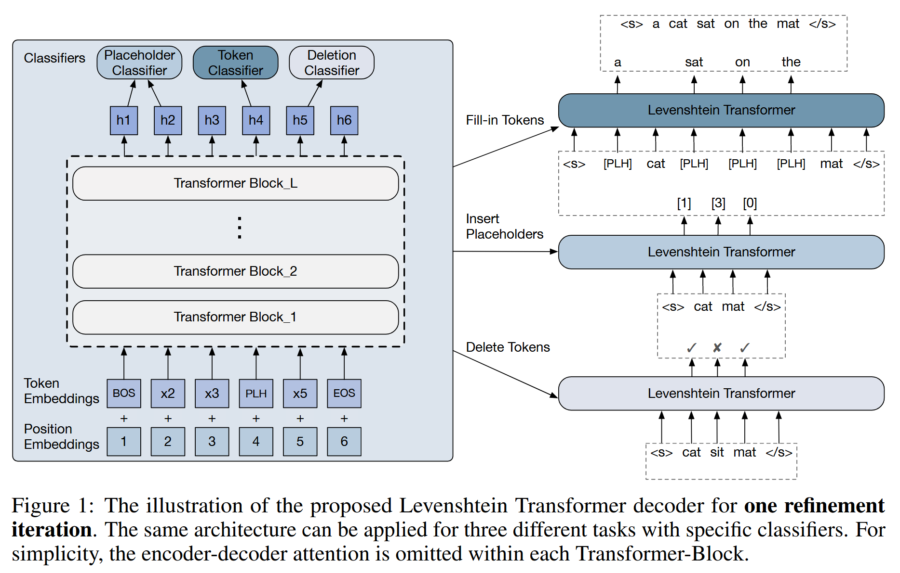
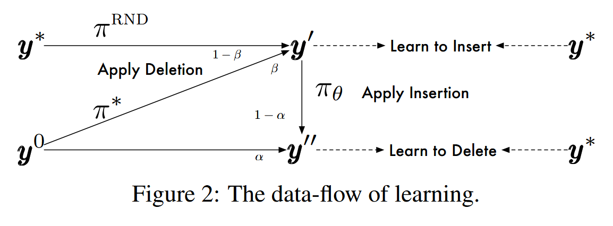
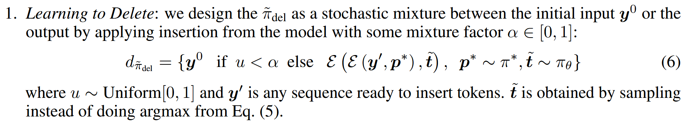
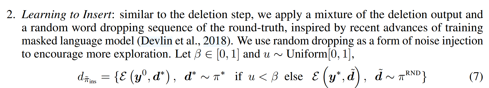

# Levenshtein Transformer
[@guLevenshteinTransformer2019]

- Purpose
  - Replace the standardized decoding mechanism with two basic operations: insertion & deletion

 

## 2. Problem Formulation
### 2.1 Sequence Generation and Refinement
#### Concept) Markov Decision Process (MDP)
- Def.)
  - MDP is defined by a tuple $`(\mathcal{Y, A, E, R}, \boldsymbol{y_0})`$
    - where
      - $`\mathcal{Y = V}^{N_{\max}}`$ : a set of discrete sequences
        - where
          - $`\mathcal{V}`$ : a vocabulary of symbols
          - $`N_{\max}`$ : the length of the sequence
        - Then, 
          - $`\boldsymbol{y}\in\mathcal{Y}`$ : the generation.
          - $`\boldsymbol{y_0}\in\mathcal{Y}`$ : the initial sequence that the [agent](#concept-agent-policy) receives. 
            - Cases)
              - $`\boldsymbol{y_0}\ne\emptyset`$ : the [agent](#concept-agent-policy) learns the **refinement** process
              - $`\boldsymbol{y_0}=\emptyset`$ : the [agent](#concept-agent-policy) learns the **generation** process
      - $`\mathcal{A}`$ : the action space
        - s.t. $`\boldsymbol{a} \in \mathcal{A}`$ is the action chosen by an [agent](#concept-agent-policy)
      - $`\mathcal{E}`$ : the environment
        - s.t. $`\mathcal{E}:\mathcal{Y\times A}\rightarrow\mathcal{Y}`$
          - Receives the agent's editing actions
          - Returns the modified sequence
        - cf.)
          - Refer to the [actions](#22-actions-deletion--insertion)
      - $`\mathcal{R}`$ : the reward function
        - where
          - $`\mathcal{R}(\boldsymbol{y}) = -\mathcal{D}(\boldsymbol{y},\boldsymbol{y}^*)`$
            - i.e.) $`\mathcal{R}`$ measures the distance between the generation $`\boldsymbol{y}`$ and the ground-truth $`\boldsymbol{y}^*`$
            - e.g.) Levenshtein Distance
        - Then, $`r\in\mathcal{R}(y)`$ is the reward given to [agent](#concept-agent-policy), when the [agent](#concept-agent-policy) takes the action given the input $`y`$

#### Concept) Agent (Policy)
- Def.)
  - The **agent** is modeled by a policy $`\pi`$ s.t.
    - $`\mathcal{\pi}:\mathcal{Y}\rightarrow P(\mathcal{A})`$
      - where $`P(\mathcal{A})`$ is the probability distribution over the action space

 

### 2.2 Actions: Deletion & Insertion
- Settings)
  - Given a subsequence $`\boldsymbol{y}^{k} = (y_1,y_2,\cdots,y_n)`$
    - where $`\begin{cases} y_1 &:= <s> \\ y_n &:= </s> \end{cases}`$
  - Two basic actions [deletion](#concept-deletion) and [insertion](#concept-insertion) are called to generate
    - $`\boldsymbol{y}^{k+1} = \mathcal{E}\left(\boldsymbol{y}^k, \boldsymbol{a}^{k+1}\right)`$

#### Concept) Deletion
- Def.)
  - Given the input sequence $`\boldsymbol{y} = (y_1,y_2,\cdots,y_n)`$
  - The **deletion** policy $`\pi^{\text{del}}`$ is defined to make a binary decision as
    - $`\pi^{\text{del}}(d\mid i,\boldsymbol{y}) = \begin{cases} 1 & (\text{delete the } i \text{-th token}) \\ 0 & (\text{keep the } i \text{-th token}) \\ \end{cases},\quad \forall y_i\in\boldsymbol{y}`$
  - To avoid breaking the boundary
    - $`\pi^{\text{del}}(d\mid 0,\boldsymbol{y}) = \pi^{\text{del}}(d\mid n,\boldsymbol{y}) = 1`$
- Prop.)
  - Can be seen as a fine-grained discriminator used in GAN

#### Concept) Insertion
- Desc.)
  - Involves two phases:
    - [Placeholder prediction](#concept-placeholder-prediction) : $`\pi^{\text{plh}}`$
    - [Token prediction](#concept-token-prediction) : $`\pi^{\text{tok}}`$

#### Concept) Placeholder Prediction
- Def.)
  - Among all the possible inserted slots $`(y_i, y_{i+1})`$ in $`\boldsymbol{y}`$
  - $`\pi^{\text{plh}}(p\mid i,\boldsymbol{y})`$ predicts the possibility of adding one or several placeholders

#### Concept) Token Prediction
- Def.)
  - $`\pi^{\text{tok}}(t\mid i,\boldsymbol{y})`$ replaces the placeholders with actual tokens in the vocabulary $`\mathcal{V}`$

 

#### Concept) Policy Combination
- Desc.)
  - [Deletion](#concept-deletion) and [insertion](#concept-insertion) are complementary.
  - In case of generating fro the empty, the [insertion](#concept-insertion) is first called.
  - One iteration is composed of
    - Delete tokens
    - Insert placeholders
    - Replace placeholders with new token
  - Within each stage, all operations are preformed in parallel.
- Def.)
  - Given the current sequence $`\boldsymbol{y} = (y_0, \cdots, y_n)`$, 
  - the policy for one iteration is
    - $`\displaystyle \pi(\boldsymbol{a\mid y}) = \prod_{d_i\in\boldsymbol{d}} \pi^{\text{del}}(d_i\mid i,\boldsymbol{y}) \cdot \prod_{p_i\in\boldsymbol{p}} \pi^{\text{plh}}(p_i\mid i,\boldsymbol{y}') \cdot \prod_{t_i\in\boldsymbol{t}} \pi^{\text{tok}}(t_i\mid i,\boldsymbol{y}'')`$
      - where
        - $`\boldsymbol{a} = \left\{ \underbrace{d_0, \cdots, d_n}_{\boldsymbol{d}};\; \underbrace{p_0, \cdots, p_{n-1}}_{\boldsymbol{p}};\; \underbrace{t_0^1, \cdots, t_0^{p_0}, \cdots, t_{n-1}^{p_{n-1}}}_{\boldsymbol{t}} \right\}`$ : the action
        - $`\boldsymbol{y}' = \mathcal{E}(\boldsymbol{y,d})`$
        - $`\boldsymbol{y}'' = \mathcal{E}(\boldsymbol{y',p})`$

  

## 3. Levenshtein Transformer
### 3.1 Model
- Use the Transformer as the basic building block.   
  
  - For the $`l`$-th block
    - $`\boldsymbol{h}_0^{(l+1)}, \boldsymbol{h}_1^{(l+1)}, \cdots, \boldsymbol{h}_n^{(l+1)} = \begin{cases} (E_{y_0}+P_0), (E_{y_1}+P_1), \cdots, (E_{y_n}+P_n) & l=0 \\ \text{TransformerBlock}_l \left(\boldsymbol{h}_0^{(l)}, \boldsymbol{h}_1^{(l)}, \cdots, \boldsymbol{h}_n^{(l)}\right) & l\gt0 \end{cases}`$
      - where
        - $`E\in\mathbb{R}^{\vert\mathcal{V}\vert\times d_{\text{model}}}`$ : the token embedding
        - $`P\in\mathbb{R}^{N_{\max}\times d_{\text{model}}}`$ : the position embedding

 

#### Concept) Policy Classifiers
- Desc.)
  - Decoder outputs $`\left(\boldsymbol{h}_0^{(l+1)}, \boldsymbol{h}_1^{(l+1)}, \cdots, \boldsymbol{h}_n^{(l+1)}\right)`$ are passed to three policy classifiers:
    - [Deletion Classifier](#concept-deletion-classifier)
    - [Placeholder Classifier](#concept-placeholder-classifier)
    - [Token Classifier](#concept-token-classifier)
- Props.)
  - Weight sharing.
    - Benefit features learned from other operations.
    - Training separate decoders is also possible, which increase the capacity of the model while does not affect the overall inference time.
  - Early exit
    - Attach the classifier to an intermediate block instead of the last one.
    - Apply to $`\pi^{\text{del}}`$ and $`\pi^{\text{plh}}`$ to reduce computation.
    - Keeping $`\pi^{\text{tok}}`$ at the last block, to enhance the performance
      - Why?) More challenging task!

#### Concept) Deletion Classifier
- Def.)
  - $`\pi_\theta^{\text{del}}(d\mid i,\boldsymbol{y}) = \text{Softmax}(\boldsymbol{h}_i \cdot A^\top)`$
    - where
      - $`i=1,\cdots,n-1`$
      - $`A\in\mathbb{R}^{2\times d_{\text{model}}}`$
- Desc.)
  - Scan over the input tokens $`y_i`$ and predict deleted (0) or kept (1)

#### Concept) Placeholder Classifier
- Def.)
  - $`\pi_\theta^{\text{plh}}(p\mid i,\boldsymbol{y}) = \text{Softmax}(\text{Concat}(\boldsymbol{h}_i, \boldsymbol{h}_{i+1}) \cdot B^\top)`$
    - where
      - $`i=1,\cdots,n-1`$
      - $`B\in\mathbb{R}^{(K_{\max}+1) \times (2d_{\text{model}})}`$
- Desc.)
  - Predicts the number of tokens to be inserted at every consecutive position pairs
  - Placeholder is represented by a special token $`<PLH>`$ reserved in the vocabulary $`\mathcal{V}`$

#### Concept) Token Classifier
- Def.)
  - $`\pi_\theta^{\text{tok}}(t\mid i,\boldsymbol{y}) = \text{Softmax}(\boldsymbol{h}_i \cdot C^\top),\; \forall y_i =<PLH>`$
    - where
      - $`A\in\mathbb{R}^{\vert\mathcal{V}\vert \times d_{\text{model}}}`$
- Desc.)
  - Fill in tokens replacing all the placeholders

  

### 3.2 Dual Policy Learning
#### Concept) Imitation Learning
- Desc.)
  - Imitate the behaviors that we draw from some [expert policy](#concept-expert-policy) $`\pi^*`$
- Objective) Maximize...  
  $`\displaystyle\underbrace{\mathbb{E}_{\begin{array}{l} \boldsymbol{y}_{\text{del}}\sim d_{\tilde{\pi}_\text{del}} \\ \boldsymbol{d}^* \sim \pi^* \end{array}} \sum_{d_i^* \in \boldsymbol{d}^*} \log \pi_\theta^{\text{del}}(d_i^*\mid i,\boldsymbol{y}_{\text{del}})}_{\text{Deletion Objective}} + \underbrace{\mathbb{E}_{\begin{array}{l} \boldsymbol{y}_{\text{ins}}\sim d_{\tilde{\pi}_\text{ins}} \\ \boldsymbol{p^*,t^*} \sim \pi^* \end{array}} \left[ \sum_{p_i^* \in \boldsymbol{p}^*} \log \pi_\theta^{\text{plh}}(p_i^*\mid i,\boldsymbol{y}_{\text{ins}}) + \sum_{t_i^* \in \boldsymbol{t}^*} \log \pi_\theta^{\text{tok}}(t_i^*\mid i,\boldsymbol{y'}_{\text{ins}}) \right]}_{\text{Insertion Objective}}`$
  - where
    - $`\tilde{\pi}_{\text{del}}, \tilde{\pi}_{\text{ins}}`$ : the [roll-in policies](#concept-roll-in-policy)
    - $`\boldsymbol{y'}_{\text{ins}}`$ : the output after inserting placeholders $`\boldsymbol{p}^*`$ upon $`\boldsymbol{y}_{\text{ins}}`$

#### Concept) Roll-in Policy
- Desc.)
  - Repeatedly drawing states from their induced state distribution
  - How?)
    - First executed by the [expert policy](#concept-expert-policy) returning the suggested actions by the expert
    - Then, maximize the conditional log-likelihood over them
- Learning)   
  
  - Learning to Delete   
    
  - Learning to Insert   
    

#### Concept) Expert Policy
- Two Types)
  - Oracle
    - $`\displaystyle\boldsymbol{a}^* = \arg\min_{\boldsymbol{a}} \mathcal{D}(y^*, \mathcal{E}(\boldsymbol{y,a}))`$
      - where
        - $`\mathcal{D}`$ : the Levenshtein distance
          - i.e.) Minimum [deletion,insertion,replacement] operation between two strings
            - Integer distance between two literals.
  - Distillation
    - Use teacher model to provide expert policy
      - sequence level knowledge distillation
    - How?)
      - Train an AR teacher model using the same dataset.
      - Replace $`\boldsymbol{y}^*`$ by the beam-search result of the teacher-model, $`\boldsymbol{y}^{\text{AR}}`$

  

### 3.3 Inference
#### Concept) Greedy Decoding
- How?)
  - Apply the trained model over the initial sequence $`\boldsymbol{y}^0`$ for several iterations.
  - Then greedily pick up the actions associated with high probabilities in [Policy classifiers](#concept-policy-classifiers) : 
    - $`\pi_\theta^{\text{del}}(d\mid i,\boldsymbol{y})`$
    - $`\pi_\theta^{\text{plh}}(p\mid i,\boldsymbol{y})`$
    - $`\pi_\theta^{\text{tok}}(t\mid i,\boldsymbol{y})`$
- Prop.)
  - Using search  or noisy parallel decoding does not yield much gain in LevT.

#### Concept) Termination Condition
- Terminate when either of two conditions is fulfilled:
  - Looping
    - If two consecutive refinement iterations return the same output.
  - Timeout
    - Set a maximum number of iterations

#### Concept) Penalty for Empty Placeholder
- Purpose)
  - To prevent the shorter output.
- Def.)
  - $`\gamma\in[0,3]`$ : the penalty term
    - This is subtracted to the logits in the [placeholder classifier](#concept-placeholder-classifier) $`\pi_\theta^{\text{plh}}(p\mid i,\boldsymbol{y})`$