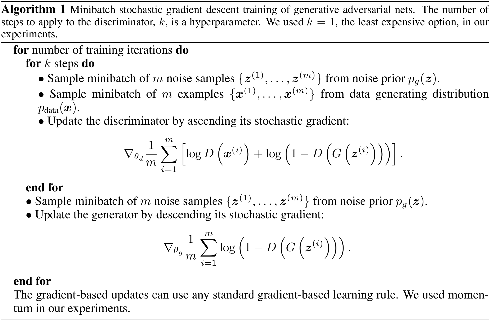
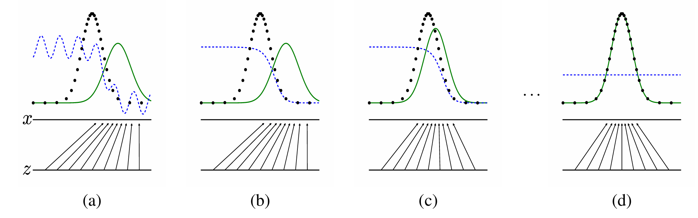
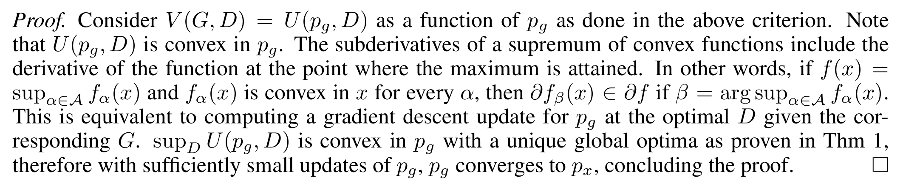

# Generative Adversarial Nets
Goodfellow et al.

## 1. Introduction
### Concept) Adversarial Nets Framework
- Desc.)
  - Two Agents
    - Generative Model
      - Goal)
        - Sample by passing random noise through multilayer perceptron
    - Discriminative Model
      - Goal)
        - Determine whether a sample is from the model distribution or the data distribution
      - Desc.)
        - This is also a multilayer perceptron.
- Prop.)
  - We can train both models using backpropagation and dropout algorithm.
  - We can sample from the generative model using only forward propagation.
  - No approximate inference or Markov chains are necessary.

 

## 3. Adversarial Nets
### Concept) Two-Player Minimax Game
- Setting)
  - Generator
    - $`G(\boldsymbol{z}; \theta_g)`$
      - Input
        - $`\boldsymbol{z}`$ : the noise 
          - where
            - $`\boldsymbol{z}\sim p_{\boldsymbol{z}}(\boldsymbol{z})`$ 
            - $`p_{\boldsymbol{z}}(\boldsymbol{z})`$ is a prior.
      - Output
        - $`p_g`$ : the generator's distribution over data $`\boldsymbol{x}`$.
      - Props.)
        - MLP with parameters $`\theta_g`$
        - Differentiable function
  - Discriminator
    - $`D(\boldsymbol{x}; \theta_d)`$ : 's mapping
      - Input
        - $`\boldsymbol{x}`$ : the data from either $`p_{\text{data}}(\boldsymbol{x})`$ or $`p_g(\boldsymbol{x})`$
      - Output
        - the probability that $`\boldsymbol{x}`$ came from $`p_{\text{data}}(\boldsymbol{x})`$
          - cf.) $`\displaystyle D^*(\boldsymbol{x}) = \frac{p_{\text{data}}(\boldsymbol{x})}{p_{\text{data}}(\boldsymbol{x}) + p_g(\boldsymbol{x})}`$
      - Props.)
        - MLP with parameters $`\theta_d`$
        - Differentiable function
- Problem Def.)
  - $`\displaystyle \min_G\max_D\; V(D,G) = \mathbb{E}_{\boldsymbol{x}\sim p_{\text{data}}(\boldsymbol{x})} \left[ \log D(\boldsymbol{x}) \right] + \mathbb{E}_{\boldsymbol{z}\sim p_{\boldsymbol{z}}(\boldsymbol{z})} \left[ \log (1 - D(G(\boldsymbol{z}))) \right]`$
    - Desc.)
      - We train...
        - $`D`$ to maximize the probability of assigning the correct label to both training examples and samples from $`G`$.
        - $`G`$ to minimize $`\log(1-D(G(\boldsymbol{z})))`$

### Algorithm 1)
- Implementation)   
  
  - Desc.)
    - One iteration
      - Optimize $`D`$ for $`k`$ times and optimize $`G`$ once.
        - Why doing this?)
          - Optimizing $`D`$ to completion would result in overfitting!
    - $`G`$'s optimization target in the early stage
      - $`\displaystyle\max_G \log D(G(\boldsymbol{z}))`$ instead of $`\displaystyle\min_G \log (1-D(G(\boldsymbol{z})))`$
        - Why?)
          - Early in learning, $`G`$ may be poor, so that $`D`$ can reject samples with high confidence.
          - Then $`\log (1-D(G(\boldsymbol{z})))`$ saturates.
            - Why?)
              - Suppose $`\boldsymbol{x}`$ is from $`G`$ and $`D`$ works well.
              - Then, $`D(G(\boldsymbol{z})) \approx 0 \Rightarrow \log (1-D(G(\boldsymbol{z}))) \approx \log(1) = 0`$
  - Learning in Steps   
    
    - Settings)
      - Blue dashed line : the discriminative distribution $`D`$
      - Black dotted line : data generating distribution $`p_{\text{data}}`$
      - Green solid line : the generative distribution $`p_g`$

  

## 4. Theoretical Results
### 4.1 Global Optimality
#### Prop. 1)
- Theorem)
  - For $`G`$ fixed, the optimal discriminator $`D^*`$ is
    - $`\displaystyle D^*_G (\boldsymbol{x}) = \frac{p_{\text{data}}(\boldsymbol{x})}{p_{\text{data}}(\boldsymbol{x}) + p_{g}(\boldsymbol{x})}`$
- pf.)
  - Recall that    
    $`\begin{aligned}
      V(G,D) &= \mathbb{E}_{\boldsymbol{x}\sim p_{\text{data}}(\boldsymbol{x})} \left[ \log D(\boldsymbol{x}) \right] + \mathbb{E}_{\boldsymbol{z}\sim p_{\boldsymbol{z}}(\boldsymbol{z})} \left[ \log (1 - D(G(\boldsymbol{z}))) \right] \\
      &= \int_x p_{\text{data}}(\boldsymbol{x}) \log D(\boldsymbol{x}) \text{d}\boldsymbol{x} \;+\; \int_z p_{\boldsymbol{z}}(\boldsymbol{z}) \log (1-D(g(\boldsymbol{z}))) \text{d} \boldsymbol{z} \\
    \end{aligned}`$ 
  - Putting $`p_g(\boldsymbol{x}) = \displaystyle\int \delta(x-G(z)) p_z(z) \text{d}z`$ for the dirac-delta distribution $`\delta(\cdot)`$, we get
    - $`\displaystyle\int_z p_{\boldsymbol{z}}(\boldsymbol{z}) \log (1-D(g(\boldsymbol{z}))) \text{d} \boldsymbol{z} = \int_x p_g(x)\log(1-D(x))\text{d}x`$
  - Thus,
    - $`V(G,D) = \displaystyle \int_x p_{\text{data}}(\boldsymbol{x}) \log D(\boldsymbol{x}) + p_g(x)\log(1-D(x)) \text{d}\boldsymbol{x}`$
  - Consider a function $`y\rightarrow a\log(y) + b\log(1-y)`$
    - Then $`\displaystyle\max_{y\in[0,1]} y = \frac{a}{a+b},\quad \forall (a,b) \in\mathbb{R}^2 \backslash \{0,0\}`$
  - Therefore,   
    $`\begin{aligned}
      D^*_G (\boldsymbol{x}) &= \arg\max_D V(G,D) \\
      &= \arg\max_D \int_x p_{\text{data}}(\boldsymbol{x}) \log D(\boldsymbol{x}) + p_g(x)\log(1-D(x)) \text{d}\boldsymbol{x} \\
      &= \frac{p_{\text{data}}(\boldsymbol{x})}{p_{\text{data}}(\boldsymbol{x}) + p_{g}(\boldsymbol{x})}
    \end{aligned}`$
- Prop.)
  - The training objective for $`D`$ can be interpreted as maximizing the log-likelihood for estimating the conditional probability $`P(Y=y\mid x)`$
    - where $`Y = \begin{cases}
      1 & \text{if } x \text{ comes from } p_{\text{data}} \\ 
      0 & \text{if } x \text{ comes from } p_{g}
    \end{cases}`$   
  - The problem goes   
    $`\begin{aligned}
      \max_D V(G,D) 
      &= \mathbb{E}_{x\sim p_{\text{data}}} [\log D^*_G(x)] + \mathbb{E}_{z\sim p_z} [\log(1- D^*_G(G(z)))] \\
      &= \mathbb{E}_{x\sim p_{\text{data}}} [\log D^*_G(x)] + \mathbb{E}_{x\sim p_g} [\log(1- D^*_G(x))] \\
      &= \mathbb{E}_{x\sim p_{\text{data}}} \left[\log\frac{p_{\text{data}}(\boldsymbol{x})}{p_{\text{data}}(\boldsymbol{x}) + p_{g}(\boldsymbol{x})}\right] + \mathbb{E}_{x\sim p_g} \left[\log\frac{p_{g}(\boldsymbol{x})}{p_{\text{data}}(\boldsymbol{x}) + p_{g}(\boldsymbol{x})}\right] \\
    \end{aligned}`$

 

#### Theorem 1)
- Theorem)
  - The global minium of the virtual training criterion $`C(G)`$ is achieved iff. $`p_g = p_{\text{data}}`$. 
    - where 
      - $`C(G) = V(D^*_G, G)`$
      - $`\displaystyle D^*_G (\boldsymbol{x}) = \frac{p_{\text{data}}(\boldsymbol{x})}{p_{\text{data}}(\boldsymbol{x}) + p_{g}(\boldsymbol{x})}`$
  - At that point $`C(G)`$ achieves the value $`-\log4`$.
- pf.)
  - By Definition,   
    $`\begin{aligned}
      C(G) = V(D^*_G, G) 
      &= \mathbb{E}_{x\sim p_{\text{data}}} \left[\log\frac{p_{\text{data}}(\boldsymbol{x})}{p_{\text{data}}(\boldsymbol{x}) + p_{g}(\boldsymbol{x})}\right] + \mathbb{E}_{x\sim p_g} \left[\log\frac{p_{g}(\boldsymbol{x})}{p_{\text{data}}(\boldsymbol{x}) + p_{g}(\boldsymbol{x})}\right] \\
      &= \mathbb{E}_{x\sim p_{\text{data}}} \left[\log\left( \frac{1}{2}\cdot \frac{p_{\text{data}}(\boldsymbol{x})}{\frac{p_{\text{data}}(\boldsymbol{x}) + p_{g}(\boldsymbol{x})}{2}} \right)\right] + \mathbb{E}_{x\sim p_g} \left[ \log\left( \frac{1}{2}\cdot \frac{p_{g}(\boldsymbol{x})}{\frac{p_{\text{data}}(\boldsymbol{x}) + p_{g}(\boldsymbol{x})}{2}} \right)\right] \\
      &= -\log4 + D_{KL}\left(p_{\text{data}} \left\Vert\frac{p_{\text{data}}+p_g}{2} \right. \right) + D_{KL}\left(p_g \left\Vert\frac{p_{\text{data}}+p_g}{2} \right. \right) \\
      &= -\log4 + 2\cdot JSD(p_{\text{data}} \Vert p_{g})
    \end{aligned}`$
  - The optimal case will be
    - $`p_g = p_{\text{data}} \Rightarrow D^*_G(x) = 0.5`$.
  - Thus,   
    $`\begin{aligned}
      C(G) = \max_D V(G,D^*_G)  &= \mathbb{E}_{x\sim p_{\text{data}}} [\log D^*_G(x)] + \mathbb{E}_{x\sim p_g} [\log(1- D^*_G(x))] \\
      &= \mathbb{E}_{x\sim p_{\text{data}}} [\log 0.5] + \mathbb{E}_{x\sim p_g} [\log 0.5] \\
      &= -\log4 \\
    \end{aligned}`$

 

### 4.2 Convergence of Algorithm 1
#### Prop 2)
- Theorem)
  - If $`G`$ and $`D`$ have enough capacity, and at each step of [Algorithm 1](#algorithm-1), the discriminator is allowed to reach its optimum given $`G`$, and $`p_g`$ is updated so as to improve the criterion
    - $`\mathbb{E}_{x\sim p_{\text{data}}} [\log D^*_G(x)] + \mathbb{E}_{x\sim p_g} [\log(1- D^*_G(x))]`$
  - then, $`p_g`$ converges to $`p_{\text{data}}`$
- pf.)   
  

 

### Practical Props.)
- [Adversarial nets](#3-adversarial-nets) represent a limited family of $`p_g`$ distributions via the function $`G(z;\theta_g)`$
- Optimize $`\theta_g`$ rather than $`p_g`$ itself.