# A **Style**-Based Generator Architecture for
# **G**enerative **A**dversarial **N**etworks (**StyleGAN**)
Karras et al. 2019

     

Reviewed & Presented by Joon Hyeok Kim

---

# Contents
1. What StyleGAN achieved
2. How did StyleGAN do that
3. Pros, cons, and updates of StyleGAN

---

# 1. What StyleGAN achieved

**StyleGAN** improved **disentanglement** by mapping **latent codes** to an intermediate space and controlling them as **styles** at different layers.

 

### Step by step
#### 1-1 Latent Code
#### 1-2 Disentanglement

---

## 1-1 . Latent Variable (Latent Code)

  

- What is the latent variable $z$?
  - hidden
  - believed to influence a set of observable outcomes
  - what we want to learn in VAE

  

- Did GAN consider latent variables?

  

  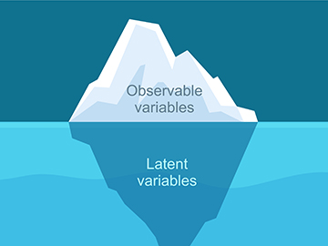
  
 
  
  

---

  

# GAN (Goodfellow et al., 2014)
- GAN simply utilized **latent code** $z\sim \mathcal{N}(0,\mathbf{I})$
  - Corresponds to VAE's Gaussian prior of $p(z)$
- No meaningful semantics in $z$
- An arbitrary $z'$ generates an image $G(z')$

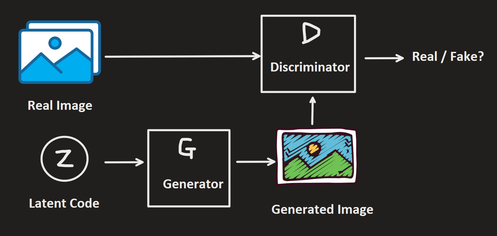

  

  
  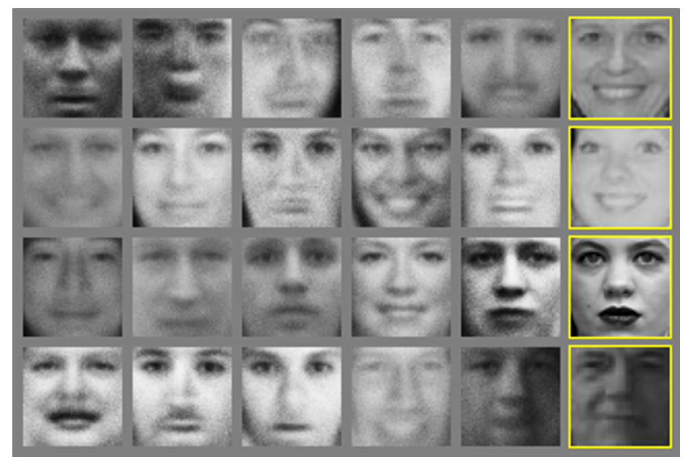
  
 
  
  

---

# Info GAN (Chen et al., 2016)
- Info GAN decomposed latent code into **noise($z$)** and **latent code ($c$)** using information theoretic approach.

 

$\displaystyle \min_G \max_D V_I(D,G) = \underbrace{V(D, G)}_{\text{GAN original}} - \lambda \underbrace{I(c;G(z,c))}_{\text{Mutual Info.}} \; = \; \min_{G,Q} \max_D V(D,G) -\lambda L_1(G,Q)$

 

  

  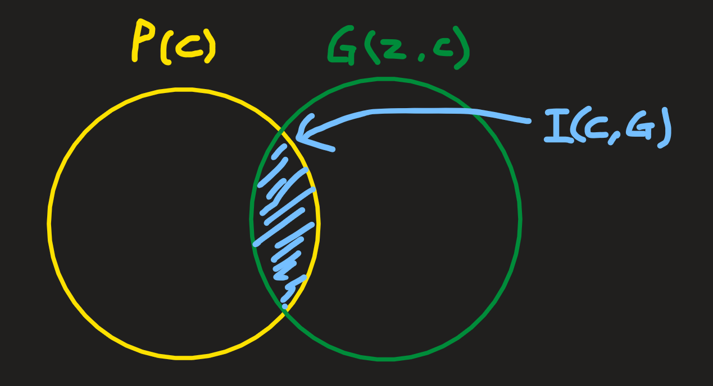
  

  

  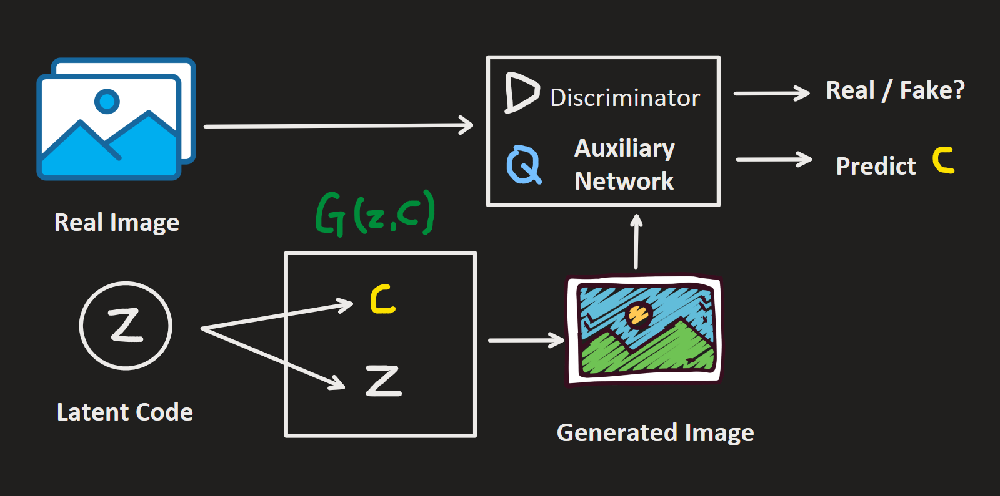
  

---
### Info GAN (Chen et al., 2016)
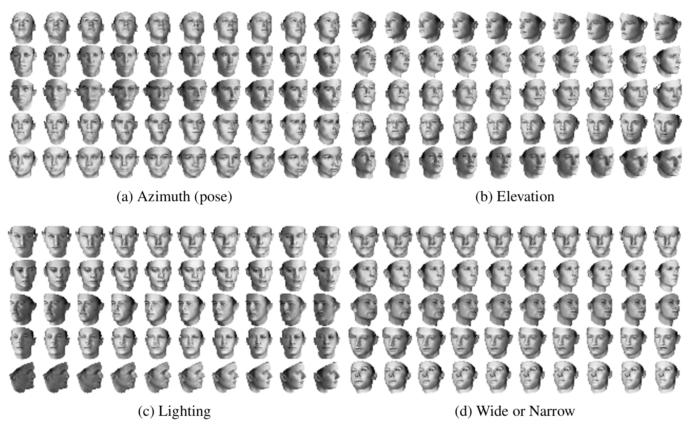

---

## 1-2 Disentanglement
Def.) different latent dimensions (or factors) control independent, semantically meaningful aspects of the generated data.

|E.g. gender entangled with age |Graphical Description|
|:-:|:-:|
|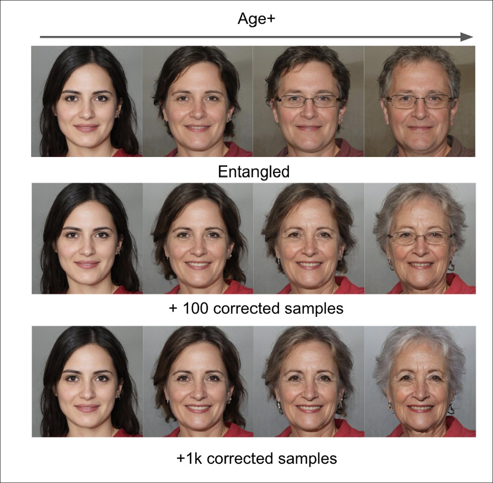|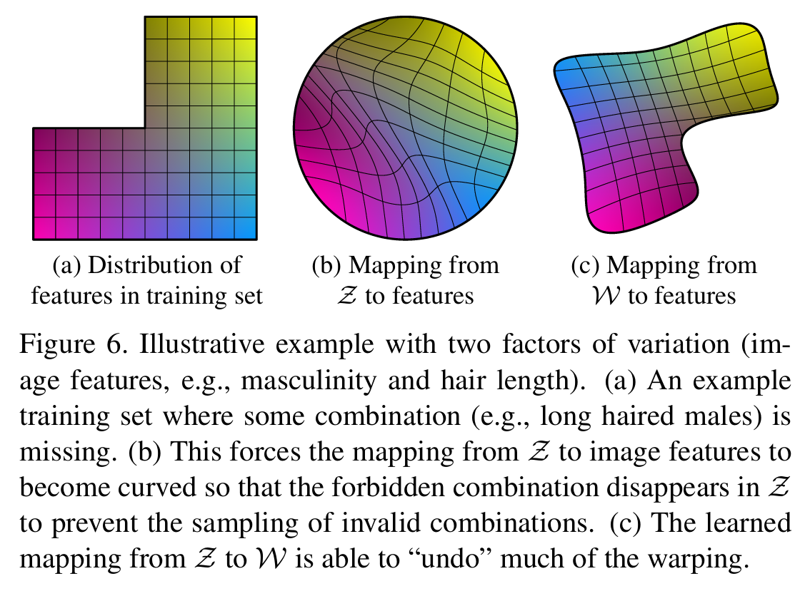|

https://blog.metaphysic.ai/better-gan-disentanglement-could-facilitate-better-synthetic-data/

---
# StyleGAN (Karras et al., 2019)

  

  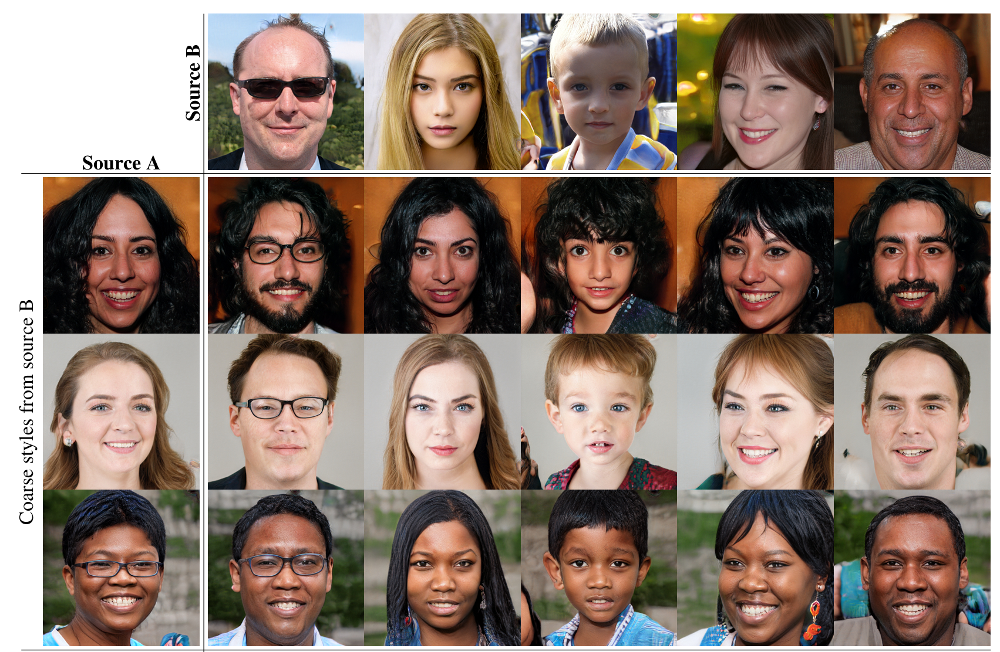
  

  

  |GAN (2014)|
  |:-:|
  ||
  |InfoGAN (2016)|
  |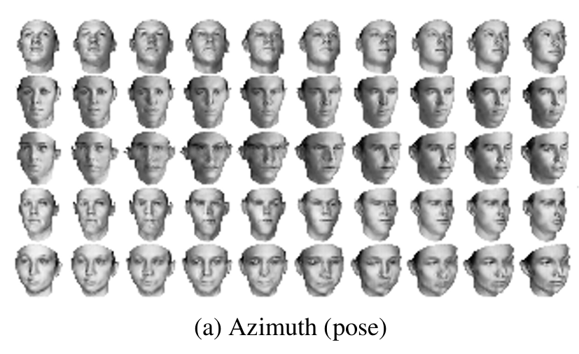|

  

---

# 2. How did StyleGAN do that

  

  - StyleGAN Original   
    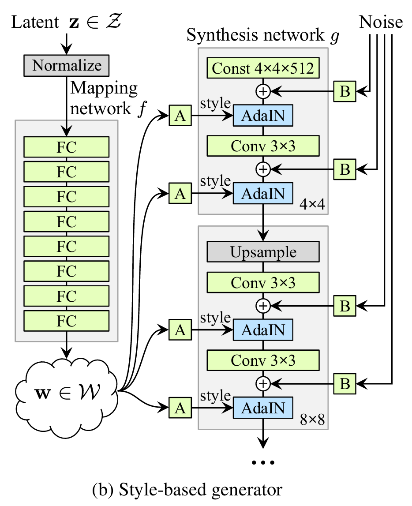
  

  

  - StyleGAN Simplified   
    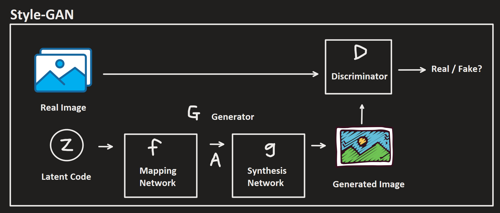
  - GAN   
    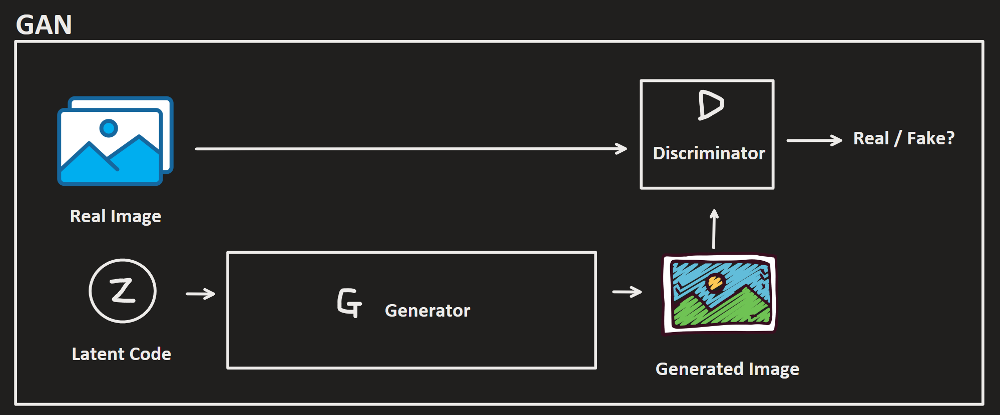

  

---
### StyleGAN (Karras et al., 2019)
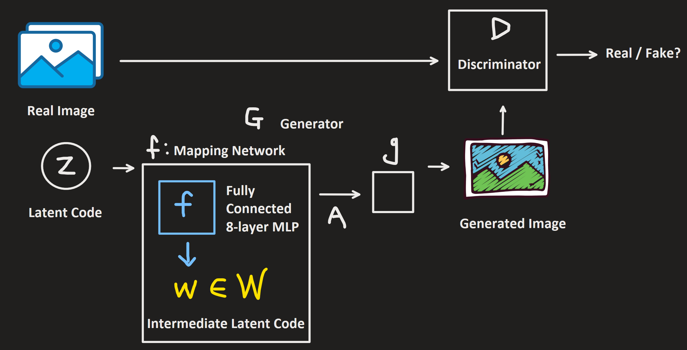

$\mathbf{z}\in\mathcal{Z},\quad \mathbf{w}\in\mathcal{W},\quad \mathcal{Z,W}\subseteq\mathbb{R}^{512}$

---
### StyleGAN (Karras et al., 2019)
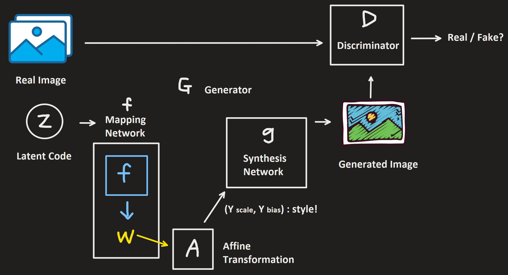

$A_{\ell} : \mathcal{W}\rightarrow \mathcal{Y}_\ell,\quad A_{\ell}(\mathbf{w}) = \{(\mathbf{y}_{s,i,\ell}, \mathbf{y}_{s,i,\ell})\}_{i=1}^{C_\ell},\quad C_\ell$ is the # of channel in layer $\ell$

---

## Synthetic Network (g) : AdaIN (Adaptive Instance Normalization)

  

$\text{AdaIN}(\mathbf{x}_i, \mathbf{y}) = \displaystyle\mathbf{y}_{s,i}\,\frac{\mathbf{x}_i - \mu(\mathbf{x}_i)}{\sigma(\mathbf{x}_i)} + \mathbf{y}_{b,i}$
where $\mathbf{x}_i$ is the $i$-th channel (feature map) of the activation $\mathbf{x}$

#### Desc.
- AdaIN is a concept from style transfer.
- The normalization $\left(\displaystyle\frac{\mathbf{x}_i - \mu(\mathbf{x}_i)}{\sigma(\mathbf{x}_i)}\right)$ removes the original style, leaving only the content.
- The scale $\mathbf{y}_{s,i}$ and bias $\mathbf{y}_{b,i}$ reintroduce a new style.

  

  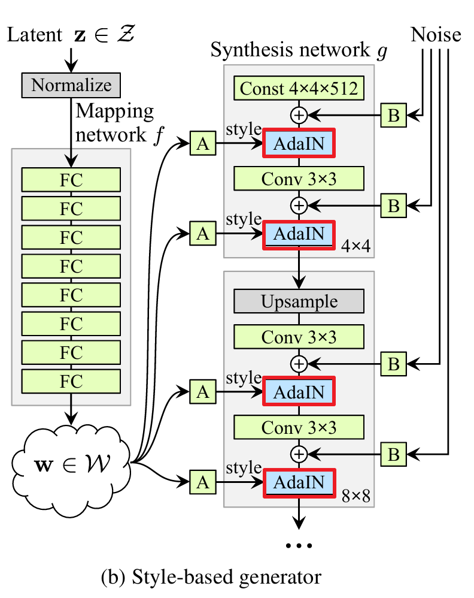
  
 
  
  

---

## Synthetic Network (g) : Progressive Growing

  

#### Def.)
Gradually growing the resolution of layers (upsampling)
- $(8\times8)\rightarrow(16\times16)\rightarrow\cdots\rightarrow(1024\times1024)$

#### Purpose
It stabilizes generating high-resolution 1024×1024 photo realistic image

\
\
\
\
\
\
\
\
\

  

  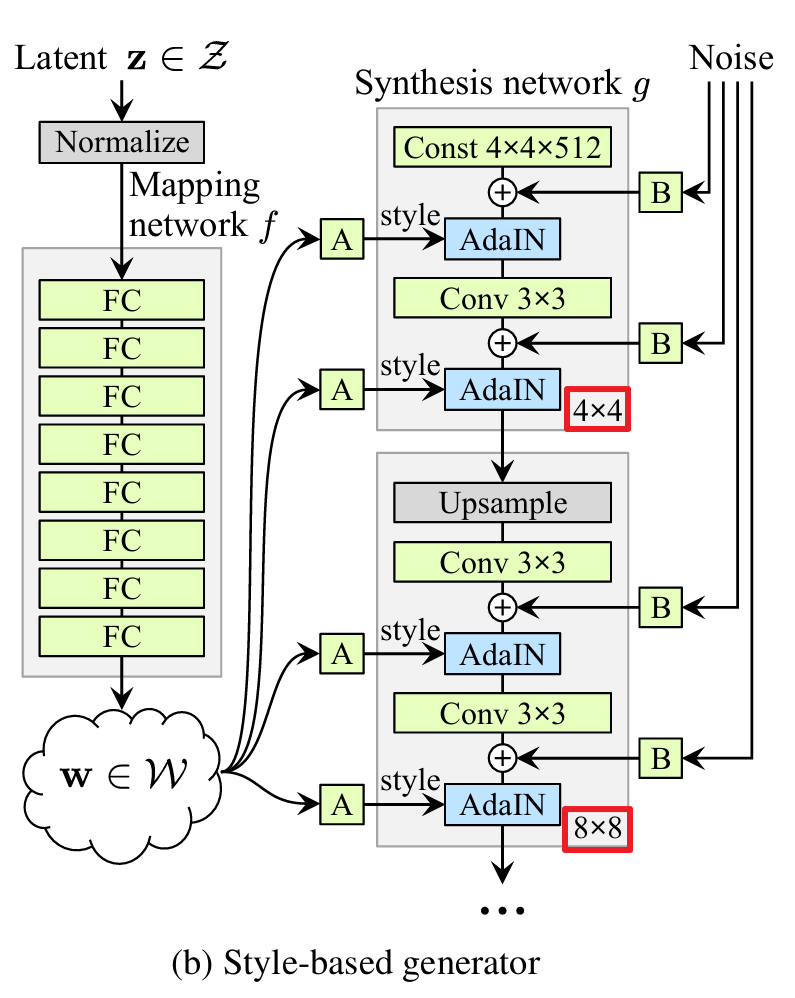
  
 
  
  

---

## Experiment : Style Mix

  

1. Start with two latent codes $\mathbf{z}_A, \mathbf{z}_B$
1. Input $\mathbf{z}_A, \mathbf{z}_B$ into the generator.   
   - e.g.)     
     $\begin{aligned}
      \mathbf{z}_A &\rightarrow \mathbf{w}_A = f(\mathbf{z}_A) \\
      &\rightarrow (\mathbf{y}_{s}, \mathbf{y}_{b})_A = A(\mathbf{w}_A) \\
      &\rightarrow \text{AdaIN}(\mathbf{x}, \mathbf{y}_A) \\
      &\rightarrow \cdots \rightarrow \text{Image A}
     \end{aligned}$
1. Mix $\mathbf{w}_A$ and $\mathbf{w}_B$
   - Coarse Mix : $\mathbf{w}_B$ from low resolution
   - Fine Mix : $\mathbf{w}_B$ only at high resolution

  

  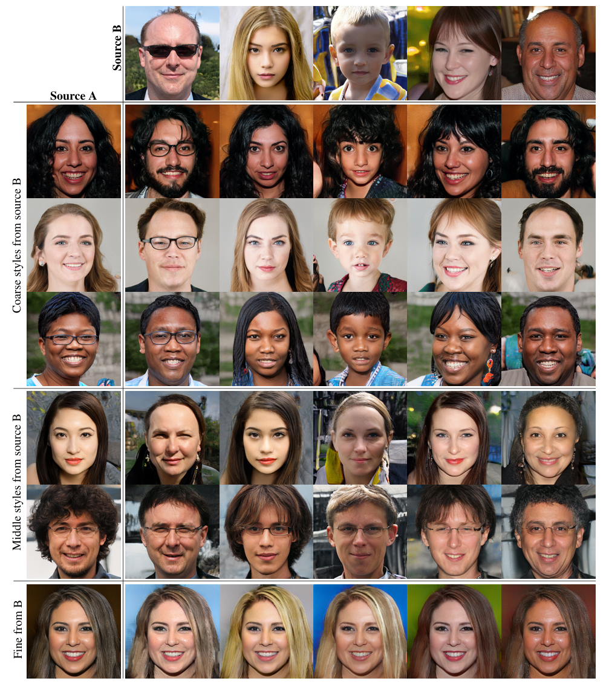
  
 
  
  

---

## Synthetic Network (g) : Noise (Stochastic Variation)

  

### Def.)
$B_\ell$ : the noise input to the $\ell$-th AdaIN layer

### Desc.)
- Single-channel images consisting of uncorrelated Gaussian noise
- Added independently to each pixel $\Rightarrow$ Local Effect!
  - cf.) Styles were complete feature maps scaled and biased with the same values $\Rightarrow$ Global Effect!
- e.g.) placement of hairs, stubble, freckles, etc

\
\
\

  

  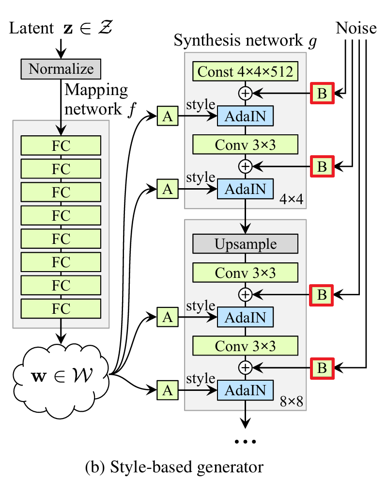
  
 
  
  

---

## Experiment : Noise Strength Control

<a href="https://youtu.be/kSLJriaOumA?si=Safkb4n0WQb0NWrH&t=131">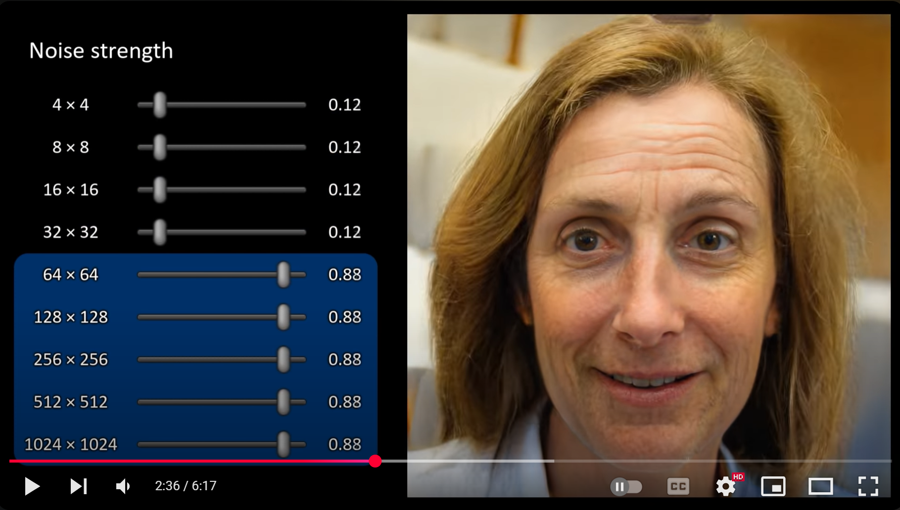</a>

---

# Pros, cons, and updates on StyleGAN
### Advantage) StyleGAN...
- disentangled latent control (styles)
- enabled style mixing and stochastic variation
- improved interpretability of the latent dimension
  - e.g.) hair style, skin color, gender, age, etc
- achieved high quality image synthesis (ProGAN)

---

### Disadvantage) StyleGAN...
- is unconditional, so does not support conditional image synthesis.
  - e.g.) "Generate a photo of a cat dancing" $\cdots (X)$
- fails on multi-class datasets (cf. BigGAN on ImageNet)   
  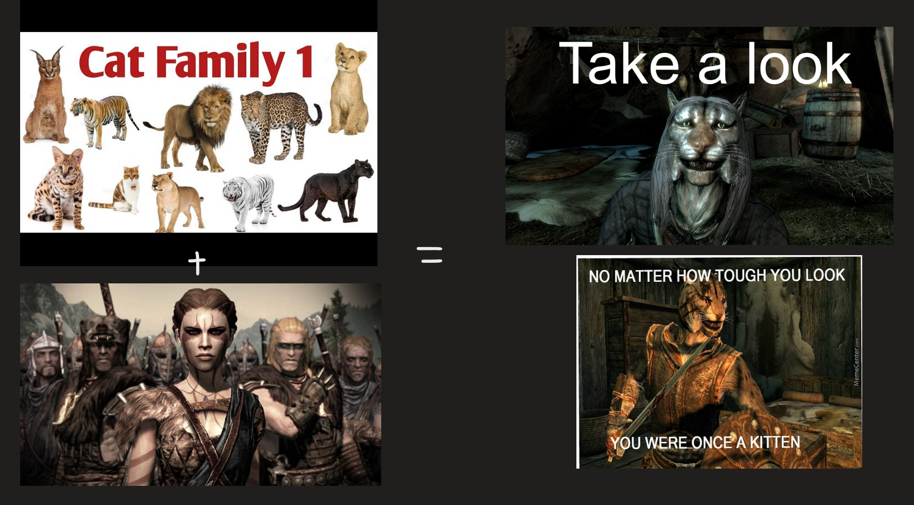

---

### Disadvantage) StyleGAN...
- has progressive growing checkerboard, droplet artifacts    
  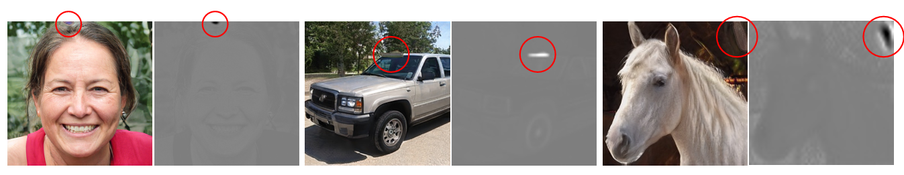
  - Solved in Style GAN 2 (Karras et al., 2020) by discarding AdaIN and Progressive Growing (...)
  - Instead it...
    - replaced AdaIN with Weight Demodulation
    - performed full-resolution training from the start 

---

### Disadvantage) StyleGAN...
- is very computationally expensive at high resolution and needs multi-GPU training   

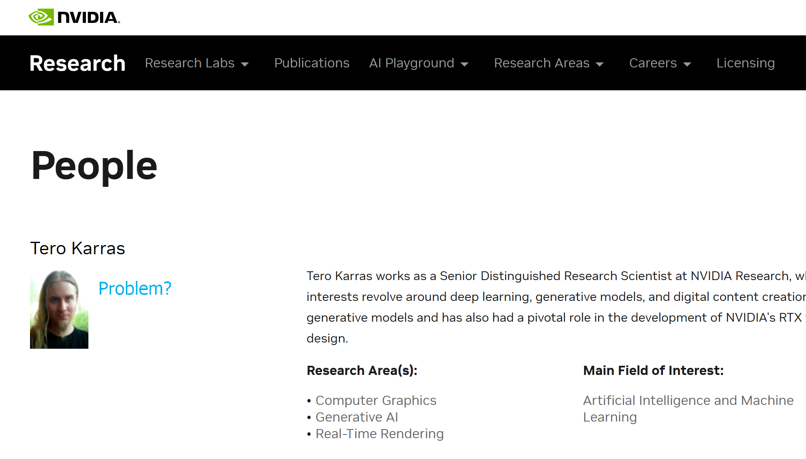

---

# Questions

     

Thank you