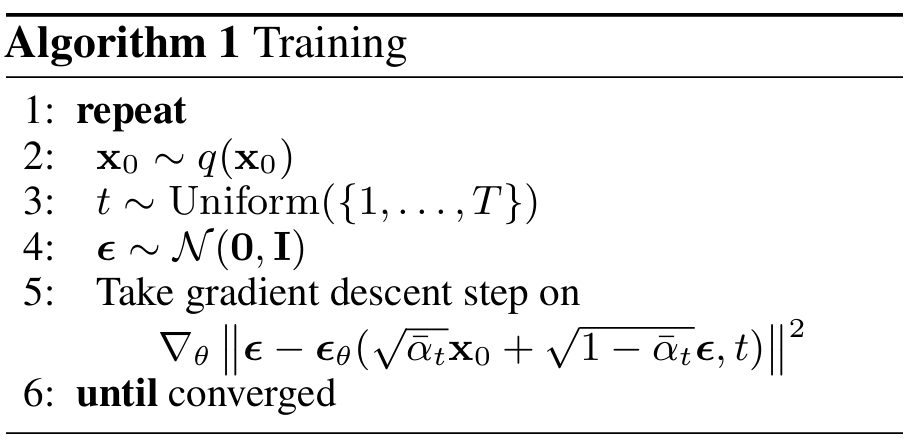
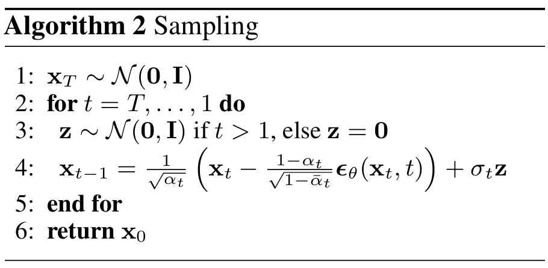

# Denoising Diffusion Probabilistic Models
Ho et al. 2020

## 2. Background
### Concept) Diffusion Model
- First introduced in...
  - Sohl-Dickstein et al. 2015, *Deep unsupervised learning using nonequilibrium thermodynamics.*
- Goal)
  - Learn the [forward](#concept-forward-process) and [reverse](#concept-reverse-process) process.
  - Generate data using the reverse process

#### Concept) Forward Process
- Goal)
  - Gradually destroy the original data $`x_0`$ until it becomes pure noise.
- Def.)
  - A **fixed** Markov chain that gradually adds Gaussian noise to data as
    - $`q(\mathbf{x}_t\mid \mathbf{x}_{t-1}) = \displaystyle\mathcal{N}\left(\mathbf{x}_t; \sqrt{1-\beta_t} \mathbf{x}_{t-1}, \beta_t I \right)`$
      - where $`\beta_t\in\mathbb{R}`$ is a scalar variance schedule parameter for step $`t`$
- Props.)
  - **No learnable** parameters
  - As $`t\to T`$, the sample $`x_t \rightarrow \mathbf{x}_T\sim\mathcal{N}(0,I)`$ : the pure noise!
  - $`\mathbf{x}_t = \displaystyle\sqrt{\bar{\alpha}_t} \mathbf{x}_0 + \sqrt{1-\bar{\alpha}_t} \epsilon`$
    - where 
      - $`\alpha_t = 1-\beta_t`$
      - $`\bar{\alpha}_t = \displaystyle\prod_{s=1}^t \alpha_s`$
      - $`\epsilon\sim\mathcal{N}(0,I)`$ : the Gaussian noise added to corrupt $`\mathbf{x}_0`$ into $`\mathbf{x}_t`$

#### Concept) Reverse Process
- Goal)
  - Recover data from noise made by the [forward process](#concept-forward-process)
  - We may generate synthetic data using this.
    - cf.) Recall inputting latent code $`\mathbf{z}`$ in [GAN](../../250908_style_gan/paper_note_gan.md)
- Def.)
  - A parameterized Markov chain that aims to invert the forward process and recover data from noise as
    - $`p_\theta(\mathbf{x}_{t-1}\mid \mathbf{x}_t) = \mathcal{N}(\mathbf{x}_{t-1}; \mu_\theta(\mathbf{x}_t, t), \Sigma_\theta(\mathbf{x}_t, t))`$
- Props.)
  - $`\theta`$ : the learnable parameters
  - Learned via minimizing a denoising objective:
    - $`\mathbb{E}_{\mathbf{x}_0,\epsilon,t} \left[ \Vert \epsilon - \epsilon_\theta(\mathbf{x}_t, t) \Vert^2 \right]`$
      - Why?)
        - Recall from [forward process](#concept-forward-process) that 
          - $`\mathbf{x}_t = \displaystyle\sqrt{\bar{\alpha}_t} \mathbf{x}_0 + \sqrt{1-\bar{\alpha}_t} \epsilon`$ 
          - $`\epsilon\sim\mathcal{N}(0,I)`$
        - Since $`\mathbf{x}_t`$ is literally a mixture of the clean data $`\mathbf{x}_0`$ and noise $`\epsilon`$, recovering $`\mathbf{x}_0`$ is equivalent to recovering $`\epsilon`$ 
          - where $`\epsilon`$ is the true Gaussian noise sampled during the [forward process](#concept-forward-process)
        - Predicting $`\epsilon`$ is easier and leads to a simpler loss function.
        - Put $`\epsilon_\theta(\mathbf{x}_t, t)`$: the model’s prediction of that noise.
  - Sampling starts from $`\mathbf{x}_T \sim \mathcal{N}(0,I)`$ and progressively denoises until $x_0$.

 

#### Model) Diffusion Model
- $`p_\theta(\mathbf{x}_0) := \displaystyle\int p_\theta(\mathbf{x}_{0:T}) \text{d} \mathbf{x}_{1:T}`$ : the latent variable model
  - where
    - $`\mathbf{x}_0`$ : the data sample (e.g. pixel vector) s.t. $`\mathbf{x}_0\sim q(\mathbf{x}_0)`$
      - where $`q`$ is the ground truth distribution that data is generated from.
    - $`p_\theta(\mathbf{x}_0)`$ : the learned distribution
      - cf.) We want $`p_\theta(x_0) \approx q(x_0)`$
    - $`\mathbf{x}_1,\cdots,\mathbf{x}_T`$ : the latents of the same dimensionality as the data $`\mathbf{x}_0`$
    - $`p_\theta(\mathbf{x}_{0:T}) := p(\mathbf{x}_T)\displaystyle\prod_{t=1}^T p_\theta(\mathbf{x}_{t-1}\mid\mathbf{x}_t)`$ : the [reverse process](#concept-reverse-process)
      - i.e.) the joint distribution defined as a Markov chain with learned Gaussian transitions starting at $`p(\mathbf{x}_T) = \mathcal{N}(\mathbf{x}_T; \mathbf{0, I})`$ : purely Gaussian so does not depend on $`\theta`$
      - Desc.)
        - Diffusion models generate data $`\mathbf{x}_0`$ using the reverse Markov chain as   
          $`\begin{aligned}
              & x_T \sim \mathcal{N}(0,I) & \text{(pure Gaussian noise)} \\
              \rightarrow& x_{T-1} \sim p_\theta(x_{T-1}\mid x_T) \\
              \rightarrow& \cdots \\
              \rightarrow& x_0 \sim p_\theta(x_0 \mid x_1) \\
          \end{aligned}`$
      - $`p_\theta(\mathbf{x}_{t-1}\mid\mathbf{x}_t) := \mathcal{N}(\mathbf{x}_{t-1}; \mu_\theta(\mathbf{x}_t, t), \Sigma_\theta(\mathbf{x}_t, t))`$
- $`q(\mathbf{x}_{1:T}\mid\mathbf{x}_0) := \displaystyle\prod_{t=1}^T q(\mathbf{x}_t\mid \mathbf{x}_{t-1})`$ : the [forward process](#concept-forward-process) (diffusion process)   
  - where
    - $`q(\mathbf{x}_t\mid \mathbf{x}_{t-1}) := \displaystyle\mathcal{N}(\mathbf{x}_t; \sqrt{1-\beta_t} \mathbf{x}_{t-1}, \beta_t \mathbf{I})`$
- Loss Function)
  - What we want is $`\log p_\theta(\mathbf{x}_0)`$.
  - However, this is intractable due to the integral : $`p_\theta(\mathbf{x}_0) := \displaystyle\int p_\theta(\mathbf{x}_{0:T}) \text{d} \mathbf{x}_{1:T}`$
  - Instead, just like the [VAE](../../250917_vae/paper_note.md), we may get the lower bound using the variational distribution as   
    $`\begin{aligned}
        \log p_\theta(\mathbf{x}{0})
        &= \log \int q(\mathbf{x}_{1:T}\mid \mathbf{x}_0) \frac{p_\theta(\mathbf{x}_{0:T})}{q(\mathbf{x}_{1:T}\mid \mathbf{x}_0)} \text{d}\mathbf{x}_{1:T} \\
        &\ge \mathbb{E}_{q(\mathbf{x}_{1:T}\mid \mathbf{x}_0)} \left[ \log\frac{p_\theta(\mathbf{x}_{0:T})}{q(\mathbf{x}_{1:T}\mid \mathbf{x}_0)} \right] & \because (\text{Jensen Inequality})
    \end{aligned}`$
  - Taking the negative, we may get the loss function as   
    $`\begin{aligned}
        \mathcal{L} &= \mathbb{E}_q \left[ -\log\frac{p_\theta(\mathbf{x}_{0:T})}{q(\mathbf{x}_{1:T}\mid \mathbf{x}_0)} \right] \\
        &= \mathbb{E}_q \left[ -\log\frac{p(\mathbf{x}_T)\displaystyle\prod_{t=1}^T p_\theta(\mathbf{x}_{t-1}\mid\mathbf{x}_t)}{\displaystyle\prod_{t=1}^T q(\mathbf{x}_t\mid \mathbf{x}_{t-1})} \right] \\
        &= \mathbb{E}_q \left[ -\log p(\mathbf{x}_T) -\sum_{t=1}^T \log\frac{p_\theta(\mathbf{x}_{t-1}\mid\mathbf{x}_t)}{q(\mathbf{x}_t\mid \mathbf{x}_{t-1})} \right] &\ge \mathbb{E}_q \left[ -\log p_\theta(\mathbf{x}{0}) \right] \\
    \end{aligned}`$
  - Using the prop. from the [forward process](#concept-forward-process) that $`\mathbf{x}_t \mid \mathbf{x}_0 = \displaystyle\sqrt{\bar{\alpha}_t} \mathbf{x}_0 + \sqrt{1-\bar{\alpha}_t} \epsilon`$, we have   
    - $`q(\mathbf{x}_t\mid \mathbf{x}_0) =\mathcal{N}\left( \mathbf{x}_t; \sqrt{\bar{\alpha}_t} \mathbf{x}_0, (1-\bar{\alpha}_t)\mathbf{I} \right)`$
  - Using the KL-Divergence, we may rewrite $`\mathcal{L}`$ as
    - $`\displaystyle\mathcal{L} = \mathbb{E}_q \left[ \underbrace{D_{\text{KL}}(q(\mathbf{x}_T\mid\mathbf{x}_0) \Vert p(\mathbf{x}_{T}))}_{L_T} + \sum_{t\gt1} \underbrace{D_{\text{KL}}(q(\mathbf{x}_{t-1} \mid \mathbf{x}_t, \mathbf{x}_0) \;\Vert\; p_\theta (\mathbf{x}_{t-1} \mid \mathbf{x}_t))}_{L_{t-1}} - \underbrace{\log p_\theta(\mathbf{x}_0 \mid \mathbf{x}_1)}_{L_0} \right]`$
  - In the previous loss' $`L_{t-1}`$, we may derive
    - $`q(\mathbf{x}_{t-1} \mid \mathbf{x}_t, \mathbf{x}_0) = \mathcal{N}(\mathbf{x}_{t-1}; \tilde{\boldsymbol{\mu}}_t(\mathbf{x}_t, \mathbf{x}_0), \tilde{\beta}_t\mathbf{I})`$ : the forward process posterior
      - where
        - $`\tilde{\boldsymbol{\mu}}_t(\mathbf{x}_t, \mathbf{x}_0) := \displaystyle\frac{\sqrt{\bar{\alpha}_{t-1}}\beta_t}{1-\bar{\alpha}_t} \mathbf{x}_0 + \frac{\sqrt{\alpha_t}(1-\bar{\alpha}_{t-1})}{1-\bar{\alpha}_t}\mathbf{x}_t`$
        - $`\displaystyle \tilde{\beta}_t := \frac{1-\bar{\alpha}_{t-1}}{1-\bar{\alpha}_t} \beta_t`$
      - How?)
        - Using the Bayes Rule
    - Then, since $`q(\mathbf{x}_{t-1} \mid \mathbf{x}_t, \mathbf{x}_0)`$ and $`p_\theta (\mathbf{x}_{t-1} \mid \mathbf{x}_t)`$ are both Gaussian, we may get the closed form expression of $`L_{t-1}`$

 

## 3. Diffusion Models and denoising autoencoders
### 3.1 Forward Process and L_T
- Summary)
  - Treat the approximate posterior $`q(\mathbf{x}_{t-1} \mid \mathbf{x}_t, \mathbf{x}_0)`$ to be fixed and have no parameter.
- Desc.)
  - This paper ignores that the forward process variances $`\beta_t`$ are learnable by reparameterization.
  - Instead, it fix them to constants.
  - Thus, the approximate posterior $`q(\mathbf{x}_{t-1} \mid \mathbf{x}_t, \mathbf{x}_0)`$ has no parameter.
    - Why?) $`\alpha_t`$ is made of $`\beta_t`$

### 3.2 Reverse Process and L_{1:T-1}
- Goal)
  - Parameterize $`p_\theta(\mathbf{x}_{t-1}\mid \mathbf{x}_t) = \mathcal{N}(\mathbf{x}_{t-1}; \mu_\theta(\mathbf{x}_t, t), \Sigma_\theta(\mathbf{x}_t, t))`$
- Moments)
  - Variance Parameterization $`(\boldsymbol{\Sigma}_\theta)`$
    - Def.)
      - $`\displaystyle\boldsymbol{\Sigma}_\theta(\mathbf{x}_t, t) = \sigma_t^2 \mathbf{I}`$
    - Options)
      - $`\displaystyle \sigma_t^2 = \tilde{\beta}_t`$
        - Result)
          - Optimal for $`\mathbf{x}_0\sim\mathcal{N}(\mathbf{0, I})`$
      - $`\displaystyle \sigma_t^2 = \frac{1-\bar{\alpha}_{t-1}}{1-\bar{\alpha}_{t}}\beta_t`$
        - Result)
          - Optimal for $`\mathbf{x}_0`$ deterministically set to one point
  - Mean Parameterization $`(\mu_\theta)`$
    - $`\begin{aligned}
        \boldsymbol{\mu}_\theta(\mathbf{x}_t, t) 
        &= \tilde{\boldsymbol{\mu}}_t \left( \mathbf{x}_t, \; \frac{1}{\sqrt{\bar{\alpha}_t}} (\mathbf{x}_t - \sqrt{1-\bar{\alpha}_t} \boldsymbol{\epsilon}_\theta(\mathbf{x}_t)) \right) \\
        &= \frac{1}{\sqrt{\bar{\alpha}_t}} \left( \mathbf{x}_t - \frac{\beta_t}{\sqrt{1-\bar{\alpha}_t}} \boldsymbol{\epsilon}_\theta(\mathbf{x}_t, t) \right)
      \end{aligned}`$
      - where $`\boldsymbol{\epsilon}_\theta`$ is a function approximator intended to predict $`\boldsymbol{\epsilon}`$ from $`\mathbf{x}_t`$
    - Derivation)
      - Choosing the variance as $`\displaystyle\boldsymbol{\Sigma}_\theta(\mathbf{x}_t, t) = \sigma_t^2 \mathbf{I}`$, we have
        - $`p_\theta(\mathbf{x}_{t-1}\mid \mathbf{x}_t) = \mathcal{N}(\mathbf{x}_{t-1}; \mu_\theta(\mathbf{x}_t, t), \sigma_t^2 \mathbf{I})`$
      - Then, we may rewrite $`L_{t-1}`$ as
        - $`L_{t-1} = \displaystyle\mathbb{E}_q\left[ \frac{1}{2\sigma_t^2} \Vert \tilde{\boldsymbol{\mu}}_t(\mathbf{x}_t, \mathbf{x}_0) - \boldsymbol{\mu}_\theta(\mathbf{x}_t, t) \Vert^2 \right] + C`$
          - where $`C`$ is a constant that does not depend on $`\theta`$
      - Also, from $`q(\mathbf{x}_{t-1} \mid \mathbf{x}_t, \mathbf{x}_0) = \mathcal{N}(\mathbf{x}_{t-1}; \tilde{\boldsymbol{\mu}}_t(\mathbf{x}_t, \mathbf{x}_0), \tilde{\beta}_t\mathbf{I})`$, we may reparameterize as
        - $`\displaystyle\mathbf{x}_t(\mathbf{x}_0, \boldsymbol{\epsilon}) = \sqrt{\bar{\alpha}} \mathbf{x}_0 + \sqrt{1-\bar{\alpha}_t} \boldsymbol{\epsilon}`$ for $`\boldsymbol{\epsilon}\sim\mathcal{N}(\mathbf{0, I})`$
      - Thus, we have   
        $`\begin{aligned}
          L_{t-1} - C &= \mathbb{E}_{\mathbf{x}_0, \boldsymbol{\epsilon}} \left[ \frac{1}{2\sigma_t^2} \left\Vert \tilde{\boldsymbol{\mu}}_t \left( \mathbf{x}_t(\mathbf{x}_0, \boldsymbol{\epsilon}), \frac{1}{\sqrt{\bar{\alpha}}_t}(\mathbf{x}_t(\mathbf{x}_0, \boldsymbol{\epsilon}) - \sqrt{1-\bar{\alpha}} \boldsymbol{\epsilon}) \right) - \boldsymbol{\mu}_\theta(\mathbf{x}_t, t) \right\Vert^2 \right] \\
          &= \mathbb{E}_{\mathbf{x}_0, \boldsymbol{\epsilon}} \left[ \frac{1}{2\sigma_t^2} \left\Vert \tilde{\boldsymbol{\mu}}_t \left( \mathbf{x}_t(\mathbf{x}_0, \boldsymbol{\epsilon}), \frac{1}{\sqrt{\bar{\alpha}}_t}(\mathbf{x}_t(\mathbf{x}_0, \boldsymbol{\epsilon}) - \sqrt{1-\bar{\alpha}} \boldsymbol{\epsilon}) \right) - \boldsymbol{\mu}_\theta(\mathbf{x}_t, t) \right\Vert^2 \right] \\
        \end{aligned}`$
- Loss Function)   
  - Again from the above derivation, we have
    $`\begin{aligned}
      L_{t-1} - C 
      &= \mathbb{E}_{\mathbf{x}_0, \boldsymbol{\epsilon}} \left[ \frac{1}{2\sigma_t^2} \left\Vert \underbrace{\frac{1}{\sqrt{\bar{\alpha}_t}} \left( \mathbf{x}_t - \frac{\beta_t}{\sqrt{1-\bar{\alpha}_t}} \boldsymbol{\epsilon} \right)}_{\text{Target posterior mean}} - \underbrace{\boldsymbol{\mu}_\theta(\mathbf{x}_t(\mathbf{x}_0, \boldsymbol{\epsilon}), t)}_{\text{Model mean}} \right\Vert^2 \right] \\
      &= \mathbb{E}_{\mathbf{x}_0, \boldsymbol{\epsilon}} \left[ \frac{1}{2\sigma_t^2} \left\Vert \underbrace{\frac{1}{\sqrt{\bar{\alpha}_t}} \left( \mathbf{x}_t - \frac{\beta_t}{\sqrt{1-\bar{\alpha}_t}} \boldsymbol{\epsilon} \right)}_{\text{Target posterior mean}} - \underbrace{\frac{1}{\sqrt{\bar{\alpha}_t}} \left( \mathbf{x}_t - \frac{\beta_t}{\sqrt{1-\bar{\alpha}_t}} \boldsymbol{\epsilon}_\theta(\mathbf{x}_t, t) \right)}_{\text{Model mean}} \right\Vert^2 \right] \\
      &= \mathbb{E}_{\mathbf{x}_0, \boldsymbol{\epsilon}} \left[ \frac{1}{2\sigma_t^2} \left\Vert \frac{\beta_t}{\sqrt{\bar{\alpha}_t}\sqrt{1-\bar{\alpha}_t}} \left( \boldsymbol{\epsilon}_\theta(\mathbf{x}_t, t) - \boldsymbol{\epsilon} \right) \right\Vert^2 \right] \\
      &= \mathbb{E}_{\mathbf{x}_0, \boldsymbol{\epsilon}} \left[ \frac{\beta_t^2}{2\sigma_t^2 \bar{\alpha}_t (1-\bar{\alpha}_t)} \left\Vert \boldsymbol{\epsilon} - \boldsymbol{\epsilon}_\theta(\mathbf{x}_t, t) \right\Vert^2 \right] \\
      &= \mathbb{E}_{\mathbf{x}_0, \boldsymbol{\epsilon}} \left[ \underbrace{\frac{\beta_t^2}{2\sigma_t^2 \bar{\alpha}_t (1-\bar{\alpha}_t)}}_{\text{all fixed at fwd process}} \left\Vert \boldsymbol{\epsilon} - \boldsymbol{\epsilon}_\theta(\sqrt{\bar{\alpha}_t}\mathbf{x}_0 + \sqrt{1-\bar{\alpha}_t} \boldsymbol{\epsilon}, t) \right\Vert^2 \right] \\
    \end{aligned}`$
- Training)
  - Algorithm)   
    
    - Uses the [simplifed loss below](#34-simplified-training-object)
- Sampling)
  - Algorithm)   
    

 

### 3.3 Data scaling, reverse process decoder, and L_0
#### Concept) Gaussian Discretization
- Problem)
  - To optimize $`L_0`$, we need to calculate the likelihood $`p_\theta(\mathbf{x}_0\mid\mathbf{x}_1)`$
  - However, the given original image data $`\mathbf{x}_0`$ is in the discrete format.
    - Why?)
      - Consider that an image data that each channel of a pixel has the value of in range $`0\sim255`$.
        - Why) 
          - Recall that in each pixel, there are three channels, RGB.
          - And each channel has the value in range $`0\sim255`$.
      - Thus, Each pixel consists of 3 channels (R, G, B), and each channel has 256 discrete states.  
      - Thus, its likelihood should be calculated as
        - $`p_\theta(\mathbf{x}_0^i \mid \mathbf{x}_1) = \text{Softmax}(Wh^i + b)[\mathbf{x}_0^i],\quad \mathbf{x}_0^i\in\{0,1,\cdots,255\}`$
          - i.e.) 256 categorical
  - If we categorize them and get probability distribution independently, ...
    - it's computationally expensive (256-way softmax for each channel of each pixel!)
      - Massive computations for $`D`$ times
        - where $`D = \text{(height)}\times\text{(width)}\times 3`$
    - it's hard to propagate gradients, and have high variance
    - its sampling will also be discrete
- Idea) Discretization
  - Instead of predicting a categorical distribution, use a continuous Gaussian and compute the probability mass assigned to the correct bin.
  - For example, if the R(red) value of the 56-th pixel is 128,
    - evaluate $\displaystyle\int_{127.5}^{128.5} \mathcal{N}(x;\,\mu_\theta^i,\sigma^2) dx$.
- How?)
  - In normalized form, the channel range $[-1,1]$ is partitioned into 256 bins:
    - e.g.) the $`k`$-th bin would be $`\displaystyle\left[\frac{k}{256}-\frac{1}{256},\; \frac{k}{256}+\frac{1}{256}\right]`$
  - Treat them as one dimensional data and get the Gaussian distribution as
    - $`p_\theta(\mathbf{x}_{t-1}\mid\mathbf{x}_t) = \displaystyle\prod_{i=1}^D \int_{\delta_{-}(x_0^i)}^{\delta_{+}(x_0^i)} \mathcal{N}(x;\; \mu_\theta^i(\mathbf{x}_{t}, t), \sigma_t^2) \;\text{d} x`$
      - where   
        $`\begin{aligned}
          \delta_{+}(x_0^i) &= \begin{cases} \infty & \text{if } x=1 \\ x+\frac{1}{255} & \text{if } x\lt 1 \end{cases} \\
          \delta_{-}(x_0^i) &= \begin{cases} -\infty & \text{if } x=-1 \\ x-\frac{1}{255} & \text{if } x\gt -1 \end{cases} \\
        \end{aligned}`$   
        - $`D`$ is the dimension of the data (e.g. $`\text{(height)}\times\text{(width)}\times 3`$)   
          - Why 3?) RGB
        - $`i`$ indicates extraction of one coordinate.
    - Interpretation)
      - The range $`\left[\delta_{-}(x_0^i), \delta_{+}(x_0^i)\right]`$ corresponds with the discrete value (e.g. $`128\in[0,255]`$)
      - $`\displaystyle\int_{\delta_{-}(x_0^i)}^{\delta_{+}(x_0^i)} \mathcal{N}(x;\; \mu_\theta^i(\mathbf{x}_{t}, t), \sigma_t^2) \;\text{d} x`$ is the probability mass in that range.
      - Think of the value  as the probability that the Gaussian exists in that range.
      - And, that Gaussian is determined by the moments provided from the previous step $`\mu_\theta(\mathbf{x}_t,t)`$
      - It's just a trick to fit discrete value in to continuous setting.
- Prop.)
  - Similar to VAE decoders, and AR models
    - This distribution ensures that the variational bound (ELBO) is a lossless codelength of discrete data.
      - Why codelength?)
        - Recall that MLE $`\left(\displaystyle\argmin_\theta -\log p(\theta)\right)`$ is finding $`\theta`$ that minimizes the [code length](https://github.com/JoonHyeok-hozy-Kim/ai_paper_study/blob/main/text_books/elmnts_info_theory/ch05/07/note.md#prop4-shannon-code) in information theory.
        - Consider that we modified the discrete data into the continuous one.
        - Thus, there can be a chance that the discrete data is lost.
        - However, the discretized likelihood guarantees that no data is lost and the value that ELBO is the actual lossless code length.
    - No need to 
      - add noise to the data 
      - incorporate the Jacobian of the scaling operation into the log likelihood

 

#### Concept) Reverse Process Decoder
- Starting point
  - $`p(\mathbf{x}_T) \sim \mathcal{N}(\mathbf{0,I})`$ : the standard normal prior
- Last part    
  - $`p_\theta(\mathbf{x}_{0}\mid\mathbf{x}_1) = \displaystyle\prod_{i=1}^D \int_{\delta_{-}(x_0^i)}^{\delta_{+}(x_0^i)} \mathcal{N}(x;\; \mu_\theta^i(\mathbf{x}_{1}, 1), \sigma_1^2) \;\text{d} x`$
- Prop.)
  - At the end of sampling, it displays $`\mu_\theta(\mathbf{x}_1, 1)`$ noiselessly.

 

### 3.4 Simplified training object
- Def.)
  - $`L_{\text{simple}}(\theta) := \displaystyle\mathbb{E}_{t,\mathbf{x}_0, \boldsymbol{\epsilon}} \left[ \left\Vert \boldsymbol{\epsilon} - \boldsymbol{\epsilon}_\theta (\sqrt{\bar{\alpha}_t}\mathbf{x}_0 + \sqrt{1-\bar{\alpha}_t} \boldsymbol{\epsilon}, t) \right\Vert^2 \right]`$
    - where
      - $`t\sim\text{Uniform}[1,T]`$
- Props.)
  - $`t=1`$
    - $`L_0`$ with the integral in the [discrete decoder definition (last part)](#concept-reverse-process-decoder) approximated by the Gaussian pdf times the bin width, ignoring $`\sigma_1^2`$ and edge effects.
  - $`t\gt1`$
    - Unweighted version of 
      - $`\mathbb{E}_{\mathbf{x}_0, \boldsymbol{\epsilon}} \left[ \underbrace{\frac{\beta_t^2}{2\sigma_t^2 \bar{\alpha}_t (1-\bar{\alpha}_t)}}_{\text{all fixed at fwd process}} \left\Vert \boldsymbol{\epsilon} - \boldsymbol{\epsilon}_\theta(\sqrt{\bar{\alpha}_t}\mathbf{x}_0 + \sqrt{1-\bar{\alpha}_t} \boldsymbol{\epsilon}, t) \right\Vert^2 \right]`$

  

## Implementation
- Network Model
  - Input
    - $`\mathbf{x}_t`$ : the forwarded image
      - Recall that $`\beta_t`$ is given and $`\epsilon\sim\mathcal{N}(\mathbf{0,I})`$ is sampled.
      - Then, we may generate $`\mathbf{x}_t`$ using them.
    - $`t`$ : the time stamp
      - This will go thought the embedding such as sinusoidal embedding.
        - Why?)
          - To inject the integer $`t`$ into the CNN such as UNET
  - Model
    - e.g.) UNET   
      
      - Use convolution to get the global features.
      - Upsample and mix with the cropped copy
  - Output
    - $`\epsilon_\theta(\mathbf{x}_t, t)`$
- Loss
  - The difference between $`\epsilon`$ and $`\epsilon_\theta(\mathbf{x}_t, t)`$
- Training
  - Minimize the loss using the backprop.
- Sampling
  - Input the complete noise $`\mathbf{x}_T`$.
  - Then the reverse process will generate the image.