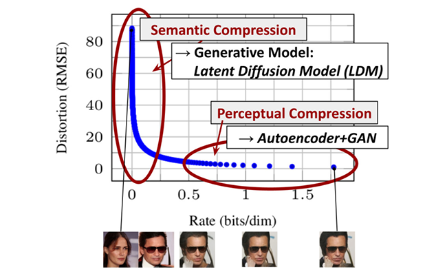
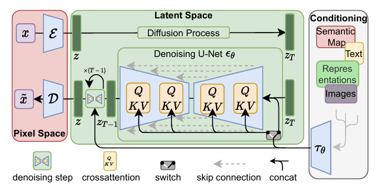
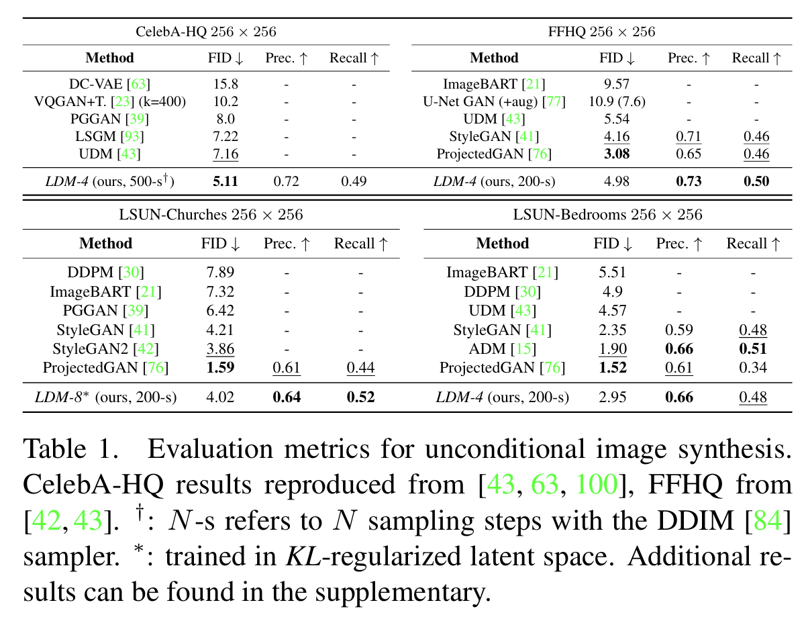
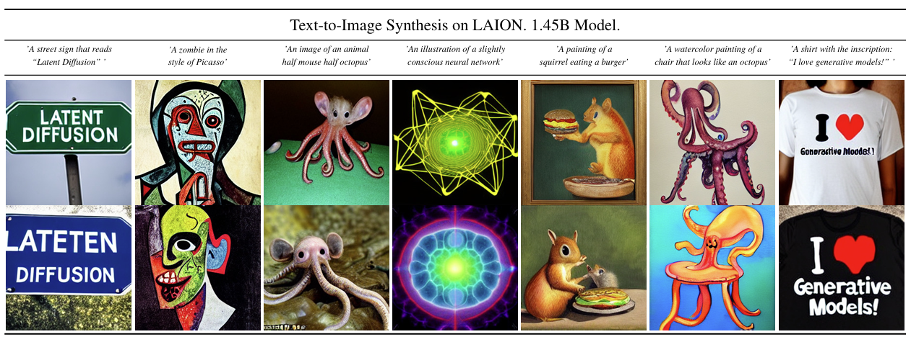
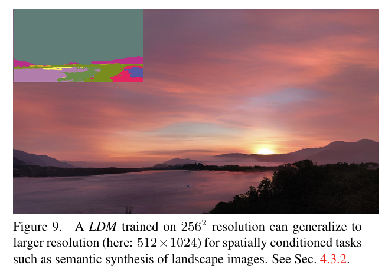
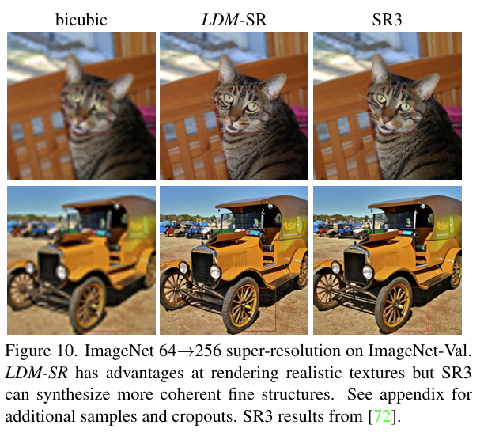
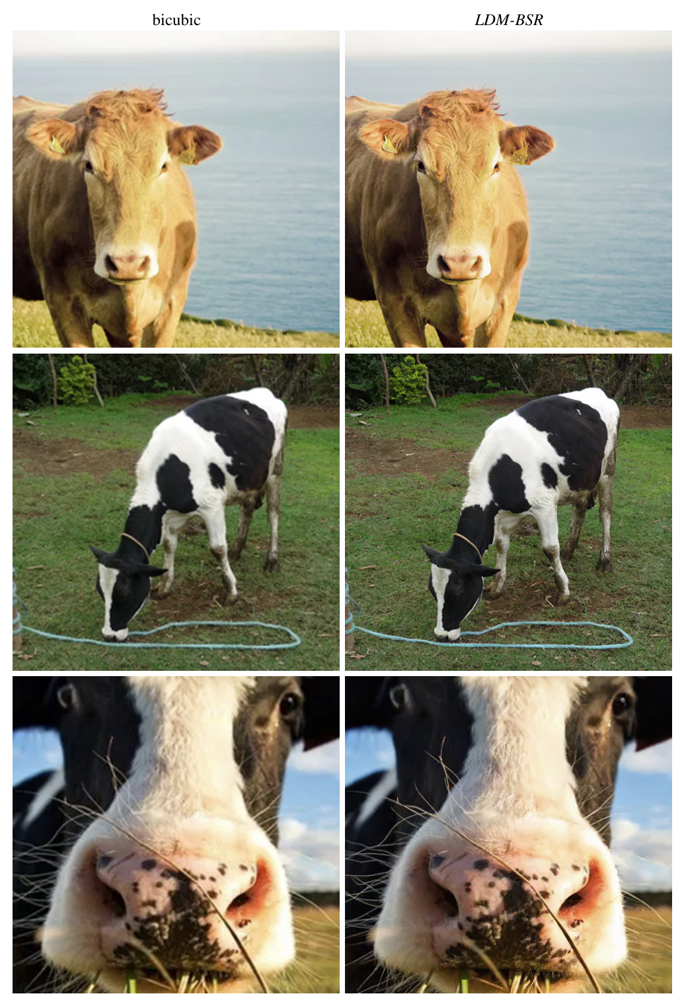
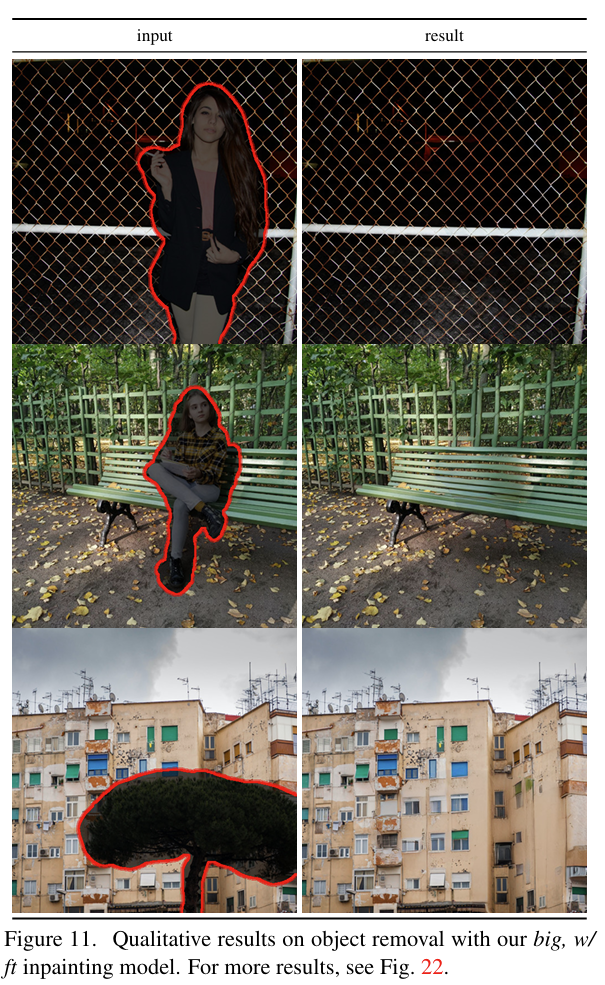

# High Resolution Image Synthesis with Latent Diffusion Models
Rombach et al. 2022

## 1. Introduction
#### Concept) Rate-Distortion Trade-Off
- Concepts)
  - Rate
    - How many bits are used to represent data
      - i.e.) **Compression** efficiency
    - Lower rate = stronger compression
  - Distortion
    - How much information is lost compared to the original
    - Lower distortion = reconstruction is closer to the original
  - Trade-Off
    - High **compression** usually increase **distortion**
- Desc.)
  - Relation with the Diffusion Models
    - In pixel space, diffusion models must handle all pixel-level details.
    - This includes high-frequency noise that is perceptually meaningless.
    - However, most bits in a digital image correspond to imperceptible details.
    - Thus, LDM tries 
      - Perceptual Compression
        - Train an autoencoder to remove redundant high-frequency details while keeping perceptual equivalence
        - This reduces rates significantly.
      - Semantic Compression
        - Train the diffusion model in the latent space of the autoencoder
  - Comparison with other models   
    
    - Desc.)
      - Autoencoder + GAN preserves nearly all pixel details.
      - LDM use 
        - autoencoder for perceptual compression
        - diffusion in the latent space for semantic compression

 

## 2. Related Work
### Concept) Diffusion Probabilistic Models (DM)
- Strength)
  - Achieved state-of-the-art results in 
    - density estimation
      - Desc.)
        - Suppose we trained $`p_\theta(x)\approx p(x)`$.
        - Here, we use methods such as MLE or ELBO, which maximize the likelihood in the training dataset.
        - Then, evaluate $`\log p_\theta(x')`$, which is the average test log-likelihood, where $`x'`$ is the test dataset.
        - Compare it with other models to have greater values.
    - sample quality
      - e.g.) IS, FiD scores
  - The generative power of these models stems from a natural fit to the inductive biases of image-like data
    - when implemented with [UNet](./ddpm.md#implementation)
    - when a reweighted objective is used for training.
      - cf.) reweighted objective
        - Recall that [DDPM](./ddpm.md#34-simplified-training-object) used $`t\sim\text{Uniform}[1,T]`$.
        - Instead, [Improved DDPM](../../../project/references/basics/improved_ddpm.md) used different step schedule to decrease noise in loss. 
          - $`t\sim p_t,\quad p_t = \sqrt{\mathbb{E}[L_t^2]}`$
- Weakness)
  - Low inference speed
    - Mitigated with 
      - advanced sampling strategies
      - hierarchical approaches
      - LDM!
  - High training cost
    - Mitigated with 
      - LDM!

  

## 3. Method
- Goal)
  - Circumvent DM's costly function evaluations in the pixel space.
- How?)
  - Utilize an autoencoding model that learns a space that is... 
    - perceptually equivalent to the image space
    - but offers significantly reduced computational complexity
  - This explicitly separate the **compressive** from the **generative learning** phase.
- Advantage)
  - DMs become more computationally efficient
    - Why?)
      - Sampling is performed on a low-dimensional space
  - Capable of exploiting the inductive bias of DMs
    - cf.) Previous approaches needed aggressive, quality-reducing compression levels
      - e.g.) Zeroshot T2I using VQ-VAE/VQGAN
  - Obtains general-purpose compression models...
    - whose latent space can be used to train multiple generative models
    - which can also be utilized for other downstream applications such as single-image CLIP-guided synthesis

 

### 3.1 Perceptual Image Compression
#### Concept) Perceptual Compression Model
- Model)
  - $`x\in\mathbb{R}^{H\times W\times3}`$ : an image data in RGB space
  - $`\mathcal{E} : \mathbb{R}^{H\times W\times3}\rightarrow\mathbb{R}^{h\times w\times3}`$ : the encoder
    - $`f = H/h = W/w`$ : a factor that $`\mathcal{E}`$ downsamples by
      - where $`f = 2^m,\quad m\in\mathbb{N}`$
    - $`z = \mathcal{E}(x)\in\mathbb{R}^{h\times w\times3}`$ : a latent variable
  - $`\mathcal{D}: \mathbb{R}^{h\times w\times3}\rightarrow\mathbb{R}^{H\times W\times3}`$ : the decoder
    - $`\tilde{x} = \mathcal{D}(z) = \mathcal{D}(\mathcal{E}(x)) \in\mathbb{R}^{H\times W\times3}`$
  - Regularization
    - KL-reg
      - What it does)
        - Imposes a slight KL-penalty towards a standard normal on the learned latent
      - cf.) VAE
    - VQ-reg
      - What it does)
        - Uses a vector quantization layer within the decoder
      - cf.) VQGAN
- Prop.)
  - Relative mild compression rate suffices achieving sound reconstruction.
    - Wny?)
      - The subsequent DM is designed to work with the two-dimensional structure of our learned latent space $`z=\mathcal{E}(x)`$
  - Compared to the pixel space s.t. $`x\in\mathcal{X}`$ the latent space $`z\in\mathcal{Z}`$...
    - is low-dimensional
    - abstracted away high-frequency and imperceptible details

 

### 3.2 Latent Diffusion Models
- Objective Function
  - $`L_{LDM} = \mathbb{E}_{\mathcal{E}(x), \epsilon\sim\mathcal{N}(0,1), t} \left[ \Vert \epsilon - \epsilon_\theta(z_t, t) \Vert_2^2 \right]`$
    - where 
      - $`t\sim\text{Uniform}(1,T)`$
      - $`\epsilon_\theta(\cdot, t)`$ : a time-conditional UNet
  - Input)
    - $`z`$ : the latent variable from the [perceptual compression model](#concept-perceptual-compression-model)'s encoder $`\mathcal{E}`$.
      - Advantage)
        - DM can... 
          - focus on important, semantic bits of the data
          - train in a lower dimensional, computationally more efficient space
  - Output)
    - $`z'\sim p_\theta(z)`$ : the sample from DM
      - Prop.)
        - Decoded with the [perceptual compression model](#concept-perceptual-compression-model)'s decoder $`\mathcal{D}`$.

 

### 3.3 Conditioning Mechanisms

- Goal)
  - Modeling conditional distribution of the form $`p(z\mid y)`$
- Idea)
  - Augment DM's UNet backbone with the cross-attention mechanism
- Model) 
  - $`\epsilon_\theta(z_t, t, \tau_\theta(y))`$ : the conditional denoising autoencoder
    - where
      - $`\tau_\theta: \mathcal{Y}\rightarrow\mathbb{R}^{M\times d_\tau}`$ : a domain specific encoder that projects the label $`y`$ to an intermediate presentation.
        - $`\tau_\theta(y)`$ is mapped to the intermediate layers of the UNet via a cross-attention layer $`\text{Attention}(Q,K,V)`$
  - $`\text{Attention}^{(i)}\left(Q^{(i)},K^{(i)},V^{(i)}\right) = \displaystyle \text{Softmax}\left(\frac{Q^{(i)}{K^{(i)}}^\top}{\sqrt{d}}\right)\cdot V^{(i)}`$ : the cross-attention layer
    - where
      - $`Q^{(i)} = W_Q^{(i)} \cdot \varphi_i (z_t)`$
        - where
          - $`\varphi_i (z_t)\in\mathbb{R}^{N\times {d_\epsilon}^i}`$ : a flattened intermediate representation of the UNet implementing $`\epsilon_\theta`$
          - $`W_Q^{(i)}\in\mathbb{R}^{d\times d_\tau}`$
      - $`K^{(i)} = W_K^{(i)} \cdot \tau_\theta(y)`$
        - where
          - $`W_K^{(i)}\in\mathbb{R}^{d\times d_\tau}`$
      - $`V^{(i)} = W_V^{(i)} \cdot \tau_\theta(y)`$
        - where
          - $`W_V^{(i)}\in\mathbb{R}^{d\times {d_\epsilon}^i}`$
    - Props.)
      - $`\left[ Q^{(i)}{K^{(i)}}^\top \right]_{(k,l)}`$ : the similarity between the $`k`$-th query from the latent spatial position and the $`l`$-th key from the label embedding.
- Loss Function)
  - $`L_{LDM} = \mathbb{E}_{\mathcal{E}(x), y, \epsilon\sim\mathcal{N}(0,1), t} \Bigg[ \Big\Vert \epsilon - \epsilon_\theta(z_t, t, \tau_\theta(y)) \Big\Vert_2^2 \Bigg]`$
  - Props.)
    - $`\tau_\theta`$ and $`\epsilon_\theta`$ can be jointly optimized
    - $`\tau_\theta`$ can be parameterized with domain-specific experts
      - e.g.) (unmasked) transformer if $`y`$ is a text prompt.
- Props)
  - Weakness)
    - Does not support 
      - conditioning beyond class-labels
      - training with blurred variants of the input image

  

## 4. Experiments
### 4.1 On Perceptual Compression Tradeoffs
- Goal)
  - Compare LDM-$`f`$s with different downsampling factors $`f\in\{1,2,4,8,16,32\}`$
    - cf.) LDM-1 corresponds to pixel-based DMs.

#### Experiment 1) Factor and Quality
- Desc.)
  - Compare the FID and the IS score of various factor models.
- Result)    
  
  - LDM-$`\{4-16\}`$ strike good balance between efficiency and perceptually faithful results.
  - LDMs with small $`f`$ values $`\{1,2\}`$ slow in training progress
  - LDMs with large $`f`$ values $`\{32\}`$ illustrate stagnating fidelity after comparably few training steps.

#### Experiment 1) Factor and Quality
- Desc.)
  - Use DDIM sampler to measure the sampling speed for different numbers of denoising steps
  - Horizontal Axis : Throughput
    - How many samples generated per second.
  - Each point denotes the step size in DDIM : $`\{10,20,50,100,200\}`$ 
    - Prop.)
      - More the step size is
        - Better quality (low FID score)
        - Slower sampling speed (low throughput)
      - Thus, in each line (LDM-$`f`$), leftmost point has the largest step size of 200.
      - And, moving rightward, the step size decreases.
- Result)    
  
  - LDM-$`\{4-8\}`$ outperform others.
    - The lowest FID scores
    - Significant throughput increase.

 

### 4.2 Image Generation with Latent Diffusion
- Dataset)
  - CelebA-HQ, FFHQ, LSUN-Churches, and LSUN-Bedrooms
- Evaluation)
  - Sample quality
  - Coverage of the data manifolding
- Scores)
  - FID
  - Precision and Recall
- Result)   
  

 

### 4.3 Conditional Latent Diffusion
#### 4.3.1 Transformer Encoders for LDMs
- Text-to-image Modeling)   
  
  - Implementation)
    - KL-regularized LDM conditioned on language prompts on LAION-400M
    - BERT-Tokenizer for $`\tau_\theta`$
  - Dataset)
    - MS-COCO for the text-to-image generation
    - OpenImages for training the model to synthesize images based on semantic layouts
- Class-Conditional Evaluation)
  - Dataset)
    - ImageNet

 

#### 4.3.2 Convolutional Sampling Beyond 256^2
- Desc.)
  - LDM can serve as efficient general purpose image-to-image translation model.
    - How?)
      - By concatenating spatially aligned conditioning information to the input of $`\epsilon_\theta`$
    - Usage)
      - [semantic synthesis](#experiment-semantic-synthesis)
      - [super-resolution](#44-super-resolution-with-latent-diffusion)
      - [inpainting](#45-inpainting-with-latent-diffusion)

#### Experiment) Semantic Synthesis
- How?)
  - Get images of landscapes paired with semantic maps.
  - Concatenate downsampled versions of the semantic maps with the latent image representation of a $`f=4`$ model with VQ-reg.
  - Train on an input resolution of $`256^2`$
- Result)
  - The model generalizes to larger resolutions upto megapixel regime $`(\ge 1024^2)`$  when evaluated in a convolutional manner.   
    

 

### 4.4 Super-Resolution with Latent Diffusion
- How?)
  - Directly condition on low-resolution images via concatenation
  - Follow SR3
    - Fix the image degradation to a bicubic interpolation with $`4\times`$ downsampling.
    - Train on ImageNet following SR3's data processing pipeline.
- Result)
  - Compared with the SR3 model   
       
       

 

### 4.5 Inpainting with Latent Diffusion
- Result)   
     
     

  

## 5. Limitations & Societal Impact
### Limitations
- Sequential sampling process is slower than that of GANs
  - cf.) Recall the denoising process!
  - DDIM is still slower than GANs
- Questionable when high precision is required
  - i.e.) hard to generate image that we want. (semantic precision)
  - LDM's reconstruction capability can become a bottleneck for tasks that require fine-grained accuracy in pixel space.
    - i.e.) Some information is innately incapable of recovering from the latent space.