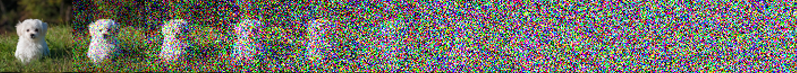
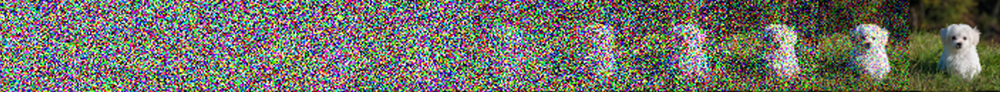
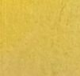
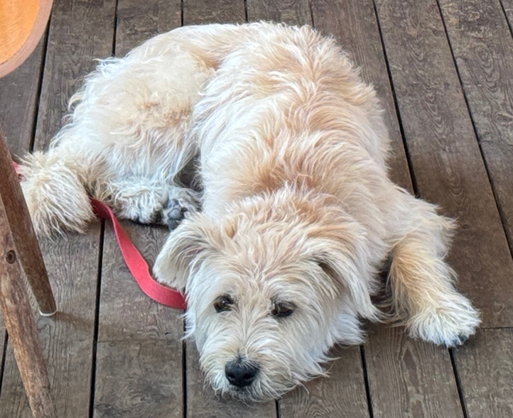
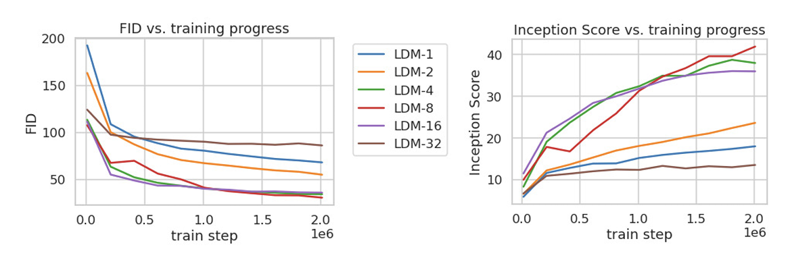
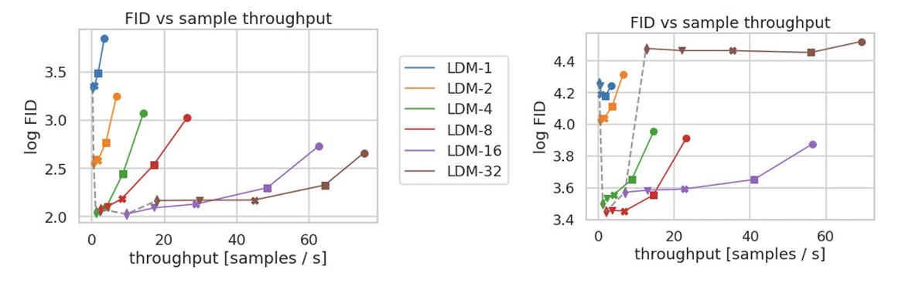

# High Resolution Image Synthesis with  **L**atent **D**iffusion **M**odels (**LDM**)
Rombach et al. 2022

     

Reviewed & Presented by Joon Hyeok Kim

---

## Text Image aligned sample

  

- Blabla

  

  
 
  
  

---

# Contents
### 1. Recap & Weaknesses of **DDPM**
### 2. Suggestion : **Latent** Diffusion Model (**L**DM) $=$ DDPM $\times$ **VAE** 
### 3. Upgrade : **Conditional** LDM $=$ DDPM $\times$ VAE $\times$ **Cross-Attention**
### 4. Pros, Cons, and **Updates** of LDM : **Stable Diffusion** v1 $\rightarrow$ v2 $\rightarrow$ v3

---

## Recap : **D**enoising **D**iffusion **P**robabilistic **M**odel (**DDPM**)

#### **Forward** Process $q(\mathbf{x}_{t-1}\mid\mathbf{x}_t)$ : $\underbrace{\mathbf{x}_0}_{\text{original image}} \rightarrow \mathbf{x}_1 \rightarrow \cdots \rightarrow \mathbf{x}_{T-1} \rightarrow \underbrace{\mathbf{x}_{T}}_{\text{pure noise!}}$

- What we choose by scheduling $\beta_t$

#### **Reverse** Process $p_\theta(\mathbf{x}_{t}\mid\mathbf{x}_{t-1})$ : $\underbrace{\mathbf{x}_{T}}_{\text{pure noise}} \rightarrow \mathbf{x}_1 \rightarrow \cdots \rightarrow \mathbf{x}_{T-1} \rightarrow \underbrace{\mathbf{x}_0'}_{\text{synthetic image!}}$

- A neural network with parameters $\theta$ that we want to learn!

---

# Optimizing DDPM
#### 1. Use Bayes Rule to get **posterior** $\quad q(\mathbf{x}_{t}\mid\mathbf{x}_{t-1},\mathbf{x}_0) = \displaystyle\frac{q(\mathbf{x}_t\mid\mathbf{x}_{t-1}) q(\mathbf{x}_{t-1}\mid\mathbf{x}_0)}{q(\mathbf{x}_t\mid\mathbf{x}_0)}$

#### 2. Maximize **ELBO** :  $\log p_\theta(\mathbf{x}{0}) \ge \displaystyle\mathbb{E}_{q(\mathbf{x}_{1:T}\mid \mathbf{x}_0)} \left[ \log\frac{p_\theta(\mathbf{x}_{0:T})}{q(\mathbf{x}_{1:T}\mid \mathbf{x}_0)} \right]$
- Equivalent to minimizing KL-Divergence $(L_{\text{vlb}})$

#### 3. Authors found that this was equivalent to estimating the **noise** that we added
- $L_{\text{simple}}(\theta) := \displaystyle\mathbb{E}_{t,\mathbf{x}_0, \boldsymbol{\epsilon}} \left[ \left\Vert \underbrace{\boldsymbol{\epsilon}}_{\text{noise!}} - \boldsymbol{\epsilon}_\theta (\sqrt{\bar{\alpha}_t}\mathbf{x}_0 + \sqrt{1-\bar{\alpha}_t} \boldsymbol{\epsilon}, t) \right\Vert^2 \right]$

 

cf.) Later improved to $L_{\text{hybrid}} = L_{\text{simple}} + \lambda L_{\text{vlb}}$ to achieve competitive log-likelihood!

---

### Implementing DDPM : UNet

---

## Weakness 1 : Computationally costly

#### Pixel Space Dimension $D = H\times W\times \underbrace{3}_{\text{RGB}}$

  

    
  

  
 

  e.g.) $512 \times 512 \times 3 = 786,432$

  

---

#### Weakness 2 : Waste of resources on learning imperceptible details

  
 

#### What model cares
  

#### What we care
  

  

  

    
  

---

## Suggestion : **Latent** Diffusion

#### 1. Encode image to the Latent Space (VAE)

#### 2. Do diffusion in the Latent Space (Diffusion Model)

#### 3. Decode image to the Pixel Space (VAE)

---

## Result

### 1. Improved Image Quality

---

## Result

### 2. Faster image sampling (DDIM)

---

## Upgrade : **Conditional** LDM $=$ DDPM $\times$ VAE $\times$ **(Cross) Attention**

---

## Pros & Cons of LDM

### Strength 1) Resolution upscaling and Inpainting Capabilities

---

# Questions

     

Thank you