# Video models are **zero-shot** learners and reasoners
Google Deepmind 2025

     

Reviewed & Presented by Joon Hyeok Kim

---

# Contents
### 1. Key Idea 1 : Analogy with **LLMs** as a Generalist Model
### 2. Key Idea 2 : **Hierarchical Categorizations** of Visual Capabilities
### 3. Methods, Evaluations, & Experiments
### 4. Limits & Future Outlook

---
### Recall the history of the language models.
#### The Pre-LLM Era was like the 群雄割据(군웅할거) of ...

  

## Task-Specific Bespoke Models
- Translation
- Summarization
- Domain specific QnA
- ...

  

  
 
  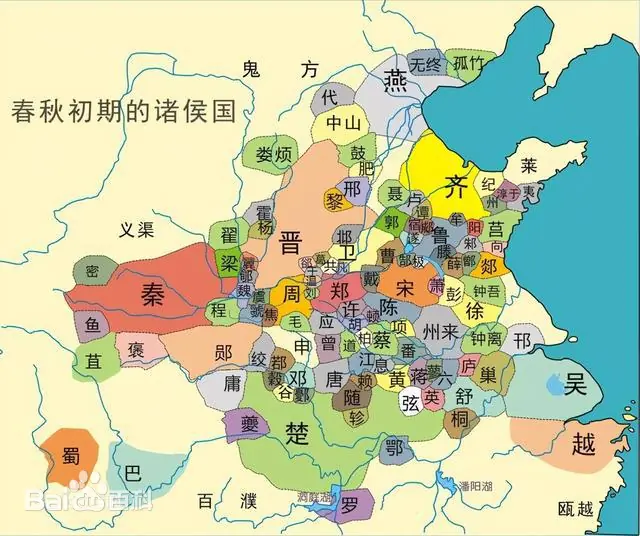
  

---
## **LLM** unified and started to work as a Generalist

  

- Translation
- Summarization
- Domain specific QnA
- And, now even capable of
  - Coding
  - Math
  - Creative writing
  - Deep research (oh my...)
  - and so on...

  

  
 
  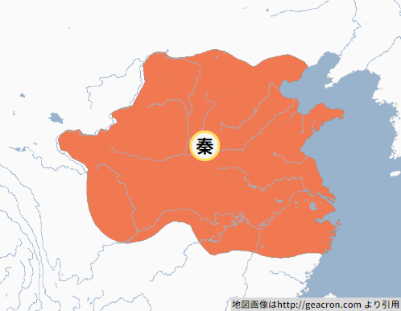
  

---
## Paradigm Shift : **Chain-of-Thoughts (CoT)** + Computing Power

  
 
  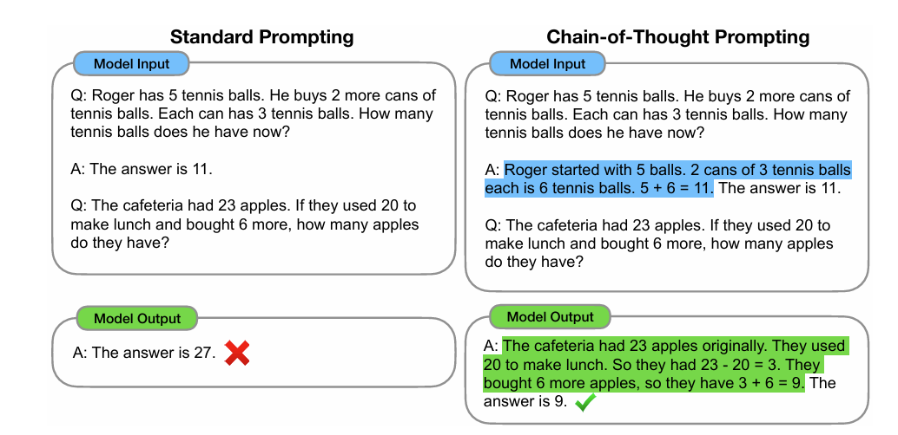
   Chain-of-Thought Prompting Elicits Reasoning in Large Language Models
   Google Research, Brain Team 2022
  

  
 
  
  

---
# Analogy in Video Models
### Current task-specific video models that outperform general video models...
 

  
 
  Segmentation Specialist
    
  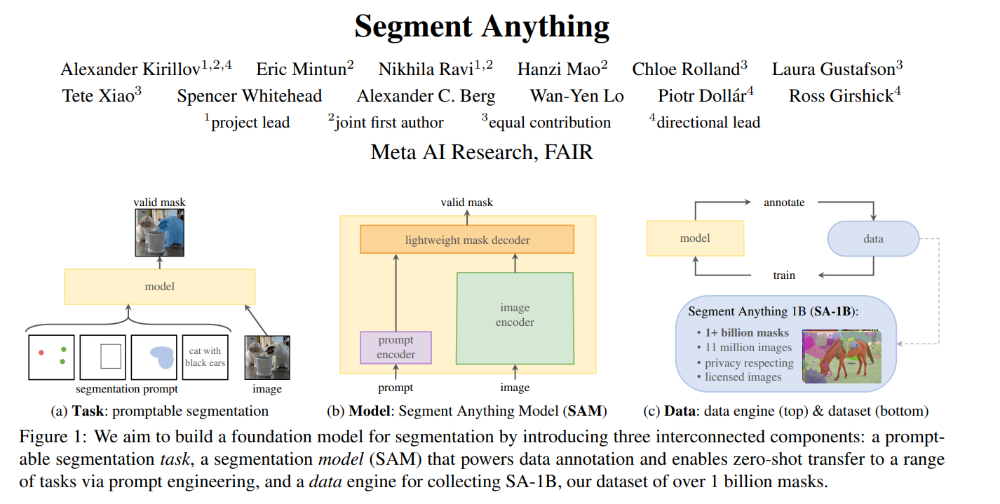
  

  
 
  Object Detection Specialist (YOLO variants)
     
  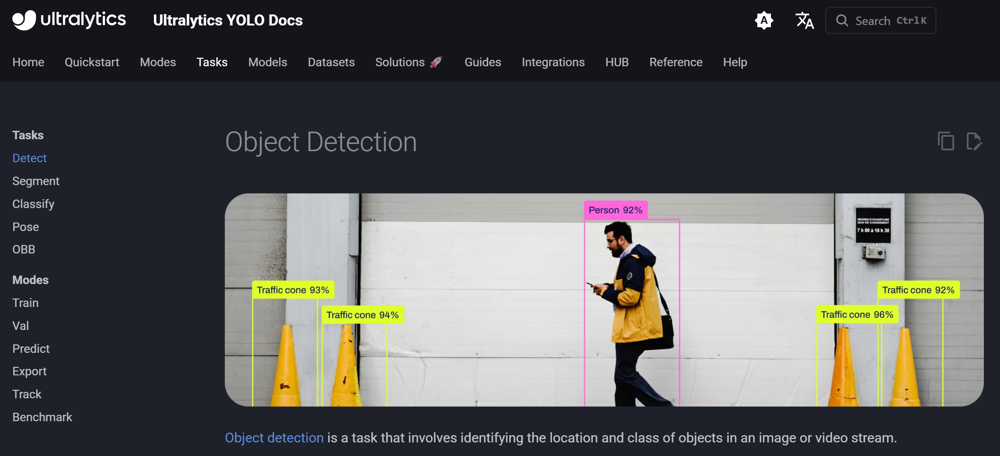
  

---
## Can **video models** become **Generalists** just like **LLM** did?

  
 
  
  

  
 
  
  

---
Maybe yes with...
## Chain-of-Frames (**CoF**) + Future Developments
- Applying changes across **dimensions** of the real world frame-by-frame
  - Dimensions : Time & Space
  - Similar to Step-by-step strategy in CoT

#### Still, conceptual and no analytic mechanism studied yet...
---
# 2. Hierarchical Categorizations of Visual Capabilities
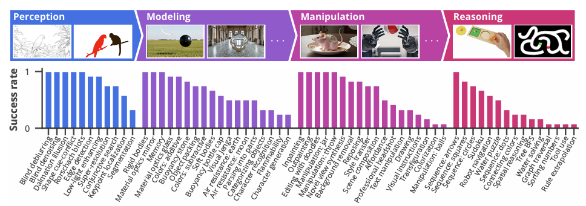
#### Provides a **framework** to assess various abilities of Video Models

---
# Stacking up! 
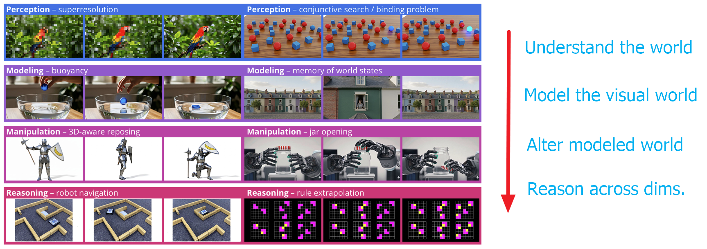

[Examples](https://video-zero-shot.github.io/)

---

# 3. Methods, Evaluation, & Results
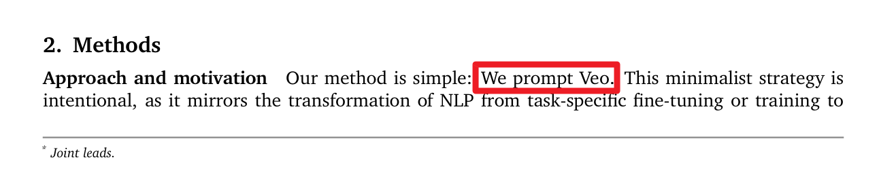   
### e.g.   
  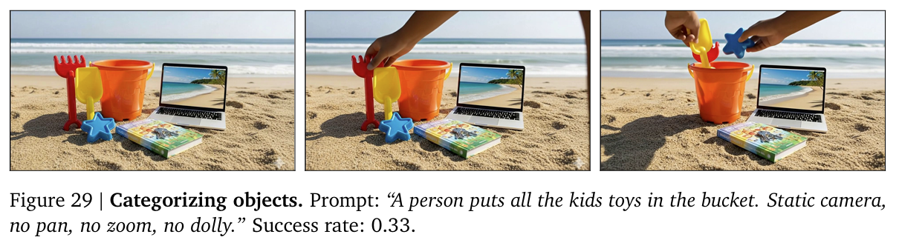   

---
# Evaluation Methodologies
## **Qualitative** Evaluation
#### Concept) Success Rate 
- Def.)
  - The fraction of generated videos that solved the task
- Props.)
  - Determined by **humans**
  - $\gt0$ : the model possesses the ability to solve the task
  - $\approx1$ : the model reliably solves the problem irrespective of the random seed

---

|||
|:-:|:-:|
|Success|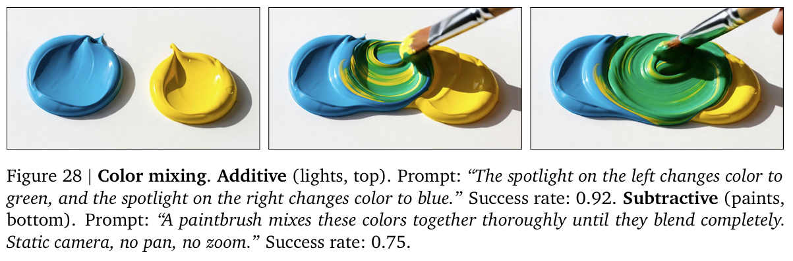|
|Failure|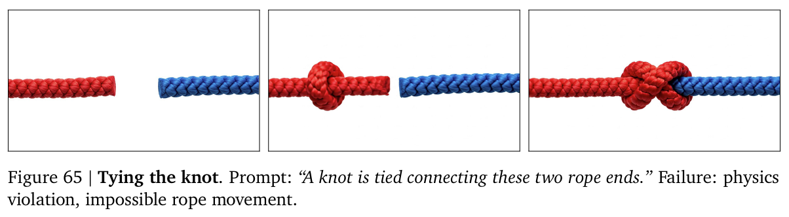|

---
## **Quantitative** Evaluation
### Problem specific scores are used.
- No unified measure nor statistics
### Consider both the **best frame** and the **last frame**
- Best Frame : Best performance but not deterministic
- Last Frame : Deterministic but no guarantee on performance

---
##### e.g.) Segmentation Problem **(Perception)** :  Intersection over Union (IoU)
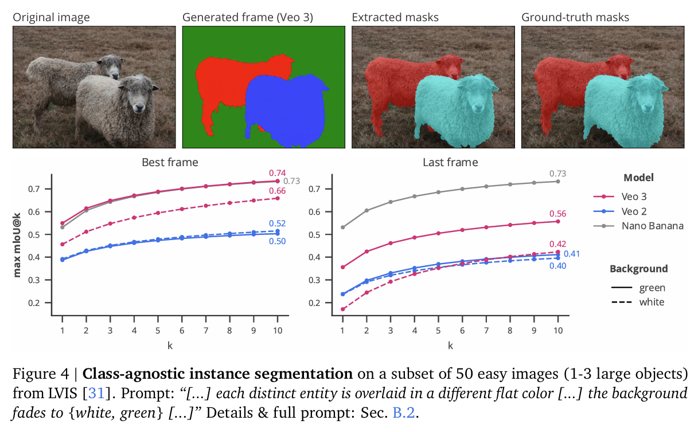

---
## e.g.) Maze Solving Problem **(Reasoning)**
#### Compare...

  
 
  
  

  
 
  
  

  
 
  
  

  
 
  
  

---
# For Video Models... (Veo 2 & Veo 3)

#### 1. Provide a maze  image to the **prompt** as the first frame
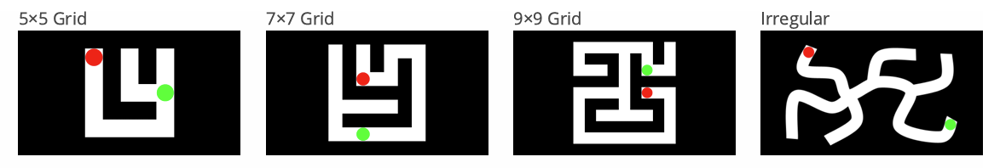
- They tried various maze datasets.
  - `maze-dataset 0.3.4`
  - Hand drawn irregular mazes (flipped/rotated) to get 40 unique samples

---

#### 2. Prompt text as below
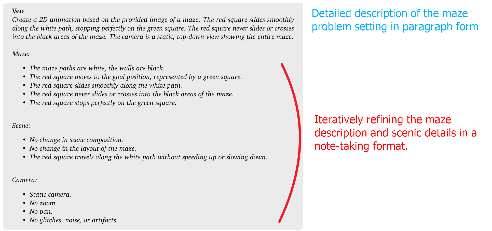

---

#### For Other Reference Models
- Nano Banana (Image Specific Generative Model)   
  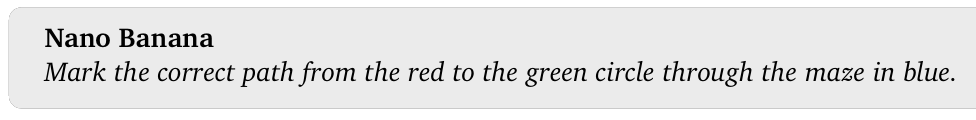
- Gemini 2.5 Pro (Language Model)   
  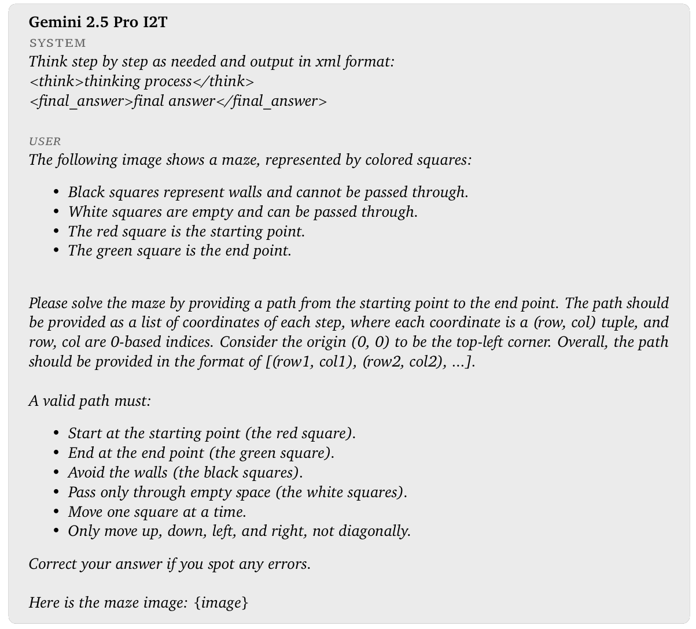

---

# Evaluation
#### Define Illegal Moves
- Jumping over walls
- Clipping through boundaries
- Alteration of the goal's position
- ...

#### Success Rate (Quantitative)
- The fraction of $k$ attempts where the agent successfully reaches the goal without illegal moves through out the generated video.

---

# Result

  

- Veo2 vs Veo3
- $k\uparrow\Rightarrow \text{pass}\uparrow$
- Complex
  - Beats LLM
- Simple, Irregular 
  - Beats Image

  

  
 
  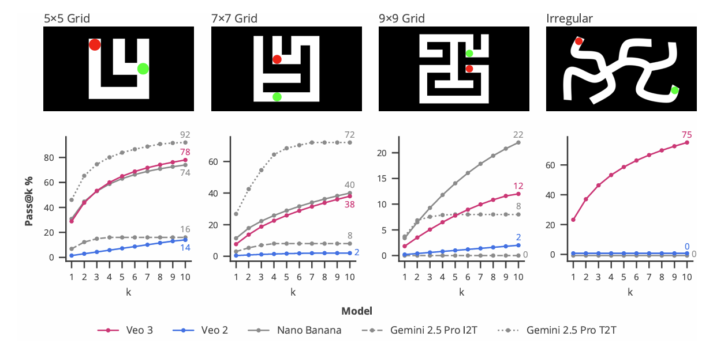
  

---

## Limit : Insufficient **Reasoning** Capability
#### Significant portion of the **reasoning** experiments scored low success rates.
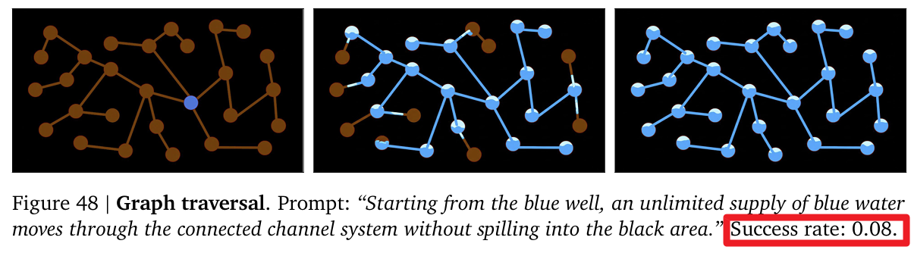   
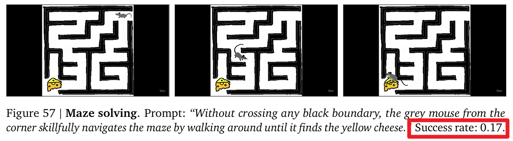   

---

#### Failures on complex tasks
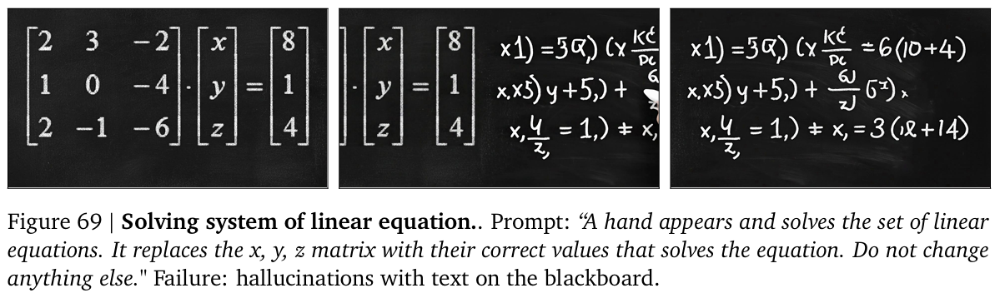   
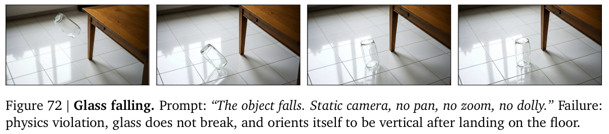   

---
# More Limits...
### No analytic relation proven between **CoF** and **Zero-shot learning**
- Does CoF guarantees the correct reasoning path?
- Or, does "correctness" even matter if we have the answer?
### No unified evaluation method : Human and problem dependent
### Video generation is still too computationally expensive
- Emergent abilities only at scale! (Veo 3's performance improvement)
### High Dependency on Prompt Engineering
- Nevertheless, CoT did change the world...
### Jack of many trades, master of few
- Fine-tuned models dominate in specific tasks. Will they last forever?

---

# Future Outlook
### Video Models Show Great Potential for Zero-Shot Learning
- Distinguish a model's task performance and its underlying ability to solve it.
- Early LLMs underperformed against fine-tuned models.
  - But look who dominates now, huh?
### We are at the very beginning of the Video Model development
- Improvement from Veo 2 to Veo 3 indicates further developments.
- Alternative approach on Prompt Engineering?
  - Current : first frame image + text description
  - Just like CoT changed the game with the prompt engineering in LLMs.
- Cost will fall : LLM's ongoing decrease in cost may support this.

### Leveraging Scaling Laws and Optimization 
- Performance can be further boosted by applying inference-time scaling and standard optimization toolkits, which were not used in this study

---

# Questions

     

Thank you