# High Resolution Image Synthesis with  **L**atent **D**iffusion **M**odels (**LDM**)
Rombach et al. 2022

     

Reviewed & Presented by Joon Hyeok Kim

---

# Contents
### 1. Recap & Weaknesses of **DDPM**
### 2. Suggestion : **Latent** Diffusion Model (**L**DM) $=$ Diffusion $\times$ **VAE** 
### 3. Upgrade : **Conditional** LDM $=$ Diffusion $\times$ VAE $\times$ **Cross-Attention**
### 4. Pros, Cons, and **Updates** of LDM : **Stable Diffusion** v1 $\rightarrow$ v2 $\rightarrow$ v3

---

## Recap : **D**enoising **D**iffusion **P**robabilistic **M**odel (**DDPM**)

#### **Forward** Process $q(\mathbf{x}_{t-1}\mid\mathbf{x}_t)$ : $\underbrace{\mathbf{x}_0}_{\text{original image}} \rightarrow \mathbf{x}_1 \rightarrow \cdots \rightarrow \mathbf{x}_{T-1} \rightarrow \underbrace{\mathbf{x}_{T}}_{\text{pure noise!}}$
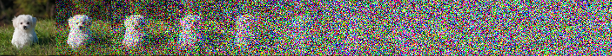
- What we choose by scheduling $\beta_t$

#### **Reverse** Process $p_\theta(\mathbf{x}_{t}\mid\mathbf{x}_{t-1})$ : $\underbrace{\mathbf{x}_{T}}_{\text{pure noise}} \rightarrow \mathbf{x}_1 \rightarrow \cdots \rightarrow \mathbf{x}_{T-1} \rightarrow \underbrace{\mathbf{x}_0'}_{\text{synthetic image!}}$
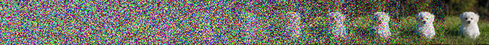
- A neural network with parameters $\theta$ that we want to learn!

---

# Optimizing DDPM
#### 1. Use Bayes Rule to get **posterior** $\quad q(\mathbf{x}_{t}\mid\mathbf{x}_{t-1},\mathbf{x}_0) = \displaystyle\frac{q(\mathbf{x}_t\mid\mathbf{x}_{t-1}) q(\mathbf{x}_{t-1}\mid\mathbf{x}_0)}{q(\mathbf{x}_t\mid\mathbf{x}_0)}$

#### 2. Maximize **ELBO** :  $\log p_\theta(\mathbf{x}{0}) \ge \displaystyle\mathbb{E}_{q(\mathbf{x}_{1:T}\mid \mathbf{x}_0)} \left[ \log\frac{p_\theta(\mathbf{x}_{0:T})}{q(\mathbf{x}_{1:T}\mid \mathbf{x}_0)} \right]$
- Equivalent to minimizing KL-Divergence $(L_{\text{vlb}})$

#### 3. Authors found that this was equivalent to estimating the **noise** that we added
- $L_{\text{simple}}(\theta) := \displaystyle\mathbb{E}_{t,\mathbf{x}_0, \boldsymbol{\epsilon}} \left[ \left\Vert \underbrace{\boldsymbol{\epsilon}}_{\text{noise!}} - \boldsymbol{\epsilon}_\theta (\sqrt{\bar{\alpha}_t}\mathbf{x}_0 + \sqrt{1-\bar{\alpha}_t} \boldsymbol{\epsilon}, t) \right\Vert^2 \right]$

 

cf.) Later improved to $L_{\text{hybrid}} = L_{\text{simple}} + \lambda L_{\text{vlb}}$ to achieve competitive log-likelihood!

---

### Implementing DDPM : **UNet** Architecture

---

## Weakness 1 : Computationally costly

#### Pixel Space Dimension $D = H\times W\times \underbrace{3}_{\text{RGB}}$

  

    
  

  
 

  $D=512^2 \times 3 = 786,432$ for a single image!

  

---

#### Weakness 2 : Waste of resources on learning imperceptible details

  
 

#### What model cares
  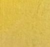

#### What we care
  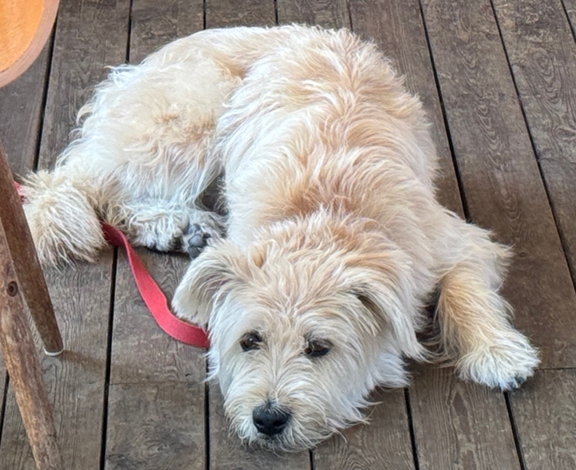

  

  

    
  

---

## Weakness 3 : Slow Sampling due to Markov Chain Structure

#### **Reverse** Process 

- $p_\theta(\mathbf{x}_{t}\mid\mathbf{x}_{t-1})$ : $\underbrace{\underbrace{\mathbf{x}_{T}}_{\text{pure noise}} \rightarrow \mathbf{x}_1 \rightarrow \cdots \rightarrow \mathbf{x}_{T-1} \rightarrow \underbrace{\mathbf{x}_0'}_{\text{synthetic image!}}}_{T\text{ steps!}}$
  - At each step, we sample $\mathbf{x}_{t-1}\sim\mathcal{N}(\mathbf{x}_{t-1};\;\mu_\theta(\mathbf{x}_t, t), \Sigma_\theta(\mathbf{x}_t, t))$

---

## Idea 1: What if we **lower the dimension** and perform **Diffusion**?
#### 1. **Encode** image to the Latent Space (**VAE**)
#### 2. Perform diffusion in the Latent Space (Diffusion Model)
#### 3. **Decode** image back to the Pixel Space (**VAE**)

 

## Idea 2: Skip some sampling steps using **DDIM**
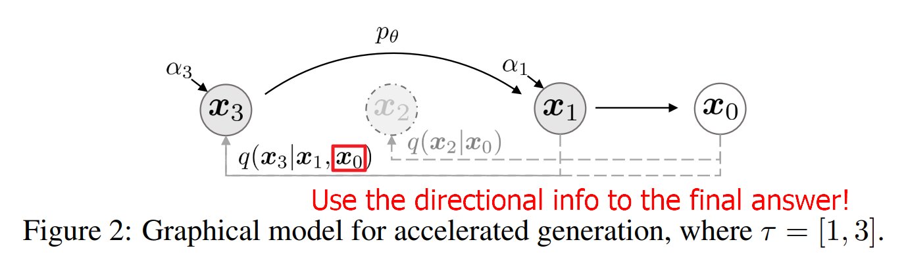

---
## Model Structure : Perceptual Compression $\times$ Latent Diffusion
#### **VAE** : Perceptual Compression Model
#### **Diffusion** : Latent Diffusion Model
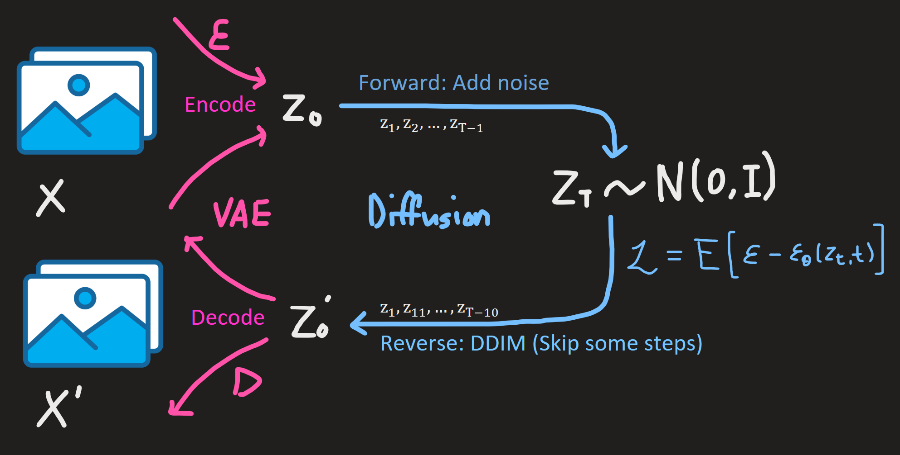

---

### Result on Unconditional Image Generation

|DDPM (2020)|LDM (2022)|
|:-:|:-:|
|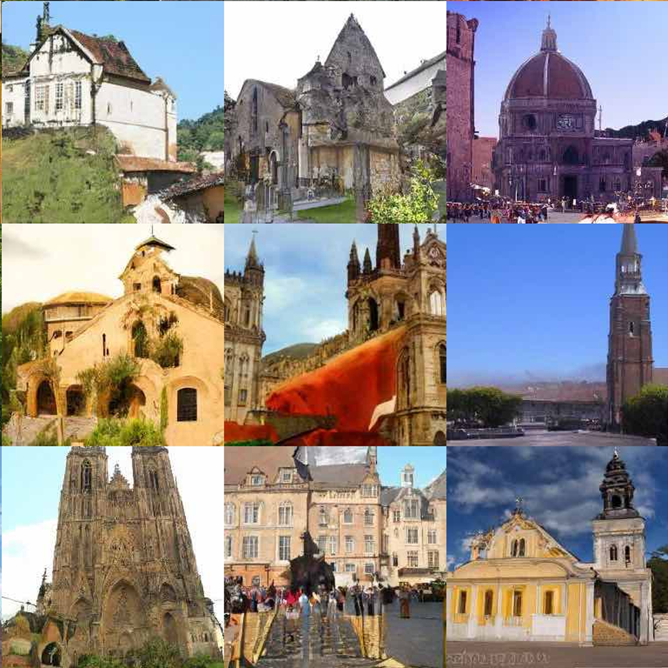|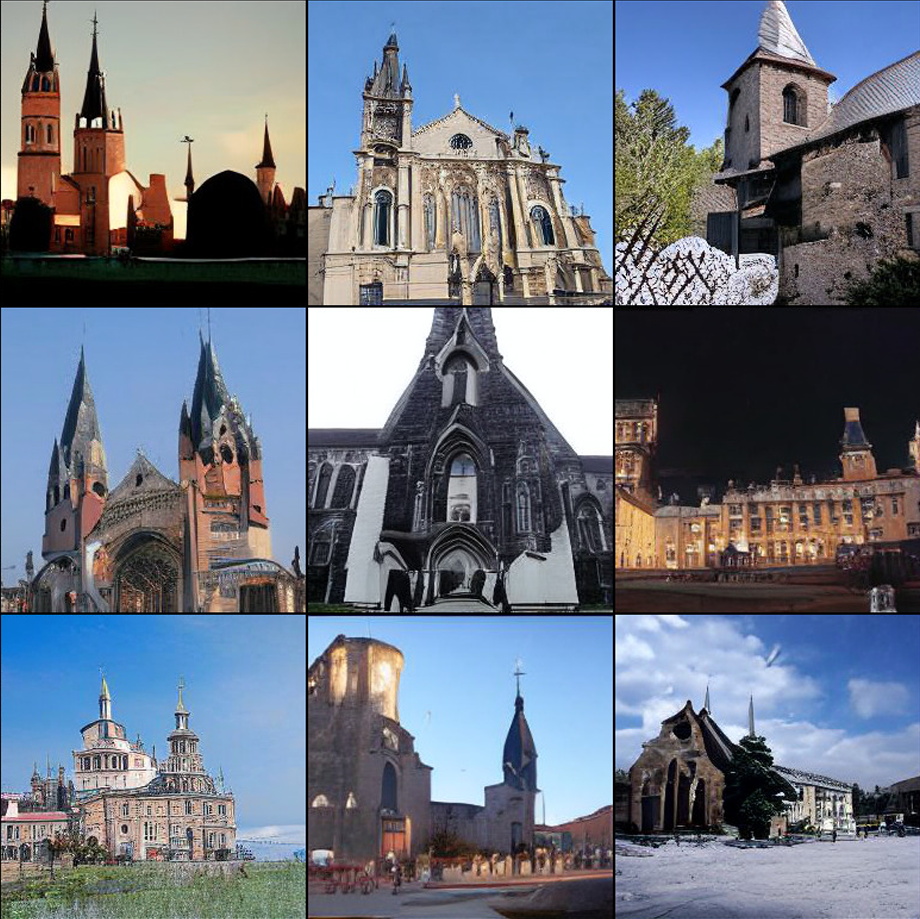|

---

#### Advantage 1 : Improved Image Quality & Faster Sampling 

||LDM-$f$s with different downsampling factors $f\in\{1,2,4,8,16,32\}$|
|:-:|:-:|
|Improved Quality|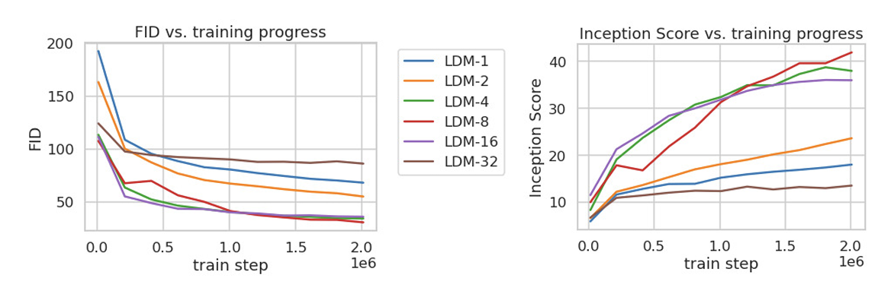|
|Faster Sampling||

---

# How? **Teamwork** maybe? 🧑🏽‍🤝‍🧑🏻

  

  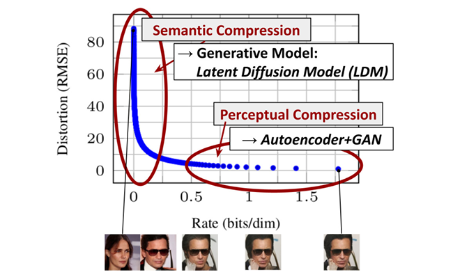
  

  
 
  
  

---

## Is that it? Not even close.
### **Conditional** generation in previous diffusion models...

|"**Cat**" in DDPM|"**Cat**" in CFG||
|:-:|:-:|-:|
|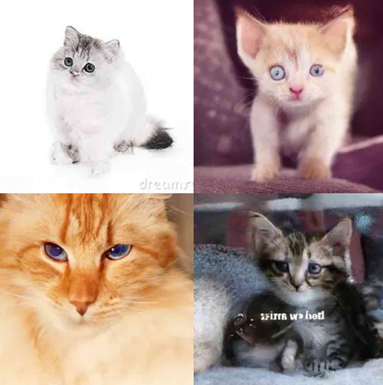|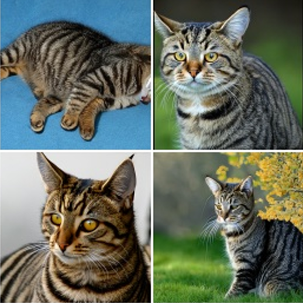| Pre-defined **labels** on the dataset|

---

## Phenomenal Shift : **Expressive** Conditional Image Generation
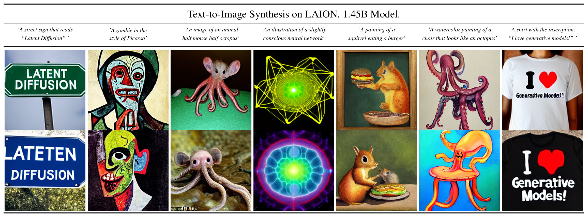

---

## Upgrade : **Conditional** LDM $=$ DDPM $\times$ VAE $\times$ **(Cross) Attention**

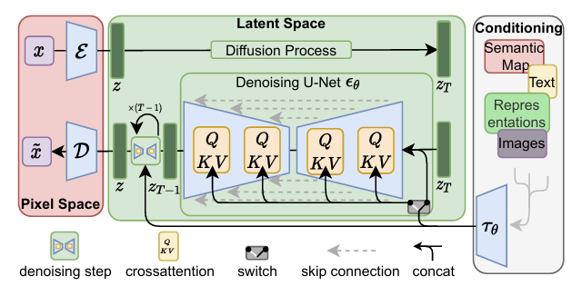

---

#### Cross Attention 
$\text{Attention}^{(i)}\left(Q^{(i)},K^{(i)},V^{(i)}\right) =  \text{Softmax}\left(\frac{Q^{(i)}{K^{(i)}}^\top}{\sqrt{d}}\right)\cdot V^{(i)}$
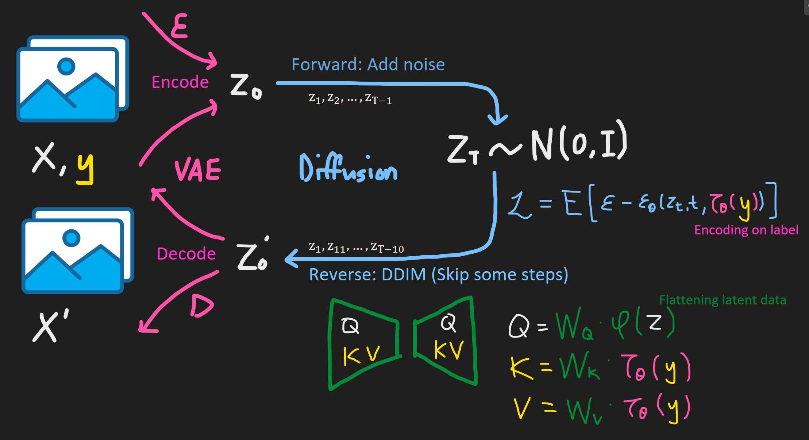

---

### Other capabilities...
|Semantic Synthesis|Upscaling|In-painting|
|:-:|:-:|:-:|
|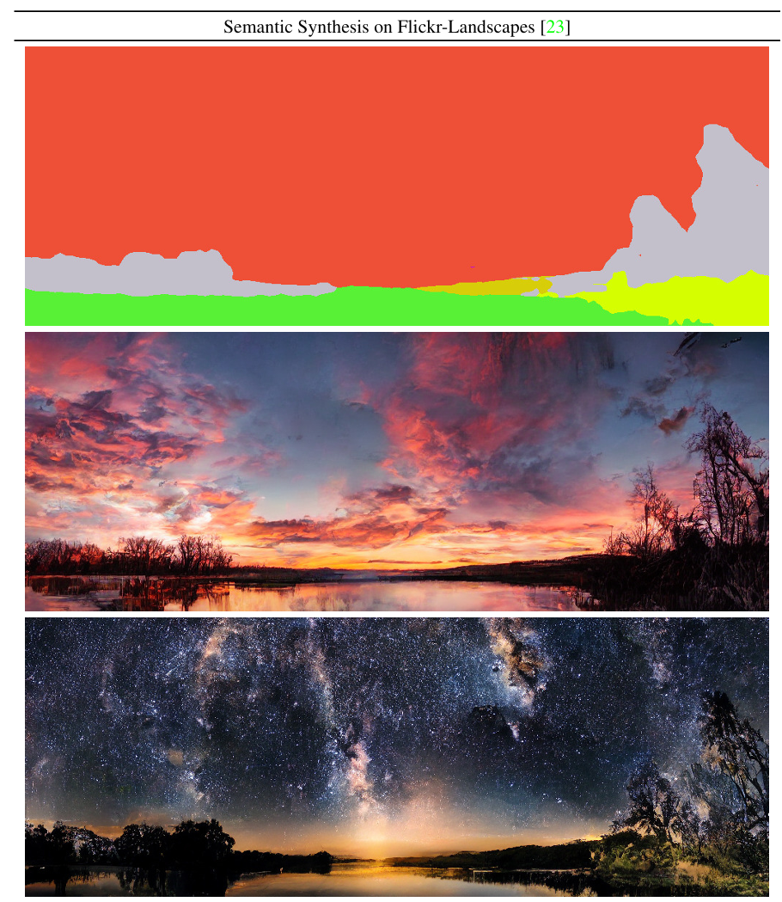|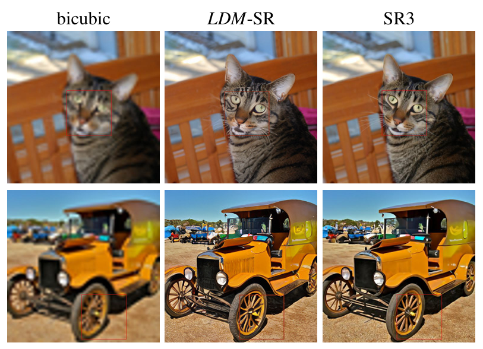|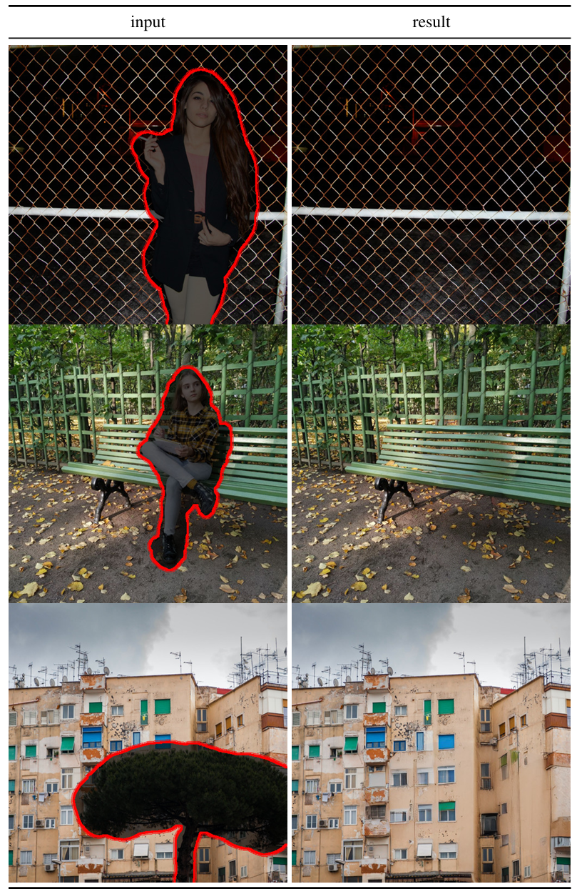|

---

# **Pros** & Cons of LDM

## **Strengths**
#### **Improvement in image quality** compared to previous Diffusion Models.
#### **Faster sampling speed** compared to previous Diffusion Models.
- Key bottleneck of the Diffusion Models
#### **Expressive conditional** image generation
- Thanks to the Cross-Attention Mechanism
#### **Versatile** capabilities 
- Expressive T2I, Semantic Synthesis, Upscaling, In-painting

---
# Pros & **Cons** of LDM
## **Weaknesses**
#### Still, **slow** sampling speed compared to **other models**
- **GANs** are way faster. (But Diffusion Models are more stable!)
#### Questionable when high precision is required
- Why?
  - Some information compressed by the VAE may not be recovered.
  - Stochastic nature of the Diffusion Models (Then, deterministic? Flow?)
#### High training cost
- Inference is relatively cheaper though...

---

# Updates: LDM $\rightarrow$ Stable Diffusion (SD) $\rightarrow$ SD2 $\rightarrow$**SD3**
### **Spoiler** : $\underbrace{\text{LDM}}_{\text{Now!}} + \underbrace{\text{DiT}}_{\text{Next}} + \underbrace{\text{Rectified Flow}}_{\text{Next week}} = \underbrace{\text{Stable Diffusion 3}}_{\text{3 weeks later}}$

  
 
  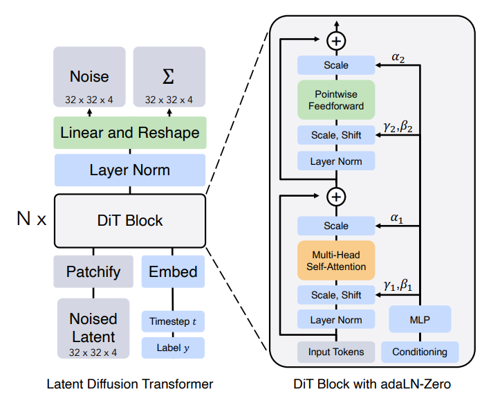
  

  

  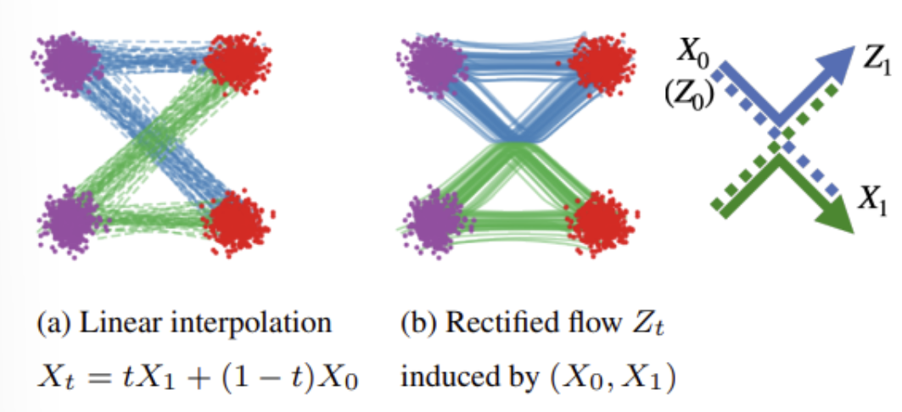
  

  
 
  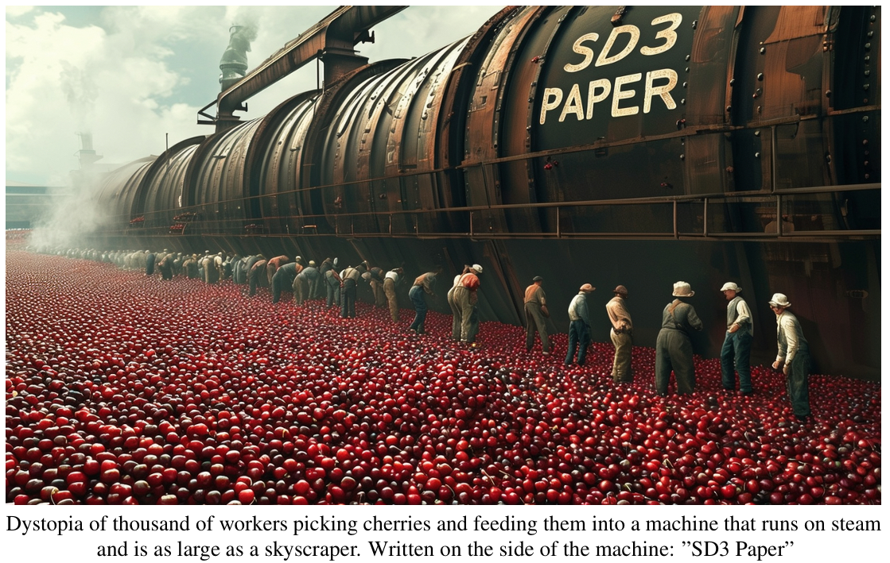
  

---

# Questions

     

Thank you