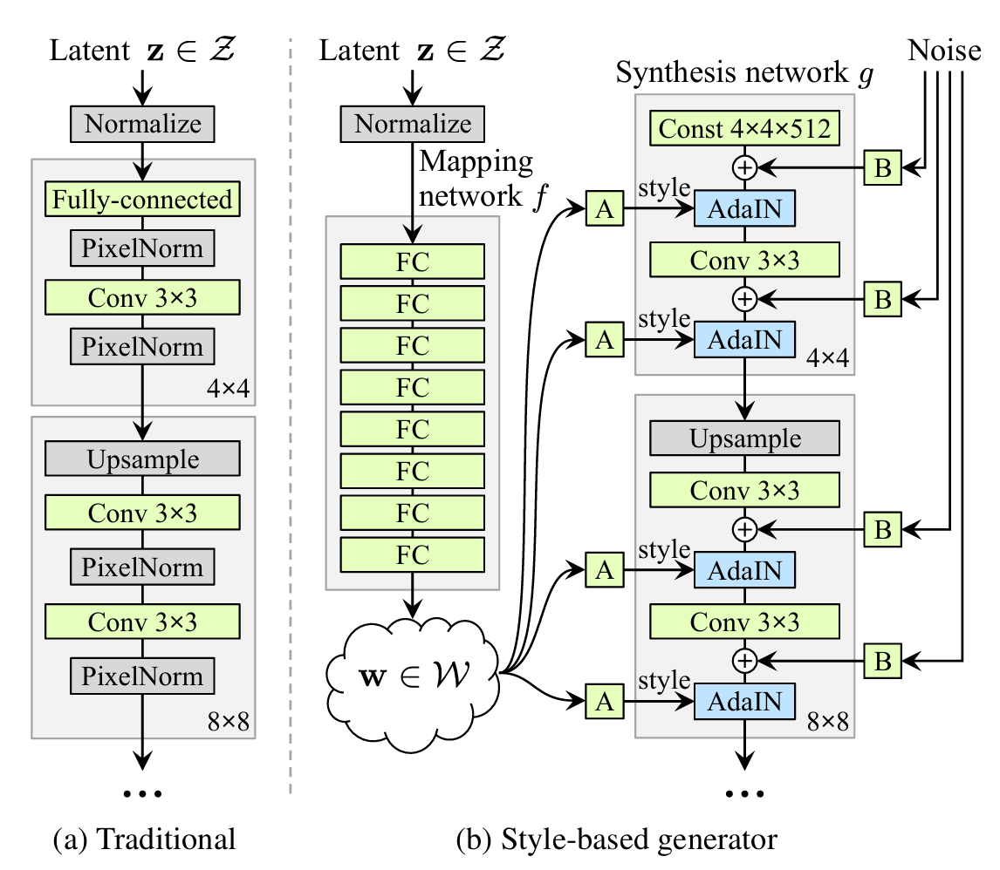

# A Style-Based Generator Architecture for Generative Adversarial Networks
Karras et al.

### History
- GAN
  - Latent Space and Latent Variable
    - DCGAN (2015)
      - Introduced
        - Convolution (CNN)
        - Latent space 
    - InfoGAN (2016)
      - Disentangled the latent factor
        - $`z = (z_{\text{noise}}, z_{\text{latent}})`$
          - or incompressible noise + interpretable latent code
  - High-Resolution Image Synthesis
    - Progressive GAN (2018)
      - Progressive Growing
        - Generated 1024×1024 photo realistic image
      - Introduced FID as a GAN performance score

  

## 2. Style-based generator

- Model)
  - $`\mathbf{z} \in \mathcal{Z}`$ : a latent code
    - $`\dim(\mathcal{Z}) = 512`$
  - $`f(\mathbf{z}) = \mathbf{w}`$
    - where
      - $`f:\mathcal{Z}\rightarrow\mathcal{W}`$ : a non-linear mapping network
      - $`f`$ is implemented using 8-layer MLP
      - $`\dim(\mathcal{W}) = 512`$
      - The truncation trick is performed at $`\mathcal{W}`$, not $`\mathbf{z}`$
  - $`A_{\ell}(\mathbf{w}) = \{ (\mathbf{y}_{s,\ell, i}, \mathbf{y}_{b,\ell, i}) \}_{i=1}^{C_\ell}`$ : a learned affine transformation inputted into the $`\ell`$-th AdaIN layer
    - where
      - $`A_\ell : \mathcal{W} \rightarrow \mathcal{Y}_\ell`$
      - $`(\mathbf{y}_{s,\ell, i}, \mathbf{y}_{b,\ell, i})`$ : the styles
        - where
          - $`\mathbf{y}_{s,\ell, i}`$ : $`\ell`$-th layer and $`i`$-th channel's **scale** parameter
          - $`\mathbf{y}_{b,\ell, i}`$ : $`\ell`$-th layer and $`i`$-th channel's **bias** parameter
  - $`\text{AdaIN}(\mathbf{x}_i, \mathbf{y}) = \displaystyle\mathbf{y}_{s,i}\,\frac{\mathbf{x}_i - \mu(\mathbf{x}_i)}{\sigma(\mathbf{x}_i)} + \mathbf{y}_{b,i}`$ : Adaptive Instance Normalization
    - where
      - $`\mathbf{x}_i`$ : the $`i`$-th channel (feature map) of the activation $`\mathbf{x}`$
    - Desc.)
      - AdaIN is a concept from style transfer.
      - The normalization $`\left(\displaystyle\frac{\mathbf{x}_i - \mu(\mathbf{x}_i)}{\sigma(\mathbf{x}_i)}\right)`$ removes the original style, leaving only the content.
      - The scale $`\mathbf{y}_{s,i}`$ and bias $`\mathbf{y}_{b,i}`$ reintroduce a new style.
  - $`B_\ell`$ : the noise input to the $`\ell`$-th AdaIN layer
    - Desc.)
      - Single-channel images consisting of uncorrelated Gaussian noise
      - The noise image is broadcasted to all feature maps using learned per feature map (channel) scaling factors and then added to the output of the corresponding convolution
  - $`\text{Const } 4\times4\times512`$ : a learned constant tensor
    - Desc.)
      - In traditional GAN models, the latent code is the first input to the first convolution layer.
      - However, the authors figured out that when AdaIN operation is added, the network no longer benefitted from feeding the latent code into the first convolution layer.
      - Thus, the substituted the latent code with the $`\text{Const } 4\times4\times512`$.
      - This constant tensor is also optimized during training via backpropagation.
