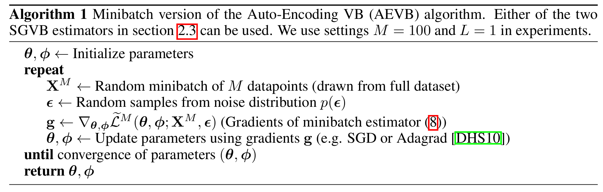

# Auto-Encoding Variational Bayes
Kingma et al.

## 2. Method
- Problem Setting)
  - Assumptions)
    - i.i.d. dataset with latent variables per datapoint
    - fixed dataset for simplicity
      - But can be applied to online, non-stationary settings
  - Goal)
    - Perform on the global parameters either
      - maximum likelihood (ML) inference
      - maximum a posteriori (MAP) inference
    - Perform variational inference on the latent variables
    - Extend to performing variational inference on the global parameters

### 2.1 Problem Scenario
- Settings)
  - $`\mathbf{X} = \{\mathbf{x}^{(i)}\}_{i=1}^N`$ : i.i.d. dataset
    - i.e.) samples of some continuous or discrete variable $`\mathbf{x}`$
  - $`\mathbf{z}`$ : an unobserved continuous random variable that generated the data $`\mathbf{X}`$ in two steps
    - a value $`\mathbf{z}^{(i)}`$ is generated from some **prior** distribution $`p_{\boldsymbol{\theta}^*}(\mathbf{z})`$
    - a value $`\mathbf{x}^{(i)}`$ is generated from some conditional (**likelihood**) distribution $`p_{\boldsymbol{\theta}^*}(\mathbf{x\vert z})`$
  - $`p_{\boldsymbol{\theta}^*}(\mathbf{z})`$ and $`p_{\boldsymbol{\theta}^*}(\mathbf{x\vert z})`$
    - came from parametric families of distributions $`p_{\boldsymbol{\theta}}(\mathbf{z})`$ and $`p_{\boldsymbol{\theta}}(\mathbf{x\vert z})`$
    - their PDFs are differentiable almost everywhere w.r.t. both $`\boldsymbol{\theta, z}`$
  - No common simplifying assumptions about the marginal or posterior probabilities.
    - cf.) Still the algorithm works well in cases of...
      - Intractable
        - $`p_{\boldsymbol{\theta}}(\mathbf{x}) = \displaystyle\int p_{\boldsymbol{\theta}}(\mathbf{z})\; p_{\boldsymbol{\theta}}(\mathbf{x\vert z}) \text{d}\mathbf{z}`$ : the marginal likelihood
        - $`p_{\boldsymbol{\theta}}(\mathbf{z\vert x}) = \displaystyle\frac{p_{\boldsymbol{\theta}}(\mathbf{x\vert z})p_{\boldsymbol{\theta}}(\mathbf{z})}{p_{\boldsymbol{\theta}}(\mathbf{x})} `$ : the posterior distribution
      - Large Dataset
  - $`q_{\boldsymbol{\phi}}(\mathbf{z\vert x})`$ : the recognition model
    - Desc.)
      - $`q_{\boldsymbol{\phi}}(\mathbf{z\vert x})`$ is an approximation to the intractable true posterior $`p_{\boldsymbol{\theta}}(\mathbf{z\vert x})`$
    - Props.)
      - It is not necessarily factorial.
      - Its parameters $`\boldsymbol{\phi}`$ are not computed from me closed-form expectation.
- Application)
  - This model can be used in solving...
    - Approximate $`\boldsymbol{\theta}_{\text{ML}}`$ or $`\boldsymbol{\theta}_{\text{MAP}}`$
    - Approximate posterior inference of the latent variable $`\mathbf{z}`$ given $`\mathbf{x}`$
      - i.e.) $`p_{\boldsymbol{\theta}}(\mathbf{z\vert x})`$
    - Approximate marginal inference of the variable $`\mathbf{x}`$
      - When?)
        - Cases where a prior over $`\mathbf{x}`$ is required.
      - e.g.)
        - image denoising, inpainting, super-resolution

 

### 2.2 The Variational Bound
#### Concept) The Variational Lower Bound (ELBO)
- Def.) ELBO 
  - $`\mathcal{L}(\boldsymbol{\theta,\phi};\mathbf{x}^{(i)})`$ : the variational lower bound on the marginal likelihood of datapoint $`i`$
    - where 
      - $`\mathcal{L}(\boldsymbol{\theta,\phi};\mathbf{x}^{(i)}) = \mathbb{E}_{q_{\boldsymbol{\phi}}(\mathbf{z\vert x})} \left[ \log p_{\boldsymbol{\theta}}(\mathbf{x,z}) - \log q_{\boldsymbol{\phi}}(\mathbf{z\vert x}) \right]`$
- Derivation)
  - Consider the log likelihood $`\log p_{\boldsymbol{\theta}}(\mathbf{x})`$ can be rewritten as   
    $`\begin{aligned}
      \log p_{\boldsymbol{\theta}}(\mathbf{x}) 
      &= \log\displaystyle\int p_{\boldsymbol{\theta}}(\mathbf{x,z}) \text{d}\mathbf{z} \\
      &= \log\displaystyle\int q_{\boldsymbol{\phi}}(\mathbf{z\vert x}) \frac{p_{\boldsymbol{\theta}}(\mathbf{x,z})}{q_{\boldsymbol{\phi}}(\mathbf{z\vert x})} \text{d}\mathbf{z} \\
      &= \log \mathbb{E}_{q_{\boldsymbol{\phi}}(\mathbf{z\vert x})} \left[\displaystyle\frac{p_{\boldsymbol{\theta}}(\mathbf{x,z})}{q_{\boldsymbol{\phi}}(\mathbf{z\vert x})}\right]
    \end{aligned}`$.
  - Since $`\log`$ is concave, Jensen's Inequality gives
    $`\begin{aligned}
      \log p_{\boldsymbol{\theta}}(\mathbf{x}) = \log \mathbb{E}_{q_{\boldsymbol{\phi}}(\mathbf{z\vert x})} \left[\displaystyle\frac{p_{\boldsymbol{\theta}}(\mathbf{x,z})}{q_{\boldsymbol{\phi}}(\mathbf{z\vert x})}\right] &\ge \mathbb{E}_{q_{\boldsymbol{\phi}}(\mathbf{z\vert x})} \left[ \log \displaystyle\frac{p_{\boldsymbol{\theta}}(\mathbf{x,z})}{q_{\boldsymbol{\phi}}(\mathbf{z\vert x})}\right] \\
      &= \underbrace{\mathbb{E}_{q_{\boldsymbol{\phi}}(\mathbf{z\vert x})} \left[ \log p_{\boldsymbol{\theta}}(\mathbf{x,z}) - \log q_{\boldsymbol{\phi}}(\mathbf{z\vert x}) \right]}_{\text{ELBO!}} \\
      &\triangleq \mathcal{L}(\boldsymbol{\theta,\phi};\mathbf{x}^{(i)})
    \end{aligned}`$

- Props.)
  - $`\underbrace{\log p_{\boldsymbol{\theta}} \left( \mathbf{x}^{(i)} \right)}_{\text{marginal likelihood of a datapoint}} = \underbrace{D_{KL} \left( \left. q_{\boldsymbol{\phi}} \left(\mathbf{z\vert x}^{(i)} \right) \right\Vert p_{\boldsymbol{\theta}} \left(\mathbf{z\vert x}^{(i)} \right)  \right)}_{\text{KL-div of the approximate from the true posterior}} + \mathcal{L}(\boldsymbol{\theta,\phi};\mathbf{x}^{(i)})`$
    - pf.) 
      - Considering the log marginal likelihood, we have   
        $`\begin{aligned}
          \log p_{\boldsymbol{\theta}}(\mathbf{x}) 
          &= \mathbb{E}_{q_{\boldsymbol{\phi}}(\mathbf{z\vert x})} \left[ \log p_{\boldsymbol{\theta}}(\mathbf{x}) \right] & (\because p_{\boldsymbol{\theta}}(\mathbf{x}) \text{ is indep. of } \mathbf{z}) \\
          &= \mathbb{E}_{q_{\boldsymbol{\phi}}(\mathbf{z\vert x})} \left[ \displaystyle \log \frac{p_{\boldsymbol{\theta}}(\mathbf{x,z})}{p_{\boldsymbol{\theta}}(\mathbf{z\vert x})} \right]  \\
          &= \mathbb{E}_{q_{\boldsymbol{\phi}}(\mathbf{z\vert x})} \left[ \displaystyle \log \frac{p_{\boldsymbol{\theta}}(\mathbf{x,z})}{p_{\boldsymbol{\theta}}(\mathbf{z\vert x})} \right]
        \end{aligned}`$
      - By definition of ELBO, we have   
        $`\begin{aligned}
          \log p_{\boldsymbol{\theta}}(\mathbf{x}) - \mathcal{L}(\boldsymbol{\theta,\phi};\mathbf{x}) 
          &= \mathbb{E}_{q_{\boldsymbol{\phi}}(\mathbf{z\vert x})} \left[ \displaystyle \log \frac{p_{\boldsymbol{\theta}}(\mathbf{x,z})}{p_{\boldsymbol{\theta}}(\mathbf{z\vert x})} \right] - \mathbb{E}_{q_{\boldsymbol{\phi}}(\mathbf{z\vert x})} \left[ \log \displaystyle\frac{p_{\boldsymbol{\theta}}(\mathbf{x,z})}{q_{\boldsymbol{\phi}}(\mathbf{z\vert x})}\right] \\
          &= \mathbb{E}_{q_{\boldsymbol{\phi}}(\mathbf{z\vert x})} \left[ \displaystyle \log \frac{q_{\boldsymbol{\phi}}(\mathbf{z\vert x})}{p_{\boldsymbol{\theta}}(\mathbf{z\vert x})} \right] \\
          &= D_{KL}(q_{\boldsymbol{\phi}}(\mathbf{z\vert x}) \Vert p_{\boldsymbol{\theta}}(\mathbf{z\vert x}))
        \end{aligned}`$
    - cf.)
      - We may get the marginal likelihood as
        - $`\log p_{\boldsymbol{\theta}} \left( \mathbf{x}^{(1)}, \cdots, \mathbf{x}^{(N)}  \right) = \displaystyle\sum_{i=1}^N \log p_{\boldsymbol{\theta}} \left(\mathbf{x}^{(i)} \right)`$
    - cf.) KL-Divergence's non-negativity corresponds with ELBO as the lower bound of the log marginal liklihood.
      - Consider that the KL-divergence is non-negative.
      - Thus,   
        $`\begin{aligned}
            \log p_{\boldsymbol{\theta}} \left( \mathbf{x}^{(i)} \right) &= \underbrace{D_{KL} \left( \left. q_{\boldsymbol{\phi}} \left(\mathbf{z\vert x}^{(i)} \right) \right\Vert p_{\boldsymbol{\theta}} \left(\mathbf{z\vert x}^{(i)} \right)  \right)}_{\text{always non negative}} + \mathcal{L}(\boldsymbol{\theta,\phi};\mathbf{x}^{(i)}) \\
            &\ge \mathcal{L}(\boldsymbol{\theta,\phi};\mathbf{x}^{(i)}) \\
            &= \mathbb{E}_{q_{\boldsymbol{\phi}}(\mathbf{z\vert x}^{(i)})}\left[ \log q_{\boldsymbol{\phi}} \left(\mathbf{z\vert x}^{(i)} \right) -\log p_{\boldsymbol{\theta}} \left(\mathbf{z, x}^{(i)} \right) \right] & \text{(Check Prop.1 below.)}
        \end{aligned}`$
- Props. from the Paper)
  - $`\mathcal{L}(\boldsymbol{\theta,\phi};\mathbf{x}^{(i)}) = \mathbb{E}_{q_{\boldsymbol{\phi}}(\mathbf{z\vert x}^{(i)})}\left[ \log q_{\boldsymbol{\phi}} \left(\mathbf{z\vert x}^{(i)} \right) -\log \left( p_{\boldsymbol{\theta}} \left(\mathbf{z, x}^{(i)} \right)  \right) \right]`$
    - pf.)
      - By definition, we have   
        $`\begin{array}{clll}
            \mathcal{L}(\boldsymbol{\theta,\phi};\mathbf{x}^{(i)}) 
            &= \log p_{\boldsymbol{\theta}} \left( \mathbf{x}^{(i)} \right) &-& D_{KL} \left( \left. q_{\boldsymbol{\phi}} \left(\mathbf{z\vert x}^{(i)} \right) \;\right\Vert\; p_{\boldsymbol{\theta}} \left(\mathbf{z\vert x}^{(i)} \right)  \right) \\
            &= \log p_{\boldsymbol{\theta}} \left( \mathbf{x}^{(i)} \right) &-& \mathbb{E}_{q_{\boldsymbol{\phi}}(\mathbf{z\vert x}^{(i)})}\left[ \log\left( \displaystyle\frac{q_{\boldsymbol{\phi}} \left(\mathbf{z\vert x}^{(i)} \right)}{p_{\boldsymbol{\theta}} \left(\mathbf{z\vert x}^{(i)} \right)} \right) \right] \\
            &= \log p_{\boldsymbol{\theta}} \left( \mathbf{x}^{(i)} \right) &-& \mathbb{E}_{q_{\boldsymbol{\phi}}(\mathbf{z\vert x}^{(i)})}\left[ \log q_{\boldsymbol{\phi}} \left(\mathbf{z\vert x}^{(i)} \right) -\log \left( \displaystyle\frac{p_{\boldsymbol{\theta}} \left(\mathbf{z, x}^{(i)} \right)}{p_{\boldsymbol{\theta}} \left(\mathbf{x}^{(i)} \right)} \right) \right] \\
            &= \log p_{\boldsymbol{\theta}} \left( \mathbf{x}^{(i)} \right) &-& \mathbb{E}_{q_{\boldsymbol{\phi}}(\mathbf{z\vert x}^{(i)})}\left[ \log q_{\boldsymbol{\phi}} \left(\mathbf{z\vert x}^{(i)} \right) -\log p_{\boldsymbol{\theta}} \left(\mathbf{z, x}^{(i)} \right) \right] - \log p_{\boldsymbol{\theta}} \left(\mathbf{x}^{(i)} \right) 
        \end{array}`$
      - Therefore,
        - $`\mathcal{L}(\boldsymbol{\theta,\phi};\mathbf{x}^{(i)}) = \mathbb{E}_{q_{\boldsymbol{\phi}}(\mathbf{z\vert x}^{(i)})}\left[ \log q_{\boldsymbol{\phi}} \left(\mathbf{z\vert x}^{(i)} \right) -\log p_{\boldsymbol{\theta}} \left(\mathbf{z, x}^{(i)} \right) \right] \quad\cdots\quad (A)`$
  - $`\mathcal{L}(\boldsymbol{\theta,\phi};\mathbf{x}^{(i)}) = -D_{KL}\left(\left. q_{\boldsymbol{\phi}} \left(\mathbf{z\vert x}^{(i)} \right) \;\right\Vert\; p_{\boldsymbol{\theta}}(\mathbf{z}) \right) + \mathbb{E}_{q_{\boldsymbol{\phi}}(\mathbf{z\vert x})}\left[ \log  p_{\boldsymbol{\theta}} \left(\mathbf{x}^{(i)}\vert\mathbf{z} \right) \right]`$
    - pf.)
      - From $`\text{(A)}`$, we have   
        $`\begin{array}{cl}
          \mathcal{L}(\boldsymbol{\theta,\phi};\mathbf{x}^{(i)}) 
          &= \mathbb{E}_{q_{\boldsymbol{\phi}}(\mathbf{z\vert x}^{(i)})}\left[ \log q_{\boldsymbol{\phi}} \left(\mathbf{z\vert x}^{(i)} \right) -\log p_{\boldsymbol{\theta}} \left(\mathbf{z, x}^{(i)} \right) \right] \\
          &= \mathbb{E}_{q_{\boldsymbol{\phi}}(\mathbf{z\vert x}^{(i)})}\left[ \log q_{\boldsymbol{\phi}} \left(\mathbf{z\vert x}^{(i)} \right) -\log p_{\boldsymbol{\theta}} \left(\mathbf{z, x}^{(i)} \right) + \log p_{\boldsymbol{\theta}}(\mathbf{z}) - \log p_{\boldsymbol{\theta}}(\mathbf{z}) \right] \\
          &= \mathbb{E}_{q_{\boldsymbol{\phi}}(\mathbf{z\vert x}^{(i)})}\left[ \log q_{\boldsymbol{\phi}} \left(\mathbf{z\vert x}^{(i)} \right)- \log p_{\boldsymbol{\theta}}(\mathbf{z}) \right] + \mathbb{E}_{q_{\boldsymbol{\phi}}(\mathbf{z\vert x}^{(i)})}\left[ -\log p_{\boldsymbol{\theta}} \left(\mathbf{z, x}^{(i)} \right) + \log p_{\boldsymbol{\theta}}(\mathbf{z})\right] \\
          &= -D_{KL}\left(\left. q_{\boldsymbol{\phi}} \left(\mathbf{z\vert x}^{(i)} \right) \;\right\Vert\; p_{\boldsymbol{\theta}}(\mathbf{z}) \right) + \mathbb{E}_{q_{\boldsymbol{\phi}}(\mathbf{z\vert x})}\left[ \log  p_{\boldsymbol{\theta}} \left(\mathbf{x}^{(i)}\vert\mathbf{z} \right) \right]
        \end{array}`$
- Intuition)
  - We want to know $`p_{\boldsymbol{\theta}}(\mathbf{x})`$.
    - Why?)
      - We want a generative model!
  - However, it is impossible to obtain $`p_{\boldsymbol{\theta}}(\mathbf{x})`$ directly.
    - Why?)
      - Suppose there exists a latent variable $`\mathbf{z}`$ that generates $`\mathbf{x}`$
      - Then, the marginal likelihood of $`\mathbf{x}`$ is defined as
        - $`p_{\boldsymbol{\theta}}(\mathbf{x}) = \displaystyle\int p_{\boldsymbol{\theta}}(\mathbf{x\vert z})p(\mathbf{z}) \text{d}\mathbf{z}`$
        - Why?) Intuitionally...
          - In order to make our model consider all possible latent variables, we should average out $`\mathbf{z}`$
          - If not, out model may be biased to certain value of the latent variable $`\mathbf{z}'`$
      - The problem is that the above integral is intractable : $`p_{\boldsymbol{\theta}}(\mathbf{x}) = \displaystyle\int p_{\boldsymbol{\theta}}(\mathbf{x\vert z})p(\mathbf{z}) \text{d}\mathbf{z}`$
  - Instead, we may consider the posterior distribution $`p_{\boldsymbol{\theta}}(\mathbf{z\vert x})`$.
    - Why?)
      - We can observe $`\mathbf{x}`$ and the posterior $`p_{\boldsymbol{\theta}}(\mathbf{z\vert x})`$ enables estimating $`\mathbf{z}`$ with $`\mathbf{x}`$
  - Using the Bayes Rule, we may get
    - $`p_{\boldsymbol{\theta}}(\mathbf{z\vert x}) = \displaystyle\frac{p_{\boldsymbol{\theta}}(\mathbf{x\vert z})p(\mathbf{z})}{p_{\boldsymbol{\theta}}(\mathbf{x})}`$ where $`\displaystyle p_{\boldsymbol{\theta}}(\mathbf{x}) =\int p_{\boldsymbol{\theta}}(\mathbf{x\vert z})p(\mathbf{z}) \text{d}\mathbf{z}`$
  - Now, consider a family of tractable distribution $`q_{\boldsymbol{\phi}}(\mathbf{z\vert x})`$
    - What if we find a distribution $`q_{\boldsymbol{\phi}^*}(\mathbf{z\vert x})`$ that is closest to $`p(\mathbf{z\vert x})`$?
      - How?)
        - Minimize the KL-Divergence between $`p_{\boldsymbol{\theta}}(\mathbf{z\vert x})`$ and $`q_{\boldsymbol{\phi}^*}(\mathbf{z\vert x})`$.
        - We can rewrite $`p(\mathbf{x})`$ as the sum of KL-Divergence and ELBO $`\mathcal{L}(\boldsymbol{\theta,\phi};\mathbf{x}^{(i)})`$
        - Since KL-Divergence is non-negative, ELBO is the lower bound of $`p(\mathbf{x})`$
  - Log likelihood $`p_{\boldsymbol{\theta}}(\mathbf{z})`$ maximization problem and ELBO $`\mathcal{L}`$ maximization problem is identical to the minimization problem of the KL-Divergence between $`p_{\boldsymbol{\theta}}(\mathbf{z\vert x})`$ and $`q_{\boldsymbol{\phi}^*}(\mathbf{z\vert x})`$.
- Optimization)
  - We want to maximize the ELBO $`\mathcal{L}`$, which is the lower bound of the log likelihood.
  - Recall that ELBO was defined as
    - $`\mathcal{L}(\boldsymbol{\theta,\phi};\mathbf{x}^{(i)}) = \mathbb{E}_{q_{\boldsymbol{\phi}}(\mathbf{z\vert x}^{(i)})}\left[ \log q_{\boldsymbol{\phi}} \left(\mathbf{z\vert x}^{(i)} \right) -\log p_{\boldsymbol{\theta}} \left(\mathbf{z, x}^{(i)} \right) \right]`$
  - Since $`q_{\boldsymbol{\phi}} \left(\mathbf{z\vert x}^{(i)} \right)`$ is what we decide, we can choose a differentiable $`q`$ and apply optimization methods.
  - However, $`p_{\boldsymbol{\theta}} \left(\mathbf{z, x}^{(i)} \right)`$ is a probability distribution dependent on the given data $`\mathbf{x}`$.
  - Thus, we consider a function $`f(\mathbf{z}) = \log p_{\boldsymbol{\theta}} \left(\mathbf{z, x}^{(i)} \right)`$, which gradient is tractable, so that we can apply optimization algorithms.
    - How?)
      - Approach 1) Naive Monte Carlo Gradient Estimator   
        $`\begin{aligned}
          \nabla_{\boldsymbol{\phi}} \mathbb{E}_{q_{\boldsymbol{\phi}}(\mathbf{z})} \left[ f(\mathbf{z}) \right]
          &= \mathbb{E}_{q_{\boldsymbol{\phi}}(\mathbf{z})} \left[ f(\mathbf{z}) \nabla_{q_{\boldsymbol{\phi}}(\mathbf{z})} \log q_{\boldsymbol{\phi}} (\mathbf{z}) \right] \\
          &\simeq \displaystyle\frac{1}{L}\sum_{l=1}^L f(\mathbf{z}^{(l)}) \nabla_{q_{\boldsymbol{\phi}}(\mathbf{z})} \log q_{\boldsymbol{\phi}} (\mathbf{z}^{(l)})
        \end{aligned}`$
        - Drawback)
          - high variance $`\rightarrow`$ Unstable gradient $`\rightarrow \max \tilde{\mathcal{L}}`$ problem becomes hard to solve. 
          - impractical for this paper's purpose
      - Approach 2) [SGVB estimator](#concept-stochastic-gradient-variational-bayes-sgvb-estimator) with [AEVB algorithm](#23-the-sgvb-estimator-and-aevb-algorithm)
        - What this paper suggests!

 

### 2.3 The SGVB estimator and AEVB algorithm
#### Concept) Stochastic Gradient Variational Bayes (SGVB) Estimator
- Objective)
  - We want to form Monte Carlo estimates of **expectations** of some function $`f(\mathbf{z})`$ w.r.t. $`q_{\boldsymbol{\phi}}(\mathbf{z\vert x})`$
- Estimators)
  - Version A : $`\tilde{\mathcal{L}}^{A} \left( \boldsymbol{\theta, \phi}; \mathbf{x}^{(i)} \right)`$
    - Def.) 
      - $`\tilde{\mathcal{L}}^{A} \left( \boldsymbol{\theta, \phi}; \mathbf{x}^{(i)} \right) = \displaystyle\frac{1}{L} \sum_{l=1}^L \log p_{\boldsymbol{\theta}} \left( \mathbf{x}^{(i)}, \mathbf{z}^{(i,l)} \right) - \log_{q_{\boldsymbol{\phi}}} \left( \mathbf{z}^{(i,l)} \mid \mathbf{x}^{(i)} \right)`$
        - where 
          - $`\mathbf{z}^{(i,l)} = g_{\boldsymbol{\phi}} \left( \boldsymbol{\epsilon^{(i,l)}}, \mathbf{x}^{(i)} \right)`$ : a differentiable transformation
          - $`\boldsymbol{\epsilon}^{(l)} \sim p(\boldsymbol{\epsilon})`$ : an (auxiliary) noise variable
            - cf.) How to choose $`g_{\boldsymbol{\phi}} \left( \boldsymbol{\epsilon^{(i,l)}}, \mathbf{x}^{(i)} \right)`$ and $`p(\boldsymbol{\epsilon})`$ are described in [2.4](#24-the-reparameterization-trick).
  - Version B : $`\tilde{\mathcal{L}}^{B} \left( \boldsymbol{\theta, \phi}; \mathbf{x}^{(i)} \right)`$
    - Def.) 
      - $`\tilde{\mathcal{L}}^{B} \left( \boldsymbol{\theta, \phi}; \mathbf{x}^{(i)} \right) = -D_{KL} \left( q_{\boldsymbol{\phi}} \left. \left(\mathbf{z\vert x}^{(i)} \right) \right\Vert  p_{\boldsymbol{\theta}}(\mathbf{z}) \right) + \displaystyle\frac{1}{L} \sum_{l=1}^L \log p_{\boldsymbol{\theta}} (\mathbf{x}^{(i)} \vert \mathbf{z}^{(i,l)})`$
        - where
          - $`\mathbf{z}^{(i,l)} = g_{\boldsymbol{\phi}} \left( \boldsymbol{\epsilon^{(i,l)}}, \mathbf{x}^{(i)} \right)`$ : a differentiable transformation
          - $`\boldsymbol{\epsilon}^{(l)} \sim p(\boldsymbol{\epsilon})`$ : an (auxiliary) noise variable
  - Minibatch Version : $`\tilde{\mathcal{L}}^{M} \left( \boldsymbol{\theta, \phi}; \mathbf{X}^{M} \right)`$
    - Def.) 
      - For 
        - $`\mathbf{X} = \left\{ \mathbf{x}^{(i)} \right\}_{i=1}^N`$ : the full dataset with $`N`$ datapoints
        - $`\mathbf{X}^M = \left\{ \mathbf{x}^{(i)} \right\}_{i=1}^M`$ : the minibatch
          - i.e.) A randomly drawn $`M`$ sample datapoints from the full dataset $`\mathbf{X}`$
      - the minibatch SGVB estimator can be defined as
        - $`\mathcal{L}(\boldsymbol{\theta,\phi}; \mathbf{X}) \simeq \tilde{\mathcal{L}}^M (\boldsymbol{\theta,\phi}; \mathbf{X}^M) = \displaystyle\frac{N}{M}\sum_{i=1}^M \tilde{\mathcal{L}}(\boldsymbol{\theta,\phi};\mathcal{x}^{(i)})`$
- Props.)
  - Here, the posterior is assumed to be $`q_{\boldsymbol{\phi}}(\mathcal{z\vert x})`$.
    - However, this technique can be applied to the un-conditioned case.
      - i.e.) $`q_{\boldsymbol{\phi}}(\mathcal{z})`$
  - Using the [reparameterization trick](#24-the-reparameterization-trick), we can reparameterize the random variable $`\tilde{\mathbf{z}}\sim q_{\boldsymbol{\phi}}(\mathcal{z\vert x})`$ with
    - $`g_{\boldsymbol{\phi}} \left( \boldsymbol{\epsilon}, \mathbf{x} \right)`$ : a differentiable transformation
    - $`\boldsymbol{\epsilon} \sim p(\boldsymbol{\epsilon})`$ : an (auxiliary) noise variable
  - All SGVB estimators are differentiable.
    - i.e.) $`\nabla_{\boldsymbol{\theta, \phi}}\; \tilde{\mathcal{L}} \left( \boldsymbol{\theta}; \mathbf{X}^M \right)`$ is obtainable.
    - Thus, we can apply stochastic optimization methods.
      - e.g.) SGD, Adagrad

 

#### Algorithm) Auto-Encoding Variational Bayes (AEVB) Algorithm

 

### 2.4 The Reparameterization Trick
- Goal)
  - Make the sampling process differentiable w.r.t. $`\boldsymbol{\phi}`$, so that we can optimize the ELBO with gradient methods.
- How)
  - Let 
    - $`\mathbf{z}`$ : a continuous random variable
    - $`\mathbf{z}\sim q_{\boldsymbol{\phi}}(\mathcal{z\vert x})`$ : some conditional distribution
  - Then we may express $`\mathbf{z}`$ as
    - $`\mathbf{z} = g_{\boldsymbol{\phi}}(\boldsymbol{\epsilon}, \mathbf{x})`$
      - where
        - $`\boldsymbol{\epsilon}`$ : an auxiliary variable with independent marginal distribution of $`p(\boldsymbol{\epsilon})`$
          - i.e.) $`\boldsymbol{\epsilon} \sim p(\boldsymbol{\epsilon})`$
        - $`g_{\boldsymbol{\phi}}(\cdot)`$ : some vector-valued function parameterized by $`\boldsymbol{\phi}`$
- Prop.)
  - $`\mathbf{z} = g_{\boldsymbol{\phi}}(\boldsymbol{\epsilon}, \mathbf{x})`$ can be used to rewrite an expectation w.r.t. $`q_{\boldsymbol{\phi}}(\mathcal{z\vert x})`$ that is differentiable w.r.t. $`\boldsymbol{\phi}`$
    - Desc.)
      - Recall that we wanted to solve    
        $`\begin{aligned}
          \arg\max_{\mathbf{x}} \log p_{\boldsymbol{\theta}}(\mathbf{x}) 
          &\approx \mathcal{L}(\boldsymbol{\theta,\phi};\mathbf{x}) \\
          &= \mathbb{E}_{q_{\boldsymbol{\phi}}(\mathbf{z\vert x})}\left[ \log q_{\boldsymbol{\phi}} \left(\mathbf{z\vert x} \right) -\log \left( p_{\boldsymbol{\theta}} \left(\mathbf{z, x} \right)  \right) \right] \\
          &\approx \mathbb{E}_{q_{\boldsymbol{\phi}}(\mathbf{z\vert x})}\left[ f(\mathbf{z}) \right] \quad (\exists f(\mathbf{z})=\log p_{\boldsymbol{\theta}}(\mathbf{x,z}))
        \end{aligned}`$
      - To optimize the problem, we should get $`\nabla_{\boldsymbol{\phi}} \mathbb{E}_{q_{\boldsymbol{\phi}}(\mathbf{z\vert x}^{(i)})}\left[ f(\mathbf{z}) \right]`$.
      - This method enables   
        $`\begin{array}{}
          \nabla_{\boldsymbol{\phi}} \mathbb{E}_{q_{\boldsymbol{\phi}}(\mathbf{z\vert x})}\left[ f(\mathbf{z}) \right] 
          &= \nabla_{\boldsymbol{\phi}} \displaystyle\int & q_{\boldsymbol{\phi}}(\mathbf{z\vert x}) & f(\mathbf{z}) & \text{d}\mathbf{z} \\
          &= \nabla_{\boldsymbol{\phi}} \displaystyle\int & p(\boldsymbol{\epsilon}) & f(g_{\boldsymbol{\phi}}(\boldsymbol{\epsilon}, \mathbf{x})) & \text{d}\boldsymbol{\epsilon}
        \end{array}`$
      - With it, we can construct a differentiable estimator
        - $`\displaystyle\int  q_{\boldsymbol{\phi}}(\mathbf{z\vert x})  f(\mathbf{z})  \text{d}\mathbf{z} \simeq \frac{1}{L} \sum_{l=1}^L f(g_{\boldsymbol{\phi}}(\boldsymbol{\epsilon}, \mathbf{x}))`$
          - where $`\boldsymbol{\epsilon}^{(l)} \sim p(\boldsymbol{\epsilon})`$
    - Pf.)
      - Given the deterministic mapping $`\mathbf{z} = g_{\boldsymbol{\phi}}(\boldsymbol{\epsilon}, \mathbf{x})`$, we have   
        $`\begin{aligned}
          q_{\boldsymbol{\phi}}(\mathbf{z\vert x}) \prod_i \text{d} z_i &= p(\boldsymbol{\epsilon}) \prod_i \text{d} \epsilon_i
        \end{aligned}`$
      - Thus, 
        - $`\displaystyle\int q_{\boldsymbol{\phi}}(\mathbf{z\vert x}) f(\mathbf{z}) \text{d}\mathbf{z} = \int p(\boldsymbol{\epsilon}) f(g_{\boldsymbol{\phi}}(\boldsymbol{\epsilon}, \mathbf{x})) \text{d}\boldsymbol{\epsilon}`$
- Suggested $`g_{\boldsymbol{\phi}}(\cdot)`$ and $`\boldsymbol{\epsilon}\sim p(\boldsymbol{\epsilon})`$
  - Tractable inverse CDF existing case
    - e.g.)
      - Exponential, Cauchy, Logistic, Rayleigh, Pareto, Weibull, Reciprocal, Gompertz,Gumbel, and Erlangdistributions
  - "Location-Scale" family of distributions
    - e.g.)
      - [Gaussian](#eg-gaussian), Laplace, Elliptical, Student’s t, Logistic, Uniform, Triangular  distributions
  - Composition of the above distributions
    - e.g.)
      - Log-Normal : exponentiation of normally distributed variable
      - Gamma : a sum over exponentially distributed variables
      - Dirichlet : weighted sumof Gamma variates
      - Beta
      - Chi-Squared
      - F distribution

#### e.g.) Gaussian
  - We may assume $`z\sim p(z\mid x) = \mathcal{N}(\mu, \sigma^2)`$.
  - Then a valid reparameterization $`g_{\boldsymbol{\phi}}(\boldsymbol{\epsilon}, \mathbf{x})`$ is
    - $`z = \mu + \sigma \epsilon`$
      - where $`\epsilon\sim\mathcal{N}(0,1)`$
  - Thus, we may get the estimator of   
    $`\begin{aligned}
      \mathbb{E}_{\mathcal{N}(z;\mu,\sigma^2)}[f(z)] 
      &= \mathbb{E}_{\mathcal{N}(\epsilon; 0,1)}[f(\mu + \sigma\epsilon)] \\
      &\simeq \frac{1}{L}\sum_{l=1}^L f(\mu + \sigma\epsilon^{(l)}) \text{ where } \epsilon^{(l)}\sim\mathcal{N}(0,1)
    \end{aligned}`$