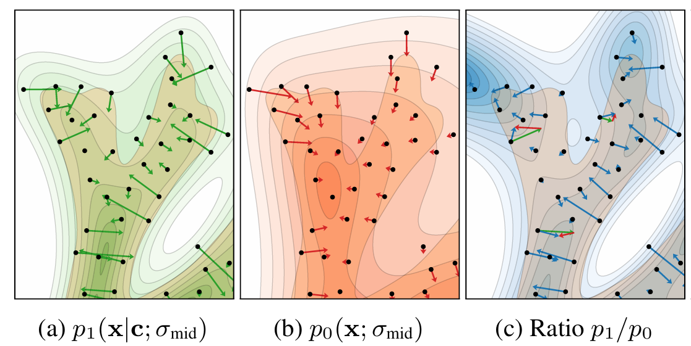

[Back to Main](../../../main.md)

 

# Guiding a Diffusion Model with a Bad Version of Itself
Karras et al. 2024

## 2. Background
### Concept) Denoising Diffusion
- Problem Setting)
  - $`p_{\text{data}}(\mathbf{x})`$ : the data distribution
  - $`p(\mathbf{x};\sigma) = p_{\text{data}}(\mathbf{x}) * \mathcal{N}(\mathbf{x};\; \mathbf{0}, \sigma^2\mathbf{I})`$ : a sequence of increasingly smoothed densities
    - where
      - $`\sigma\in[0, \sigma_{\max}]`$ : the continuous noise level
        - Scheduled with $`\sigma(t)=t`$ in this paper.
      - $`p(\mathbf{x};\sigma_{\max}) \approx \mathcal{N}(\mathbf{x};\; \mathbf{0}, \sigma_{\max}^2\mathbf{I})`$ : pure noise!
  - $`\text{d}\mathbf{x}_{\sigma} = -\sigma \nabla_{\mathbf{x}_{\sigma}} \log p(\mathbf{x}_{\sigma}; \sigma) \text{d}\sigma`$ : the probability flow ODE
    - where
      - $`\mathbf{x}_{\sigma}\sim p (\mathbf{x}_{\sigma};\sigma),\quad\forall\sigma\in[0, \sigma_{\max}]`$
      - $`\mathbf{x}_0 \sim p (\mathbf{x}_0; 0) = p_{\text{data}}(\mathbf{x}_0)`$ : the denoised sample!
    - Meaning)
      - As the noise level decreases ($`\text{d}(-\sigma)`$), the sample $`\mathbf{x}_\sigma`$ moves toward the direction that increases the score.
- Sol.)
  - The score function $`\nabla_{\mathbf{x}}\log p(\mathbf{x};\sigma)`$ for the given sample $`\mathbf{x}`$ and the noise level $`\sigma`$ to get the trajectory of $`\boldsymbol{\sigma}`$ is intractable.
  - Instead, we may set up a neural network $`D_\theta(\mathbf{x};\sigma)`$, and train for the denoising task of 
    - $`\theta = \displaystyle\arg\min_{\theta} \mathbb{E}_{\mathbf{y}\sim p_{\text{data}}, \sigma\sim p_{\text{train}}, \mathbf{n}\sim\mathcal{N}(\mathbf{0},\sigma^2\mathbf{I})} \big\Vert D_\theta(\mathbf{y+n};\;\sigma) - \mathbf{y} \big\Vert_2^2`$
      - where
        - $`\mathbf{y}\sim p_{\text{data}}`$ is the clean data
          - cf.) $`\mathbf{x} = \mathbf{y + n},\quad\mathbf{n}\sim\mathcal{N}(\mathbf{0},\sigma^2\mathbf{I})`$
        - $`p_{\text{train}}`$ controls the noise level distribution during training
          - e.g.) Uniform
      - Prop.)
        - $`\nabla_{\mathbf{x}} \log p(\mathbf{x}; \sigma) \approx \displaystyle\frac{D_\theta(\mathbf{x};\;\sigma)-\mathbf{x}}{\sigma^2}`$
- Conditional Case)
  - Let $`\mathbf{c}`$ be the label.
  - Given the label $`\mathbf{c}`$, we seek a sample from the conditional distribution $`p(\mathbf{x}\mid\mathbf{c};\;\sigma)`$
  - The denoiser network can be denoted as $`D_\theta(\mathbf{x};\sigma,\mathbf{c})`$

 

### Concept) Classifier-Free Guidance (CFG)
- Purpose)
  - Push the samples toward higher likelihood of the class label.
    - sacrificing the variety of generation
    - focusing on more canonical images that the network appears to be better capable of handling
  - To generate low [temperature](./classifier_free_guidance.md#concept-temperature) samples.
    - Why needed?)
      - The training objective of a DM aims to cover the entire data distribution.
      - Thus, for the low-probability regions, the model gets heavily penalized for not representing them.
      - However, the model does not have enough data to learn to generate good images corresponding to them.
      - As a result, low quality images are generated.
- Methodology)
  - Train a denoiser network to operate in both conditional and unconditional setting.
    - $`D_0(\mathbf{x};\sigma,\mathbf{c})`$ : 
    - $`D_1(\mathbf{x};\sigma,\mathbf{c})`$
  - The unconditional generation task specifies a result to avoid.
- Model)
  - General settings)
    - $`D_w(\mathbf{x};\sigma,\mathbf{c}) = w D_1(\mathbf{x};\sigma,\mathbf{c}) + (1-w)D_0(\mathbf{x};\sigma,\mathbf{c})`$
      - Choosing $`w\gt1`$, we may over-emphasize the output of $`D_1`$.
    - Recall that the [denoiser](#concept-denoising-diffusion) and the score function were equivalent as
      - $`\nabla_{\mathbf{x}} \log p(\mathbf{x}; \sigma) \approx \displaystyle\frac{D_\theta(\mathbf{x};\;\sigma)-\mathbf{x}}{\sigma^2}`$
    - Adding conditional condition $`\mathbf{c}`$ to the probability, we may rewrite as    
      $`\begin{aligned}
        D_w(\mathbf{x}\mid\mathbf{c};\;\sigma)
        &\approx \mathbf{x} + \sigma^2 \nabla_{\mathbf{x}} \log p_w(\mathbf{x}\mid\mathbf{c}; \sigma) & \cdots(A) \\
        &\varpropto \mathbf{x} + \sigma^2 \nabla_{\mathbf{x}} \log \Big( p_1(\mathbf{x}\mid\mathbf{c};\sigma)^w \cdot p_0(\mathbf{x}\mid\mathbf{c};\sigma)^{1-w} \Big) \\
        &= \mathbf{x} + \sigma^2 \nabla_{\mathbf{x}} \log \left( p_1(\mathbf{x}\mid\mathbf{c};\sigma) \cdot \left[\frac{p_1(\mathbf{x}\mid\mathbf{c};\sigma)}{p_0(\mathbf{x}\mid\mathbf{c};\sigma)}\right]^{w-1} \right) & \cdots(B)
      \end{aligned}`$
    - From (A) and (B), we may get
      - $`\displaystyle\nabla_{\mathbf{x}} \log p_w(\mathbf{x}\mid\mathbf{c}; \sigma) = \nabla_{\mathbf{x}} \log p_1(\mathbf{x}\mid\mathbf{c};\sigma) + (w-1) \nabla_{\mathbf{x}} \log \frac{p_1(\mathbf{x}\mid\mathbf{c};\sigma)}{p_0(\mathbf{x}\mid\mathbf{c};\sigma)}`$
    - Then considering the [probability flow ODE](#concept-denoising-diffusion), we have   
      $`\begin{aligned}
        \text{d}\mathbf{x}_{\sigma} 
        &= -\sigma \nabla_{\mathbf{x}_{\sigma}} \log p(\mathbf{x}_{\sigma}; \sigma) \text{d}\sigma \\
        &= -\sigma \left( \underbrace{\nabla_{\mathbf{x}} \log p_1(\mathbf{x}\mid\mathbf{c};\sigma)}_{\text{generation by }p_1} + (w-1) \underbrace{\nabla_{\mathbf{x}} \log \frac{p_1(\mathbf{x}\mid\mathbf{c};\sigma)}{p_0(\mathbf{x}\mid\mathbf{c};\sigma)}}_{\text{perturbation}} \right) \text{d}\sigma \\
      \end{aligned}`$
      - Interpretation)
        - The image generation consists of
          - the generation by the density $`p_1`$
          - the perturbation
            - i.e.) the increase in the likelihood that a hypothetical  classifier would attribute for the sample having come from density $`p_1`$ rather than $`p_0`$
            - i.e.) The direction that makes $`p_1`$ and $`p_0`$ more distinctive
            - Larger $`w`$, stronger effect
  - Classifier Free Guidance)
    - Let $`D_0`$ be unconditional : $`\mathbf{c}=\varnothing`$
      - i.e.) $`D_0(\mathbf{x};\sigma,\varnothing)`$ with $`p_0(\mathbf{x}\mid\sigma)`$
    - Put $`D_1 = D_\theta`$.
    - Then the above dynamics goes   
      $`\begin{aligned}
        \nabla_{\mathbf{x}} \log p_w(\mathbf{x}; \sigma) 
        &= \nabla_{\mathbf{x}} \log p_\theta(\mathbf{x}\mid\mathbf{c};\sigma) + (w-1) \nabla_{\mathbf{x}} \log \frac{p_\theta(\mathbf{x}\mid\mathbf{c};\sigma)}{p_0(\mathbf{x};\sigma)} \\
        &= \nabla_{\mathbf{x}} \log p_\theta(\mathbf{x}\mid\mathbf{c};\sigma) + (w-1) \nabla_{\mathbf{x}} \log \frac{p(\mathbf{c}\mid\mathbf{x};\sigma)}{p(\mathbf{c};\sigma)} \\
        &= \nabla_{\mathbf{x}} \log p_\theta(\mathbf{x}\mid\mathbf{c};\sigma) + (w-1) \nabla_{\mathbf{x}} \log p(\mathbf{c}\mid\mathbf{x};\sigma) - (w-1)  \nabla_{\mathbf{x}} \log p(\mathbf{c};\sigma) \\
        &= \nabla_{\mathbf{x}} \log p_\theta(\mathbf{x}\mid\mathbf{c};\sigma) + (w-1) \nabla_{\mathbf{x}} \log p(\mathbf{c}\mid\mathbf{x};\sigma) & (\because \nabla_{\mathbf{x}}\log p(\mathbf{c};\sigma)=0) \\
      \end{aligned}`$
    - From the above, we may get 
      - $`p_w(\mathbf{x}; \sigma) \varpropto p_\theta(\mathbf{x}\mid\mathbf{c};\sigma) \cdot \underbrace{p(\mathbf{c}\mid\mathbf{x};\sigma)^{w-1}}_{\text{implied density}}`$
    - This is different from the valid heat diffusion that add noise as
      - $`p(\mathbf{x}\mid\mathbf{c}; \sigma) = p_{\text{data}}(\mathbf{x}\mid\mathbf{c}) * \mathcal{N}(\mathbf{0},\sigma^2\mathbf{I})`$
    - This paper argues that this leads to
      - distorted sampling trajectories
      - exaggerated truncation
      - mode dropping in results
      - over saturation of colors
- Strength)
  - Improves the image quality
    - [Why?](#3-why-does-cfg-improve-image-quality)
- Drawbacks)
  - Limits its usage as a general low-temperature sampling model.
  - Applicable only for conditional generation
  - Sampling trajectory can **overshoot** the desired conditional distribution.
    - Result)
      - Skewed and often overly simplified image compositions.
  - The prompt alignment and quality improvement effects cannot be controlled separately.
    - Unclear how exactly they are related to each other.

 

## 3. Why does CFG improve image quality?
- Summary)
  - Score-based models tend to produce outlier outputs.
    - Why?)
      - The score matching objective is closely related to the ML estimation.
      - The ML estimation that utilizes the KL-Divergence leads to a conservative fit of the data distribution.
        - i.e.) Attempting to cover all training samples by giving extreme penalties to the model if it severely underestimates the likelihood of **any** training example. 
      - The conservative fit to data distribution results in generating strange and **unlikely** images from the distribution's extreme.
        - cf.) They are not learnt accurately but included just to avoid the high loss penalty.
  - [CFG](#concept-classifier-free-guidance-cfg) eliminates the outliers.
    - How?)
      - The unconditional denoiser $`D_0`$ underfits the data and results in alleviating the conservative fit of the score-based model.
        - Why?)
          - Recall that the CFG had two denoiser networks
            - $`D_0(\mathbf{x};\sigma)`$ : the unconditional denoiser
            - $`D_1(\mathbf{x};\sigma,\mathbf{c})`$ : the conditional denoiser
          - $`D_0`$ faces a more difficult task on that it has to generate from all classes at once.
            - Whereas $`D_1`$ can focus on a single class $`\mathbf{c}`$.
          - Given a small slice of training budget, $`D_0$ attains a worse fit to the data.
      - The perturbation term $`\displaystyle\nabla_{\mathbf{x}} \log \frac{p_1(\mathbf{x}\mid\mathbf{c};\sigma)}{p_0(\mathbf{x}\mid\mathbf{c})}`$ concentrates the samples to be drawn at the "good side" (where the training data is rich) of the data manifold.
        - Why?)
          - Unconditionally learned distribution $`p_0`$ has more spread out distribution compared to the conditional one $`p_1`$.
          - Thus, its ratio $`\displaystyle\frac{p_1}{p_0}`$ decrease sharply with distance from the manifold.   
            
          - Thus, the gradient $`\displaystyle\nabla_{\mathbf{x}} \log \frac{p_1(\mathbf{x}\mid\mathbf{c};\sigma)}{p_0(\mathbf{x};\sigma)}`$ point inward towards the data manifold.
          - This leads the model to sample more within the data manifold.

#### Model) 2D Toy Example
- Desc.)
  - Dataset is designed to exhibit...
    - Low Local Dimensionality for the zero noise case ($`\sigma = 0`$)
      - highly **anisotropic**
        - The data distribution is not uniform in all directions
        - It is stretched out along certain meaningful axes
        - Extremely thin in other, nonsensical directions
      - narrow **support**
        - "**Support**" refers to the region where data actually exists.
        - Even if you move along a meaningful "anisotropic" direction, straying even slightly from the path will result in an unrealistic image.
          - Why?) No data exists in that region!
    - Hierarchical emergence of local detail upon noise removal 
      - As noise decreases ($`\sigma\rightarrow0`$)...
        - Isotropic distribution becomes **anisotropic**.
        - **Support** gets narrower.
- Result) Sample Distribution   
      
  - (a) : the underlying distribution
  - (b) : CFG with no guidance.
    - Unlikely outlier samples are generated
  - (c) : CFG
    - **Overshoots** the correction and produces a narrow distribution than the ground truth.
    - However, this **overshooting** does not appear to have an adverse effect on images.
  - (d) : Naive Truncation
    - e.g.)
      - GAN's truncation techniques
      - Lowering temperature in generative language models
    - Desc.)
      - Concentrated in high-probability regions
      - But, isotropic with low diversity, oversimplified details, and monotone texture
  - (e) : Autoguidance
- Result) Gradient of each probability distributions    
      
  - (a) : Distribution learned by the conditional denoiser $`D_1(\mathbf{x}\mid\mathbf{c};\sigma)`$ with intermediate noise level $`\sigma_{\text{mid}}`$
    - Learned density approximates the underlying ground truth quite well
    - But, it fails to replicate its sharper details.
  - (b) : Distribution learned by the unconditional Denoiser $`D_0(\mathbf{x};\sigma)`$ with intermediate noise level $`\sigma_{\text{mid}}`$
    - Learned a further spread-out density compared to (a)
    - Looser fit to the data
  - (c) : The perturbation term
  - (d) : DM with no guidance
  - (e) : CFG with $`w=4`$

  

## 4. Our Method (Autoguidance)
- Key Idea)
  - Use the same frame work as the [CFG](#concept-classifier-free-guidance-cfg).
  - Generalize the $`D_0`$ into the weaker version of $`D_1`$.
    - cf.)
      - In [CFG](#concept-classifier-free-guidance-cfg), $`D_0`$ was the unconditional version of $`D_1`$, which had penalty of marginalizing all class conditions.
      - Here, $`D_0`$ is generalized to any weaker version of $`D_1`$ that has some penalty in training, so that it will underfit the data distribution.
  - The sampling distribution will be guided in two directions of...
    - maximizing the log likelihood of the original model $`\nabla_\mathbf{x}\log p_1(\mathbf{x}\mid\mathbf{c};\sigma)`$
    - avoiding the discrepancy between the original and the weaker models' distribution $`\displaystyle\nabla_{\mathbf{x}} \log \frac{p_1(\mathbf{x}\mid\mathbf{c};\sigma)}{p_0(\mathbf{x}\mid\mathbf{c};\sigma)}`$
- Ideation)
  - Recall that the [score matching objective](#concept-denoising-diffusion) tended to over-emphasize low probability regions of the data distribution.
  - This may due to various factors such as network architecture.
  - The problem is that we cannot expect to identify and characterize the specific issues a priori.
  - If we set up an additional weaker version of the same model, it may suffer more on similar errors in the same region.
    - $`D_1`$ : the high-quality model
    - $`D_0`$ : the poor-quality model
      - trained on the same task, conditioning, and data distribution as $`D_1`$
      - suffer from certain additional degradations
        - e.g.) low-capacity, under-training
  - By measuring the difference between the error made by the original model and the weaker one, we may identify where the error is made.

 

#### Concept) Synthetic Degradation
- Why doing this?)
  - To validate the hypothesis that $`D_1`$ and $`D_0`$ must suffer from the same kind of degradations
- Result)
  - As long as the degradations are compatible, autoguidance largely undoes the damage caused by the corruptions.
- Methods)
  - Base Model)
    - EDM2-S trained on ImageNet 512 without dropout
    - FID : 2.56
  - Dropout
    - Degradation)
      - $`D_1`$ : 5% dropout
      - $`D_0`$ : 10% dropout
    - Result)
      - FID : 2.25, with $`w=2.25`$
  - Input Noise
    - Degradation)
      - $`D_1`$ : Increase noise level $`\sigma`$ by 10%
      - $`D_0`$ : Increase noise level $`\sigma`$ by 20%
    - Result)
      - FID : 2.56, with $`w=2.00`$
  - Mismatched Degradation)
    - Applying dropout to one model, while increasing noise on the other.
    - This did not improved the results.

 

#### Experiment)
- Settings)
  - Data)
    - ImageNet at two resolutions $`512^2, 64^2`$
  - Models)
    - EDM2
      - Latent Diffusion for $`512^2`$ images
      - Worked directly on RGB for $`64^2`$ images
  - Degradations)
    - Shorter training time
    - Reduced capacity 
- Result)
  - Best result when both degradations were enabled
    - XS-sized guiding model with 1/16th of the training iterations!

  

[Back to Main](../../../main.md)