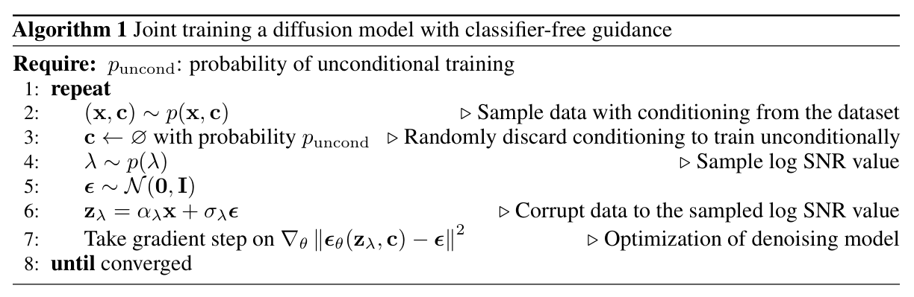
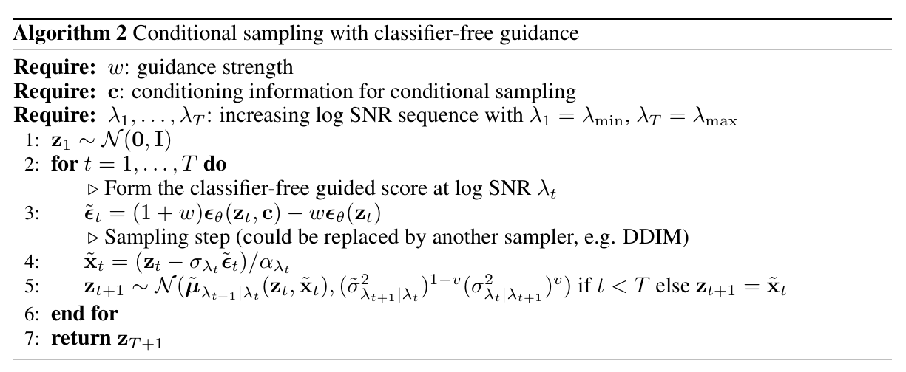

[Back to Main](../../../main.md)

 

# Classifier-Free Diffusion Guidance

## 2. Background
### Concept) Continuous Time Diffusion Model
#### Problem Setting)
- $`\mathbf{x}\sim p(\mathbf{x})`$
- $`\lambda \triangleq \log\displaystyle\frac{{\alpha_\lambda}^2}{{\sigma_\lambda}^2}`$ :  the log SNR (signal-noise-ratio)
  - where
    - $`{\alpha_\lambda}^2`$ : the variance contribution from the **signal**
    - $`{\sigma_\lambda}^2`$ : the variance contribution from the **noise**
      - cf.) Consider a forward process sample
        - $`\mathbf{z}_\lambda = \underbrace{\alpha_\lambda \mathbf{x}}_{\text{signal}} + \underbrace{\sigma_\lambda \epsilon}_{\text{noise}} ,\quad \epsilon\sim\mathcal{N}(0,\mathbf{I})`$
    - $`{\alpha_\lambda}^2+{\sigma_\lambda}^2=1`$
  - Desc.)
    - Here, the log SNR $`\lambda`$ substitutes the time step $`t`$ in the discrete settings.
      - e.g.) $`\underbrace{t=\{1,2,\cdots,T\}}_{\text{discrete time}}\rightarrow \underbrace{\lambda\in[\lambda_{\min}, \lambda_{\max}]}_{\text{continuous time}}`$
    - Why?) The **log SNR** corresponds with the **time step**.
      - $`\lambda\rightarrow\infty \Leftrightarrow {\alpha_\lambda}^2 \gg {\sigma_\lambda}^2`$ : Low noise level
        - $`t\rightarrow 0`$ in the discrete setting]
      - $`\lambda\rightarrow-\infty \Leftrightarrow {\alpha_\lambda}^2 \ll {\sigma_\lambda}^2`$ : Pure noise
        - $`t\rightarrow T`$ in the discrete setting
- $`\mathbf{z} = \{ \mathbf{z}_\lambda\mid\lambda\in[\lambda_{\min}, \lambda_{\max}] \},\quad \lambda_{\min}\lt \lambda_{\max}\in\mathbb{R}`$
  - $`\mathbf{z}_\lambda`$ is the [forward process](#forward-process) sample with the noise level $`\lambda`$
  - $`\lambda`$ is clipped to the range $`[\lambda_{\min}, \lambda_{\max}]`$ for the stability.
    - Theoretically, $`\lambda\in\mathbb{R}`$

#### Forward Process)
- Def.)
  - $`q(\mathbf{z}\mid\mathbf{x})`$ : the forward process
    - where
      - $`q(\mathbf{z}_\lambda\mid\mathbf{x}) = \mathcal{N}(\alpha_\lambda\mathbf{x}, {\sigma_\lambda}^2 \mathbf{I}),\quad\text{s.t. } {\alpha_\lambda}^2+{\sigma_\lambda}^2=1`$
      - $`{\alpha_\lambda}^2 = \displaystyle\frac{1}{1+e^{-\lambda}}`$ : the signal variance
        - cf.) This corresponds to $`\bar{\alpha}_t = \displaystyle\prod_{s=1}^t \alpha_s`$
        - Derivation)   
          - By definition 
            - $`\lambda \triangleq \log\displaystyle\frac{{\alpha_\lambda}^2}{{\sigma_\lambda}^2} = \log\displaystyle\frac{{\alpha_\lambda}^2}{1-{\alpha_\lambda}^2}`$
          - Thus, 
            - $`e^{-\lambda} = \displaystyle\frac{1-{\alpha_\lambda}^2}{{\alpha_\lambda}^2} \Rightarrow {\alpha_\lambda}^2 = \frac{1}{1+e^{-\lambda}}`$
      - $`{\sigma_\lambda}^2 = 1-{\alpha_\lambda}^2`$
- Prop.)
  - $`q(\mathbf{z}_\lambda\mid\mathbf{z}_{\lambda'}) = \mathcal{N}\left(\frac{\alpha_\lambda}{\alpha_{\lambda'}}\mathbf{z}_{\lambda'}, {\sigma_{\lambda\mid\lambda'}}^2 \mathbf{I}\right)`$
    - where
      - $`\lambda\lt\lambda'`$
      - $`{\sigma_{\lambda\mid\lambda'}}^2 = {\sigma_\lambda}^2 - \displaystyle\frac{{\alpha_\lambda}^2}{{\alpha_{\lambda'}}^2}{\sigma_{\lambda'}}^2 = \left( 1-e^{\lambda-\lambda'} \right){\sigma_\lambda}^2`$

#### Reverse Process)
- Def.)
  - $`p(\mathbf{z}) = \displaystyle\int q(\mathbf{z}\mid\mathbf{x}) p(\mathbf{x})\text{d}\mathbf{x}`$ : the marginal of $`\mathbf{z}`$
    - where
      - $`\mathbf{x}\sim p(\mathbf{x})`$
      - $`\mathbf{z}\sim q(\mathbf{z}\mid\mathbf{x})`$
    - Prop)
      - What we want to know.
      - But intractable!
  - $`p_\theta(\mathbf{z}_{\lambda'}\mid\mathbf{z}_{\lambda}) = \mathcal{N}\left( \tilde{\mu}_{\lambda'\mid\lambda}(\mathbf{z}_{\lambda}, \underbrace{\mathbf{x}_\theta}_{\text{model!}}(\mathbf{z}_{\lambda})), \quad \underbrace{\left({\tilde{\sigma}_{\lambda'\mid\lambda}}^2 \right)^{1-v} \left({{\sigma}_{\lambda\mid\lambda'}}^2 \right)^{v}}_{\text{from Improved DDPM}} \right)`$ : the reverse process
    - Derivation)
      - Set $`p_\theta(\mathbf{z}_{\lambda_{\min}}) = \mathcal{N}(\mathbf{0,I})`$ to be the pure noise.
      - Get the posterior of the [forward process](#forward-process) as 
        - $`q(\mathbf{z}_{\lambda'}\mid\mathbf{z}_{\lambda}, \mathbf{x}) = \mathcal{N}\left( \tilde{\mu}_{\lambda'\mid\lambda}(\mathbf{z}_{\lambda}, \mathbf{x}), \quad \left({\tilde{\sigma}_{\lambda'\mid\lambda}}^2 \right) \mathbf{I} \right)`$
          - where
            - $`\tilde{\mu}_{\lambda'\mid\lambda}(\mathbf{z}_{\lambda}, \mathbf{x}) = e^{\lambda-\lambda'}\left(\frac{\alpha_{\lambda'}}{\alpha_{\lambda}}\right)\mathbf{z}_{\lambda} + \left(1- e^{\lambda-\lambda'}\right) \alpha_{\lambda'} \mathbf{x}`$
            - $`{\tilde{\sigma}_{\lambda'\mid\lambda}}^2 = \left(1-e^{\lambda-\lambda'} \right) {\sigma_{\lambda'}}^2`$
      - Use a model $`\mathbf{x}_\theta`$ s.t. $`\mathbf{x}_\theta \approx \mathbf{x}`$ so that $`\underbrace{p_\theta(\mathbf{z}_{\lambda'}\mid\mathbf{z}_{\lambda})}_{\text{our model}} \approx \underbrace{q(\mathbf{z}_{\lambda'}\mid\mathbf{z}_{\lambda}, \mathbf{x})}_{\text{posterior of }q}`$
        - How?) $`\epsilon`$-prediction from [DDPM's simplified objective](../../../paper_presentation/250924_latent_diffusion/paper_summary/ddpm.md#34-simplified-training-object)
          - $`\mathbf{x}_\theta(\mathbf{z}_{\lambda}) = (\mathbf{z}_{\lambda} - \sigma_\lambda \epsilon_\theta(\mathbf{z}_{\lambda}))/\alpha_\lambda`$
      - The variance is a log-space interpolation of $`{\tilde{\sigma}_{\lambda'\mid\lambda}}^2`$ and $`{{\sigma}_{\lambda\mid\lambda'}}^2`$
        - cf.) Refer to the [Improved DDPM's reverse process variance](./improved_ddpm.md#31-learning-reverse-process-variance).
        - $`v`$ is a constant hyperparameter in this paper.
    - Training Objective)
      - $`\mathbb{E}_{\epsilon,\lambda}\Big[ \big\Vert \epsilon_\theta(\mathbf{z}_{\lambda}) - \epsilon \big\Vert_2^2 \Big]`$
        - where
          - $`\epsilon\sim\mathcal{N}(\mathbf{0,I})`$
          - $`z_{\lambda} = \alpha_\lambda \mathbf{x} + \sigma_\lambda \epsilon`$
          - $`\lambda \sim p(\lambda)`$ drawn over $`[\lambda_{\min}, \lambda_{\max}]`$
            - Two Cases)
              - $`p(\lambda) = \text{Uniform}(\lambda_{\min}, \lambda_{\max})`$
              - (v) Not uniform.
                - $`\lambda = -2\log\tan(au+b)`$
                  - where
                    - $`u\sim\text{Uniform}(0,1)`$
                    - $`b = \arctan(e^{-\lambda_{\max}/2})`$
                    - $`a = \arctan(e^{-\lambda_{\min}/2})-b`$
                - Desc.)
                  - a hyperbolic secant distribution modified to be supported on a bounded interval.
                  - Inspired by the [Improved DDPM's cosine noise schedule](./improved_ddpm.md#32-improving-the-noise-schedule)
        - Props.)
          - $`\epsilon_\theta(\mathbf{z}_\lambda) \approx -\sigma_\lambda \nabla_{\mathbf{z}_\lambda} \log p(\mathbf{z}_{\lambda})`$
            - Desc.)
              - (LHS) Guessing the original noise $`\epsilon`$ in DDPM's perspective.
              - (RHS) $`\nabla_{\mathbf{z}_\lambda} \log p(\mathbf{z}_{\lambda})`$ is the [score from the Score-Based Model](../../../paper_presentation/250924_latent_diffusion/paper_summary/score_based_model.md#concept-score)
          - Conditional Generative Model Case
            - For the conditioning information $`\mathbf{c}`$, we may set
              - $`\epsilon_\theta(\mathbf{z}_\lambda,\mathbf{c})`$

 

#### Concept) Temperature
- Def.) $`T`$
  - A scaling parameter that controls the "sharpness" of a probability distribution.
  - In the softmax, $`p_i = \frac{\exp(z_i/T)}{\sum_j \exp(z_j/T)},`$
    - where $z_i$ are the logits.
- Properties
  - $`T = 1`$: recovers the standard softmax.
  - $`T < 1`$: distribution becomes **sharper** (high-confidence, deterministic; one class dominates).
    - i.e.) The low temperature!
  - $`T > 1`$: distribution becomes **flatter** (uncertain, closer to uniform).
  - $`\lim_{T\to 0}`$: approaches an **argmax** (one-hot selection).
  - $`\lim_{T\to \infty}`$: approaches a **uniform distribution**.
- Usage
  - In generation
    - lower $`T\rightarrow`$ higher quality but lower diversity; 
    - higher $`T\rightarrow`$ more diverse but lower quality.
  - In knowledge distillation: temperature is used to smooth teacher predictions.

 

#### Concept) Trade-off between IS and FID
- Inception Score (IS)
  - Def.)
    - $`\text{IS} = \exp\Big(\mathbb{E}_x\big[D_{KL}(p(y\mid x)\mid p(y))\big]\Big)`$
  - Prop.)
    - **Increases** when the generated images are more class-distinct and confident
    - **Larger** IS $`\Leftrightarrow`$ More distinctive classes $`\Leftrightarrow`$ **Better**!
- Fréchet Inception Distance (FID)
  - Def.)
    - Let
      - $`p_{\text{data}} = \mathcal{N}(\mu_{\text{data}}, \Sigma_{\text{data}})`$
      - $`p_{\text{gen}} = \mathcal{N}(\mu_{\text{gen}}, \Sigma_{\text{gen}})`$
    - Then
      - $`\text{FID} = \Vert \mu_{\text{data}} - \mu_{\text{gen}} \Vert^2 + \text{Tr} \left( \Sigma_{\text{data}} + \Sigma_{\text{gen}} - 2\sqrt{\Sigma_{\text{data}}\Sigma_{\text{gen}}} \right)`$
  - Prop.)
    - **Decreases** when the distribution of the generated data is similar to the original data's distribution.
    - **Smaller** FID $`\Leftrightarrow`$ More similarity $`\Leftrightarrow`$ **Better**!
- Trade-off between IS and FID
  - If the generated data becomes more class distinct, then
    - IS increases
    - FID worsens (increases) because the diversity is reduced and the generated distribution deviates from the real one.

 

## 3. Guidance
### 3.1 Classifier Guidance
Dhariwal & Nichol 2021
- Desc.)
  - A technique to boost the sample quality of a diffusion model using an extra trained classifier.
  - Enabled generating low temperature samples from a diffusion model
    - Concept) Low [Temperature](#concept-temperature)
      - Desc.)
        - A technique that makes a probability distribution sharper
      - Prop.)
        - Sharper distribution leads to more deterministic sampling.
        - Thus, the output tends to be more stable and of higher quality, but the diversity decreases.
    - cf.) Similar to **BigGAN** and low temperature **Glow**
- Problem Setting)
  - $`\mathbf{c}`$ : the classifier
  - $`\epsilon_\theta(\mathbf{z}_\lambda,\mathbf{c})`$ : the classifier guidance
    - where $`\epsilon_\theta(\mathbf{z}_\lambda,\mathbf{c}) \approx -\sigma_\lambda \nabla_{\mathbf{z}_\lambda} \log p(\mathbf{z}_{\lambda}\mid\mathbf{c})`$ : the diffusion score
- Goal)
  - We want to generate data that can be clearly classified into the chosen category.
  - How?)
    - Maximize $`\log p(\mathbf{z}\mid\mathbf{c})`$.
      - Meaning)
        - For a given class $`\mathbf{c}`$, higher $`\log p(\mathbf{z}\mid\mathbf{c})`$ indicates a higher probability of generating $`\mathbf{z}`$ that is recognized as belonging to $`\mathbf{c}`$
    - Practical Trick)
      - Mix a diffusion model's score estimate with the input gradient of the log probability of a classifier
        - $`\nabla_{\mathbf{z}_\lambda} \log \tilde{p}_\theta(\mathbf{z}_\lambda\mid\mathbf{c}) = \nabla_{\mathbf{z}_\lambda} \log p_\theta(\mathbf{z}_\lambda\mid\mathbf{c}) + w \cdot \underbrace{\nabla_{\mathbf{z}_\lambda} \log  p_\theta(\mathbf{c}\mid\mathbf{z}_\lambda)}_{\text{extra guidance term!}}`$
        - Why?) 
          - The extra term $`\log p(\mathbf{c\mid z})`$ may steer the gradient towards increasing the probability that the classifier identifies $`\mathbf{z}`$ as class $`\mathbf{c}`$
- Model)   
  $`\begin{aligned}
    \tilde{\epsilon}_\theta(\mathbf{z}_\lambda, \mathbf{c}) 
    &= \epsilon_\theta(\mathbf{z}_\lambda, \mathbf{c}) - w\sigma_\lambda \nabla_{\mathbf{z}_\lambda} \log p_\theta(\mathbf{c}\mid\mathbf{z}_{\lambda}) \\
    &\approx - \sigma_\lambda \nabla_{\mathbf{z}_\lambda} \left[ \log p(\mathbf{z}_{\lambda}\mid\mathbf{c}) + w\log p_\theta(\mathbf{c}\mid\mathbf{z}_{\lambda}) \right]
  \end{aligned}`$
  - where
    - $`w`$ : a parameter that controls the strength of the classifier guidance
- Usage)
  - Replace the original $`\epsilon_\theta(\mathbf{z}_\lambda,\mathbf{c})`$ with $`\tilde{\epsilon}_\theta(\mathbf{z}_\lambda, \mathbf{c})`$ in the objective function.
  - Then the sampling distribution goes
    - $`\tilde{p}_\theta(\mathbf{z}_\lambda\mid\mathbf{c})\varpropto p_\theta(\mathbf{z}_\lambda\mid\mathbf{c}) \cdot p_\theta(\mathbf{c}\mid\mathbf{z}_\lambda)^w`$
      - Desc.)
        - By setting $`w\gt0`$, we may up-weight the probability of data for which the classifier $`p_\theta(\mathbf{c\mid z}_\lambda)`$ assigns high likelihood to the correct label. 
- Effect)
  - By varying the strength $`w`$ of the classifier gradient, they could [trade off](#concept-trade-off-between-is-and-fid) Inception score and FID score.
    - Bigger $`s`$ $`\Rightarrow`$ More samples like that classifier $`y`$
      - Then
        - Inception Score increases : more recognizable
        - FID decreases : more realistic
        - Less diversity
- e.g.)  
  - Three mixture of Gaussian distributions being more separable.
    
- Drawback)
  - Complicates the diffusion model training pipeline.
    - Why?)
      - Requires training an extra classifier in DM
      - Classifier must be trained on noisy data so it is generally not possible to plug in a pre-trained classifier.
  - Mixing $`\nabla_{\mathbf{z}_{\lambda}} \log p(\mathbf{c}\mid \mathbf{z}_{\lambda})`$ can be interpreted as a gradient-based adversarial attack!
    - cf.) Just like in GAN models where the generator's adversarial attack improves the quality of the generation.

 

### 3.2 Classifier-Free Guidance
- Goal)
  - Have the same effect as the [classifier guidance](#31-classifier-guidance), but without using the gradients.
    - cf.) $`\nabla_{\mathbf{z}_{\lambda}} \log p(\mathbf{c}\mid \mathbf{z}_{\lambda})`$
- Idea)
  - Simultaneously train the **conditional** and the **unconditional** models in a single neural network!
  - How?)
    - Randomly set $`\mathbf{c} = \varnothing`$ with some probability $`p_{\text{uncond}}`$.
      - If $`\mathbf{c} = \varnothing`$, we train the unconditional model
      - Else, we train the conditional model
- Model)
  - Let
    - $`p_\theta(\mathbf{z})`$ : an unconditional denoising diffusion model
      - s.t. parameterized through the score estimator $`\epsilon_\theta(\mathbf{z}_\lambda)`$
    - $`p_\theta(\mathbf{z}\vert\mathbf{c})`$ : an unconditional denoising diffusion model
      - s.t. parameterized through the score estimator $`\epsilon_\theta(\mathbf{z}_\lambda,\mathbf{c})`$
  - Then, we may set up the model as
    - $`\tilde{\epsilon}_\theta(\mathbf{z}_\lambda,\mathbf{c}) = (1+w)\epsilon_\theta(\mathbf{z}_\lambda,\mathbf{c}) - w \epsilon_\theta(\mathbf{z}_\lambda)`$
- Prop.)
  - No classifier gradient in the model.
    - Thus, taking a step in the $`\tilde{\epsilon}_\theta`$ direction cannot be interpreted as a gradient-based adversarial attack on an image classifier.
  - Not even implicitly has the classifier gradient in the model.
    - $`\tilde{\epsilon}_\theta`$ is constructed from score estimates that are non-conservative vector fields.
      - Why?) An unconstrained neural network is used!
      - cf.) A non-conservative vector fields has no mapped scalar function.
      - Thus, no scalar potential function exists such as a classifier log likelihood.
    - cf.) Implicit Classifier Gradient $`\epsilon^*`$
      - Derivation)
        - Start from the Bayes Rule s.t. $`p^i(\mathbf{c\mid z}_\lambda) \varpropto \displaystyle\frac{p(\mathbf{z}_\lambda\mid\mathbf{c})}{p(\mathbf{z}_\lambda)}`$.
        - If we have access to exact scores $`\epsilon^*(\mathbf{z}_\lambda,\mathbf{c})`$ and $`\epsilon^*(\mathbf{z}_\lambda)`$ we may get the gradient of this classifier as 
          - $`\nabla_{\mathbf{z}_\lambda} \log p^i(\mathbf{c}\mid \mathbf{z}_\lambda) = -\frac{1}{\sigma_\lambda} \left[\epsilon^*(\mathbf{z}_\lambda,\mathbf{c})-\epsilon^*(\mathbf{z}_\lambda)\right]`$
- Algorithms)
  - Training   
    
  - Sampling   
    
- Strength)
  - Simplicity.
    - One line change in the code enabled the trade-off between IS and FID.
    - No need for an extra trained classifier like the [classifier guidance](#31-classifier-guidance) model.

 

[Back to Main](../../../main.md)