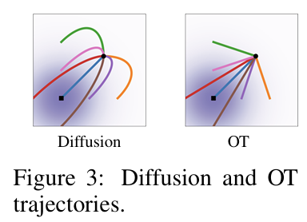
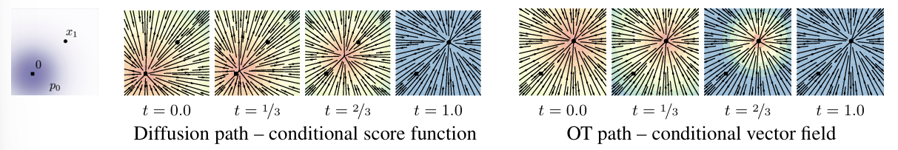
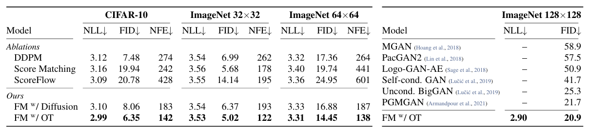
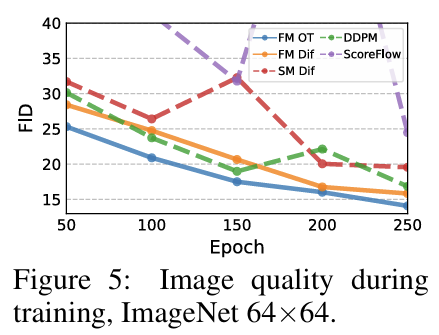

[Back to Main](../../../main.md)

 

# Flow Matching for Generative Modeling
Lipman et al. 2023

## 2. Preliminaries: Continuous Normalizing Flows
### Concept) Continuous Normalizing Flows (CNF)
Chen et al. 2018
- Model)
  - Let
    - $`\mathbb{R}^d`$ : the data space
      - with datapoints $`x = (x^1,\cdots,x^d)\in\mathbb{R}^d`$
    - $`t\in[0,1]`$ : time
    - $`p:[0,1]\times\mathbb{R}^d\rightarrow\mathbb{R}_{\gt 0}`$ : the probability density path
      - where 
        - $`\displaystyle\int p_t(x)\text{d}x = 1`$
          - i.e.) the time dependent probability density function
        - $`p_0`$ is a prior
          - cf.) We may assume it to be the pure noise.
    - $`v:[0,1]\times\mathbb{R}^d\rightarrow\mathbb{R}^d`$ : the time dependent vector field
      - where $`v_t`$ can be used to construct a **flow** (time-dependent diffeomorphic map)
    - $`\phi:[0,1]\times\mathbb{R}^d\rightarrow\mathbb{R}^d`$ : the **flow** which is defined by ODE as
      - $`\displaystyle\frac{\text{d}}{\text{d}t}\phi_t(x) = v_t(\phi_t(x))`$
      - $`\phi_0(x) = x`$
  - Then, we may model the vector field $`v_t`$ with a neural network $`v_t(x;\theta)`$
    - where $`\theta\in\mathbb{R}^p`$ are its learnable parameters
  - The deep parametric model of the flow $`\phi_t`$ is called a Continuous Normalizing Flow (CNF)
  - The vector field $`v_t`$ is said to **generate** a probability density path $`p_t`$, if
    - $`p_t = [\phi_t]_* p_0`$
      - where the push-forward (change of variable) operator $`*`$ is defined by
        - $`[\phi_t]_* p_0 = \displaystyle p_0\left( \phi_t^{-1}(x) \right) \det\left[\frac{\partial \phi_t^{-1}}{\partial x}(x)\right]`$
- Drawbacks)
  - ODE simulations for the forward and backward propagation are computationally expensive.
    - cf.) ODE simulation refers to simulating $`x_t, \forall t\in[0,1]`$ 
    - Later works that tried to mitigate this by
      - regularizing the ODE to be easier to solve
        - Dupont et al. 2018
        - Yang et al. 2019
        - Finlay et al. 2020
        - Onken et al 2021
        - Tong et al 2020
        - Kelly et al 2020
        - Du et al 2022
      - developing simulation free CNF training
        - Rozen et al 2021
        - Ben-Hamu et all 2022
    - Diffusion models utilized simulation-free trainings.
      - The target probability path is indirectly defined.
      - Training is done by the denoising process, a **conditional objective** that provides unbiased gradients w.r.t. the score matching object.
      - [CFM](#32-conditional-flow-matching) is inspired by this idea.

  

## 3. Flow Matching
#### Problem Setting)
- Let
  - $`x_1\sim q(x_1)`$ : a random variable distributed according to some unknown data distribution $`q`$
    - Here, we have access to the data samples from $`q(x_1)`$.
    - But we don't have access to the density function $`q`$.
  - $`p_t`$ : a probability path s.t.
    - $`p_0=p`$ : a simple distribution
      - e.g.) $`p(x) = \mathcal{N}(x\mid0,I)`$
    - $`p_1 \approx q`$
- We want to construct the path of $`p_t`$ s.t. $`p_1=q`$.
  - How?)
    - Get a nice $`v_t`$ that generates such $`p_t`$

 

#### Concept) Flow Matching Objective
- Def.)
  - Let 
    - $`u_t`$ : a vector field s.t. generates $`p_t`$.
  - Then, we may define the Flow Matching (FM) objective as
    - $`\mathcal{L}_{\text{FM}}(\theta) = \mathbb{E}_{t, p_t(x)} \Big[\Vert v_t(x) - u_t(x) \Vert^2\Big]`$
      - where
        - $`\theta`$ : the learnable parameters of the CNF vector field $`v_t`$
        - $`t\sim\mathcal{U}[0,1]`$ : the time drawn from the Uniform distribution
        - $`x\sim p_t(x)`$
- Drawback)
  - Intractability!
    - We have no prior knowledge on $`p_t`$ and $`u_t`$.
    - There can be many paths that satisfies $`p_1(x) = q(x)`$, but what to choose?
    - We don't have access to a closed form $`u_t`$ that generates $`p_t`$
- Alternative)
  - Use [conditional probability paths and vector fields](#31-constructing-conditional-probability-paths-and-vector-fields).

 

### 3.1 Constructing Conditional Probability Paths and Vector Fields
- Idea)
  - Let's utilize the existing datapoint $`x_1`$ by conditioning $`x`$ on it 
    - i.e.) $`x\mid x_1`$.

#### Concept) Conditional Probability Path
- Def.)
  - Let $`x_1`$ be a particular data sample
  - Then, we may get a **conditional probability path** $`p_t(x\mid x_1)`$ s.t. 
    - At $`t=0`$
      - $`p_0(x\mid x_1) = p(x)`$ : the simple prior that we set
    - At $`t=1`$
      - $`p_1(x\mid x_1)`$ is a distribution concentrated around $`x=x_1`$
        - e.g.) $`p_1(x\mid x_1) = \mathcal{N}(x; x_1, \sigma^2 I)`$ with 
          - the mean of $`x_1`$
          - sufficiently small std. dev. of $`\sigma\gt0`$

#### Concept) Marginal Probability Path
- Def.)
  - Consider the the [conditional probability path](#concept-conditional-probability-path) $`p_t(x\mid x_1)`$
  - Marginalizing $`p_t(x\mid x_1)`$ over the unknown distribution $`q(x_1)`$, we may get the **marginal probability path** as
    - $`p_t(x) = \displaystyle\int p_t(x\mid x_1) \; q(x_1) \; \text{d}x_1`$
      - where
        - $`p_1(x) = \displaystyle\int p_1(x\mid x_1)\; q(x_1)\; \text{d}x_1 \approx q(x)`$

#### Concept) Marginal Vector Field
- Def.)
  - Consider a **conditional vector field** $`u_t(x\mid x_1)`$.
  - Marginalizing it over posterior conditional distribution $`p_t(x_1\mid x)`$, we may get we may get the **marginal vector field** as
    - $`u_t(x) = \displaystyle\int u_t(x\mid x_1) \frac{p_t(x\mid x_1)\; q(x_1)}{p_t(x)}\text{d}x_1`$
      - where
        - $`u_t(\cdot\mid x_1):\mathbb{R}^d\rightarrow\mathbb{R}^d`$ : a conditional vector field that generates the **conditional probability path** $`p_t(\cdot\mid x_1)`$
- Derivation)
  - We may marginalize $`u_t(x\mid x_1)`$ over the posterior probability of $`p_t(x_1\mid x)`$ as   
    $`\begin{aligned}
      u_t(x) &= \displaystyle\int u_t(x\mid x_1) p_t(x_1\mid x) \text{d}x_1 \\
      &= \int u_t(x\mid x_1) \frac{p_t(x\mid x_1) p_t(x_1)}{p_t(x)} \text{d}x_1 & (\because\text{Bayes Rule}) \\
      &= \int u_t(x\mid x_1) \frac{p_t(x\mid x_1) q(x_1)}{p_t(x)} \text{d}x_1 & (\because p_t(x_1)\triangleq q(x_1)) \\
    \end{aligned}`$
- Prop.)
  - The **marginal vector field** $`u_t(x)`$ generates the [marginal probability path](#concept-marginal-probability-path) $`p_t(x)`$.

 

#### Theorem 1)
- Thm.)
  - Given **conditional vector fields** $`u_t(x\mid x_1)`$ that generate [conditional probability paths](#concept-conditional-probability-path) $`p_t(x \mid x_1)`$, for any distribution $`q(x_1)`$, the [marginal vector field](#concept-marginal-vector-field) $`u_t`$ generates the [marginal probability path](#concept-marginal-probability-path) $`p_t(x)`$.
    - i.e.) $`u_t`$ and $`p_t`$ satisfy the continuity equation
- Pf.)
  - Refer to Appendix A in the paper.
- Limit)
  - Still, $`u_t`$ is intractable.
    - Alternatively, we may use $`u_t(x\mid x_1)`$ : [Conditional Flow Matching](#32-conditional-flow-matching)

  

### 3.2 Conditional Flow Matching
- Key Idea)
  - Although we marginalized $`u_t`$ using the conditional distribution $`p(x\mid x_1)`$, $`u_t`$ is still intractable.
  - Thus, we cannot train on the [Flow Matching Objective](#concept-flow-matching-objective) $`\mathcal{L}_{\text{FM}}`$.
  - What if we use $`u_t(x\mid x_1)`$ instead?
    - Why?) We may arbitrarily choose $`p_t(x\mid x_1)`$ and calculate $`u_t(x\mid x_1)`$ based on it.
- Training) Conditional Flow Matching (CFM) Objective
  - $`\mathcal{L}_{\text{CFM}}(\theta) = \mathbb{E}_{t,q(x_1), p_x(x\mid x_1)}\left[ \big\Vert v_t(x) - \underbrace{u_t(x\mid x_1)}_{\text{modification!}} \big\Vert^2 \right]`$
    - where
      - $`t\sim\mathcal{U}[0,1]`$ (uniform)
      - $`x_1\sim q(x_1)`$ : the sample drawn from the unknown data distribution
      - $`x\sim p_t(x\mid x_1)`$ : **Modified** to the conditional distribution!
        - cf.) It was $`p_t(x)`$ for the [Flow Matching Objective](#concept-flow-matching-objective)
- Prop.)
  - The [Flow Matching Objective](#concept-flow-matching-objective) $`\mathcal{L}_{\text{FM}}(\theta)`$ and the **Conditional Flow Matching** Objective $`\mathcal{L}_{\text{CFM}}(\theta)`$ have identical gradients w.r.t. $`\theta`$
    - i.e.)
      - $`\nabla_\theta \mathcal{L}_{\text{FM}}(\theta) = \nabla_\theta \mathcal{L}_{\text{CFM}}(\theta)`$
    - Thus, just by training the CNF using the [conditional probability path](#concept-conditional-probability-path) $`p_t(x\mid x_1)`$, we may generate the [marginal probability path](#concept-marginal-probability-path) $`p_t(x)`$ 
- e.g.)
  - We may choose $`p_t(x\mid x_1)`$ be the interpolation $`x_t = tx_1 + (1-t)x_0`$ where 
    - $`x_1`$ : is the data sample
    - $`x_0\sim\mathcal{N}(0,I)`$ : noise
  - Then the conditional vector field can be derived as
    - $`u_t(x\mid x_1) = \frac{\text{d}}{\text{d}t} x_t = x_1 - x_0`$

  

## 4. Conditional Probability Paths and Vector Fields
### Concept) Gaussian Conditional Probability Path Family
- Desc.)
  - A general family of [conditional probability paths](#concept-conditional-probability-path)
- Def.) 
  - $`p_t(x\mid x_1) = \mathcal{N}(x ;\; \mu_t(x_1), \sigma_t(x_1)^2 I)`$
    - where
      - $`\mu : [0,1]\times\mathbb{R}^d\rightarrow\mathbb{R}^d`$ : the time-dependent mean of Gaussian distribution
      - $`\sigma : [0,1]\times\mathbb{R}\rightarrow\mathbb{R}_{\gt0}`$ : the time-dependent scalar standard deviation of Gaussian distribution
    - At $`t=0`$, 
      - $`p_0(x) = \mathcal{N}(x\mid0,\;I^2)`$ : pure Gaussian noise
        - $`\mu_0(x_1) = 0`$
        - $`\sigma_0(X_1) = 1`$
    - At $`t=1`$
      - $`p_1(x\mid x_1)`$ is a concentrated Gaussian distribution centered at $`x_1`$
        - $`\mu_1(x_1) = x_1`$
        - $`\sigma_1(X_1) = \sigma_{\min}`$

### Concept) Simplest Gaussian Probability Path
- Why simplest?)
  - There are infinitely many vector fields in the Gaussian family.
  - However, the vast majority are made by the components that leave the underlying distribution invariant.
    - e.g.) Rotational components
      - Since the Gaussian distribution has the perfect sphere shape, rotational components cannot affect the underlying distribution.
  - They only result in unnecessary extra computations.
  - Thus, we may consider the simplest form only.
- Model)
  - For
    - $`x\sim\mathcal{N}`$
    - $`p_t(x\mid x_1) = \mathcal{N}(x ;\; \mu_t(x_1), \sigma_t(x_1)^2 I)`$ : the conditional probability path
      - where $`\mu_t`$ and $`\sigma_t`$ are differentiable by $`t`$
  - Consider the **flow** that satisfies the [CFM](#32-conditional-flow-matching) as
    - $`\psi_t(x) = \sigma_t(x_1) x + \mu_t(x_1)`$ s.t.
        - $`\displaystyle\frac{\text{d}}{\text{d}t} \psi_t(x) = u_t(\psi_t(x)\mid x_1)`$ 
          - i.e.) The target vector field is the conditional vector field for the [CFM](#32-conditional-flow-matching)
        - $`[\psi_t]_* p(x) = p_t(x\mid x_1)`$
          - i.e.) The target probability path is the [conditional probability path](#concept-conditional-probability-path)
  - Props.)
    - If $`x\sim\mathcal{N}(0,I)`$, then $`\psi_t(x)\sim\mathcal{N}(\mu_t(x_1), \sigma_t(x_1)^2 I)`$
      - Why?)
        - Since $`x\sim\mathcal{N}`$, the affine transformation of $`x`$ is also Gaussian.
        - Considering that $`\sigma_t(x_1)`$ and $`\mu_t(x_1)`$ are given,
          - $`\psi_t(x) = \sigma_t(x_1) x + \mu_t(x_1)`$ is also a affine transformation of $`x`$.
        - Thus, $`\psi_t(x)\sim\mathcal{N}`$
          - cf.) $`\psi_t(\cdot)`$ itself is just a deterministic vector field.
    - Various models are available depending on how $`\mu_t`$ and $`\sigma_t`$ are defined
      - e.g.)
        - [Diffusion Conditional VFs](#eg-diffusion-conditional-vfs)
        - [Optimal Transport Conditional VFs](#eg-optimal-transport-conditional-vfs)
      - Comparison : [Diffusion vs OT]()
- CFM Loss)
  - $`\displaystyle\mathcal{L}_{\text{CFM}}(\theta) = \mathbb{E}_{t,q(x_1),p(x_0)}\left[ \Big\Vert v_t(\psi_t(x_0)) - \underbrace{\frac{\text{d}}{\text{d}t} \psi_t(x_0)}_{u_t(\psi_t(x_0)\mid x_1)} \Big\Vert^2 \right]`$
    - where
      - $`x_0\sim p(x_0) = \mathcal{N}(0,I)`$
        - cf.) Recall that we want $`x\sim\mathcal{N}\Rightarrow\psi_t(x)\sim\mathcal{N}`$

 

### Theorem 3.)
- Thm.)
  - Let
    - $`p_t(x \mid x_1)`$ : a [Gaussian conditional probability path](#concept-gaussian-conditional-probability-path-family)
      - i.e.) $`p_t(x\mid x_1) = \mathcal{N}(x ;\; \mu_t(x_1), \sigma_t(x_1)^2 I)`$
    - $`\psi_t`$ : the corresponding flow map of $`p_t(x\mid x_1)`$ and $`u_t(\psi_t(x)\mid x_1)`$
  - Then the unique vector field that defines $`\psi_t`$ has the form:
    - $`\displaystyle u_t(x\mid x_1) = \frac{\sigma_t'(x_1)}{\sigma_t(x_1)} (x-\mu_t(x_1)) + \mu_t'(x_1)`$
- Pf.)
  - For simplicity, put $`w_t(x) = u_t(x\mid x_1)`$
  - By definition of the flow, we have
    - $`\displaystyle\frac{\text{d}}{\text{d}t} \psi_t(x) = w_t(\psi_t(x)) \quad \cdots \quad (A)`$.
  - Since $`\psi_t(x) = \sigma_t(x_1)x + \mu_t(x_1)`$ is the affine transformation, it is invertible.
    - Put $`x = \psi^{-1}(y) \quad \cdots \quad (B)`$.
  - Putting $`\psi' = \frac{\text{d}}{\text{d}t}\psi^{-1}(y)`$ and plugging (B) into (A), we may get   
    $`\frac{\text{d}}{\text{d}t} \psi_t(x) = \psi'(\psi^{-1}(y)) = w_t(y) \quad \cdots \quad (C)`$.
  - Also, from $`\psi_t(x) = \sigma_t(x_1)x + \mu_t(x_1)`$, we have 
    - $`\psi_t^{-1}(y) = \displaystyle\frac{y-\mu_t(x_1)}{\sigma_t(x_1)} \quad \cdots \quad (D)`$
    - $`\psi_t'(x) = \sigma_t'(x_1) x + \mu_t'(x_1) \quad \cdots \quad (E)`$
  - From (C), we have   
    $`\begin{aligned}
      w_t(y) &= \psi'(\psi^{-1}(y)) \\
      &= \psi'\left(\frac{y-\mu_t(x_1)}{\sigma_t(x_1)}\right) & \because (D) \\
      &= \sigma_t'(x_1) \cdot \left(\frac{y-\mu_t(x_1)}{\sigma_t(x_1)}\right) + \mu_t'(x_1) & \because (E)
      &= \frac{\sigma_t'(x_1)}{\sigma_t(x_1)} (x-\mu_t(x_1)) + \mu_t'(x_1) & \text{QED}
    \end{aligned}`$

 

#### e.g.) Diffusion Conditional VFs
- Reversed [Variance Exploding (VE)](../../../paper_presentation/250924_latent_diffusion/paper_summary/score_based_model.md#model-ve-sde) path
  - $`p_t(x) = \mathcal{N}(x;\; x_1, \sigma_{1-t}^2 I)`$
    - where $`\sigma_t`$ is an increasing function and
        - $`\sigma_0 = 0`$
        - $`\sigma_1 \gg 1`$
    - i.e.)
      - $`\mu_t(x_1) = x_1`$
      - $`\sigma_t(x_1) = \sigma_{1-t}`$
  - Then by [Thm.3](#theorem-3), we may get the **conditional vector field** as   
    $`\begin{aligned}
      u_t(x\mid x_1) &= \frac{\sigma_t'(x_1)}{\sigma_t(x_1)} (x-\mu_t(x_1)) + \mu_t'(x_1) \\
      &= -\frac{\sigma_{1-t}'}{\sigma_{1-t}} (x-x_1) & \because \frac{\text{d}}{\text{d}t}\mu_t(x_1)=0,\; \frac{\text{d}}{\text{d}t}\sigma_t(x_1)= -\sigma_{1-t}' \\
    \end{aligned}`$
- Reversed [Variance Preserving (VP)](../../../paper_presentation/250924_latent_diffusion/paper_summary/score_based_model.md#model-vp-sde) path
  - $`p_t(x) = \mathcal{N}(x;\; \alpha_{1-t} x_1, (1-\alpha_{1-t}^2) I)`$
    - where
      - $`\alpha_{t} = e^{-\frac{1}{2}T(t)}`$
      - $`T(t) = \displaystyle\int_0^t \beta(s)\text{d}s`$
      - $`\beta`$ is the noise scale function.
    - i.e.)
      - $`\mu_t(x_1) = \alpha_{1-t} x_1`$
      - $`\sigma_t(x_1) = \sqrt{1-\alpha_{1-t}^2}`$
  - Then by [Thm.3](#theorem-3), we may get the **conditional vector field** as   
    $`\begin{aligned}
      u_t(x\mid x_1) &= \frac{\sigma_t'(x_1)}{\sigma_t(x_1)} (x-\mu_t(x_1)) + \mu_t'(x_1) \\
      &= \frac{-\frac{-2 \alpha_{1-t} \alpha_{1-t}'}{2\sqrt{1-\alpha_{1-t}^2}}}{\sqrt{1-\alpha_{1-t}^2}} (x-\alpha_{1-t} x_1) - \alpha_{1-t}' x_1 \\
      &= \frac{\alpha_{1-t}\alpha_{1-t}'}{1-\alpha_{1-t}^2} (x - \alpha_{1-t} x_1) - \alpha_{1-t}' x_1 \\
      &= \alpha_{1-t}' x_1 \left(\frac{\alpha_{1-t}^2}{1-\alpha_{1-t}^2} - 1\right) + \frac{\alpha_{1-t}\alpha_{1-t}'x}{1-\alpha_{1-t}^2} \\
      &=  -\frac{\alpha_{1-t}' x_1}{1-\alpha_{1-t}^2} + \frac{\alpha_{1-t}\alpha_{1-t}'x}{1-\alpha_{1-t}^2} \\
      &= \frac{\alpha_{1-t}'}{1-\alpha_{1-t}^2} (\alpha_{1-t} x - x_1) \\
      &  \vdots \\
      &= -\frac{T'(1-t)}{2} \left[\frac{e^{-T(1-t)}x - e^{-\frac{1}{2}T(1-t)}x_1}{1-e^{-T(1-t)}}\right]
    \end{aligned}`$
- Prop.)
  - Coincides with the vector field in the [deterministic probability flow](../../../paper_presentation/250924_latent_diffusion/paper_summary/score_based_model.md#43-probability-flow-and-neural-odes) from the Score-Based Models
  - Combining the **diffusion conditional VF** with the [FM](#3-flow-matching) objective offers more stable and robust results.
  - Diffusion processes cannot reach a true noise distribution in finite time
    - i.e.) $`x_T`$ is not pure noise but the approximation.
    - However, in [CFM](#32-conditional-flow-matching), since $`p_0(x)`$ is deterministically set to be pure Gaussian noise, this problem never happens.

 

#### e.g.) Optimal Transport Conditional VFs
- Idea)
  - Define the mean and the std to simply change linearly in time $`t`$
    - Why?)
      - Recall that the [Optimal Transport (OT)](rectified_flow.md#concept-transport-map) attempts to minimize the cost function.
      - The McCann's Theorem proved that the affine transformation is the optimal transportation map between two Gaussian distributions.
        - cf.) McCann's Displacement Interpolation   
          $`\begin{aligned}
            \psi_t(x_0) &= (1-t)x_0 + t\psi_1(x_1) \\
            &= (1-t)x_0 + t(\sigma_{\min}x_0 + x_1) \\
            &= \underbrace{[1-(1-\sigma_{\min})t]}_{\sigma_t} x_0 + \underbrace{t x_1}_{\mu_t}
          \end{aligned}`$
          - where $`x_0`$ is the pure noise.
        - i.e.) $`\mu_t`$ and $`\sigma_t`$ are linear to $`t`$
- Model)
  - Following the OT above, we may set the flow $`\psi_t(x_0)`$ as
    - $`\psi_t(x_0) = \underbrace{[1-(1-\sigma_{\min})t]}_{\sigma_t(x_1)} x_0 + \underbrace{t x_1}_{\mu_t(x_1)}`$
  - Conditional Probability Path
    - $`p_t(x\mid x_1) = \mathcal{N}\left(x;\; tx_1, (1-(1-\sigma_{\min})t)^2 I\right)`$
    - i.e.)
      - $`\mu_t(x) = tx_1`$
      - $`\sigma_t(x) = 1-(1-\sigma_{\min})t`$
  - Then by [Thm.3](#theorem-3), we may get the **conditional vector field** as   
    $`\begin{aligned}
      u_t(x\mid x_1) &= \frac{\sigma_t'(x_1)}{\sigma_t(x_1)} (x-\mu_t(x_1)) + \mu_t'(x_1) \\
      &= \frac{\sigma_{\min}-1}{1-(1-\sigma_{\min})t} (x-tx_1) + x_1 \\
      &= \frac{(\sigma_{\min}-1)x + x_1}{1-(1-\sigma_{\min})t} \\
    \end{aligned}`$
    - Pf.)
      - The value $`x`$ at time $`t`$ is $`\psi_t(x_0)`$
      - Thus, $`x = \psi_t(x_0) = [1-(1-\sigma_{\min})t] x_0 + t x_1`$
      - We may rewrite it as
        - $`x_0 = \displaystyle\frac{x-tx_1}{1-(1-\sigma_{\min})t}`$
      - Then, we may get   
        $`\begin{aligned}
          u_t(x\mid x_1) &= \frac{\text{d}}{\text{d}t} \psi_t(x_0) \\
          &= -(1-\sigma_{\min})x_0 + x_1 &\cdots x_0 \text{ notation} \\
          &= -(1-\sigma_{\min}) \left(\frac{x-tx_1}{1-(1-\sigma_{\min})t}\right) + x_1 \\
          &= \frac{(\sigma_{\min}-1)x + x_1}{1-(1-\sigma_{\min})t}&\cdots x \text{ notation}  \\
        \end{aligned}`$
  - CFM Loss)
    - $`\mathcal{L}_{\text{CFM}}(\theta) = \mathbb{E}_{t,q(X_1),p(x_0)}\left[ \Big\Vert v_t(\psi_t(x_0)) - \underbrace{\big( x_1 - (1-\sigma_{\min}) x_0 \big)}_{x_0 \text{ notation}} \Big\Vert^2 \right]`$
- Prop.)
  - The conditional flow $`\phi_t(x)`$ is the Optimal Transport (OT) displacement map between $`p_0(x\mid x_1)`$ and $`p_1(x\mid x_1)`$

 

#### Analysis) Diffusion vs OT Conditional VFs
- Particles under the [OT displacement map](#eg-optimal-transport-conditional-vfs) always move in straight line trajectories with constant speed.   
  
- [OT paths](#eg-optimal-transport-conditional-vfs)'s conditional vector field has constant direction in time.   
  
  - The arrows are the score functions $`\nabla\log p_t(x\mid x_1)`$
- Sampling trajectory from [diffusion paths](#eg-diffusion-conditional-vfs) can “overshoot” the final sample, resulting in unnecessary backtracking
  - Whilst the [OT paths](#eg-optimal-transport-conditional-vfs) are guaranteed to stay straight.

  

## 6. Experiments
### 6.1 Density Modeling and Sample Quality on ImageNet
- Experiment
  - Data) 
    - CIFAR 10, ImageNet $`32^2, 64^2, 128^2`$
  - Model Architecture)
    - UNet
  - Compared Algorithms
    - DDPM
    - Score Matching
    - Score Flow
    - [Flow Matching with Diffusion](#eg-diffusion-conditional-vfs)
    - [Flow Matching with OT](#eg-optimal-transport-conditional-vfs)
  - Result)
    - [Flow Matching with OT](#eg-optimal-transport-conditional-vfs) was the best.   
      
      - lowest negative log-likelihood (NLL)
      - lowest FID
      - lowest number of function evaluation (NFE)
      - converged much faster than diffusion models.   
        

### 6.2 Sampling Efficiency

### 6.3 Conditional Sampling from Low-Resolution Images

  

[Back to Main](../../../main.md)