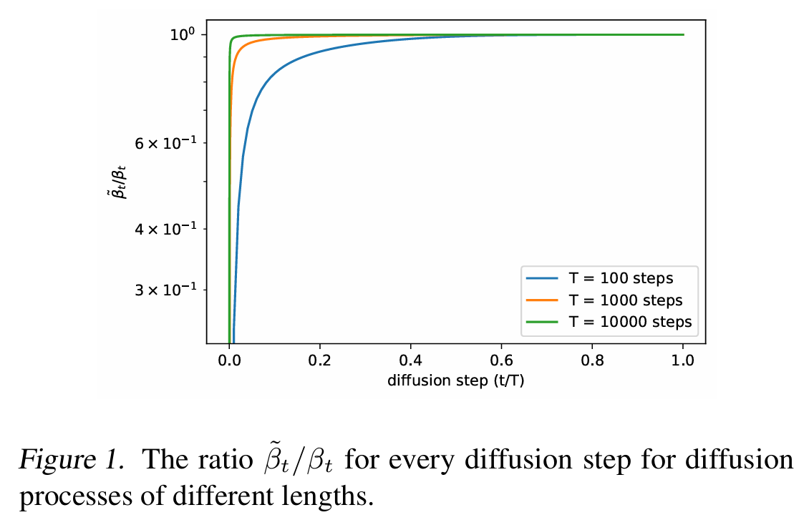
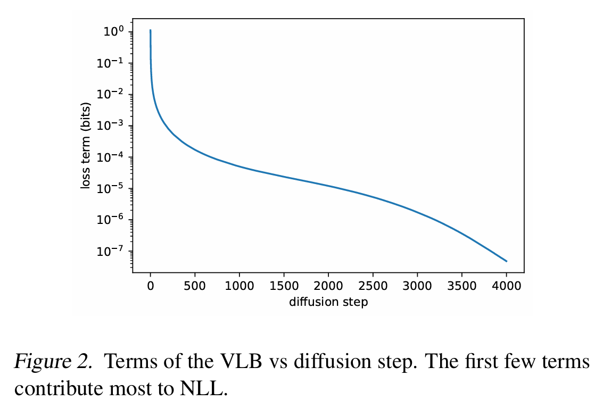
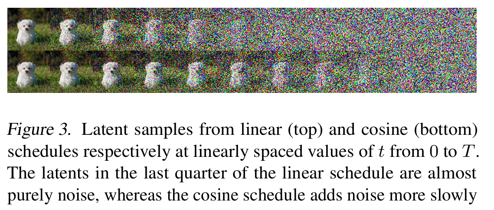
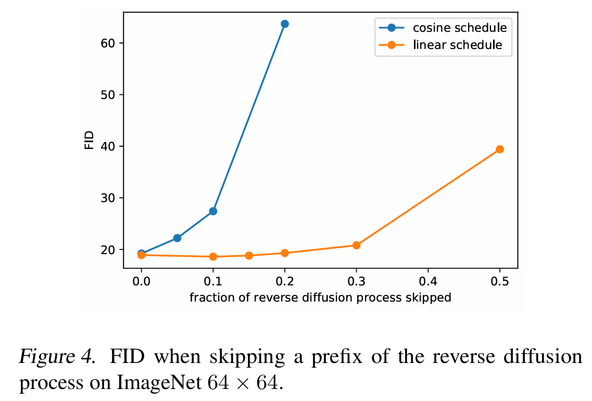
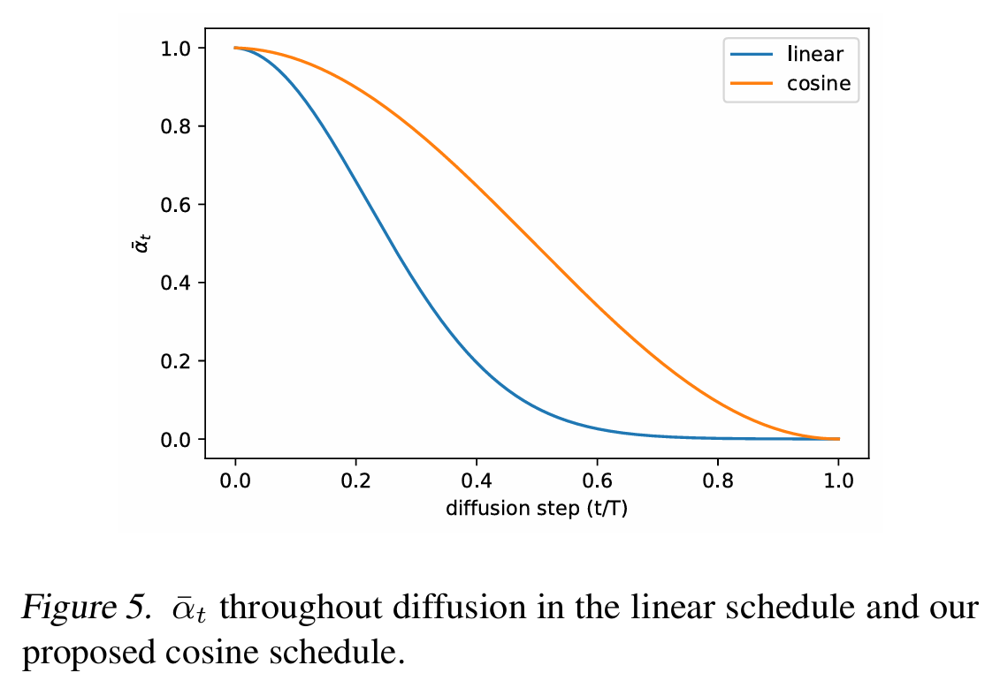

# Improved Denoising Diffusion Probabilistic Models
Nichol et al. 2021

## 2. Denoising Diffusion Probabilistic Models
### 2.1 Definitions
- $`x_0\sim q(x_0)`$ : a given dataset
- Forward Process
  - Def.)
    - $`q`$ : the forward noising process which produces latents $`x_1,\cdots,x_T`$ by adding Gaussian noise at time $`t`$ with variance $`\beta_t\in(0,1)`$ as
      - $`q(x_1,\cdots,x_T\mid x_0) := \displaystyle\prod_{t=1}^T q(x_t\mid x_{t-1})`$
        - where $`q(x_t\mid x_{t-1}) := \displaystyle\mathcal{N}(x_t;\; \sqrt{1-\beta_t} x_{t-1}, \beta_t\mathbf{I})`$
    - Prop.)
      - Given sufficiently large $`T`$ and well behaved schedule of $`\beta_t`$, we have
        - $`x_T\sim\mathcal{N}(0,\mathbf{I})`$
      - Directly sampling an arbitrary $`t`$-th step
        - $`q(x_t\mid x_0) = \mathcal{N}(x_t;\; \sqrt{\bar{\alpha}_t} x_0, (1-\bar{\alpha}_t)\mathbf{I})`$
          - where
            - $`\alpha_t := 1-\beta_t`$
            - $`\bar{\alpha}_t := \displaystyle\prod_{s=0}^t \alpha_s`$
        - $`x_t = \sqrt{\bar{\alpha}_t}x_0 + \sqrt{1-\bar{\alpha}_t}\epsilon`$
          - where $`\epsilon\sim\mathcal{N}(0,\mathbf{I})`$
      - $`1-\bar{\alpha}_t`$ tells us the variance of the noise for an arbitrary step.
      - Posterior $`q(x_{t-1}\mid x_t, x_0)`$
        - Let 
          - $`q(x_{t-1}\mid x_t, x_0) = \mathcal{N}(x_{t-1};\;\tilde{\mu}(x_t, x_0), \tilde{\beta}_t\mathbf{I})`$
            - $`\tilde{\mu}(x_t, x_0)`$ : the posterior mean
            - $`\tilde{\beta}_t`$ : the posterior variance.
        - By the Bayes rule, we have
          - $`q(x_{t-1}\mid x_t, x_0)\varpropto q(x_t\mid x_{t-1}, x_0)q(x_{t-1}\mid x_0)`$
        - Thus, we may denote the moments of the posterior $`q`$ as
          - $`\tilde{\beta}_t := \displaystyle\frac{1-\bar{\alpha}_{t-1}}{1-\bar{\alpha}_t} \beta_t`$
          - $`\tilde{\mu}_t(x_t,x_0) := \displaystyle\frac{\sqrt{\bar{\alpha}_{t-1}}\beta_t}{1-\bar{\alpha}_t} x_0 + \frac{\sqrt{\alpha_{t}}(1-\bar{\alpha}_{t-1})}{1-\bar{\alpha}_t} x_t`$
- Reverse Process
  - Def.)
    - $`p_\theta`$ : approximate $`q`$ as
      - $`p_\theta(x_{t-1}\mid x_t) := \mathcal{N}(x_{t-1};\; \mu_\theta(x_t,t), \Sigma_\theta(x_t, t))`$
        - where $`p_\theta(x_{t-1}\mid x_t) \approx \underbrace{q(x_{t-1}\mid x_{t})}_{\text{reverse order!}}`$
- Variational Lower Bound
  - Def.)
    - $`L_{\text{vlb}} := L_0 + L_1 + \cdots + L_{T-1} + L_T`$
      - where
          - $`L_0 := -\log p_\theta(x_0\mid x_1)`$
          - $`L_{t-1} := D_{KL}\left( q(x_{t-1}\mid x_t, x_0) \;\Vert\; p_\theta(x_{t-1}\mid x_t) \right)`$
          - $`L_{T} := D_{KL}\left( q(x_{T}\mid x_0) \;\Vert\; p(x_{T}) \right)`$
            - cf.) $`L_T`$ is independent of $`\theta`$
              - Why?) $`x_T`$ is a pure noise if the forward process has done its job properly.
  - Prop.)
    - If $`q,p_\theta`$ are all Gaussians, we may get the closed form solutions for $`\forall L`$.
    - DDPM used [discretization](../../../paper_presentation/250924_latent_diffusion/paper_summary/ddpm.md#concept-gaussian-discretization) to calculate the likelihood $`p_\theta(x_{0}\mid x_1)`$

 

### 2.2 Training in Practice
- Sampling $`t`$
  - $`t\sim\text{Uniform}(1,T)`$ for each image in each mini-batch
- Parameterizing $`\mu_\theta(x_t,t)`$
  - We may derived closed form Gaussian posterior of the forward process $`q(x_{t-1}\mid x_t,x_0)`$.
  - And, we may use the posterior mean $`\tilde{\mu}`$ for the $`p_\theta`$'s mean parameterization.
    - $`\tilde{\mu}(x_t,t) = \displaystyle\frac{1}{\sqrt{\alpha_t}}\left( x_t - \frac{\beta_t}{\sqrt{1-\bar{\alpha}_t}} \epsilon_\theta(x_t,t) \right) = \mu_\theta(x_t,t)`$
- Best optimization target
  - $`L_{\text{simple}} = \mathbb{E}_{t,x_0,\epsilon}\left[ \Vert \epsilon - \epsilon_\theta(x_t,t) \Vert^2 \right]`$

 

### 2.3 Weakness
- DDPM was unable to achieve competitive log likelihood.
  - cf.) Why log-likelihood?
    - Razavi et al.,2019
      - Optimizing log-likelihood forces generative models to capture all of the modes of the data distribution
    - Henighan et al.,2020
      - Small improvements in log-likelihood can have a dramatic impact on sample quality and learnt feature representations
  - cf.) Smaller log-likelihood is better
    - Why?)
      - Recall that $`p_\theta(x)\in[0,1]`$.
      - Thus, $`\log p_\theta(x) \le 0`$.
      - Hence, we use $`-\log p_\theta(x) \ge 0`$
      - Then, $`\displaystyle\frac{\partial (-\log p_\theta(x))}{\partial p_\theta(x)} \lt 0`$
        - i.e.) $`p_\theta(x) \uparrow \; \Rightarrow -\log p_\theta(x) \downarrow`$
  - [Section 3](#3-improving-the-log-likelihood) find ways to improve this by modifying DDPM.
    - How?)
      - [3.1 Learning reverse process variance](#31-learning-reverse-process-variance)
         - $`L_{\text{hybrid}} = L_{\text{simple}} + \lambda L_{\text{vlb}}`$
         - $`\Sigma_\theta(x_t, t) = \exp( v\log\beta_t + (1-v)\log\tilde{\beta}_t)`$
      - [3.2 Improving the Noise Schedule](#32-improving-the-noise-schedule)
        - $`\bar{\alpha}_t = \displaystyle\frac{f(t)}{f(0)},\quad \text{s.t. } f(t) = \cos\left( \frac{t/T + s}{1+s} \cdot \frac{\pi}{2} \right)^2`$
        - $`\beta_t = \displaystyle 1-\frac{\bar{\alpha}_t}{1-\bar{\alpha}_t}`$
      - [3.3. Reducing Gradient Noise](#33-reducing-gradient-noise)
        - $`L_{\text{vlb}} = \displaystyle\mathbb{E}_{t\sim p_t} \left[\frac{L_t}{p_t}\right]`$
        - $`p_t\varpropto\sqrt{\mathbb{E}[L_t^2]}`$ 

  

## 3. Improving the Log-Likelihood
- Training datasets used
  - ImageNet $`64\times64`$
  - CIFAR-10
- Settings)
  - Original DDPM
    - Settings)
      - Optimize $`L_{\text{simple}}`$
      - $`\sigma_t^2 = \beta_t`$
      - $`T = 1000`$
      - 200K training iterations
    - Result)
      - log-likelihood of 3.99 bits/dim
  - Improved DDPM
    - Settings)
      - Optimize $`L_{\text{simple}}`$
      - $`\sigma_t^2 = \beta_t`$
      - $`T = 4000`$
      - 200K training iterations
    - Result)
      - log-likelihood of 3.77 bits/dim

 

### 3.1 Learning Reverse Process Variance
- Key Idea)
  - Use the geometric interpolation between $`\beta_t`$ and $`\tilde{\beta_t}`$ as the reverse process variance parameterization of
    - $`\Sigma_\theta(x_t, t) = \exp( v\log\beta_t + (1-v)\log\tilde{\beta}_t)`$
      - where
        - $`v`$ : a vector containing one component per dimension
          - cf.) This is learned by the network!
        - $`\beta_t`$ : the original schedule that we assign
        - $`\tilde{\beta}_t`$ : the posterior variance term of $`q`$
          - cf.) $`q(x_{t-1}\mid x_t, x_0) = \mathcal{N}(x_{t-1};\;\tilde{\mu}(x_t, x_0), \tilde{\beta}_t\mathbf{I})`$
            - where $`\tilde{\beta}_t := \displaystyle\frac{1-\bar{\alpha}_{t-1}}{1-\bar{\alpha}_t} \beta_t`$
    - cf.) Geometric Interpolation
      - $`{\beta_t}^v \cdot {\tilde{\beta}_t}^{1-v} = \exp(\log({\beta_t}^v \cdot {\tilde{\beta}_t}^{1-v})) = \exp( v\log\beta_t + (1-v)\log\tilde{\beta}_t)`$
  - Then, by replacing the existing $`\Sigma_\theta`$ with the above interpolation in the [original DDPM](../../../paper_presentation/250924_latent_diffusion/paper_summary/ddpm.md#model-diffusion-model)'s loss, we may get a new objective function $`L_{\text{vlb}}`$ s.t.
    - $`L_{\text{vlb}} = \displaystyle\mathbb{E}_q \left[ \underbrace{D_{KL}({q(\mathbf{x}_T\mid\mathbf{x}_0)}\Vert{p(\mathbf{x}_T)})}_{L_T} + \sum_{t=2}^T \underbrace{D_{KL}({q(\mathbf{x}_{t-1}\mid\mathbf{x}_t,\mathbf{x}_0)}\Vert{p_\theta(\mathbf{x}_{t-1}\mid\mathbf{x}_t)})}_{L_{t-1}} - \underbrace{\log p_\theta(\mathbf{x}_0\mid\mathbf{x}_1)}_{L_0} \right]`$
      - where 
        - $`p_\theta(\mathbf{x}_{t-1}\mid\mathbf{x}_t) = \mathcal{N}(\mathbf{x}_t;\; \mu_\theta(\mathbf{x}_t,t), \underbrace{\Sigma_\theta(\mathbf{x}_t, t)}_{\text{Here!}})`$
  - Modify the learning objective into
    - $`L_{\text{hybrid}} = L_{\text{simple}} + \lambda L_{\text{vlb}}`$
      - where
        - $`L_{\text{vlb}}`$ guides $`\Sigma_\theta(x_t,t)`$
          - Why needed?)
            - $`L_{\text{simple}}`$ is independent of $`\Sigma_\theta(x_t,t)`$
              - cf.) $`L_{\text{simple}} = \mathbb{E}_{t,x_0,\epsilon}\left[ \Vert \epsilon - \epsilon_\theta(x_t,t) \Vert^2 \right]`$
        - $`\lambda \in\mathbb{R}`$
          - cf.) Improved DDPM used $`\lambda = 0.001`$ to prevent $`L_{\text{vlb}}`$ overwhelming $`L_{\text{simple}}`$
- Why doing this?)
  - Original DDPM showed that using either $`\beta_t`$ or $`\tilde{\beta_t}`$ does not affect the sample quality.
  - This may be due to the fact that $`\beta_t`$ and $`\tilde{\beta_t}`$ are almost equal **except** near $`t=0`$.   
    
  - Nevertheless, we should take the steps near $`t=0`$ into account
    - Why?)
      - Most perceptible details are learned near, $`t=0`$.
      - The graph below shows that the first few steps of the diffusion process contribute the most to the variational lower bound (ELBO).   
        
  - The log-space interpolation provides a smooth trade-off between using $\beta_t$ and $\tilde{\beta}_t$, instead of picking one arbitrarily.
    - i.e.) Learning $`v`$!

 

### 3.2. Improving the Noise Schedule
- Key Idea)
  - Use the cosine noise schedule of
    - $`\bar{\alpha}_t = \displaystyle\frac{f(t)}{f(0)},\quad \text{s.t. } f(t) = \cos\left( \frac{t/T + s}{1+s} \cdot \frac{\pi}{2} \right)^2`$
      - where 
        - $`s`$ : a small offset that prevents $`\beta_t`$ from being too small near $`t=0`$.
          - Why needed?)
            - Authors found having tiny amounts of noise at the beginning of the process made it hard for the network to predict $`\epsilon`$ accurately enough.
          - In practice, $`s=0.008`$
            - where $`\sqrt{\beta_0}`$ being slightly smaller than the pixel bin size $`\frac{1}{127.5}`$
    - $`\beta_t = \displaystyle \min\left(1-\frac{\bar{\alpha}_t}{1-\bar{\alpha}_t}, 0.999\right)`$
      - cf.)
        - In the original DDPM, the $`\beta_t`$ was set to be linear from $`10^{-4}`$ to $`0.02`$.
          - Then it derived $`\bar{\alpha}_t`$ from $`\beta_t`$.
        - In the Improved DDPM, we set $`\bar{\alpha}_t`$ first, and then derive $`\beta_t`$ from it.
      - Prop.)
        - $`\beta_t \lt 0.999`$ : clipped!
          - Why?)
            - To prevent singularities at the end of the diffusion process near $`t=T`$.
            - $`(\beta_t \rightarrow 1) \Rightarrow (\bar{\alpha} \rightarrow 0) \Rightarrow \tilde{\mu}_t(x_t,x_0) \rightarrow \infty`$
              - cf.) $`\tilde{\mu}_t(x_t,x_0) := \displaystyle\frac{\sqrt{\bar{\alpha}_{t-1}}\beta_t}{1-\bar{\alpha}_t} x_0 + \frac{\sqrt{\alpha_{t}}(1-\bar{\alpha}_{t-1})}{1-\bar{\alpha}_t} x_t`$
- Purpose)
  - Original DDPM's linear noise schedule
    - Schedule
      - Linear schedule between $`\beta_1 = 10^{-4}`$ and $`\beta_T = 0.02`$.
    - Drawbacks)
      - Its linear noise schedule was sub-optimal for image resolution $`64\times64`$ and $`32\times32`$.
      - At the end of the forward process it was too noisy that didn't contribute very much to sample quality.   
        
        - Pf.) The graph below shows that skipping significant portion of the diffusion process does not affect the FID score (orange line!)   
          
- Props.)
  - $`\bar{\alpha}_t`$ is designed to have 
    - a linear drop-off in the middle of the process
    - very little changes near extremes of $`t=0, t=T`$   
      
  - The choice of the cosine function $`\cos^2`$ is arbitrary.
    - Any other function with similar shape would work as well.

 

### 3.3. Reducing Gradient Noise
- Problem)
  - $`L_{vlb}`$ was difficult to optimize in practice.
    - Why?)
      - ELBO is the lower bound, not the likelihood itself.
        - Recall that the loss function $`L_{vlb}`$ utilizes the variational lower bound (ELBO).
        - This is the lower bound of the likelihood, not itself.
        - Thus, there can be chance that the loss increase after an iteration.
      - Noise and variance from MC sampling
        - ELBO is estimated using the Monte Carlo sampling.
- Sol.)
  - Sample $`t\sim p_t`$ 
    - where 
      - $`p_t\varpropto\sqrt{\mathbb{E}[L_t^2]}`$ 
        - where $`\mathbb{E}[L_t^2]`$ is the expected loss at $`t`$
        - i.e.) Greater the loss $`L_t`$, higher the chance of drawing $`t`$
      - $`\sum p_t = 1`$
    - Prop.)
      - $`\mathbb{E}[L_t^2]`$ is unknown beforehand and may change throughout training.
    - How?)
      - At the beginning of the training, sample $`t`$ uniformly until draw 10 samples for $`\forall t\in[0,T-1]`$
      - Then, maintain a history of the previous 10 values for each loss term, and update dynamically during training.
      - Make $`p_t`$ give higher probability to the step $`t`$ that has the higher expected loss $`\mathbb{E}[L_t]`$
  - Put $`L_{\text{vlb}} = \displaystyle\mathbb{E}_{t\sim p_t} \left[\frac{L_t}{p_t}\right]`$
    - i.e.) Adjust by dividing $`L_t`$ with $`p_t`$.
      - Why?)
        - Due to $`p_t`$, the step $`t`$ with greater loss has higher probability to be drawn.
        - By dividing $`L_t`$ with $`p_t`$, we may normalize the effect of being biased by drawing them frequently.

 