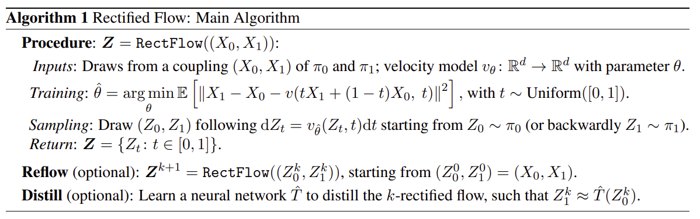
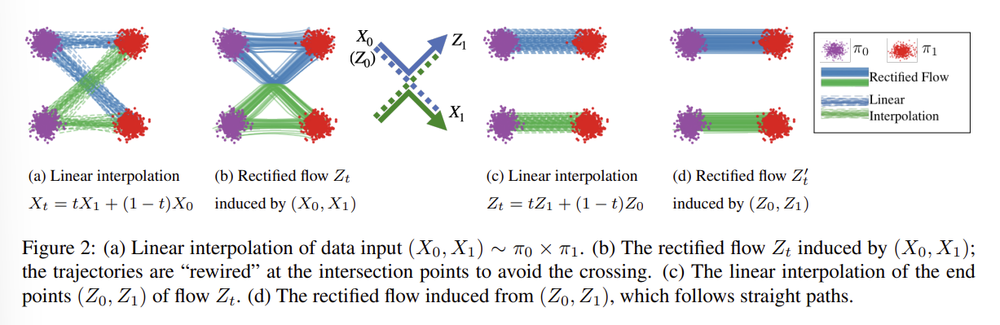
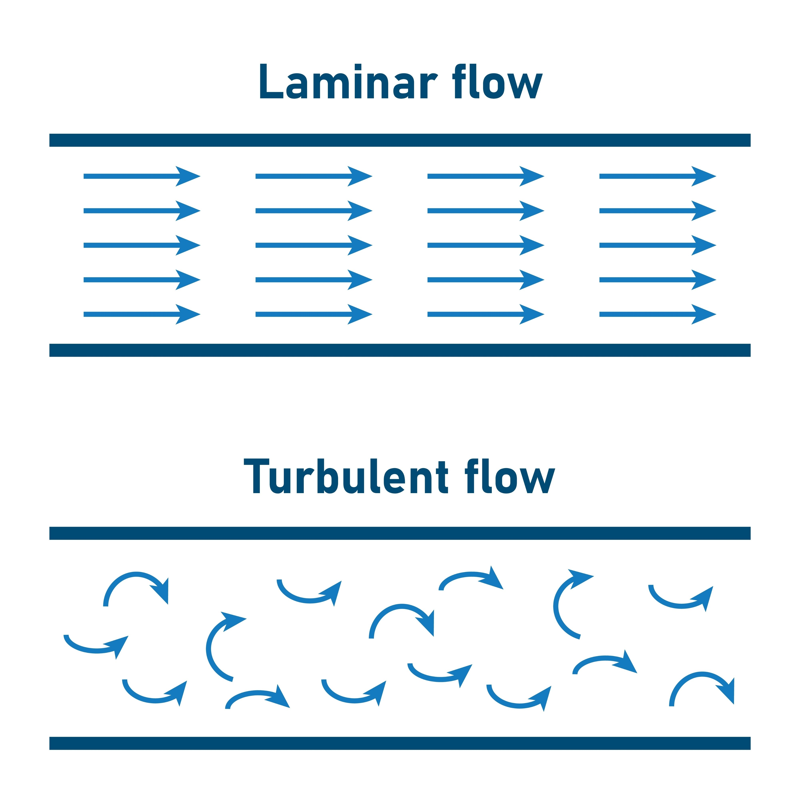
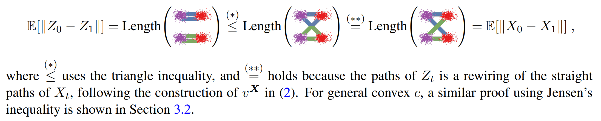
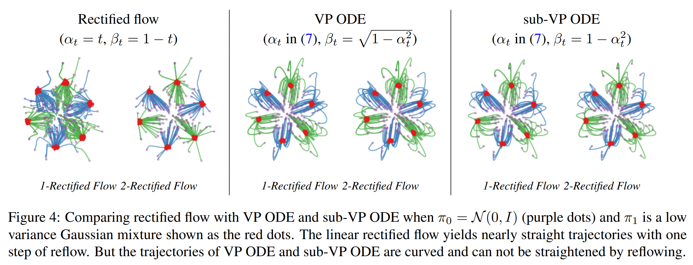
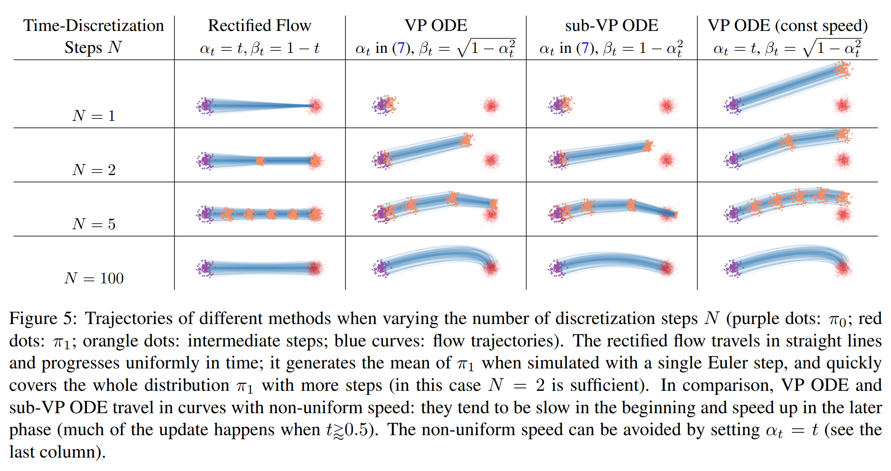

[Back to Main](../../../main.md)

 

# Flow Straight and Fast: Learning to Generate and Transfer Data with Rectified Flow
Liu et al. 2022

## Introduction
#### Concept) Representation Learning
- Goal)
  - Automatically learn a meaningful low-dimensional representation
- Process)
  - Map high-dimensional data $`X`$ to low-dimensional latent space $`A`$
- e.g.)
  - VAE, GAN, NF

#### Concept) Domain Transfer
- Goal)
  - Translate data from a source domain to a target domain while preserving the core content
- Process)
  - Learn a [transport map](#concept-transport-map) $`T`$ from one distribution to another.

 

#### Concept) Transport Map
- Def.)
  - Given empirical observations of two distributions on $`\mathbb{R}^d`$,
    - $`X_0\sim \pi_0`$
    - $`X_1\sim \pi_1`$
  - a transport map $`T:\mathbb{R}^d\rightarrow\mathbb{R}^d`$ can be defined as
    - $`Z_1 := T(Z_0)\sim \pi_1`$ for $`Z_0\sim\pi_0`$
  - The pair $`(Z_0, Z_1)`$ is a coupling (transport plan) or $`\pi_0`$ and $`\pi_1`$.
- Representations)
  - GAN-Type Minimax Algorithm
    - Drawbacks)
      - Numerical instability, mode collapse issues, and the need for hume fine tuning
    - e.g.) Cycle GAN
  - MLE
    - Drawbacks)
      - Intractability of the objective
        - Thus, approximation methods such as variational or Monte Carlo inference techniques are used.
      - Implementations such as VAE and NF have trade off between expressive poser and computational cost
  - Implicit Continuous Time Process
    - e.g.)
      - Ordinary Differential Equations (ODE)
        - Flow Models
      - Stochastic Differential Equations (SDE)
        - Diffusion Models
    - Advantage)
      - Superb image quality and diversity without instability and mode collapse issues
    - Drawback)
      - High computational cost in inference time
  - Optimal Transport (OT)
    - Desc.)
      - Unifies both generative learning techniques and the domain transfer problem.
        - cf.) Other models treated them separately.
      - Utilizes the cost function $`c:\mathbb{R}^d\rightarrow\mathbb{R}`$ and train to minimize the score $`\mathbb{E}[c(Z_1-Z_0)]`$.
    - Drawback)
      - Slow for high dimensional and large volumes of data
      - The cost metric is not perfectly aligned with the actual learning performance.

#### Concept) Transport Cost
- Def.)
  - The total effort to transform one probability distribution into another according to a specific transport plan or coupling

 

## 2. Method (Rectified Flow)
### 2.1 Overview
#### Concept) Rectified Flow
- Goal)
  - Provide simple approach to the transport mapping problem
  - Unifiedly solve both generative modeling and domain transfer
- Desc.)
  - An ODE model that transport between $`\pi_0`$ and $`\pi_1`$ by following **straight** line path as much as possible
- Methods
  - Settings)
    - Let 
      - $`X_0\sim\pi_0`$ : empirical observation 1
      - $`X_1\sim\pi_1`$ : empirical observation 2
      - $`(X_0, X_1)`$ : the data pair
        - Arbitrary!
    - The **rectified flow** induced from the data pair $`(X_0,X_1)`$ is an ordinary differentiable model (ODE) on time $`t\in[0,1]`$
      - $`\text{d} Z_t = v_\theta(Z_t, t) \text{d}t`$
        - where
          - $`Z_0\sim\pi_0`$
          - $`Z_1\sim\pi_1`$
          - $`\mathbf{Z} = (Z_0, Z_1)`$ : the rectified coupling
            - Deterministic!
          - $`v_\theta:\mathbb{R}^d \times \underbrace{[0,1]}_{\text{the time }t}\rightarrow\mathbb{R}^d`$ : the drift force that drive the flow to follow the direction to the linear path $`X_1-X_0`$
            - Parameterized as a neural network
      - $`(Z_0, Z_1) = \text{Rectify}\big((X_0, X_1)\big)`$ : the mapping from the data pair $`(X_0, X_1)`$ to the rectified coupling $`(Z_0, Z_1)`$
      - $`\mathbf{Z} = \text{RectFlow}\big((X_0, X_1)\big)`$ : the rectified flow induced from $`(X_0, X_1)`$.
  - Training)
    - Model)
      - $`\hat{\theta} = \displaystyle\arg\min_\theta \int_0^1 \mathbb{E}\Big[ \big\Vert \underbrace{(X_1-X_0)}_{\text{Dynamic Instruction!}} - v_{\theta}(X_t, t) \big\Vert^2 \Big]\text{d}t`$
        - where 
          - $`X_1 - X_0`$ : the dynamic instruction between $`X_0`$ and $`X_1`$
            - Desc.)
              - Assume that the datapoints $`X_0`$ and $`X_1`$ are the vectors.
              - Then, the vector $`X_1 - X_0`$ contains the direction and the magnitude between them.
              - We want our velocity model to approximate it.
          - $`v_{\theta}(X_t, t)`$ : our velocity model
            - Why velocity?)
              - Velocity is composed of the direction and the magnitude.
              - We want our model to approximate those properties as time $`t`$ continues.
          - $`X_t = tX_1 + (1-t)X_0`$
    - Desc.)
      - Sample an arbitrary data pair $`(X_0, X_1)`$ from distributions $`\pi_0`$ and $`\pi_1`$.
      - Following the straight path between $`X_0`$ and $`X_1`$, we train the ODE model of $`v_\theta`$
        - Goal)
          - $`v_\theta(X_t, t)\approx X_1-X_0`$
  - Inference / Sampling)
    - Model)
      - Solve $`\text{d}\tilde{X}_t = -v(\tilde{X}_t, t)\text{d}t`$
    - Desc.)
      - Two directional
        - Sample $`Z_0\sim\pi_0`$ ($`Z_1\sim\pi_1`$)
        - Use the trained dynamics to find the rectified pair $`Z_1\sim\pi_1`$ ($`Z_0\sim\pi_0`$)
- Algorithm)   
  
- Props.)
  - [Flows avoid crossing](#prop-211-flows-avoid-crossing)
  - [Rectified flow reduce transport costs](#prop-212-rectified-flow-reduce-transport-costs)
  - [Straight line flows yield fast simulation](#prop-213-straight-line-flows-yield-fast-simulation)

 

 

#### Prop 2.1.1) Flows avoid crossing
- Fundamental Mathematical Requirement
  - ODE must have unique solution for any given starting point
- The Problem with Naive Interpolation
  - When dealing with multi-modal distributions, paths created by simple linear interpolation can intersect.
    - e.g.)
      - Suppose $`\pi_0`$ and $`\pi_1`$ are multi-modal.
      - We define a linear interpolation $`X_t`$.
        - where the flow is defined by the velocity field $`v(Z_t, t)`$
      - Suppose two paths cross at a point $`(Z_\tau, \tau)`$.
      - Then the function $`v`$ should output two different velocities for the same input $`(Z_\tau, \tau)`$.
      - This is the contradiction.
- The [Rectified Flow](#re) solution   
  
  - By optimizing a loss that forces the learned velocity field $`v_\theta`$ to match the velocity of a straight line $`(X_1-X_0)`$, the model learns a globally simple and consistent flow.
  - This optimization implicitly **rewires** the initial random pairings to find a **non-crossing** transport plan.
  - This guarantees the unique solution of the ODE.

 

#### Prop 2.1.2) Rectified flow reduce transport costs
- Key Idea)
  - If $`\displaystyle\min_{v} \int_0^1 \mathbb{E}\Big[ \big\Vert (X_1-X_0) - v(X_t, t) \big\Vert^2 \Big]\text{d}t`$ is solved exactly,
    - $`(Z_0, Z_1)`$ of the rectified flow is guaranteed to be a valid coupling of $`\pi_0, \pi_1`$
      - i.e.) $`Z_1 \sim \pi_1`$ if $`Z_0\sim\pi_0`$
      - cf.) Refer to [Thm. 3.3](#thm-33)
  - The rectified coupling $`(Z_0,Z_1)`$ guarantees to yield no larger [transport cost](#concept-transport-cost) than the data pair $`(X_0,X_1)`$ simultaneously for all convex cost functions $`c`$.
    - Here, the convex cost function come from the OT model.
    - cf.) Refer to [Thm. 3.5](#thm-35)
  - The rectified coupling $`(Z_0,Z_1)`$ has deterministic dependency as it is constructed from an ODE model.
    - cf.) Whereas the data pair $`(X_0,X_1)`$ may be an arbitrary coupling of $`\pi_0,\pi_1`$
      - i.e.) Less meaning fully paired observations in practical problems.

 

#### Prop 2.1.3) Reflow (Rectification)
- Def.)
  - Suppose we recursively apply rectified flow as    
    $`\begin{aligned}
      (Z_0^0, Z_1^0) &= \text{RectFlow}\big((X_0,X_1)\big) \\
      (Z_0^1, Z_1^1) &= \text{RectFlow}\big((Z_0^0, Z_1^0)\big) \\
      &\vdots \\
      (Z_0^k, Z_1^k) &= \text{RectFlow}\big((Z_0^{k-1}, Z_1^{k-1})\big) \\
    \end{aligned}`$
  - We may denote
    - $`\mathbf{Z}^0`$ : a rectified flow
    - $`\mathbf{Z}^k`$ : a $`k`$-rectified flow
- Desc.)
  - Recursively apply the rectified flow.
  - Maintain the model $`v_\theta`$ that we trained in the previous rectification stage.
  - Input
    - $`(Z_0^{k-1},Z_1^{k-1})`$ : the $`(k-1)`$-rectified coupling
      - How to get)
        - Draw $`Z_0^{k-1}\sim\pi_0\quad \big(Z_1^{k-1}\sim\pi_1\big)`$
        - Using $`v_\theta`$, infer $`Z_1^{k-1}\quad \big(Z_0^{k-1}\big)`$
  - Output
    - $`(Z_0^{k},Z_1^{k})`$
- Prop.)
  - Reflow procedure...
    - decreases transport cost
    - straighten paths of rectified flows
  - Perfectly straight paths can be simulated exactly with a single Euler step.
    - i.e.) one-step model
  - Different from the [distillation process](#224-distillation) that attempts the one-shot inference.

 

### 2.2 Main Results and Properties
#### Def.) Optimal Model
- For a given coupling $`(X_0,X_1)`$, the exact minium of the objective can be achieved if
  - $`v^X(x,t) = \mathbb{E}[X_1-X_0\mid X_t = x]`$
    - i.e) Optimal Velocity Field
- Optimal rectified flow
  - $`\text{d}Z_t = v^X(Z_t, t)\text{d}t`$ with $`Z_0\sim\pi_0`$

 

#### 2.2.1 Marginal Preserving Property
- Prop.)
  - $`\text{Law}(Z_t) = \text{Law}(X_t),\quad \forall t\in[0,1]`$
    - i.e.) The marginal law of $`Z_t`$ equals that of $`X_t`$ at every time $`t`$
    - where $`\text{Law}`$ denotes the marginal probability
- Desc.)
  - The joint distribution of $`X_t`$ is in general non-causal, non-Markov.
    - Why?)
      - $`(X_0,X_1)`$ is just an arbitrary pairing.
      - There can be multiple cross points among different $`X_t`$s.
  - However, if you take the expectation of them, a nice shaped transportation that causalizes, Markovianizes, and derandomizes the $`X_t`$.
  - The optimal model, $`v^X`$ approximates such paths.
  - And additionally, if we marginalize out with $`t`$, the distributions of $`X_t`$ and $`Z_t`$ may be identical.
    - e.g.) Flow case
      - Assume that $`Z_t`$ is the laminar flow and $`X_t`$ is the turbulent flow.   
        
      - Although $`X_t`$ seems random and chaotic, there is a trend in general of flowing rightward.
      - $`Z_t`$ can be a structured flow that learned the simplified version of this trend.

 

#### 2.2.2 Reducing Transport Costs
- Prop.)
  - The rectified coupling $`(Z_0, Z_1)`$ yields lower or equal convex transport costs than input $`(X_0, X_1)`$ in that $`\mathbb{E}\big[ c(Z_1-Z_0) \big] \le \mathbb{E}\big[ c(X_1-X_0) \big]`$ for any convect cost $`c:\mathbb{R}^d\rightarrow\mathbb{R}`$
- Convex Cost Function
  - e.g.)
    - $`c(\cdot) = \Vert\cdot\Vert^\alpha,\quad \alpha\ge 1`$
    - $`c(\cdot) = \Vert\cdot\Vert`$   
      

#### 2.2.4 Distillation
- Goal)
  - We want to perform a one-shot inference model that approximates the final stage $`k`$-rectified model.
  - We may fine tune the existing $`k`$-rectified flow model $`v_{\hat{\theta}}^k`$ to do that task.
- Model)
  - $`\hat{T}`$ : a neural network s.t.
    - $`\hat{T}(z_0) = z_0 + v_{\hat{\theta}}^k(z_0, 0)`$ : the one-shot inference of $`z_1`$ given $`z_0`$
- Training)
  - $`\displaystyle\min_{\hat{\theta}} \mathbb{E}\Big[\big\Vert(Z_1^k-Z_0^k) - v_{\hat{\theta}}^k(Z_0^k, 0)\big\Vert^2\Big]`$
    - where $`(Z_0^k, Z_1^k)`$ is the k-rectified coupling
- Prop.)
  - [Reflow (Rectification)](#prop-213-reflow-rectification) vs Distillation
    - Distillation attempts to faithfully approximate the coupling $`(Z_0^k, Z_1^k)`$. 
      - Thus, the input and the output are all $`(Z_0^k, Z_1^k)`$.
    - [Reflow (Rectification)](#prop-213-reflow-rectification) yields different coupling with lower transport cost and more straight flow.
      - Input : $`(Z_0^k, Z_1^k)`$
      - Output : $`(Z_0^{k+1}, Z_1^{k+1})`$

 

#### 2.2.5 Exact Calculation on the Velocity Field
- Model)
  - Let $`\rho(x_0\mid x_1)`$ be a conditional density function of $`X_0`$ given $`X_1=x_1`$.
  - If such $`\rho`$ exists, we may denote the [optimal velocity field](#def-optimal-model) $`v^X`$ as
    - $`v^X(z,t) = \displaystyle\mathbb{E}\left[ \frac{X_1 - z}{1-t} \eta_t(X_1, z) \right]`$
      - where
        - $`\eta_t(X_1, z) = \displaystyle\frac{\rho\left(\frac{z-tX_1}{1-t}\mid X_1\right)}{\mathbb{E}\left[ \rho\left( \frac{z-tX_1}{1-t} \mid X_1 \right) \right]}`$
- Derivation)
  - Put $`z = tX_1 + (1-t)X_0 = X_t`$.
  - Thus, we may rewrite as
    - $`X_0 = \displaystyle\frac{z-tX_1}{1-t},\quad X_1-X_0 = \displaystyle\frac{X_1-z}{1-t}`$
  - From the [optimal velocity field](#def-optimal-model), we may get   
    $`\begin{aligned}
      v^X(x,t) &= \mathbb{E}[X_1-X_0\mid X_t = z] \\
      &= \mathbb{E}\left[\frac{X_1-z}{1-t} \Big\vert X_t = z \right] \\
      &= \int \frac{x_1-z}{1-t} \cdot p(x_1\mid z) \text{d} x_1 \\
      &= \int \frac{x_1-z}{1-t} \cdot \frac{p(z\mid x_1) \; p(x_1)}{p(z)} \text{d} x_1 & (\because\text{Bayes Rule}) \\
    \end{aligned}`$
  - We may rewrite $`p(z\mid x_1)`$ as   
    $`\begin{array}{lll}
      p(z\mid x_1) &= \rho\left( X_0\mid X_1=x_1 \right) \cdot \left\vert\frac{\text{d} X_0}{\text{d} z}\right\vert & (\because X_0\text{ is the only randomness in } z) \\
      &= \rho\left( \frac{z-tX_1}{1-t} \Big\vert x_1 \right) \cdot \frac{1}{1-t} & \cdots (A)
    \end{array}`$
  - Also, we may rewrite $`p(z)`$ as   
    $`\begin{array}{lll}
      p(z) &= \int p(z\mid x_1) \cdot p(x_1) \; \text{d} x_1 \\
      &= \mathbb{E}_{X_1} \left[ p(z\mid x_1) \right] \\
      &= \mathbb{E}_{X_1} \left[ \rho\left( \frac{z-tX_1}{1-t} \Big\vert x_1 \right) \cdot \frac{1}{1-t} \right] & \cdots (B) \\
    \end{array}`$
  - Plugging (A) and (B), we may get   
    $`\begin{aligned}
      v^X(x,t) 
      &= \int \frac{x_1-z}{1-t} \cdot \frac{p(z\mid x_1) p(x_1)}{p(z)} \text{d} x_1 \\
      &= \int \frac{x_1-z}{1-t} \cdot \frac{\rho\left( \frac{z-tX_1}{1-t} \Big\vert x_1 \right) \cdot \frac{1}{1-t}}{\mathbb{E}_{X_1} \left[ \rho\left( \frac{z-tX_1}{1-t} \Big\vert x_1 \right) \cdot \frac{1}{1-t} \right]} p(x_1) \text{d} x_1 \\
      &= \mathbb{E}\left[ \frac{X_1 - z}{1-t} \eta_t(X_1, z) \right] & \left(\text{Put }\eta_t(X_1,z) = \frac{\rho\left(\frac{z-tX_1}{1-t}\mid X_1\right)}{\mathbb{E}\left[ \rho\left( \frac{z-tX_1}{1-t} \mid X_1 \right) \right]}\right) \\
    \end{aligned}`$
- Prop.)
  - If $`\rho(x_0\mid x_1)`$ is positive and continuous $`\forall (X_0\mid X_1)`$
    - then $`v^X`$ is well defined and continuous on $`\mathbb{R}^d\times[0,1)`$
  - Further if $`\log\eta_t`$ is continuously differentiable w.r.t. $`z`$
    - $`\nabla_z v^X(z,t) = \displaystyle\frac{1}{1-t} \mathbb{E}\Big[ ((X_1-z)\nabla_z\log\eta_t(X_1,z) - 1)\;\eta_t(X_1,z) \Big]`$
  - If $`v^X`$ is uniformly Lipschitz continuous on $`[0,a],\;\forall a\lt1`$
    - $`\text{d} Z_t = v^X(Z_t, t)\text{d}t`$ is guaranteed to have a unique solution
  - Consider the case that $`\pi_0`$ is discrete where $`X_0\sim\pi_0`$
    - Then $`X_0\mid X_1=x_1`$ does not yield any conditional density function
    - As a result, $`v^X(z,t)`$ may be undefined or discontinuous.
    - Consequently, the ODE $`\text{d} Z_t = v^X(Z_t, t)\text{d}t`$ will ill-behave.
      - Sol.) Add $`X_0`$ with a Gaussian noise $`\xi\sim\mathcal{N}(0,\sigma^2I)`$.
        - Then $`\tilde{X}_0 = X_0 + \xi`$

 

#### 2.2.6 Smooth Function Approximation
- Key Idea)
  - We saw that we can get the [closed form solution](#225-exact-calculation-on-the-velocity-field) of $`v^X`$.
  - However, this may cause overfit to the data $`X`$.
  - Thus, it is important to take smooth function approximation, instead of directly using $`v^X`$.
  - In case of **high**-dimensional and large scale problem, the **deep neural network** perfectly serves as a smooth approximation of $`v^X`$.
  - However, if the problem setting is **low**-dimensional, neural network may not be efficient, considering its training cost, or may cause overfit to the data.
  - Instead, we may use alternative simpler models.
- Alternative for **Low**-Dimensional Problem
  - Nadaraya-Watson style Non-Parametric Estimator of $`v^X`$
    - $`v^{X,h}(z,t) = \displaystyle\mathbb{E}\left[ \frac{X_1-z}{1-t}\omega_h(X_t, z) \right]`$
      - where
        - $`\omega_h(X_t, z) = \displaystyle\frac{\kappa_h(X_t,z)}{\mathbb{E}[\kappa_h(X_t,z)]}`$
        - $`\kappa_h(x,z)`$ is a smoothing kernel with a bandwidth parameter $`h\gt0`$ that measures the similarity between $`x`$ and $`z`$.
          - e.g.) RBF Kernel $`\kappa_h(x,z) = \exp(-\Vert x-z\Vert^2/2h^2)`$

  

### 2.3 A Nonlinear Extension
- Key Idea)
  - Previous rectification used the linear interpolation $`X_t`$
    - i.e.) $`X_t = tX_1 + (1-t)X_0`$
  - What if we try **non-linear curves** connecting $`X_0`$ and $`X_1`$?
    - [Thm 3.3](#thm-33) shows that they can still transport $`\pi_0`$ to $`\pi_1`$
    - However, they do not guarantee the decrease in convex transport costs or straightening effects.
    - Probability Flow and DDIM can be viewed as ones that used this approach.
- Model)
  - Let
    - $`\mathbf{X} = \{X_t:t\in[0,1]\}`$ : any time-differentiable random process that connects $`X_0`$ and $`X_1`$
    - $`\dot{X_t}`$ : the time derivative of $`X_t`$
  - The non-linear rectified flow induced from $`\mathbf{X}`$ is defined as
    - $`\text{d}Z_t = v^X(Z_t,t)\text{d}t`$
      - where
        - $`Z_0 = X_0`$
        - $`v^X(z,t) = \mathbb{E}\left[ \dot{X_t} \mid X_t = t \right]`$
  - Optimization)
    - $`\displaystyle\min_v \int_0^1 \mathbb{E}\left[ w_t \Big\Vert v(X_t, t) - \dot{X_t} \Big\Vert^2 \right]\text{d}t`$
      - where
        - $`w_t:(0,1)\rightarrow(0,+\infty)`$ : a positive weighting sequence
          - cf.) $`w_t = 1`$ by default.
- Prop.)
  - $`\text{Law}(Z_t) = \text{Law}(X_t),\quad\forall t\in[0,1]`$
    - Thus, $`(Z_0,Z_1)`$ remains to be a coupling of $`\pi_0,\pi_1`$
  - If $`\mathbf{X}`$ is not straight, $`(Z_0,Z_1)`$ no longer guarantees to decrease the convex transport cost over $`(X_0, X_1)`$
- e.g.)
  - Linear Interpolation)
    - If $`\dot{X_t} = X_1-X_0`$ and $`w_t=1`$
      - the model is the linear interpolation $`X_t = tX_1 + (1-t)X_0`$
  - Probability Flow ODE (PF-ODE)
    - Desc.)
      - All variants of PF-ODEs can be viewed as instances of the non-linear rectified flow 
        - when using 
          - $`X_t = \alpha_t X_1 + \beta_t\xi`$
          - $`\exists \alpha_t, \beta_t`$
          - $`\alpha_1=1,\beta_1 = 0`$
          - $`\xi\sim\mathcal{N}(0,I)`$
    - Types)
      - [VE ODE](../../../paper_presentation/250924_latent_diffusion/paper_summary/score_based_model.md#model-ve-sde)
      - [VP ODE](../../../paper_presentation/250924_latent_diffusion/paper_summary/score_based_model.md#model-vp-sde)
      - [sub-VP ODE](../../../paper_presentation/250924_latent_diffusion/paper_summary/score_based_model.md#model-sub-vp-sde)   
        
    - Props.)
      - Non-straight paths
      - Non-uniform speed   
        

  

## 3. Theoretical Analysis
### 3.1 The Marginal Preserving Property
#### Def. 3.1)

#### Def. 3.2)

#### Thm. 3.3)

### 3.2 Reducing Convex Transport Costs
#### Def. 3.4)

#### Thm. 3.5)

### 3.3 The Straightening Effect
#### Thm. 3.6)

#### Thm. 3.7)

### 3.4 Straight vs. Optimal Couplings
#### Thm. 3.8)

#### Lemma 3.9)

#### Thm. 3.10)

### 3.5 Denoising Diffusion Models and Probability Flow ODEs
#### Prop. 3.11)

  

[Back to Main](../../../main.md)