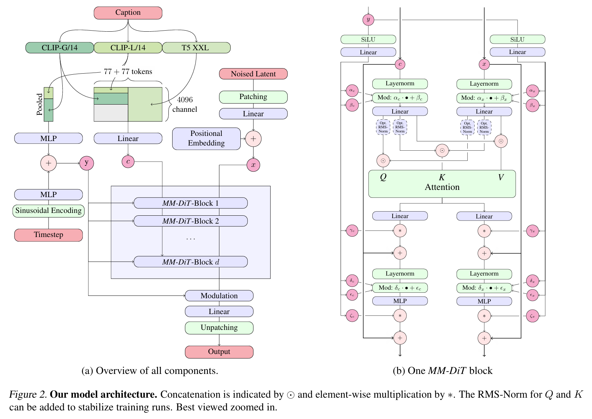

# Scaling Rectified Flow Transformers for High-Resolution Image Synthesis
Esser et al. 2024

## 2. Simulation-Free Training of Flows
- Problem Settings)
  - $`x_0\sim p_0`$ : a sample from a data distribution $`p_0`$
  - $`x_1\sim p_1`$ : a sample from a noise distribution $`p_1`$
    - where
      - $`p_1=\mathcal{N}(0,1)`$
  - $`\text{d} y_t = v_{\Theta}(y_t, t) \text{d}t`$ : an ordinary differential equation (ODE) that maps $`x_0`$ and $`x_1`$
    - where 
      - $`v`$ is parameterized by the weights $`\Theta`$ of a neural network
    - Sol.)
      - Directly regress a vector field $`u_t`$ below.
  - $`u_t`$ : a vector field that generates a probability path $`p_t`$ between $`p_0`$ and $`p_1`$
  - $`z_t = a_t x_0 + b_t \epsilon`$ : a forward process set to construct $`u_t`$
      - where
        - $`\epsilon\sim\mathcal{N}(0,I)`$
      - Prop.)
        - For $`a_0=1, b_0=0\quad \Rightarrow\quad z_0 = x_0`$
        - For $`a_1=0, b_1=1\quad \Rightarrow\quad z_1 = \epsilon`$
        - Thus,
          - $`p_t(z_t) = \mathbb{E}_{\epsilon\sim\mathcal{N}(0,I)} p_t(z_t\mid\epsilon)`$
  - $`\psi_t`$ : the flow that relates $`z_t, x_0`$ and $`\epsilon`$ 
    - s.t.
      - $`\psi_t(\cdot\mid\epsilon) : x_0\rightarrow \underbrace{a_tx_0 + b_t \epsilon}_{z_t}`$
      - $`u_t(z\mid\epsilon) := \psi_t'\left( \psi_t^{-1}(z\mid\epsilon) \mid\epsilon \right)`$
        - Prop.) 
          - Putting $`z_0 = x_0`$
            - $`z_t' = u_t(z_t\mid\epsilon)`$ is the solution to the ODE
            - $`u_t(\cdot\mid\epsilon)`$ generates $`p_t(\cdot\mid\epsilon)`$
        - Explicit Form)   
          - $`\displaystyle u_t(z_t \mid\epsilon) = \frac{a_t'}{a_t}z_t -\frac{b_t}{2} \lambda_t' \epsilon`$
            - where $`\lambda_t := \log\frac{a_t^2}{b_t^2}`$ is the log signal-to-noise ratio (SNR)
            - Derivation)
              - Consider that 
                - (A) : $`\psi_t'(x_0\mid\epsilon) = \frac{\text{d}}{\text{d}t}(a_tx_0 + b_t\epsilon) = a_t'x_0 + b_t'\epsilon`$
                - (B) : $`\displaystyle\psi_t^{-1}(z) = \frac{z-b_t\epsilon}{a_t}`$
                - (C) : $`\displaystyle z_t = a_t x_0 + b_t \epsilon \quad\Leftrightarrow\quad x_0 = \frac{z_t-b_t\epsilon}{a_t}`$
                - (D) : $`\displaystyle \lambda_t' = \frac{\text{d}}{\text{d}t}\lambda_t= \left( \frac{b_t^2}{a_t^2} \right)\left( \frac{2a_t a_t'}{b_t^2} - \frac{2a_t^2 b_t'}{b_t^3} \right) = \frac{2a_t'}{a_t} - \frac{2b_t'}{b_t} = \frac{2}{b_t}\left( \frac{a_t'b_t}{a_t} - b_t' \right)`$
              - Thus,   
                $`\begin{aligned}
                    u_t(z_t\mid\epsilon) &= \psi_t'\left( \psi_t^{-1}(z_t\mid\epsilon) \mid\epsilon \right) \\
                    &= \psi_t'\left( \frac{z_t-b_t\epsilon}{a_t} \mid\epsilon \right) & \because(B) \\
                    &= \psi_t'\left( \frac{z_t -b_t\epsilon}{a_t}  \right) \\\
                    &= a_t' \left(\frac{z_t-b_t\epsilon}{a_t}\right) + b_t'\epsilon  &\because (A),(C) \\
                    &= \frac{a_t'}{a_t} z_t - \left(\frac{a_t'b_t}{a_t} - b_t'\right) \epsilon \\
                    &= \frac{a_t'}{a_t} z_t - \frac{b_t}{2}\lambda_t'\epsilon & \because (D)
                \end{aligned}`$

 

#### Concept) Flow Matching Objective
- $`\mathcal{L}_{\text{FM}} = \mathbb{E}_{t,p_t(z)}\left[ \big\Vert v_\Theta(z,t) - u_t(z) \big\Vert_2^2 \right]`$
  - where
    - $`\displaystyle u_t(z) = \mathbb{E}_{\epsilon\sim\mathcal{N}(0,I)}\left[ u_t(z\mid\epsilon) \frac{p_t(z\mid\epsilon)}{p_t(z)} \right]`$ : the marginal vector field
  - Problem)
    - $`u_t`$ is intractable

 

#### Concept) Conditional Flow Matching Objective)   
$`\begin{aligned}
    \mathcal{L}_{\text{CFM}} &= \mathbb{E}_{t,p_t(z\mid\epsilon),p(\epsilon)}\left[ \big\Vert v_\Theta(z,t) - \underbrace{u_t(z\mid\epsilon)}_{\text{cond'l VF}} \big\Vert_2^2 \right] \\
    &= \mathbb{E}_{t,p_t(z\mid\epsilon),p(\epsilon)}\left[ \bigg\Vert v_\Theta(z,t) - \underbrace{\left(\frac{a_t'}{a_t}z_t -\frac{b_t}{2} \lambda_t' \epsilon\right)}_{\text{Explicit Form}} \bigg\Vert_2^2 \right] \\
    &= \mathbb{E}_{t,p_t(z\mid\epsilon),p(\epsilon)}\left[ \bigg\Vert \left(v_\Theta(z,t) - \frac{a_t'}{a_t}z_t\right) + \frac{b_t}{2} \lambda_t' \epsilon \bigg\Vert_2^2 \right] \\
    &= \mathbb{E}_{t,p_t(z\mid\epsilon),p(\epsilon)} \left(-\frac{b_t}{2} \lambda_t'\right)^2 \left[ \Big\Vert \epsilon_\Theta(z,t) - \epsilon \Big\Vert_2^2 \right] & \text{Put } \epsilon_\Theta(z,t) = \frac{-2}{b_t\lambda_t'}\left(v_\Theta(z,t) - \frac{a_t'}{a_t}z_t\right) \\
\end{aligned}`$
- Prop.)
  - The gradient of the CFM objective is equivalent to that of the [Flow Matching objective](#concept-flow-matching-objective).
    - $`\nabla_\Theta \mathcal{L}_{\text{CFM}} = \nabla_\Theta \mathcal{L}_{\text{FM}}`$

 

#### Concept)  min-SNR Weighting Scheme (Kingma & Gao, 2023)   
- $`\displaystyle \mathcal{L}_w(x_0) = -\frac{1}{2}\mathbb{E}_{t\sim\mathcal{U}(t), \epsilon\sim\mathcal{N}(0,I)} \left[ w_t\lambda_t' \underbrace{\Big\Vert \epsilon_\Theta(z,t) - \epsilon \Big\Vert_2^2}_{\text{Same objective!}} \right]`$
  - Idea)
    - Previous $`\mathcal{L}_{\text{CFM}}`$ had the weight of $`\left(-\frac{b_t}{2} \lambda_t'\right)^2`$.
    - Setting any other time-dependent weight other than $`\left(-\frac{b_t}{2} \lambda_t'\right)^2`$ does not change the global optimum of the objective function.
    - However, it may affect the gradient that we care for the gradient descent solution.
    - Kingma & Gao suggested that clipping as $`w_t = \min(\text{SNR}_t, \gamma)`$ stabilizes the training.
      - where $`\text{SNR}_t = \frac{a_t^2}{b_t^2} = \exp(\lambda_t)`$

  

## 3. Flow Trajectories
### Concept) Rectified Flow
- Def.)
  - $`z_t = (1-t)x_0 + t\epsilon`$ : the forward process
- Desc.)
  - Forward process is defined as straight paths between the data distribution and a standard normal distribution
  - Uses the [CFM Objective](#concept-conditional-flow-matching-objective) $`\mathcal{L}_{\text{CFM}}`$ with $`w_t^{\text{RF}} = \frac{t}{1-t}`$

 

### Concept) EDM
- Def.)
  - $`z_t = x_0 + b_t \epsilon`$ : the forward process
    - where
      - $`b_t = \exp F_{\mathcal{N}}^{-1} (t\mid P_m, P_s^2)`$
      - $`F_{\mathcal{N}}^{-1}`$ : the quantile function of the normal distribution with 
        - $`P_m`$ : mean
        - $`P_s^2`$ : variance
- Desc.)
  - The network is parameterized through an $`\mathbf{F}`$-prediction
  - The loss can be written as $`\mathcal{L}_{w_t^{\text{EDM}}}`$ with
    - $`w_t^{\text{EDM}} = \mathcal{N}(\lambda_t; -2P_m, (2P_s)^2) (e^{-\lambda_t} + 0.5^2)`$

 

### Concept) Cosine
- Def.)
  - $`z_t = \displaystyle\cos\left(\frac{\pi t}{2}\right)x_0 + \sin\left(\frac{\pi t}{2}\right) \epsilon`$ : the forward process
    - cf.) Corresponds to a weighting $`w_t = \text{sech}(\lambda_t / 2)`$
- Desc.)
  - When combined with a $`\mathbf{v}`$-prediction loss, the weighting is given by $`w_t = e^{-\lambda_t/2}`$

 

### Concept) LDM
- Desc.)
  - Variance preserving schedules
    - $`b_t = \sqrt{1-a_t^2}`$
    - $`a_t = \sqrt{\prod_{s=0}^t (1-\beta_s)}`$ 
      - where $`\beta_t`$ is the diffusion coefficient for $`t=1,\cdots,T`$
        - DDPM : $`\beta_t = \beta_0 + \frac{t}{T-1}(\beta_{T-1}-\beta_0)`$
        - LDM : $`\beta_t = \left(\sqrt{\beta_0} + \frac{t}{T-1}\left( \sqrt{\beta_{T-1} - \beta_{0}} \right)\right)^2`$

 

### Concept) Tailored SNR Samplers for RF Models
- Purpose)
  - Get more frequent samples for the intermediate time samples in $`t\in[0,1]`$
    - Why?)
      - For $`t=0`$ and $`t=1`$, we have $`p_0`$ and $`p_1`$ that we can easily predict the mean.
      - However, for the intermediate steps, it's more difficult to predict $`\epsilon-x_0`$ for the velocity $`v_\Theta`$
- How?)
  - Instead of drawing $`t\sim\mathcal{U}(t)`$, use a density $`\pi(t)`$ that has higher density on the intermediate steps.
    - Candidates for $`\pi(t)`$
      - [Logit-Normal Sampling](#concept-logit-normal-sampling)
      - [Mode Sampling with Heavy Tails](#concept-mode-sampling-with-heavy-tails)
      - [CosMap](#concept-cosmap)
  - Utilizing the weight $`w_t^\pi`$ on the [objective](#concept--min-snr-weighting-scheme-kingma--gao-2023) $`\mathcal{L}_{w_t^\pi}`$ has the same effect.
    - $`\displaystyle w_t^\pi = \frac{t}{1-t}\pi(t)`$

 

#### Concept) Logit-Normal Sampling
- Def.)
  - $`\displaystyle\pi_{\ln}(t;m,s) = \frac{1}{s\sqrt{2\pi}} \frac{1}{t(1-t)} \exp\left(-\frac{(\text{logit}(t)-m)^2}{2s^2}\right)`$
    - where
      - $`\text{logit}(t) = \log\frac{t}{1-t}`$
      - $`m`$ : the location parameter
        - It enables us to bias the training timesteps towards either data $`p_0`$ (negative $`m`$) or noise $`p_1`$ (positive $`m`$)
      - $`s`$ : the scale parameter
- Drawback)
  - The logit-normal density always vanishes at the endpoints 0 and 1.
- Implementation)
  - Sample $`u\sim\mathcal{N}(u;m,s)`$.
  - Map it through the standard logistic function.

 

#### Concept) Mode Sampling with Heavy Tails
- Def.)
  - $`\displaystyle\pi_{\text{mode}}(t;s) = \left\vert \frac{\text{d}}{\text{d}t} f_{\text{mode}}^{-1}(t) \right\vert`$
    - where
      - $`\displaystyle f_{\text{mode}}(u;s) = 1-u-s\cdot\left(\cos^2\frac{\pi u}{2} -1 + u\right)`$
        - which is strictly positive density on $`[0,1]`$
      - $`s`$ : the scale parameter
        - Set $`-1 \le s \le \frac{2}{\pi-2}`$ to make $`f_{\text{mode}}`$ monotonic
        - If $`s=0`$, then $`\pi_{\text{mode}}(t;s=0) = \mathcal{U}(t)`$ 

 

#### Concept) CosMap
- Def.)
  - $`\displaystyle\pi_{\text{CosMap}}(t) = \left\vert \frac{\text{d}}{\text{d}t} f^{-1}(t) \right\vert = \frac{2}{\pi-2\pi t + 2\pi t^2}`$
    - where
      - $`f:u\rightarrow f(u) = t`$ for $`u\in[0,1]`$ s.t.
        - $`\displaystyle t = f(u) = 1-\frac{1}{\tan\left(\frac{\pi u}{2}\right) + 1}`$

  

## 4. Text-to-Image Architecture
- Goal)
  - Text-conditional sampling of images
- Requirements
  - Multi modality : text and image
- General Setup)
  - LDM
    - Pretrained autoencoder
    - Encode the text conditioning $`c`$ using pretrained, frozen text models.
- Architecture)
  - DiT   
    
    - Only considers class conditional image generation
    - Uses a modulation mechanism to condition the network on both the **timestep** of the diffusion process and the **class** label.
      - $`t`$ : timestep
      - $`c_{\text{vec}}`$ : inputs to the modulation mechanism
      - $`c_{\text{ctxt}}`$
    - Construct a sequence of embeddings of the text and image inputs.
      - Positional encodings
      - Flatten $`2\times 2`$ patches of the latent pixel representation $`x\in\mathbb{R}^{h\times w\times c}`$ to a patch encoding sequence of length $`\frac{1}{2}\cdot h \cdot \frac{1}{2}\cdot w`$

