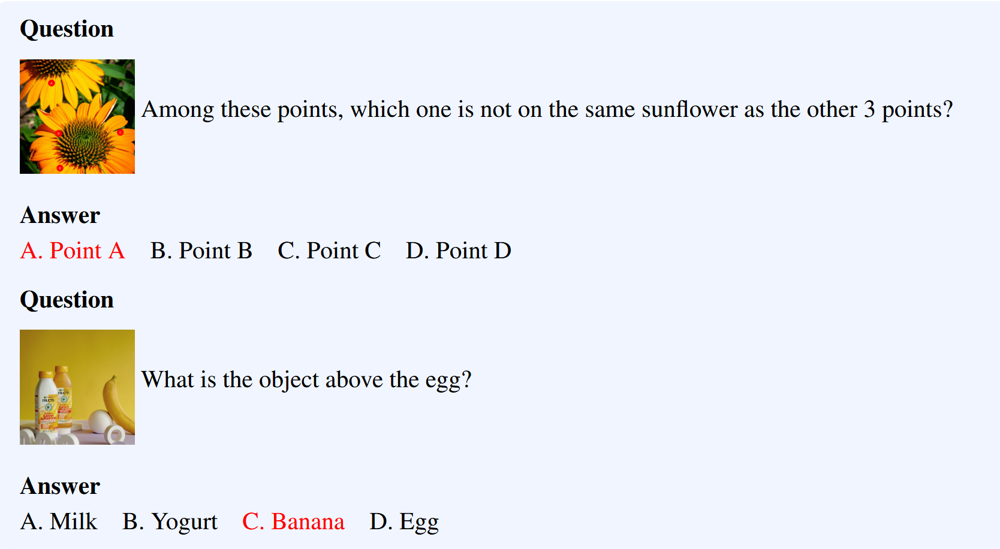

# PhysBench: Benchmarking and Enhancing Vision-Language Models for Physical World Understanding
[@chowPhysBenchBenchmarkingEnhancing2025]

### Concept) PhysBench
- Four Major Task Categories of the Physical World   
  
  1. Physical Object **Property**
     - Desc.)
       - Assessment of physical attributes of objects
     - e.g.)
       - mass, size, density, tension, friction, bending stiffness, elasticity, plasticity
  2. Physical Object **Relationships**
     - Desc.)
       - Evaluation of spatial relationships involving objects' relative or absolute positions and motions
  3. Physical **Scene** Understanding
     - Desc.)
       - Interpretation of environmental factors
     - e.g.)
       - light sources, viewpoints, temperature
  4. Physics-based **Dynamics**
     - Desc.)
       - Understanding of physical events
     - e.g.)
       - collisions, throwing, fluid dynamics, explosions
- Structure
  - A multiple-choice questionnaire
    - Presents four options for each question, with only one answer
  - e.g.)   
    