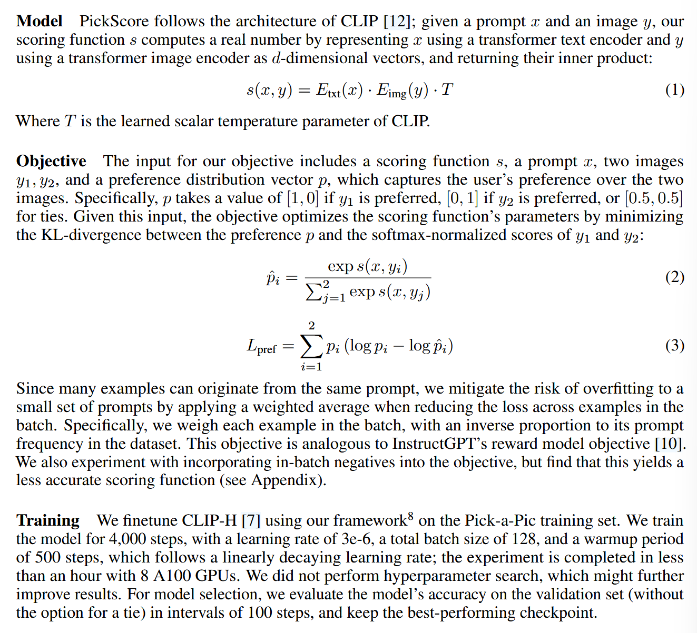

# Pick-a-Pic: An Open Dataset of User Preferences for Text-to-Image Generation
[@kirstainPickaPicOpenDataset2023]

### Concept) Pick-a-Pic
- Web-app that generates T2I images
- Receive user's preference feedback on the generated image
  - Based on this score, this paper suggests the [PickScore](#concept-pickscore)

### Concept) PickScore
- Desc.)
  - Combines the preference score with CLIP-style model 
- Methods)   
  