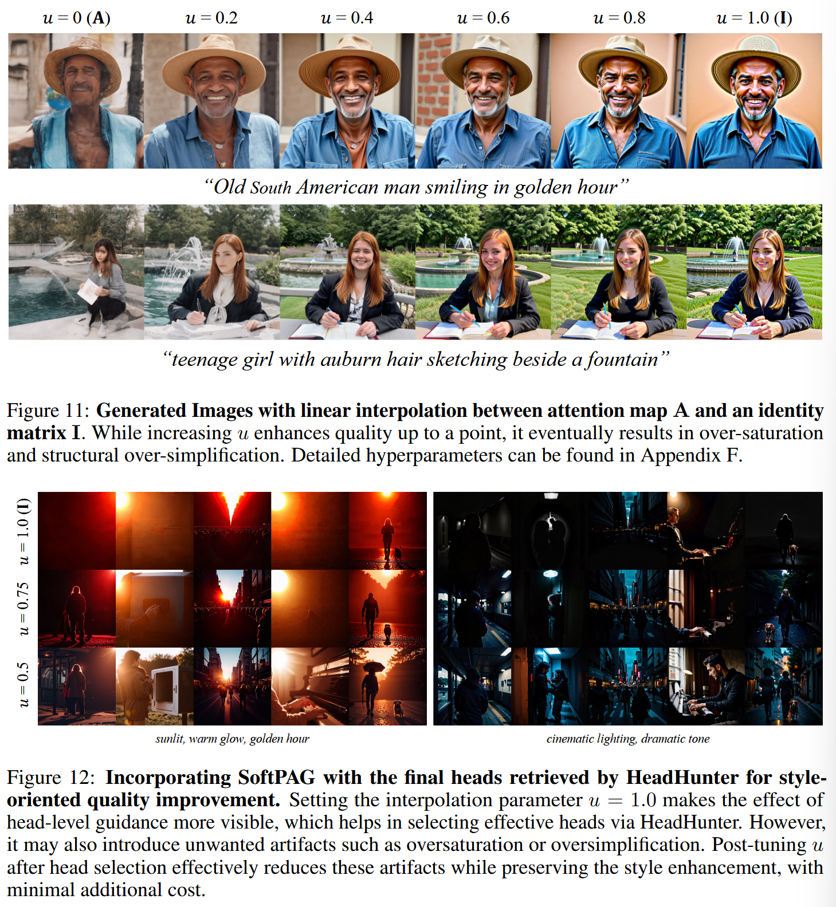

# Fine-Grained Perturbation Guidance via Attention Head Selection
[@ahnFineGrainedPerturbationGuidance2025]

## 2. Preliminaries
### 2.1 Generative Modeling Frameworks
#### Concept) Diffusion Models
- Settings)
  - Forward Process
    - $`\mathbf{x}_t = \alpha_t \mathbf{x}_0 + \sigma_t \epsilon`$
      - where
        - $`\mathbf{x}_0\sim p_{\text{data}}`$ : the image data
        - $`(\alpha_t, \sigma_t)`$ : the noise schedule
        - $`\epsilon\sim\mathcal{N}(\mathbf{0,I})`$
        - $`t\in[0,1]`$
  - Neural Network
    - $`\hat{\epsilon}_\theta(\mathbf{x}_t, t)`$
  - Flow Matching
    - $`\mathbf{x}_t = (1-t)\mathbf{x}_0 + t\epsilon`$ : the continuous time velocity field
      - where
        - $`\epsilon\sim\mathcal{N}(\mathbf{0,I})`$
        - $`\mathbf{u}(\mathbf{x}_t, t) = \epsilon-\mathbf{x}_0`$
    - $`\hat{\mathbf{u}}_\theta(\mathbf{x}_t,t)`$

### 2.2 Architectures for Diffusion Models
#### Concept) Convolutional U-Net with Self-Attention
- Models Used
  - SD1, SD2
- Props.)
  - Hierarchical downsampling
  - Residual convolutions
    - cf.) Suggested in ResNet
      - $`H(x) = F(x) + x`$
        - i.e.) Add input to output.
  - Skip connections
  - Self-attention is occasionally applied to intermediate spatial feature maps to model global dependencies.

 

#### Concept) Multi-head Attention Mechanism
- Desc.)
  - Linearly project queries, keys, and values into multiple subspaces and compute attention in parallel
- Model)
  - Let
    - $`\hat{\epsilon}_\theta`$ : a multi-head attention network with $`H_l`$ number of attention heads.
      - i.e.) $`h\in\{1,\cdots,H_l\}`$
  - The $`l`$-th layer applies the separate linear projections as
    - $`Q_{l,h} = Q_l W_{l,h}^Q`$
    - $`K_{l,h} = K_l W_{l,h}^K`$
    - $`V_{l,h} = V_l W_{l,h}^V`$
      - where
        - $`Q_l,K_l,V_l\in\mathbb{R}^{N\times d}`$
        - $`N`$ : the sequence length
        - $`d`$ : the feature dimension
        - $`W_{l,h}^Q, W_{l,h}^K, W_{l,h}^V \in\mathbb{R}^{d\times\bar{d}}`$ : the head-specific projection matrices
        - $`\bar{d}`$ : the dimensionality of each head
  - Then, $`l`$-th layer's attention map $`A_{l,h}`$ and head output $`O_{l,h}`$ are computed as
    - $`\displaystyle A_{l,h} = \text{Softmax}\left(\frac{Q_{l,h}K_{l,h}^\top}{\sqrt{\bar{d}}}\right)`$
    - $`O_{l,h} = A_{l,h}V_{l,h}`$
  - Finally, the outputs from all heads are then aggregated using an output linear projection:
    - $`\text{MultiHead}(Q_l,K_l,V_l) = \text{Concat}(O_{l,1},\cdots, O_{l,H_l}) W_l^O`$
      - where
        - $`W_l^O\in\mathbb{R}^{(H_l\times\bar{d})\times d}`$ : the output projection matrix at layer $`l`$ 

 

#### Concept) Diffusion Transformer (DiT)
- Desc.)
  - Replaced diffusion model's convolutional structures with pure multi-head attentions
  - Strong scaling behavior
  - Lacks a coarse-to-fine synthesis hierarchy
    - Thus, it is less clear which layers capture high-level semantic features.
    - Hence, conventional image editing and perturbation techniques can not be applied directly.

  

### 2.3 Diffusion Guidance Mechanisms
#### Concept) Classifier-Free Guidance (CFG)
- Model)
  - $`\hat{\epsilon}_{\text{CFG}} = (1+w)\hat{\epsilon}_{\text{cond}} - \hat{\epsilon}_{\text{uncond}}`$
    - where
      - $`w`$ : the guidance scale
      - $`\hat{\epsilon}_{\text{cond}}`$ : predictions with conditioning
      - $`\hat{\epsilon}_{\text{uncond}}`$ : predictions without conditioning

 

#### Concept) Attention Perturbation Guidance
- Model)
  - $`\hat{\epsilon}_{\text{guided}} = (1+w)\hat{\epsilon}_{\text{original}} - \hat{\epsilon}_{\text{perturbed}}`$
    - where
      - $`w`$ : the guidance scale
      - $`\hat{\epsilon}_{\text{perturbed}}`$ : the predicted epsilon under attention perturbation
        - Modifying $`A_{l,h}`$ into $`I`$

  

## 3. Motivation
### 3.1 Analysis of Head-Level Perturbation Guidance
#### Concept) Head-Level Perturbation 
- Goal)
  - Apply perturbations selectively to a subset of attention heads during the forward pass
- Def.)
  - $`\mathbf{A}_{l,h}^{(\text{PAG})} = \mathbf{I}`$
    - where
      - $`(l,h)\in\mathcal{S}`$
      - $`\mathcal{S} = \{(l_1,h_1),\cdots, (l_m,h_m)\}`$ : $`m`$ selected layer-head pairs
- Props.)
  - Intra-Layer Heterogeneity
    - Desc.)
      - In a single layer, a small number of heads are primarily responsible for the generation quality.
      - Even in a well-performing layer, removing heads that degrades the quality of the image can improve the generation quality.
  - Individual head-level guidance occasionally reveals interpretable concepts.
    - e.g.) texture, color tone, geometry, and lighting
  - Complex concepts are formed by combining the activations of attention heads.
  - Perturbation may lead to oversaturation or oversimplification

  

## 4. Controlling Head-Level Attention Perturbation
### 4.1 Head Hunter
- Goal)
  - Set an objective function
    - e.g.) Pick Score [@kirstainPickaPicOpenDataset2023]
  - Greedily find top-k attention heads that has the best average scores.
- Algorithm)   
  

 

#### Results)
- Individual heads' contribution on composing a style.
  - Observation)
    - There was a sudden enhancement in stylistic expression.
    - Authors decomposed the individual effects of each head by applying PAG separately.
    - They found that each head gave distinct style change, which composed to be a sudden change in style.   
      
- Selected heads were distributed across the layers.
- Styling worked on unconditional cases as well, but the effect was not guaranteed.   
  

 

### 4.2 Controlling Guidance Intensity via Attention Map Interpolation
#### Concept) Soft Perturbed-Attention Guidance (SoftPAG)
- Model)
  - $`\mathbf{A}_{l,h}^{(\text{SoftPAG})} = (1-u)\mathbf{A}_i + u\mathbf{I}`$
    - where
      - $`(l,h)\in\mathcal{S}`$
      - $`u\in[0,1]`$
- Result)   
  