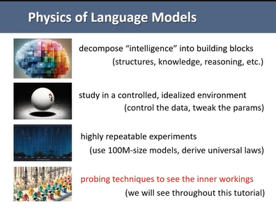
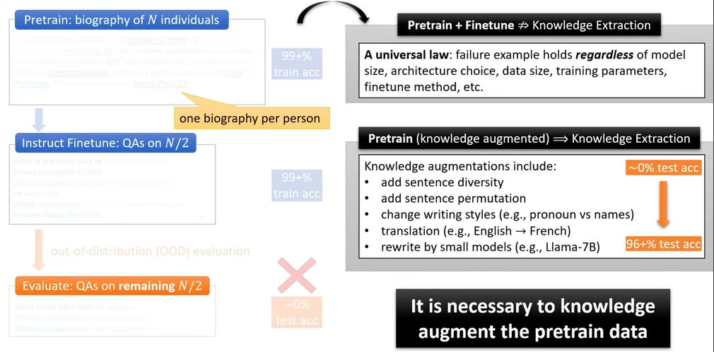
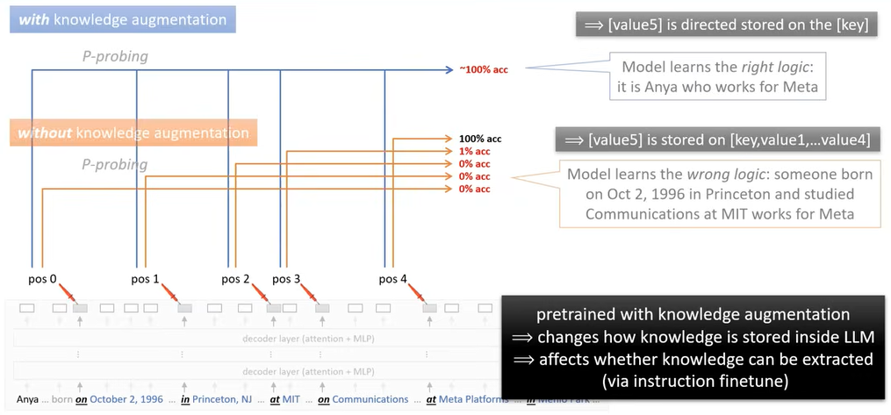
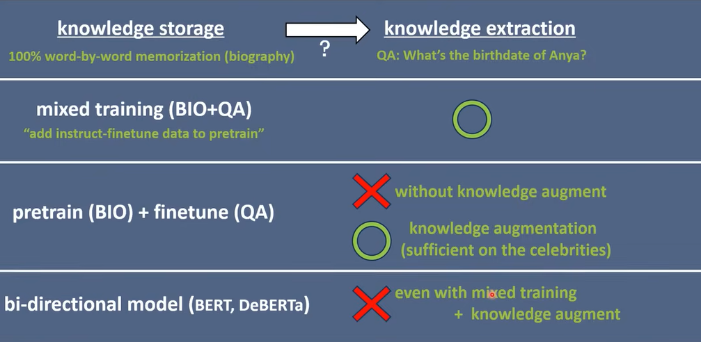
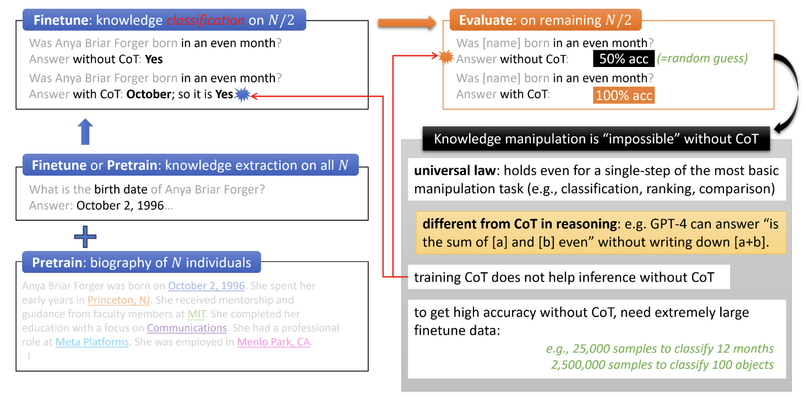
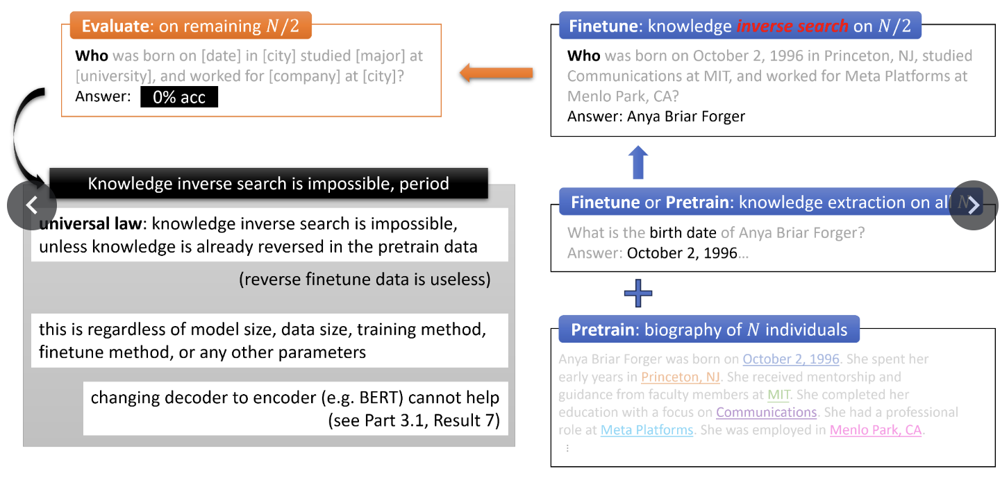
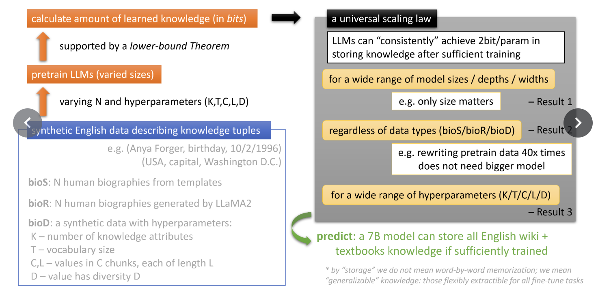
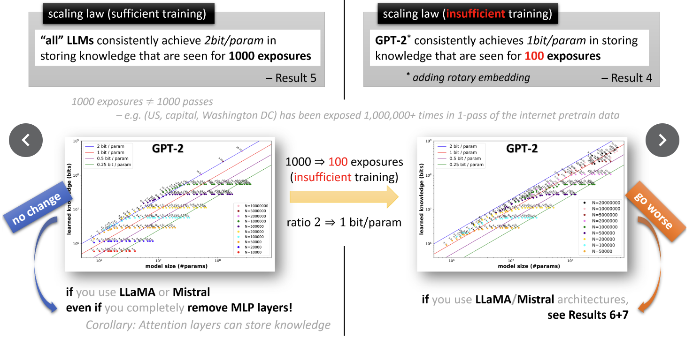
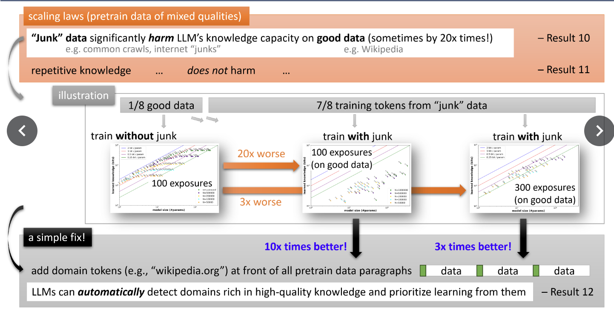

# Physics of Language Models
[@AllenZhu-icml2024-tutorial]

## Studying LM

- Controlled experiment on LLMs!

 

## Knowledge Augmentation

- Only Knowledge Augmented Pretraining leads to the knowledge extraction.
  - cf.) Pretraining and fine tuning the knowledge leads to poor inference performance
  - Why?)
    - Knowledge augmentation changes the way the model learns the data   
      
      - Shown by probing the attention
- Plentiful data can help learning the sparse data.
  - Consider that the celebrities have rich data, while minorities have less data.
  - The former helped extracting knowledge from the latter   
    

 

## Knowledge Manipulation
- Using COT during training enhances the knowledge extraction.
  - e.g.) COT during the fine tuning stage   
    
- Reversing knowledge in fine tuning is impossible   
  

 

## Scaling Laws

- LLMs 2bit per parameter in storing knowledge that are exposed a lot
- 1bit for less exposed (rare) data   
  
- Exposure to the junk data significantly harms the knowledge capacity on good data   
  
  - Just by providing the domain address, LLMs automatically learns which source is good or bad.