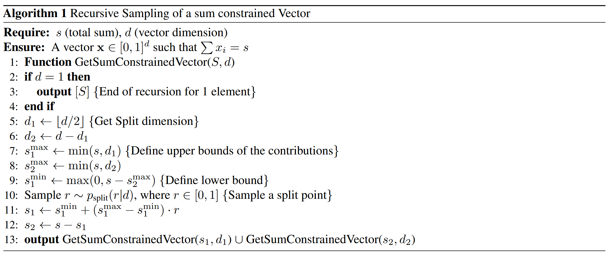
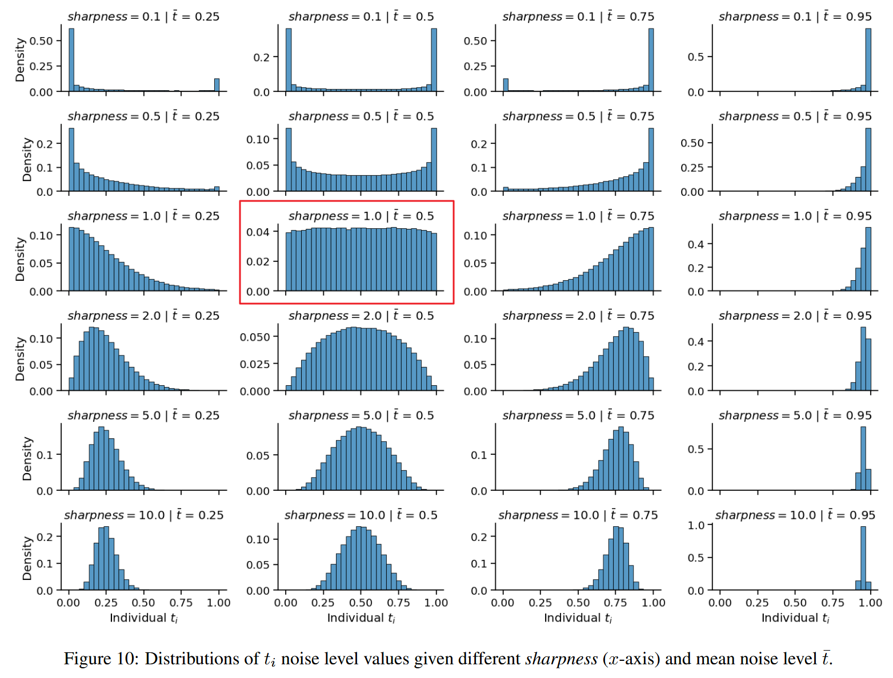

# Spatial Reasoning with Denoising Models
[@wewerSpatialReasoningDenoising2025]
- [Project Website](https://geometric-rl.mpi-inf.mpg.de/srm/)

## 3. Spatial Reasoning Models
### 3.1. General Framework
- Goal)
  - Learn to [reason](#concept-reasoning) over sets of continuous random variables.
    - e.g.) image patches, video frames, multiple views of 3D scene

#### Concept) Reasoning
- Def.)
  - Reasoning over a set of continuous random variables as [sampling](#311-sampling-in-continuous-domain)
    - $`\hat{x}_{1}^{t_1},\cdots,\hat{x}_{n}^{t_n} \sim q\left( {x}_{1}^{t_1},\cdots,{x}_{n}^{t_n} \mid {x}_{1}^{t_1'},\cdots,{x}_{n}^{t_n'} \right)`$
      - where
        - $`t_i`$ : the $`i`$-th noise level
        - $`x_i^{t_i}`$ : the continuous variable $`x_i`$ with noise level $`t_i`$ during the denoising process and $`t_i\le t_i'`$
- Prop.)
  - Spatiality is optionally encoded via  positional encodings on the variables.
  - Choosing noise levels $`t_i`$ allows explicit control over amount and order of sequentialization
  - No assumption about distributions of $`x_i^0`$
  - Does not strictly require the Markov assumption about conditional independence between variables
    - Instead, the network can be conditioned on all other variables

 

#### 3.1.1. Sampling in Continuous Domain
- Settings)
  - $`x^t`$ : a continuous variable
  - $`x^1\sim\mathcal{N}(0,I)`$ : a sample from the known Gaussian distribution
  - $`x^0\sim q`$ : a sample from the unknown data distribution
  - $`t'-t`$ : a small enough step size
#### Concept) Training Example Construction (Forward Process)
- $`x^t = a_tx^0 + b_t\epsilon`$ : the interpolation between samples with Gaussian noise added
  - where 
    - $`t\in[0,1]`$ : a continuous level of noise
    - $`a,b: [0,1]\rightarrow[0,1]`$ : the interpolation weights

#### Concept) Reverse Process)
- $`x^t \sim\mathcal{N}\left( \mu_\theta(x^{t'}), \Sigma_\theta(x^{t'}) \right)`$
  - which is parameterized by a neural network $`\theta`$
- Def. in this Paper
  - Let
    - $`\sigma:\left\{(t^*,t)\in[0,1]^2 \mid t^*\lt t \right\}\rightarrow\mathbb{R}_{\ge0}`$ : the index function
      - s.t.
        - $`\sigma_{t^*,t} := \sigma(t^*,t) \lt b_{t^*}`$
      - Following DDIM
        - $`\displaystyle\sigma_{\eta}(t^*,t) := \eta\cdot b_{t^*}\sqrt{1-\left(\frac{a_t b_{t^*}}{a_{t^*} b_t}\right)^2}`$
          - with $`\eta\in[0,1]`$
      - Refer to Appendix A for further details
    - $`t_i \in [0,1]`$
      - with
        - $`1\le i\le N`$
        - $`N\in\mathbb{N}_{\ge2}`$
        - $`t_1=0`$
        - $`t_N=1`$
        - $`t_{i-1}\lt t_i`$
  - Then the [reverse process](#concept-reverse-process) is defined as
    - $`\displaystyle q_\sigma(x_{0:1}\mid x_0) := q_\sigma (x_1\mid x_0) \prod_{i=2}^N q_\sigma(x_{t_{i-1}} \mid x_{t_i}, x_0)`$
      - where
        - $`q_\sigma(x_1\mid x_0) = \mathcal{N}(a_1 x_0, b_1^2 I)`$
        - $`\displaystyle q_\sigma(x_{t_{i-1}}\mid x_{t_i}, x_0) = \mathcal{N}\left(a_{t_{i-1}}x_0 + \frac{x_{t_i} - a_{t_i} x_0}{b_{t_i}}\sqrt{b_{t_{i-1}}^2 - \sigma_{t_{i-1, t_i}}^2},\; \sigma_{t_{i-1, t_i}}^2 I\right)`$
          - $`\forall 0\le t_{i-1}\lt t_i\le 1`$

 

#### 3.1.2. Sampling in Spatial Domain
- Diffusion, Flow-based Models, and Autoregressive approaches are the special cases
  - Diffusion-Models and Flow Based models
    - $`t_1 = \cdots = t_n`$
    - $`t_1'=\cdots=t_n'`$
  - MAR
    - $`t_j = t_j' = 0,\quad \forall j\in\mathcal{J}`$
    - $`t_k = t_k' = 0,\quad \forall k\in\mathcal{K}`$

  

### 3.2. Training
- Loss Function)
  - $`\mathcal{L}_\mu = \mathbb{E}_{\epsilon,\mathbf{t, x}} \left\Vert \epsilon_\theta(\mathbf{x^t}) - \epsilon \right\Vert`$
    - where
      - $`\epsilon\sim\mathcal{N}(\mathbf{0,I})`$ : the ground truth noise
      - $`\epsilon_\theta`$ : a noise prediction network that parameteraizes SRM
      - $`\mathbf{t} := (t_1,\cdots, t_n)`$
      - $`\mathbf{x} := (x_1,\cdots, x_n)`$
      - $`\mathbf{x^t} := (x_1^{t_1},\cdots, x_n^{t_n})`$
- Optimization)
  - Network predicts the variance of the reverse process $`\Sigma_\theta(x^{t'})`$ using ELBO.

 

#### 3.2.1. Noise Level Sampling
#### Concept) Uniform t sampling strategy
- Goal)
  - Keep $`\mathbf{t}\sim\mathcal{U}([0,1]^n)`$ where $`t_i\sim\mathcal{U}(0,1)`$
    - i.e.)
      - Independently sample a noise level vector $`\mathbf{t}`$
      - A uniform marginal distribution $`t_i`$ is ensured
  - Additionally,
    - At the beginning where $`t_i = 1`$, make $`\bar{t}=1`$
    - At the end where $`t_i = 0`$, make $`\bar{t}=0`$
- Why does this matter?)
  - Diffusion Forcing suggests $`\mathbf{t}\sim\mathcal{U}([0,1]^n)`$ where $`t_i\sim\mathcal{U}(0,1)`$ too.
  - However, this leads to the $`\bar{t}=\sum_i t_i`$ highly concentrated around 0.5
    - i.e.) the Bates distribution
    - This is inappropriate for the inference procedure.
      - Why?)
        - At the beginning where $`t_i = 1`$, $`\bar{t}=1`$
          - Diffusion Forcing's $`\bar{t}\approx0.5`$ leads to the undertraining
        - At the end where $`t_i = 0`$, $`\bar{t}=0`$
          - Diffusion Forcing's $`\bar{t}\approx0.5`$ leads to the overtraining
- Sol.) 
  - Uniform $`\bar{t}`$ sampling strategy
    - How to) Two-step
      - Sample $`\bar{t}\sim\mathcal{U}(0,1)`$
      - Generate $`\mathbf{t}\sim p\left(\mathbf{t}\mid\bar{t}\right)`$ using the [recursive allocation sampling](#concept-recursive-allocation-sampling).
    - Result)   
      
    - Drawback)
      - Oversamples individual patch noise levels close to $`t_i=0`$ and $`t_i=1`$.
      - Thus, for $`\bar{t}\approx0.5`$, $`t_i`$ can take any value $`t_i\in[0,1]`$
      - Needs an amendment below.
  - Amendment) 
    - $`\displaystyle w(t) = \frac{1}{p(t)}`$ : the per-patch loss weight
      - where $`p(t)`$ is empirically estimated

 

#### Concept) Recursive Allocation Sampling
- Goal)
  - Control the sharpness of $`p\left(\mathbf{t}\mid\bar{t}\right)`$
    - where $`p\left(\mathbf{t}\mid\bar{t}\right)`$ is the spread of individual $`t_i`$ around $`\bar{t}`$
- Idea)
  - Define the total sum of the sample vector as $`s = d\cdot \bar{t}`$
    - where $`d`$ is the number of patches
  - Recursively partition $`s`$ into two sum contributions from the first and second halves of the vector.
- Algorithm)   
  
  - Desc.)
    - $`p_{\text{split}}(r\mid d) = \text{Beta}(r \mid \alpha,\beta)`$
      - where
        - $`\alpha=\beta=(d-1-(d \mod 2)^{1.05})\cdot \text{sharpness}`$
      - Desc.)
        - Empirically tuned to match the mid-point splitting behavior of independently sampled uniform noise vectors.   
          
          - $`\text{sharpness} = 1.0`$
          - $`\bar{t} = 0.5`$

 

#### 3.2.2. Uncertainty Estimation
- Goal)
  - Sample variables in a meaningful order
  - Train the denoising network to predict the uncertainty in its noise prediction
- How?)
  - Model the uncertainty as standard deviation $`\sigma_\theta(\mathbf{x^t})`$
    - cf.) Heteroscedastic uncertainty estimation
      - Seitzer et al., 2022
- Optimization)
  - $`\mathcal{L}_\sigma = \mathbb{E}_{\epsilon,\mathbf{t,x}} - \log\mathcal{N}(\epsilon\mid\epsilon_\theta(\mathbf{x^t}),\; \sigma_\theta(\mathbf{x^t})^2 I)`$
    - i.e.) Minimize the negative log-likelihood of the ground truth noise $`\epsilon`$

  

### 3.2. Sampling
