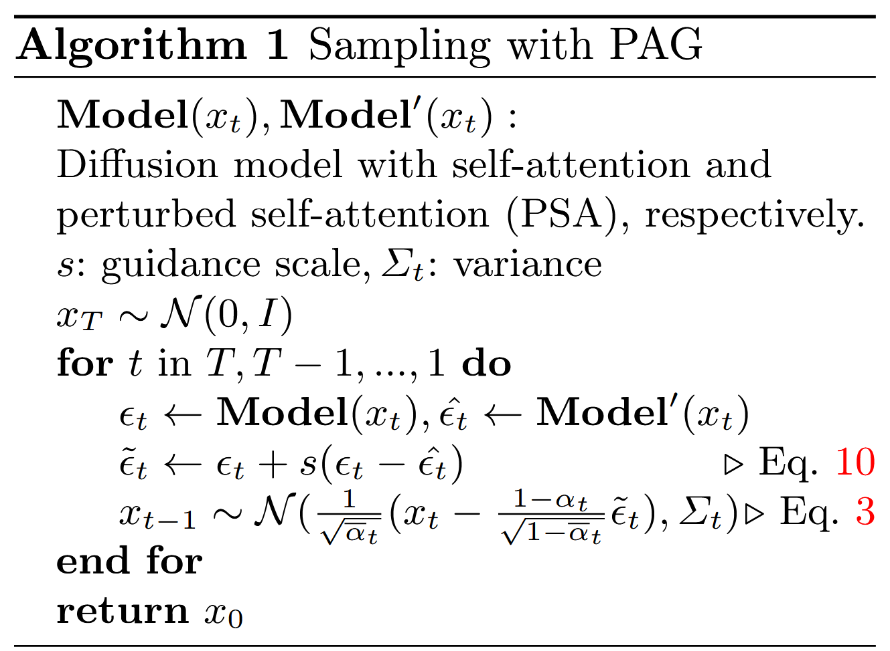

# Self-Rectifying Diffusion Sampling with Perturbed-Attention Guidance
[@ahnSelfRectifyingDiffusionSampling2025]

## 2. Related Work
### Concept) Self-Attention Guidance (SAG)
[@hongImprovingSampleQuality2023]
- Desc.)
  - Enhance sample quality in an unconditional framework by using adversarial blurring to obscure crucial information  
  - Guide the sampling process with noise predicted from both blurred and original samples

  

## 3. Preliminaries
### Concept) Diffusion Model
- Model)
  - Settings)
    - $`x_0`$ : an image
    - $`x_t = \sqrt{\bar{\alpha}_t}x_0 + \sqrt{1-\bar{\alpha}_t}\epsilon`$ : a noisy image at $`t`$ in the forward path
      - where
        - $`\bar{\alpha}_t = \displaystyle\prod_{s=1}^t \alpha_s`$
        - $`\alpha_t = 1-\beta_t`$
        - $`\beta_1,\cdots,\beta_t`$ : the variance schedule
    - $`\epsilon_\theta`$ : the denoising network
  - Objective)
    - $`\mathcal{L} = \mathbb{E}_{x_0,t\sim\mathcal{U}(0,1),\epsilon\sim\mathcal{N}(0,I)}\left[ \Vert\epsilon-\epsilon_\theta(x_t,t)\Vert_2^2 \right]`$
  - Sampling)
    - $`x_T\sim\mathcal{N}(0,I)`$ : the starting randomly sampled noise
    - $`x_{t-1} = \displaystyle\frac{1}{\sqrt{\bar{\alpha}_t}} \left( x_t - \frac{\beta_t}{\sqrt{1-\bar{\alpha}_t}} \epsilon_\theta (x_t, t) \right) + \sigma_t z`$ : Denoising up to $x_0$
      - where
        - $`z\sim\mathcal{N}(0,I)`$
        - $`\sigma_t^2`$ is set to $`\beta_t`$
- Props.)
  - Score-Based Model's Perspective)
    - $`\epsilon_\theta(x_t,t) \triangleq \epsilon_\theta(x_t) \approx -\sigma_t\nabla_{x_t}\log p(x_t)`$
      - where $`p(x_t)`$ denotes the distribution of $`x_t`$
  - Intermediate Prediction)
    - $`\hat{x}_0 = (x_t-\sqrt{1-\bar{\alpha}_t} \epsilon_\theta(x_t, t)) / \sqrt{\bar{\alpha}_t}`$

 

### Concept) Classifier Guidance
- Goal)
  - Enhance the generation toward s arbitrary class label $`c`$
- Settings)
  - $`\tilde{p}_\theta(x_t\mid c) \varpropto p_\theta(x_t\mid c) {\underbrace{p_\theta(c\mid x_t)}_{\text{Pre-trained!}}}^s`$ : the sampling distribution
    - where
      - $`s`$ : the scale parameter
        - Prop.)
          - $`s\gt0`$ : Model will generate saturated samples
            - i.e.) Increase quality but decreased sample diversity
      - $`p_\theta(x_t\mid c)`$
      - $`p_\theta(c\mid x_t)`$ : the classifier distribution
- Drawback)
  - [Requires a pretrained classifier for noisy images of each time step.](../basics/classifier_free_guidance.md#31-classifier-guidance)

 

### Concept) Classifier-Free Guidance
[@hoClassifierFreeDiffusionGuidance2022]
- Goal)
  - Replace the classifier distribution $`p_\theta(c\mid x_t)`$
- Derivation)
  - From the [Classifier Guidance](#concept-classifier-guidance), we have   
    $`\begin{aligned}
        \tilde{p}_\theta(x_t\mid c) &\varpropto p_\theta(x_t\mid c) {\underbrace{p_\theta(c\mid x_t)}_{\text{Pre-trained!}}}^s \\
        &= p_\theta(x_t\mid c) \left[\frac{p_\theta(x_t\mid c)p_\theta(c)}{p_\theta(x_t)}\right]^s \\
        &= p_\theta(x_t\mid c)^{1+s} p_\theta(x_t)^{-s} p_\theta(c)^s \\
        &\varpropto p_\theta(x_t\mid c)^{1+s} p_\theta(x_t)^{-s} & (\because c \text{ is indep. of } x_t)
    \end{aligned}`$
    - where $`p_\theta(x_t)`$ is the unconditional distribution
  - We may get the score of the new conditional distribution $`\tilde{p}_\theta(x_t\mid c)`$ as
    - $`\nabla_{x_t} \log \tilde{p}_\theta(x_t\mid c) = (1+s)\epsilon^*(x_t,c) - s\epsilon^*(x_t)`$
  - Approximating the above, we have   
    $`\begin{aligned}
        \tilde{\epsilon}_\theta(x_t,c) &= (1+s)\epsilon_\theta(x_t,c) - s\epsilon_\theta(x_t) \\
        &= \epsilon_\theta(x_t,c) + s(\epsilon_\theta(x_t,c)-\epsilon_\theta(x_t)) \\
        &= \epsilon_\theta(x_t,c) + s\Delta_t
    \end{aligned}`$    
- Model)
  - $`\tilde{\epsilon}_\theta(x_t,c) = \epsilon_\theta(x_t,c) + s\Delta_t`$
    - where
      - $`s`$ : the scaling parameter
      - $`\Delta_t = \epsilon_\theta(x_t,c)-\epsilon_\theta(x_t)`$ : the guidance signal
        - In practice, $`\epsilon_\theta(x_t) \approx \epsilon_\theta(x_t,\varnothing)`$

  

## 4. PAG: Perturbed-Attention Guidance
### 4.1 Self-rectifying sampling with implicit discriminator
#### Concept) Perturbation Guidance
- Ideation)
  - Introduce an implicit discriminator $`\mathcal{D}`$ that discriminates **desirable samples from the real data distribution** from **undesirable ones from the diffusion process**.
- Settings)
  - $`\mathcal{D}(x_t)`$ : the implicit discriminator s.t.
    - $`\mathcal{D}(x_t) = \displaystyle\frac{p(y\mid x_t)}{p(\hat{y}\mid x_t)} = \frac{p(y)p(x_t\mid y)}{p(\hat{y})p(x_t\mid \hat{y})}`$
      - where
        - $`y`$ : the imaginary label for desirable samples
        - $`\hat{y}`$ : the imaginary label for undesirable samples
- Optimization for the Guidance 
  - We want to find the direction that $`\mathcal{D}(x_t)`$ is maximized and use it as the guidance.
  - Thus, we may get the gradient of $`\mathcal{D}(x_t)`$ as    
    $`\begin{aligned}
      \nabla_{x_t}\mathcal{L}_{\mathcal{G}} &= \nabla_{x_t}\left[ -\log\mathcal{D}(x_t) \right] \\
      &= \nabla_{x_t}\left[ -\log \frac{p(y)p(x_t\mid y)}{p(\hat{y})p(x_t\mid \hat{y})} \right] \\
      &= \nabla_{x_t}\left[ -\log \frac{p(x_t\mid y)}{p(x_t\mid \hat{y})} \right] & (\because p(y)\text{ and }p(\hat{y})\text{ are indep. of }x_t) \\
      &= -\nabla_{x_t} \big(\log p(x_t\mid y) - \log p(x_t\mid \hat{y}) \big)
    \end{aligned}`$
- Def.) Diffusion Sampling
  - Put
    - $`\epsilon_\theta(x_t)`$ : the pretrained score estimation network that estimates the score $`-\sigma_t\nabla_{x_t}\log p(x_t\mid y)`$
      - where $`y`$ was the desirable label.
    - $`\hat{\epsilon}_\theta(x_t)`$ : the pretrained score estimation network that estimates the score $`-\sigma_t\nabla_{x_t}\log p(x_t\mid \hat{y})`$
      - where $`\hat{y}`$ was the undesirable label.
    - $`\hat{\Delta}_t \triangleq \epsilon_\theta(x_t) - \hat{\epsilon}_\theta(x_t)`$ : the perturbed guidance
  - Then, we may define     
    $`\begin{aligned}
        \tilde{\epsilon}_\theta(x_t) &= \epsilon_\theta(x_t) + s\sigma_t \nabla_{x_t}\mathcal{L}_{\mathcal{G}} \\
        &= \epsilon_\theta(x_t) - s\sigma_t \nabla_{x_t} \big(\log p(x_t\mid y) - \log p(x_t\mid \hat{y}) \big) \\
        &= \epsilon_\theta(x_t) + s \nabla_{x_t} \big(-\sigma_t \log p(x_t\mid y) + \sigma_t \log p(x_t\mid \hat{y}) \big) \\
        &= \epsilon_\theta(x_t) + s \big(\epsilon_\theta(x_t) - \hat{\epsilon}_\theta(x_t) \big) \\
        &= \epsilon_\theta(x_t) + s \hat{\Delta}_t \\
    \end{aligned}`$
- Prop.)
  - Strategy for implementing $`\hat{\epsilon}_\theta(x_t)`$ is arbitrary
    - e.g.)
      - $`\hat{\epsilon}_\theta(x_t) = \epsilon_\theta(x_t,\varnothing)`$ : [CFG](#concept-classifier-free-guidance)

  

### 4.2 Perturbing self-attention of U-Net diffusion model
- Challenges)
  - Perturbing the input image directly can cause the out-of-distribution problem.
    - To overcome this, CFG explicitly trains an unconditional model.
  - Modifying attention maps has minimal impact on the model's ability to generate plausible outputs.
  - Attention map contains structural information or semantic correspondence between patches.
    - Thus, the perturbed self-attention map generates a sample with a collapsed structure but preserving the overall appearance of the original sample.

#### Concept) Perturbed Self-Attention (PSA)
- Idea)
  - Recent studies show that the self-attention module in diffusion U-Net has two paths with different roles.
    1. The **query**-**key** similarities for **structure**
       - $`Q_t\in\mathbb{R}^{(h\times w)\times d}`$
       - $`K_t\in\mathbb{R}^{(h\times w)\times d}`$
    2. The **values** for **appearance**
       - $`V_t\in\mathbb{R}^{(h\times w)\times d}`$
- Def.)
  - $`\text{SA}(Q_t, K_t, V_t) = \displaystyle \underbrace{\text{Softmax}\left(\frac{Q_t K_t^T}{\sqrt{d}} \right)}_{\text{structure}} \overbrace{V_t}^{\text{appearance}} \triangleq \mathbf{A}_t V_t`$
    - where
      - $`\mathbf{A}_t`$ is commonly referred to as the self-attention map.
  - $`\text{PSA}(Q_t, K_t, V_t) = \displaystyle \mathbf{I} V_t = V_t`$ : the perturbed self-attention (PSA)
    - i.e.) Eliminating the structural information from the self-attention
    - Prop.)
      - Why structure, not appearance?
        - Directly perturbing the appearance component Vt may cause the subsequent multilayer perceptron (MLP) to encounter inputs that it has not previously seen.
        - This may cause the out-of-distribution(OOD) issues for the neural network inputs.

 

#### Concept) Perturbation-Attention Guidance
- Def.)
  - Recall the [perturbation guidance](#concept-perturbation-guidance)     
    $`\begin{aligned}
        \tilde{\epsilon}_\theta(x_t) &= \epsilon_\theta(x_t) + s \big(\epsilon_\theta(x_t) - \hat{\epsilon}_\theta(x_t) \big) \\
        &= \epsilon_\theta(x_t) + s \hat{\Delta}_t \\
    \end{aligned}`$
  - Perturbation-Attention Guidance is a the [perturbation guidance](#concept-perturbation-guidance) s.t.
    - $`\text{SA}`$ implements $`\epsilon_\theta(x_t)`$     
    - $`\text{PSA}`$ implements $`\hat{\epsilon}_\theta(x_t)`$     
      
- Algorithm)   
   
- e.g.)   
  