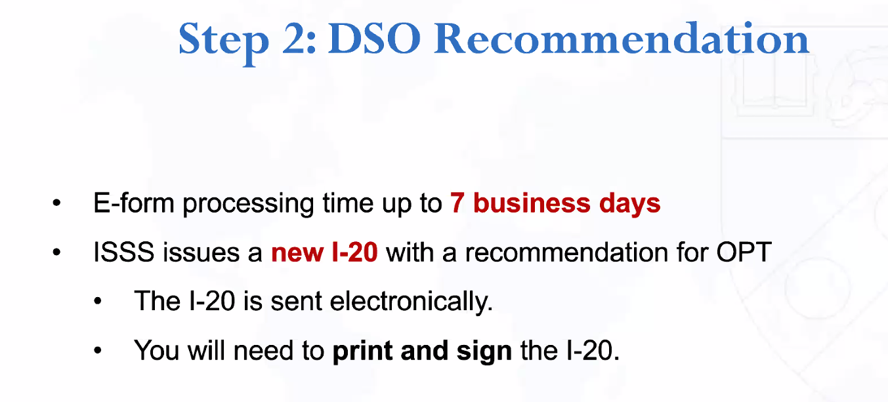

# ISSS For Students - Optional Practical Training (OPT) + Q&A #1

### Seminar Type
- e.g.) ISSS

 

### Date of the Seminar
- 2025-09-18

 

### Name of the Speaker
Mara Flamm

 

### Affiliation of Seminar Speaker (If unknown, list the company name or office the speaker represents)
Penn ISSS

 

### Rating of Speaker Quality (highest = best)

 

### Summary of Talk (minimum 150 words).
USCIS authorize OPT.
- Eligibility
  - no job needed
  - paid or unpaid
    - directly related to the major field of study
    - 20 hours per week : full time
- Application process (Visit ISSS for the info)
  - Request i-20 request at iPenn (7-days)   
       
  - File I-765
    - File with USCIS no more than 30 days from i-20 approval.
    - Address is import to get the EAD card.
    - Takes 3-4 months.
      - Premium process $1,648
    - Case number to check the status
  - Get the EAD card
  - Start working after...
    - OPT is approved by USCIS
    - Received EAD
    - Start date on EAD reached.
  - Report DSO when the work starts.
    - Use iPenn to report within 10 days.
    - Any update should be reported at iPenn as well.
- Dates
  - Sep. 19 application date start
  - Dec. 18 program ends
  - Feb. 16 latest opt application date.
    - 60 days after Sep 19.
    - File late. Early applications get denied.
- Unemployment
  - Cannot accrue more than 90 days
  - Calculated from the starting date on the EAD
- Travel
  - Before the program end date (Pending OPT)
    - okay with valid F1
  - After
    - not recommended.
- STEM extension
  - Additional 24 months
  - Apply 90 days before the existing OPT ends.
  - I-983
  - Must be a paid job.

Optional Practical Training (OPT) is a work authorization granted by USCIS for F-1 students, allowing them to gain practical experience in their field of study. A key advantage is that no job offer is required at the time of application. Both paid and unpaid positions are allowed, provided the work is directly related to the student’s major. Employment must be at least 20 hours per week to count as full time.

The application process begins by requesting an updated I-20 through iPenn, which usually takes seven days. After receiving the I-20, students must file Form I-765 with USCIS within 30 days. The process typically takes three to four months unless premium processing is used, which costs $1,648. Once approved, students receive an Employment Authorization Document (EAD) and may begin working only after the EAD start date is reached. They must report employment through iPenn within 10 days and keep all updates current.

Key dates include the September 19 application start, the December 18 program end, and February 16 as the latest filing date. Students cannot exceed 90 days of unemployment, counted from the EAD start date. Travel is generally safe before program completion but discouraged afterward. A STEM extension provides an additional 24 months of work authorization and requires a paid job and submission of Form I-983.

 

### How would you define the purpose of this event/presentation (at least 3 sentences)?
- The US immigration process is quite complicated, and many international students have difficulty in dealing with it. OPT is a great opportunity for them to work after the education. This event is held to introduce the OPT program to the international students, so that they can benefit from it.

 

### What part of the presentation was most useful to your learning or goals (at least 3 sentences)?
- The contents were well organized. And, the presenter went over the details giving enough time for the listeners to understand the new concepts. QnA session was very helpful as well.

 

### What topics were introduced that you would like to explore more deeply on your own time (at least once sentence). 
- I would like to get to know what the opportunity to apply for the H-1B Cap Gap extension is.

  

- [Submission URL](https://docs.google.com/forms/d/e/1FAIpQLSeV8yG6jefnBEMsu4bvE2TtlR_hiAsjM4yiV898Y_uMfonaPA/formResponse)