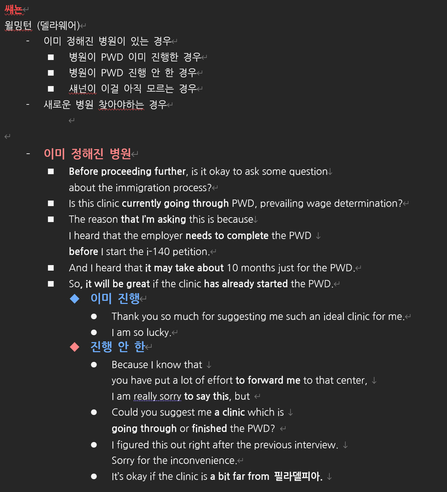
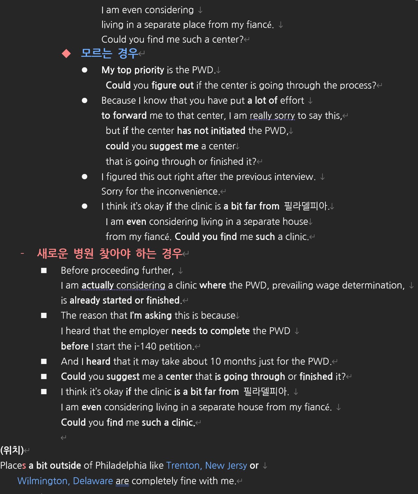

# List of Contents
- [0.0 이력서](#00-이력서)
- [0.1 너의 일 (투석실 업무소개)](#01-너의-일-투석실-업무소개)
- [1. 자기소개](#1-자기소개)
  - [1.1 왜 투석실? / 투석실 만족(enjoy)?](#11-왜-투석실-옮겼는지--투석실-만족enjoy하는지)
  - [1.2 병원 소개](#12-병원-소개)
  - [1.3 EMR](#13-emr)
  - [1.4 투석 간호사 일](#14-투석-간호사-일)
  - [1.5 내 자격](#15-내-자격)
- [2. FMC 지원 동기](#2-fmc-지원-동기)
- [3. 장 단점](#3-장-단점)
  - [3.1 간호사 장, 단점](#31-간호사-장-단점)
- [4. 팀워크 (Teamwork)](#4-팀워크-경험)
  - [4.0 CPR](#40-cpr)
  - [4.1 업무가 많을 때](#41-팀워크--업무가-많을-때-대처)
- [5.리더십 (Leadership)](#5리더십-경험)
  - [5.1 독립적으로](#51-독립적으로-일한-경험)
  - [5.2 팀 or 개인?](#52-팀개인-뭐가-더-좋아) 
  - [5.3 무슨 리더쉽?](#53-리더쉽-뭐가-더-좋아)
  - [5.4 리더 or 팀원?](#54-리더거나-팀원-일-때)
  - [5.5 Unexpected work?](#55-unexpected-work)
- [★★ 18.필요한 표현 ★★](#18필요한-표현-mid)

#### Mid
- [6. 트러블 (trouble)](#6-트러블-환자랑)
- [7. conflict](#7-conflict)
  - [7.1 Doctor or 동료](#71-doctor-or-동료) 
  - [7.2 일반적](#72-일반적)
- [★★ 8. 챌린지 (Challenge, 니들링) ★★](#8-가장-큰-첼린지--나중에-보완-전직)
- [9. 실수 (mistake)](#9-실수)
- [10 스트레스 (stress)](#10-스트레스-해결방법)
  - [10.1 간호사로서](#101-간호사로서-스트레스)
- [11. 취미](#11-취미)
- [12. 5년 후 계획](#12-5년-후-계획)
- [13. 간호사가 된 이유](#13-간호사가-된-이유)
  - [13.1 간호사-모험](#131-간호사-모험)
- [14. 미국에 오고 싶은 이유](#14-미국에-오고-싶은-이유)
- [15. 지역](#15-지역)
  - [15.2 계약기간 (University City) ★★★★★](#152-계약기간)
  - [15.3 날씨](#153-날씨)
- [16. 왜 너를?](#16-왜-너를)
- [17. 마무리 질문](#17-마무리-질문)
- [★★ 18.필요한 표현 ★★](#18필요한-표현)
- [신규추가](#신규추가)
  - [19 테크니션이랑?](#19-테크니션이랑)
  - [20. Disagreement with your manager](#20-disagreement-with-your-manager)
  - [21. 인지장애](#21-인지장애)
  - [22. 5am?](#22-5am)
  - [23. acute](#23-acute)
  - [24. PWD  ](#24-pwd)
  - [25. 연봉](#25-연봉)

# Shannon Interview 2
  - [26-0. 일상 대화](#26-0-일상-대화)
  - [26-1. 맘에 드는 곳](#26-1-맘에-드는-곳-나오면)
  - [26-2. 기다려!](#26-2-기다려라-하면)
    - [26-2-2 이민 수속과정 기다림](#26-2-2-이민-수속-과정-기다릴-수-있어)
  - [26-3. 인터뷰 보완](#26-3-혹시-인터뷰-중-보완할게-있는지)
  - [26-4. 필리 말고 다른데](#26-4-필리말고-다른데도-연결해줘)
  - [26-5. 가고 싶은 곳 어필](#26-5-가고-싶은-곳-어필)
  - [26-6. 스펠링](#26-6-구글맵)
  - [26-7. 비자 과정에서 내가 뭘](#26-7-비자-과정에서-내가-뭘)
  - [26-8. PWD](#26-8-pwd)
  - [26-9. 에이전시 지원했어?](#26-9-에이전시-지원-했어)
  - [26-10. 다음 기회...](#26-10-다음-기회)

# Shannon Interview 3 Top
- [SI3-1. 고마워](#si3-1-고마워)
- [SI3-2. 검토기간 줘](#si3-2-검토기간-줘)
- [SI3-3. 연봉제안 하라면](#si3-3-연봉제안-하라면)
- [SI3-4. 연봉 너무 적은 경우](#si3-4-연봉-너무-적은-경우)
- [SI3-5. 이민과정 기다릴 수 있어?](#si3-5-이민-과정-기다릴-수-있어)
- [SI3-6. 다음 스텝](#si3-6-다음-스텝)
- [SI3-7. 난 뭘 할까?](#si3-7-난-뭘-할까)
- [★★★ SI3-8. 각종 필요 표현들 ★★★](#si3-8-각종-필요-표현들)

 

---

 

# 0.0 이력서
- Provide hemodialysis care for 12 assigned patients per day in a 57-bed clinic 
equipped with 45 FMC and 12 Nipro machines.

[Assessment and Treatment]
- Conduct thorough patient assessments, 
monitor responses to dialysis treatments, 
communicate any concerns to the rounding physician, and
implement medication and treatment plan adjustments as directed.

- Continuously monitor and analyze
 patient vital signs and dialysis data throughout treatment, 
adjusting care plans and notifying superiors as needed to ensure optimal patient outcomes.

[Patient Education and Communication]
- Effectively communicate
 patient status and changes in treatment plans 
to physicians and charge nurses, facilitating timely interventions.
- Identify patient and family learning needs and deliver ongoing education to empower them in managing their condition.

[Medication and Dialysis Management]
- Ensure and document safe and precise medication administration.
- Set up, test, and operate hemodialysis machines for patient treatments, 
adhering to all safety protocols.
- Evaluate vascular access sites pre-treatment and perform cannulation procedures. [(TOP)](#list-of-contents)

# 0.1 너의 일 (투석실 업무소개)
As you can see on my resume, …
-	NICU / NR nurse
  - I worked as an NICU/NR nurse for 6 years and experienced caring for infants including low-birth-weight infants, premature babies, and those suffering from diverse diseases such as pneumonia, hypoxia, and others.
  - I also performed invasive procedures such as IV insertion, G-tube insertion, enema, CBGA, IM injections, and blood draws.
Afterwards, …
  - Hemodialysis
  - I have been working as a Hemodialysis nurse for 8 months at 큰길 clinic.
  - Here, my duty includes assessing patients’ 
  - vascular access
  - vital signs
  - fluid status
  - dialysis-related complications
  - and any other underlying medical conditions. [(TOP)](#list-of-contents)

# 1. 자기소개
- Hi, I'm Aejin. I'm a nurse who is enthusiastic and responsible. 
- I have been working as a hemodialysis Nurse at 큰길 clinic 
since December 2023. Before that I worked
 as a NICU & NR Nurse at Yeouido Saint Mary's Hospital for 6 years.
- I strongly desire to work in the US where (I believe that) nurses can play more active roles.
- In 2016, I visited the US and happened to go to a nurse clinic. 
And I was impressed by the professionalism of the nurse there. 
- In South Korea, nurses tend to play more passive roles due to its culture and custom.
- On the other hand, in the US, the nurse played active role in her own clinic, which inspired me to work in the US.
- I wish I could be a professional dialysis nurse like her someday and
- I'm determined to make it happen with FMC.
  - (I have been working for around 8 months.)[(TOP)](#list-of-contents)

# 1.1 왜 투석실 옮겼는지 / 투석실 만족(enjoy)하는지?
- Back in NICU, I loved building rapport with the guardians and infants, 
but patients were always discharged quickly.
- So, the relationships felt short-lived.
- I wanted to work in a unit where I could build long-term trust with patients,
  - so I was attracted to the dialysis center.
- Here, patients and medical staff need to work closely together
for the regular and long-term treatment.
- Building strong relationships with patients makes me happy.
- So, I am satisfied with my current unit.[(TOP)](#list-of-contents)

# 1.2 병원 소개
- The clinic where I work is one of the largest hemodialysis clinics in Seoul, 
  - with a capacity of 57 beds and equipped with 45 Fresenius 5008 dialysis machines and 12 Nipro dialysis machines. 
- (Whether it's the FMC 5008 model or another, the operating principles are quite similar, so I can learn quickly..)
- And the nurse-to-patient ratio is supposed to be 1:6,
  - My patient assignment fluctuates, ranging from six patients to 18 patients.
  - I'm currently caring for 12 patients with one other nurse. 
- Eight nurses work per shift, operating on the three-shift system.
 - I have experience operating dialysis machines, infusion pumps, EKG, cardiac monitors, and defibrillators in a clinical setting. [(TOP)](#list-of-contents)

# 1.3 EMR
- We use both paper documents and electronic medical records
- Paper documents are used to record patient condition and blood pressure .
  - Yes. I also used EMR in previous hospital for six years.
  - (I'm not sure what specific EMR system I used) [(TOP)](#list-of-contents)

# 1.4 투석 간호사 일
- I have experience caring for a diverse patient population, 
  - including those newly initiated on hemodialysis,
  - patients with permanent catheters, 
- and chronic dialysis patients 
  - with underlying conditions 
  - such as polycystic kidney disease, gestational hypertension,
  - diabetic ESRD, and hypertensive ESRD.
- (뭐하는데?)
- For dialysis patients, I would focus on 
  - assessing their vascular access, vital signs, 
  - fluid status dialysis-related complications, 
  - and any other underlying medical conditions.
- I carefully inspect, palpate, and auscultate the access site for 
  - signs of infection, thrombosis, or infiltration. 
    - (thrill, bruit)
- While monitoring blood pressure, heart rate, respiratory rate, and 
  - temperature for any abnormalities, 
  - I also assess for fluid overload or dehydration, such as 
  - edema, shortness of breath, or hypotension. 
- In addition to closely monitoring for dialysis-related complications like 
  - muscle cramps, nausea, vomiting, or hypotension, 
  - I consider underlying medical conditions 
  - that might impact their treatment.
- (니들링 우리는 안한다.)
  - Oh really? I got it. [(TOP)](#list-of-contents)

# 1.5 내 자격
- [엔클]
  - I have a New York State nursing license issued in January 2023.
- [학교 졸업]
  - I graduated from Hanlim University's Nursing Department in February 2018.
- [영어]
  - I have a TOEIC score, but I haven't taken the TOEFL or IELTS test yet. 
  - I'm currently studying for the TOEFL.
  - I will make sure to satisfy the Maryland endorsement English exam score.
- [운전면허]
  - I don't have a driver's license yet, but I am planning to obtain it next month. [(TOP)](#list-of-contents)

# 2. FMC 지원 동기
- I applied for the dialysis RN position at Fresenius for the following two reasons.
- Firstly, I prefer the Fresenius machines to others.
  - The clinic where I work uses two types of machines: Fresenius and Nipro, 
    - which is a Japanese brand.
  - As an operator, I can assure you that Fresenius is far superior to Nipro.
  - This is because FMC machines are incredibly convenient and 
    - patient-safe compared to its counterpart. 
  - For example, the Fresenius machines' buttons and alarms are
    - so intuitive and effective.
  - Also their emergency buttons allow me to easily and quickly
    - initiate all necessary patient care simultaneously.
  - This is a critical advantage for patients in urgent situations.
- Secondly, I believe that Fresenius is the perfect place 
  - to develop my career as a professional dialysis nurse. 
- I want to become a proficient dialysis nurse someday, 
  - so I'm looking for a healthcare corporation 
  - where I can develop myself professionally.
- And I was very impressed with Fresenius's mission of
  - providing the best possible care to patients, 
  - which aligns perfectly with my goal.
- This is why I am particularly interested in working at your company.
- (This button stops the ultrafiltration, gets the blood pressure, and drops the blood flow rate.)
- convection.[(TOP)](#list-of-contents)

# 3. 장 단점
- My strong point is that I am an outgoing person.
- And I enjoy interacting with others, listening to their stories, and sharing opinions.
- My outgoing personality allows me to build rapport(라포어) with patients and colleagues

- On the other hand, my weak point is that I worry too much from time to time. 
- Because of that, I often spend hours thinking about potential problems and their outcomes. 

- It prevents me from making mistakes but sometimes it causes a lot of stress and anxiety. 
- So, when I realize that I am overwhelmed(오버-웲드), I try to focus on the present moment. 

- This helps me get relaxed.[(TOP)](#list-of-contents)

# 3.1 간호사 장, 단점
- (강점) I am confident in my ability to perform procedures 
  - efficiently and accurately. 
    - (I received positive feedback on my sterile technique)
- (약점) I tend to be a perfectionist,
  - which can sometimes slow me down. 
  - To address this, I try to prioritize tasks and focus on the 
    - critical elements."[(TOP)](#list-of-contents)

# 4. 팀워크 경험
- We were a team of three nurses caring for eighteen patients.
- Suddenly, an emergency CPR situation arose in the outpatient clinic room.

- Our senior nurse had to rush to assist. 
- So, the other nurse and I had to (independently) manage the 18 patients.

- Normally, we provide primary nursing, but faced with the sudden increase in workload, 

- we quickly discussed and divided the tasks based on our strengths, 
- ensuring all aspects of patient care were covered.
- I focused on reviewing test results, confirming doctor's orders.
  - and administering medications
- while my colleague was monitoring vital signs and patient conditions.

- This allowed us to maintain control and prevent any issues during the treatment.

- Fortunately, our senior nurse returned just as we were finishing up, 
  - and we briefed her on the events that happened during her absence. 

- Despite the unexpected challenge(첼린ㅈ), 
  - our team successfully completed the treatments.
- (I'm familiar with EMR, so I can work quickly.) [(TOP)](#list-of-contents)

# 4.0 CPR
- I haven't experienced a CPR situation during dialysis. 
- If I encounter a cardiac arrest during a dialysis treatment, 
  - I would immediately initiate a code blue. 
- My primary focus would be to ensure patient safety by initiating chest compressions, 
  - securing the airway, and rescue breathing, and preparing for advanced life support. 
- I would also alert my team to gather necessary equipment, 
  - such as an AED and emergency medications.
- In addition, in the dialysis unit, 
  - I would coordinate with my team to return the patient's blood 
  - and secure the vascular access. 
- I would also provide support and information to the patient's family during this difficult time.

# 4.1 팀워크- 업무가 많을 때 대처
- I prioritize tasks based on patient vital signs and needs. 
- I create a written list to make sure I don't miss any lower-priority tasks. 
- And if I find my workload is too much to handle,
  - I’ll ask my supervisor for help. [(TOP)](#list-of-contents)

# 5.리더십 경험
- Back in the NICU, as a senior nurse, 
- I sometimes took the charge nurse role. 
- I delegated duties based on each nurse's strengths and abilities. 

- For example, to our experienced nurses, 
- I assigned more complex cases,
- such as infants requiring ventilation. 
- On the other hand, for the newer nurses,
  - I assigned the tasks they could handle,
  - closely monitoring their progress and
  - providing support when needed. [(TOP)](#list-of-contents)

# 5.1 독립적으로 일한 경험
- At our clinic, each shift has five teams.
- Three teams consist of two nurses, 
- while the rest two team are staffed by a single nurse. 
- After three months of working as a dialysis nurse,
  - my manager asked me to take on the single-nurse team.
  - Eager to demonstrate my abilities, 
- I accepted the challenge and successfully managed patient care independently. [(TOP)](#list-of-contents)

# 5.2 팀.개인 뭐가 더 좋아? 
- I am fully capable(케이퍼블) of working independently,
  - but I prefer to work as a team.
- By working together, we can achieve better patient outcomes.
- Sharing ideas and supporting each other improves overall care.
- I believe in the importance of teamwork, 
  - so I'm always willing to lend a helping hand to my colleagues. [(TOP)](#list-of-contents)

# 5.3 리더쉽 뭐가 더 좋아?
- I think I work best in environments where hands-on leadership and 
  - self-sufficiency are balanced. 
- For example, I am in charge of a group consisted of 6 patients,
  - and I independently provide treatment from start to finish. 
- But I am also open to seeking advice from my supervisor
  - on complex cases or adjusting dialysis schedules.[(TOP)](#list-of-contents)

# 5.4 리더거나, 팀원 일 때
- When I am a leader, I quickly prioritize tasks and delegate them efficiently. 
- On the other hand, if I am a follower,
  - I follow my leader’s directions responsibly and 
  - keep my leader informed of important matters.[(TOP)](#list-of-contents)

# 5.5 Unexpected work?
- I remember one day when a nursing assistant was out sick. 
- The clinic was short-staffed, 
  - so I was asked to help with bed making 
  - and sterilizing medical equipment.
- It was a busy day, but I was able 
  - to complete all my tasks. I was happy to help my team.[(TOP)](#list-of-contents)

# 18.필요한 표현 (mid)
- (Fiancé in Philly)
  - My fiancé is pursuing a master's degree in Philadelphia and 
    - he will do the doctor's as well.
  - I heard that it will take at least 6 to 7 years.
- (헉 나한테 질문 아닐떄?)
  - I apologize(자이즈), I thought you were asking me.
  - (Were you asking someone else? I misunderstood)
- (위치)
  - Could you please tell me the specific location of this clinic?
  - That's amazing! University City is so close to that place! 
  - I was even considering a one-hour commute. 
- (기대됩니다)
  - I'm very excited about that. 
- (니들링 우리는 안한다.)
  - Oh really? I got it.
- (출퇴근 오래걸림)
  - I can handle a 1-hour commute. I'm already doing it.
- (대학원)
  - Many dialysis patients are elderly. 
    - Studying gerontology will help me better understand their specific needs. [(TOP -mid)](#mid)

# 6. 트러블 환자랑
- One day, a patient attempted to touch me in a sexually inappropriate way.

- I politely but firmly asked(에스드) him to refrain from such unwanted contact.

- Unfortunately, the patient persisted.

- Although I felt uncomfortable, 
- I prioritized(프라이오리타이즈드) the safety of other patients.
	
- In order not to agitate them, I calmly reported the incident to my supervisor.

- It was a very difficult experience, but
  - I learned how to deal with such challenging situations.
- (It was determined that the patient's care would be better managed at another facility.)[(TOP -mid)](#mid)

# 7. conflict
# 7.1 Doctor or 동료 
  - Once, I had a patient who needed to set dialysis ultrafiltration for 3kgs, 
    - but his initial blood pressure was lower than usual,( around 100 millimeters of mercury systolic.) 
  - So, I decided to start the machine at 2.5kgs,
    - planning to gradually increase it as the patient's blood pressure stabilized.

  - However, the doctor on rounds was not aware 
    - of the patient’s condition
     - and continuously urged me to change the setting.

  - I was worried that arguing in front of the patient 
    - would make him anxious, 
    - so I took the doctor aside to discuss the situation. 

  - It turned out that the doctor thought that
    - I had mistakenly set the ultrafiltration on the machine. 

  - I explained that I had lowered the setting 
    - due to the patient's low initial blood pressure, and 
    - was planning to monitor their blood pressure
    - before increasing it.

  - We were able to understand each other's perspectives
    - and resolve the issue.
   
  - So, I think that effective communication is 
    - essential for resolving conflicts.
  - (That patient typically experiences 
    - a significant rise in blood pressure 
    - toward the end of dialysis sessions, 
    - which is then well-maintained.) [(TOP -mid)](#mid)

# 7.2 일반적
  - To begin with, we often work under high pressure, so I try not to take anything personally. 
  - Instead, I think communication is the most important key.
  - so I would ask the colleague who I am in trouble with to have a conversation with me. 
  - Then, I would actively listen to his or her situation and try to understand that person’s perspective. 
  - If we cannot resolve the problem and it affects the patient care,
  - I would then involve a supervisor by following the chain of command. [(TOP -mid)](#mid)

# 8. 가장 큰 첼린지 ? [나중에 보완 전직.]
- (챌린지 기존 서론)
  - Starting a new career in the dialysis center,
    - performing invasive procedures such as cannulation was most challenging.
  - For example, one day, a patient complained during the procedure.  
  - Of course, I understood that he experienced discomfort(컴) during the procedure.
- (환자와의 트러블로 서론) 
  - One day, a patient complained during cannulation and
    - refused to receive my treatment.
  - Of course, I understood that he experienced discomfort(컴) during the procedure,
    - because of its invasive nature.
- (본론)
  - So, I actively listened to his feelings and tried to be empathetic,
    - while offering sincere apologies.   
  - However, I realized that empathy(엠퍼띠) alone wasn’t enough.   
  - To minimize patient discomfort and risk,
  - I practiced a lot using plastic cannulation tubes.   
  - Today, most patients are satisfied with my technique.(니)
  - I was happy when the same patient later told me
    - that he was satisfied with my care. 
  - This challenging experience taught me the importance of empathy 
    - and finding solutions collaboratively.
  - (I believe that my ability to perform all aspects of dialysis and 
    - my comprehensive understanding of the process 
    - allow me to provide an optimal experience for my patients.) [(TOP -mid)](#mid)

# 9. 실수
- When I was working in the dialysis clinic for about two months,
  - a patient experienced a sudden drop in blood pressure 
  - at the end of the hemodialysis treatment. 
- So, I quickly(쿠이클리) stopped the treatment. 	

- After the patient recovered and left the clinic,
- I realized I had missed administering an erythropoietin(이리쓰로포이에틴) injection. 

- I became very nervous, wondering what if something went wrong.
- Still, I reported the incident to a senior nurse without hesitation. 

- We decided to administer the injection
  - during the next treatment with the doctor’s confirmation.
- This was because the patient received the injection once a week.

- This incident reinforced my belief in the importance of honesty.
- (If I hadn't told the truth, the patient would have skipped the injection for a week.) [(TOP -mid)](#mid)

# 10 스트레스 해결방법
- I love riding a bicycle and I’m a huge foodie.
- These days, I enjoy going to cafes and restaurants by bicycle. 
- I can eat delicious food and burn off those extra calories at the same time. [(TOP -mid)](#mid)
# 10.1 간호사로서 스트레스
- As nurses, we have a big responsibility to keep our patients safe.
- Thus, we have to be extra careful. 
- To minimize errors, I prioritize tasks and double-check critical aspects.[(TOP -mid)](#mid)

# 11. 취미
- I love traveling and riding a bicycle. 
- So I enjoy going on a bicycle trip on weekends.[(TOP -mid)](#mid)

# 12. 5년 후 계획
- In the next five years, I want to pursue a Master’s degree
  - in Adult Gerontology 재런탈러지 Care 
  - to enhance(인헨스) my nursing care skills and knowledge for dialysis patients. 

- Also, I hope to buy a small house in the  US.
- (Many dialysis patients are elderly. Studying gerontology will help us better understand their specific needs.) [(TOP -mid)](#mid)

# 13. 간호사가 된 이유
- I went into nursing 
  - because I'm passionate about taking care of others 
  - and helping them. [(TOP -mid)](#mid)
# 13.1 간호사-모험
- I want to gain diverse clinical experience 
  - to expand my skills and knowledge. 
  - Ultimately, my career goal is to specialize in acute dialysis nursing.[(TOP -mid)](#mid)

# 14. 미국에 오고 싶은 이유
- I believe that I can further develop my career and work 
  - in a good environment in the United States.

- Besides, I am an adventurer and I like trying new things. 

- Beautiful environments, pleasant weather, and
  - kind people of the United States are attracting me. 

- I am so thrilled to start a new journey there.[(TOP -mid)](#mid)

# 15. 지역
# 15.2 계약기간
- A 24-month contract is okay with me because
  - my fiancé is pursuing a master's degree in Philadelphia.
- He lives in University City.
- And he will do the doctor's as well.
- I heard that it will take at least 6 to 7 years.
- Additionally, I am satisfied with my current role as a dialysis nurse. [(TOP -mid)](#mid)

# 15.3 날씨
- I'm okay with the weather of Maryland because 
- I'm used to the four distinct seasons of South Korea.
- In Korea, summers are very hot, and winters are very cold. [(TOP -mid)](#mid)

# 16. 왜 너를?
- (I can contribute my ability to enhance patient optimal experience.)

- In Korea, I worked without technicians.
- I have a comprehensive understanding of the dialysis process, 
- and I can handle most of the situations during treatment.
- Besides, I am familiar with the Fresenius dialysis machine, 
  - so I can quickly adapt to your facilities.

- Additionally, during the past six years in the NICU,
  - I sometimes led the team of nurses, 
  - and this leadership experience will also be helpful. [(TOP -mid)](#mid)

# 17. 마무리 질문
- (근무자 수)
  - Could you please tell me the average number of nurses, technicians, and patients per shift in your clinic?
- (근무 시작 시간)
  - I was wondering what time I should start working each day.
- (커리어 발전 지원)
  - Do you provide support for your nurses to advance in their careers?
- (더는 없어)
  - I don't have any further questions at this point. 
  - I think you've answered all my questions very clearly. 
- (결과는 언제?)
  - Could you please let me know when I might expect to hear the result?
- (고마워 너랑 일할래)
  - Thank you for taking the time to interview me.
  - I am looking forward to working with your team. 
- (나갈까?)
  - Shall I leave the meeting now? [(TOP -mid)](#mid)

# 18.필요한 표현
- (Fiancé in Philly)
  - My fiancé is pursuing a master's degree in Philadelphia and 
    - he will do the doctor's as well.
  - I heard that it will take at least 6 to 7 years.
- (헉 나한테 질문 아닐떄?)
  - I apologize(자이즈), I thought you were asking me.
  - (Were you asking someone else? I misunderstood)
- (위치)
  - Could you please tell me the specific location of this clinic?
  - That's amazing! University City is so close to that place! 
  - I was even considering a one-hour commute. 
- (기대됩니다)
  - I'm very excited about that. 
- (니들링 우리는 안한다.)
  - Oh really? I got it.
- (출퇴근 오래걸림)
  - I can handle a 1-hour commute. I'm already doing it.
- (대학원)
  - Many dialysis patients are elderly. 
    - Studying gerontology will help me better understand their specific needs. [(TOP -mid)](#mid)

 

# 신규추가
# 19 테크니션이랑?
- We don’t have technicians in Korean dialysis centers. 
- So, nurses deal with most of the dialysis procedures
  - and control the machines. 
- But if the machine does not work properly, 
  - we call Fresenius Korea specialists.[(TOP -mid)](#mid)

# 20. Disagreement with your manager
- As a team member, I believe in following leadership.
- In my experience, my supervisors have generally made sound decisions, 
  - which I've been happy to support. 
- However, if I ever disagree with a decision,
  - I would first try to understand the meaning behind it.
- If I still have concerns after discussing the matter,
  - I would follow the chain of commands to address the issue.[(TOP -mid)](#mid)

# 21. 인지장애
- No, I haven’t. But I will learn from my colleagues how to deal with them and quickly get used to it.[(TOP -mid)](#mid)

# 22. 5am?
- I already start working at 6 am and it takes 
  - more than an hour to work now. So, 5 am will be okay with me.[(TOP -mid)](#mid)

# 23. acute
- I want to apply for the acute dialysis hospital.
- Sometimes, patients in very serious condition come into our clinic. 
- But, I always felt so helpless when I couldn't treat them and had to send them
  - to a bigger hospital.
- That's why I'm trying to transfer to a hospital in Korea 
  - to gain experience with a wider range of cases 
  - and improve my skills as a hemodialysis nurse.
- It'll probably take about two years before I can land in the US,
  - so I'm going to make the most of my time in Korea 
  - to gain as much experience with acute cases as possible.[(TOP -mid)](#mid)

# 24. PWD  
  
 

- (PWD설명)
  - It’s a previous stage of I-140 in immigration process 
  - and I heard that it can be done 
  - before applying for I-140 by the employer. 

- (이미 진행중이라고 한다면)
  - Could you provide an update 
  - on which stage that clinic stands in the PWD process?"

- [구글맵.]
  - Could you tell me the spelling of the name of the clinic?
  -  I want to search for it on Google Maps.
  -  I'm open to a commute of up to an hour and a half. [(TOP -mid)](#mid)

# 25. 연봉
- [연봉제안 하라면 ]
  - I checked the indeed and the glassdoor and they said the average salary for dialysis is about 41 to 42 dollars per hour

- [연봉]
  - I think that’s reasonable. 

- [너무 적은 경우]
  - Thanks for the offer ,
  - but I can assure you that my 6 years of nursing experience
  - and my familiarity with the FMC machines will be helpful for your company and for the patients. 
  - Besides, considering the living cost of Pennsylvania
  - 00 dollars per hours is not enough. 
  - Could you raise it up a bit more. [(TOP -mid)](#mid)

---

  

# 26. Shannon Interview 2
## 26-0 일상 대화
- [첫 인사] Good Morning, glad to see you
- [뭐라고?] 
  - Could you come again?
  - May I beg your pardon?
  - Pardon?
- [뭐가 더 좋아?] While ~ is good, I think ~ is better
- [스케줄 조정] I'm available on weekdays next week around the same time as today. 
- [대답 언제 해줄거야?] Could you please let me know when I can expect a response from you?
- [끝 인사] It was nice meeting you [(섀넌2 Top)](#shannon-interview-2)

## 26-1. 맘에 드는 곳 나오면
- Awesome!
- That’s a great news!
- Thank you for your effort.
- Do I have to do the interview again? 
- (해야한다고 하면) I will make sure to do well on the interview.
- (이메일) May I take some time to think about it until tomorrow and email you back? [(섀넌2 Top)](#shannon-interview-2)

## 26-2 기다려!라 하면
- In that case, I'll be patient.
- If an opportunity arises, please let me know. [(섀넌2 Top)](#shannon-interview-2)

## 26-2-2 이민 수속 과정 기다릴 수 있어?
- I am willing to wait for the immigration process, but 
  - I would appreciate it if we could begin the immigration petition as soon as possible. [(섀넌2 Top)](#shannon-interview-2)

## 26-3 혹시 인터뷰 중 보완할게 있는지?
- By the way, was my previous interview with Marybeth was fine?
- I am wondering if there are some points that I can improve.
- I really want to do well so that I can impress employers and get a job.
- Any advice or recommendation will be very helpful. [(섀넌2 Top)](#shannon-interview-2)

## 26-4 필리말고 다른데도 연결해줘
- I really appreciate your efforts to 
  - consider my situation and 
  - forward me to Philadelphia.
- But, even if it's far from Pennsylvania, could you introduce me to a center that 
  - has a high demand for international nurses? 
- (섀넌 눈치 한 번 보고)
- The reason that I’m saying this is because 
  - I'm concerned that 
    - facilities in Philly may not have a high demand for international nurses because 
    - there are already many local nurses.
- (For me, the most important thing is 
  - to start the immigration process as soon as possible.) [(섀넌2 Top)](#shannon-interview-2)

## 26-5 가고 싶은 곳 어필
- For me, the facility that can support the prompt immigration process 
  - is the top priority. 
- So, it wouldn't matter if the clinic is far from Philly such as 
  - New Jersey, Delaware especially Wilmington, Maryland, Virginia, and so on. 
- Any clinic is great with me if it can actively support my immigration process.  [(섀넌2 Top)](#shannon-interview-2)

## 26-6 구글맵
- Could you tell me the spelling of the name of the clinic?
- I want to search for it on Google Maps.
- I'm open to a commute of up to an hour and a half. [(섀넌2 Top)](#shannon-interview-2)

## 26-7 비자 과정에서 내가 뭘?
- What are the next steps in the hiring process?
- What documents will I need to provide to support the EB-3 visa application? 
  - (EB-3 비자 신청을 지원하기 위해 제가 제공해야 할 서류는 무엇인가요?)
- Are there any specific steps or actions that I need to take during the application process? 
  - (신청 과정에서 제가 취해야 할 특정 단계나 조치가 있나요?) [(섀넌2 Top)](#shannon-interview-2)

## 26-8 PWD
- Could you please provide more details on the timeline for 
  - the prevailing wage determination process?
- (PWD설명)
  - It’s a previous stage of I-140 in immigration process 
  - and I heard that it can be done 
  - before applying for I-140 by the employer.  [(섀넌2 Top)](#shannon-interview-2)

## 26-9 에이전시 지원 했어?
- I've been very interested in Fresenius and 
  - have applied through various channels, 
  - including an agency. 
- Did it pose any issue with my employment process? [(섀넌2 Top)](#shannon-interview-2)

## 26-10 다음 기회
- I appreciate you letting me know.
- Actually, I was so eager to work at Fresenius and 
  - was exploring various options to increase my chances. 
- So, I had already applied through a direct hiring agency called WWHS. 
- Then, I was forwarded to a Fresenius clinic in Maryland, and 
  - only the final interview was left.
- But after I started the direct hiring process with you, 
  - they somehow closed my case and 
  - could not do the final interview. 
- Currently, it seems all my opportunities are gone. 
- Could you please be generous and find other facilities that are left? 
- I am really desperate.
- (그래도 안 된다.)
  - I understand your decision.
  - Would there be any opportunities for me to apply again in the future? [(섀넌2 Top)](#shannon-interview-2)

# Shannon Interview 3
# SI3-1. 고마워
- That’s great news. That’s amazing. 
- I really appreciate your efforts to 
  - consider my situation and 
  - forward me to Philadelphia. [(섀넌3 Top)](#shannon-interview-3-top)

# SI3-2. 검토기간 줘
- May I take some time to review the contract and email you back?  [(섀넌3 Top)](#shannon-interview-3-top)

# SI3-3. 연봉제안 하라면
- I checked the indeed and the glassdoor and 
  - they said the average salary for dialysis is about 
  - 45 dollars per hour
- (연봉 맘에 들면)
  - I think that’s reasonable. [(섀넌3 Top)](#shannon-interview-3-top)

# SI3-4. 연봉 너무 적은 경우
- Thanks for the offer, but 
  - I can assure you that my 6 years of nursing experience and 
  - my familiarity with the FMC machines will be helpful for your company and 
  - for the patients. 
- Besides, considering the living cost of Pennsylvania 
  - XX dollars per hours is not enough. 
- Could you raise it up a bit more? [(섀넌3 Top)](#shannon-interview-3-top)

# SI3-5. 이민 과정 기다릴 수 있어?
- I am willing to wait for the immigration process, but 
  - I would appreciate it if we could begin the immigration petition as soon as possible. [(섀넌3 Top)](#shannon-interview-3-top)

# SI3-6. 다음 스텝
- What are the next steps in the hiring process? [(섀넌3 Top)](#shannon-interview-3-top)

# SI3-7. 난 뭘 할까
- Are there any specific steps or actions that 
  - I need to take during the application process? [(섀넌3 Top)](#shannon-interview-3-top)

# SI3-8. 각종 필요 표현들
- (이해한다) 
  - I understand.
  - I see what you mean.
  - I get it.
  - That makes sense.
- (좀더 설명해줘)
  - Could you describe it more specifically?
- (궁금)
  - I am curious about ~
- (마무리)
  - Thank you Shannon.
  - I couldn't have done it without your support.
  - I really appreciate it.
  - Please, take care.
  - See you.
  - Bye

[(전체 TOP)](#list-of-contents)

- d
- d
- d
- d
- d
- d
- d
- d
- d
- d
- d
- d
- d
- d
- d
- d
- d
- d
- d
- d
- d
- d
- d
- d
- d
- d

[(TOP)](#list-of-contents)